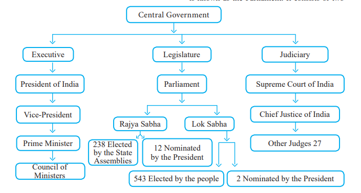
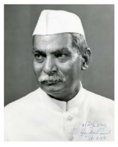
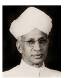
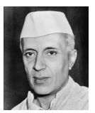
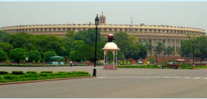
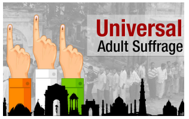
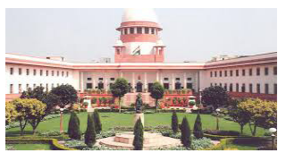

  

# Introduction 

The Central Government is the supreme government in our country. The head quarter of the Central Government is at New Delhi. Articles 52 to 78 in part V of Indian Constitution deals with the Union Executive. The makers of the Indian constitution, by giving due recognition to the vastness and plural

character of our nation, have provided a federal arrangement for her governance. The Central Government consists of three organs, namely, Union Executive, Legislature and Judiciary. The Union Executive consists of the President of India, the Vice-President, and the Council of Ministers headed by the Prime Minister, and the Attorney General of India. The Legislature is known as the Parliament. It consists of two houses, namely the Rajya Sabha and the Lok Sabha. The Union Judiciary consists of the Supreme Court of India.

## 2.1 The President of India

The President is the nominal executive authority. The chief executive of the Indian union is the President. He is designated as the First citizen of India. He is the supreme commander of the armed forces. 

The President is also the Constitutional head of the Union Executive. According to Article 53 of the constitution, the executive power of the Union shall be vested in the President which shall be exercised by him directly or through officers subordinate to him in accordance with Constitution.

**Qualification for the election as President**

1. He should be a citizen of India. 

2. He must have completed the age of thirty-five years. 

3. He must not hold any office of profit under the Union, State or local Government. 

4. He should have the other qualifications required to become a member of the Lok Sabha.

5. His or her name should be proposed by at least ten electors and seconded by another ten electors of the Electoral College which elects the President.

The President cannot be a Member of Parliament or of a State Legislature; if he is a member of any legislature, his seat will be deemed to have been vacated on the date he / she assumes the office of President.
  

**Election of the President**

The President is elected by an electoral college in accordance with the system of proportional representation by means of single transferable vote. The Electoral College consists of the elected members of both houses of Parliament and the elected members of the states and elected members of National Capital Territory of Delhi and Puducherry. Once elected as the President has to take an oath of office before the Chief Justice of India. The President is elected for a term of five years and can be re-elected.

**Powers of the President**

**Executive Powers**

Article 77 requires that every executive action of the Union shall be taken in the name of the President.

He appoints the Prime Minister and the other members of the Council of Ministers, distributing portfolios to them on the advice of the Prime Minister. He is responsible for making a wide variety of appointments. These include the appointment of Governors of States, the Chief Justice and other Judges of the Supreme Court and high Courts, the Attorney General, the Comptroller and Auditor General, the Chief Election Commissioner and other Election Commissioners the Chairman and other Members of the Union Public Service Commission Ambassadors and High Commissioners to other countries.

**Legislative Powers**

He inaugurates the session of the Parliament by addressing it after the general election and also at the beginning of the first session each year. This address is essentially identical in nature to a Speech from the Throne.The President summons Parliament at least twice in a year.

He may send messages to either House of the Parliament with respect to a bill pending in the House. All bills passed by the Parliament become “Laws of Acts” only after getting assent of the President. Money bills cannot be introduced in the Parliament without his approval. President terminates the sessions of both or any of the Houses of Parliament. He can even dissolve the Lok Sabha before the expiry of the term of the House.

He nominates 12 persons who are eminent in literature, science, sports, art and social service to the Rajya Sabha. He can also nominate two persons belonging to Anglo-Indian Community to the Lok Sabha, if in his opinion, that community is inadequately represented in the House.

**Financial Power**

Annual Budget of the Central Government is presented before the Lok Sabha by the Union Finance Minister only with the permission of the President. He causes to be laid before the Parliament the annual financial statement (the Union Budget). The Constitution of India places the Contingency Fund of India is at the disposal of the President. No demand for a grant can be made except on his recommendation. He can make advances out of the contingency fund of India to meet any unexpected expenditure. He constitutes a finance commission after every five years.

**Judicial Powers**

Article 72 confers on the President power to grant pardons, reprieves, respites or remissions of punishment, or to commute the sentence of any person convicted of an offence.  

**Military Powers**

Article 53(2) lays down that “the supreme command of the Defence Force of the Union shall be vested in the President and the exercise thereof shall be regulated by law”.

**Diplomatic Powers**

The President appoints Indian diplomats to other countries and receives foreign diplomats posted to India. The ambassador designate becomes ambassador after calling on the President and presenting his credentials. All treaties and agreements with foreign States are entered into, in the name of the President.

**Emergency Powers**

The President has been empowered by the Constitution to proclaim National Emergency under Article 352, State Emergency under Article 356, Financial Emergency under Article 360.

>Kerala and Punjab are the States where the President’s Rule was imposed for maximum number of times i.e., nine times in both States.

**Removal of the President**

The President may by writing under his hand addressed to the Vice-President, resign his office. The President may, for violation of the Constitution, be removed from office by impeachment in the manner provided in Article 61; The Impeachment action can be brought about in the form of resolution in either house of the Parliament. It must be supported by not less than One-Fourth of the total strength of the House for its introduction. The President shall, in spite of the conclusion of his term, continue to hold office until his successor enters upon his office.

## 2.2 Vice-President

The vice-President occupies the second highest office in the country. He is accorded a rank next to the President in the official warrant of precedence. This office is modeled on the

lines of the American Vice-President. Article 63 of the constitution provides for a Vice President of India. This office has been created to maintain the political continuity of the state.

**Qualification for the election as Vice President**

1. He should be a citizen of India.

2. He must have completed the age of thirty- five years.

3. He must not hold any office of profit under the Union, State or local Government.

4. He should have the other qualifications required to become a member of the Rajya Sabha.

**Election and term of the Vice-President**

Article 66(1) the Vice- President, like the president, is elected not directly by the people but the method of indirect election. The term of office of the Vice President is five years. His office may terminate earlier than the fixed term either by resignation, death or by removal. He is eligible for re-election. Till then deputy chairman of the Rajya sabha can perform the duties of the chairman of the Rajya sabha.

**Removal of the Vice President**

The Vice President may be removed from his office by a resolution of the Council of States passed by a majority of all the then members of the council and agreed to by the House of the People. A resolution for this purpose may be moved only after a notice of at least a minimum of 14 days has been given of such an intention.

**Functions of the Vice President**

The Vice-President is Ex-Officio Chairman of the Rajya Sabha.

1. He regulates the proceeding of the House.

2. He decides the order of the House.

3. He decides the admissibility of a resolution or questions.

4. He suspends or adjourns the House in case of a grave disorder. When the President is unable to discharge his duties due to illness or absence from the country, he attends to the functions of the President for a maximum period of six months.

>**Casting Vote** According to Article (100) of the Constitution, the vice-president can\only cast his vote when there is a tie over the Bill in the Rajya Sabha.It means that there is need for one vote only to pass the Bill. No members have any right to oppose his decision.

## 2.3 Prime Minister 

Article 74 (1) says: There shall be a council of ministers with the Prime Minster as the head to aid and advice the President.

The post of Prime Minister of India has adopted the Westminster (England) model of constitutional democracy. The parliment of England is situated in Westminister so it's called Westminister parliment

The leader of the majority party in Lok Sabha is appointed by the President as the Prime Minister. The other ministers are appointed by the President on the advice of the Prime Minister. If no party commands absolute majority in the Lok Sabha, the President can summon the leader of any party who, in his opinion, can manage to form a ministry. The President administers to the ministers the oath of office and of secrecy. A person who is not a member of the Parliament can be appointed as a minister but he has to get himself elected to the Parliament within six months. Ministers are individually as well as collectively responsible to the Lok Sabha.

**Duties and functions of Prime Minister**

Article 78 mentioned the duties of the Prime Minister:

1. The Prime Minister decides the rank of his ministers and distributes various departments.

2. The Prime Minister decides the dates and the agenda of the meeting of the Cabinet which he presides.

3. The Prime Minister informally consults two or three of his senior colleagues when he does not convene a Cabinet meeting.

4. The Prime Minister supervises the work of various ministers.

5. To converse to the President all decisions of the Council of Ministers connecting to the government of the affairs of the Union and proposals for legislation.

6. The Prime Minister act as the link between the President and the Council of Ministers.

7. The Prime Minister is the leader of the nation and chief spokesperson of the country.

„„ As the leader of the nation, the Prime Minister represents our nation at all international conferences like the commonwealth, summit of the non aligned nations and SAARC nations.

**Council of Ministers**

After the elections, the President of India, on the advice of the Prime Minister, appoints the council of ministers. The Constitution of India   restricts the number of the Council of Ministers including the Prime Minister to 15% of the total members of the Lok Sabha.

**Categories of the Ministers**

The ministers are classified under three ranks

(i) Cabinet Ministers

(ii) Ministers of State

(iii) Deputy Ministers.

**Cabinet Ministers**

The Cabinet is an informal body of senior ministers who form the nucleus of administration. Important decisions of the government are taken by the Cabinet, such as defense, finance, external affairs and home.

**Ministers of State**

These ministers belong to the second category of ministers in the council. They are also in charge of ministries or departments but they do not participate in the meetings of the cabinet unless invited to do so.

**Deputy Ministers**

They are the lowest ranked ministers in the cabinet. They assist either the Ministers of Cabinet or State in the performance of the duties entrusted to them.

## 2.4 Parliament of India 

The parliament is the legislative organ of the Union government. The Parliament of India consists of three parts they are the 1) President, 2) Rajya Sabha (the council of States) 3) Lok Sabha (the House of the People). The Rajya Sabha is the Upper House and the Lok Sabha is the Lower House it is termed as bicameral legislature.

**Rajya Sabha**

The council of State or Rajya Sabha consists of 250 members out of whom 238 represent the states and the Union Territories, elected by the method of indirect election.

The 12nominated members shall be chosen by the President from amongst persons having ‘special knowledge or practical experience in the field of literature, science, sports, art and social service.

**Qualification of the Members**

1. He should be a citizen of India.

2. He should not be less than 30 years of age.

3. He should not hold any office of profit under any Government.

4. He should be a person with sound mind and monetarily solvent.

5. He should not be the member of Lok Sabha or any other legislature.

**Term of House**

The Rajya Sabha is a permanent house and it cannot be dissolved. The members of the Rajya Sabha are elected for a term of six years. One third of the members of Rajya Sabha retire every two years, and new members are elected to fill the seats thus vacated. The Vice President of India is the Ex-officio Chairperson of the Rajya Sabha. The Deputy Chairperson of the Rajya Sabha is elected by the members of the Rajya Sabha.
 

**Election**

Members of Rajya Sabha are elected by the elected members of the ‘State Legislative Assemblies’ in accordance with the system of proportional representation by means of the single transferable vote. This process of election is called “indirect election” as they are not elected by the people directly.

**Lok Sabha**

The Lok Sabha is the popular house of the Indian Parliament and contains elected representatives of the people. Maximum number of members can be elected for Lok Sabha is 552. The Lok Sabha as of today has 543 elected members. Out of these, 530 members are elected from different states and 13 members from the Union Territories. The President generally nominates two members belonging to the Anglo-Indian community. At present, the Lok Sabha consists of 545 members.

**Qualification of the Members** 

1. He should be a citizen of India. 

2. He should not be less than 25 years of age. 

3. He should have his name in electoral rolls in some part of the country. 

4. He should not hold any office of profit under the Union or State Government. 

5. He should be mentally sound and economically solvent.

**The term of the House**

Generally the Lok Sabha enjoys a term of five years from the date of its first session. It can be dissolved by the President before the expiry of its term on the advice of the Prime Minister. The emergency provisions of the Constitution enable the President to prorogue or dissolve the Lok Sabha either on the advice of the Prime Minister or on being convinced that no party or no alliance of parties enjoys necessary majority support in the House.

**Election**

The members of the Lok Sabha are directly elected by the people of the constituencies created on the basis of population. The Election Commission of India arranges, supervises and conducts elections to the Lok Sabha.

“Universal Adult Franchise” is followed while electing the members of the Lok Sabha. All Indian Citizens above 18 years of age who are registered as voters will vote for their representatives.

**Functions of the Lok Sabha**

1. Any bill can be introduced and passed in the Lok sabha (Including Money Bill).

2. It has the same power as Rajya Sabha to participate in case of impeachment of president and the judges of Supreme Court.

3. It has equal power as Rajya Sabha in passing any bill for constitutional amendment.

>Elected members of the Parliament from Tamil Nadu.
1. Rajya Sabha – 18 members 
2. Lok Sabha – 39 members

**The Speaker**

The Lok Sabha is presided over by the ‘speaker’ who is elected by its members. The office of the Speaker occupies an essential position in our Parliamentary democracy. The Speaker continues to be in the office even in the houses dissolved, till a new Speaker is elected by the new Lok Sabha. The Speaker presides over a joint sitting of the two Houses of Parliament. He has the power to decide whether a Bill is Money Bill or an ordinary one. While the office of speaker is vacant or the speaker is absent from the sitting of the house, the deputy speaker presides, except when a resolution for his own removal is under consideration.

| Parliament Session | Parliament Session | 
|------|------|
| Budget Session |Februar y to May |
| Monsoon Session |July to September |
| Winter Session |November to December |

**Powers and Functions of the Parliament**

1. The Parliament of India has the functions of Legislation, overseeing of administration, passing of Budget, ventilation of public grievances, discussion of various subjects like development plans, international relations and internal policies.

2. Parliament is also vested with powers to impeach the President and to remove Judges of the Supreme Court and High Courts, Chief Election Commissioner and Comptroller and Auditor-General of India in accordance with the procedure laid down in the Constitution.

3. The Parliament has the power to change the boundaries of the States.

## 2.5 Attorney General of India

The Constitution (Article 76) has provided for office of the Attorney General for India. He is the highest law officer in the country. He is appointed by the President. He must be a person who is qualified to be appointed the Judge of the Supreme Court. He may be removed by the President at any time. He may also quit his office by submitting his resignation to the President.

**Duties and Functions of Attorney General of India**

To give advice to the Government of India upon such legal matters which are referred to him by the President. Attorney General of India has the right of audience in all courts in the territory of India. Further he has the right to speak and to take part in the proceedings of both Houses of the Parliament or their joint sitting and any committee of the Parliament of which he may be named a member, but without a right to vote. He enjoys all the privileges and immunities that are available to a member of Parliament.

## 2.6 Judiciary

Judiciary is the third organ of the government. It plays a vital role in protecting the rights and freedom of the citizens.

**Supreme Court**

The “Supreme Court is the Guardian of the Constitution”. Our judiciary is autonomous of the Legislative and Executive wing of the Union and State Government. An integrated judiciary means a single judicial hierarchy for the whole country. The judiciary plays an important role in defensive the rights and freedom of the citizens. It plays an important role in analyzing and interpreting the necessities of laws and the constitution.

**Composition of the Supreme Court**

At the commencement of the constitution in 1950 our supreme court consisted of 8 judges  including the chief justice. At present, the Supreme Court consists of 34 judges including the chief justice.

**Appointment of Judges**

The Chief Justice of Supreme Court in India is appointed by the President of India. The other judges are appointed by the President in consultation with the collegiums with Chief Justice Head.

**Qualification of Supreme Court Judges**

1. He must be a citizen of India.

2. He should have worked as a Judge of a High Court for at least 5 years.

3. He should have worked as an advocate of High Court for at least 10 years.

4. He is in the opinion of the President, a distinguished Jurist.

The constitution also provides for the appointment of judges to the Supreme Court on an ad-hoc (temporary) basis. The Chief Justice and other judges of the Supreme Court hold the office up to the age of 65 years. The judges of the Supreme Court can resign before their term by giving their resignation in writing to the President. The Parliament also has power to remove the Judges by invoking impeachment provisions. The Supreme Court has its permanent seat in “New Delhi”. It may also sit any other place in India which may be decided by the Chief Justice of India with the approval of the President of India.

**Powers and Functions of the Supreme Court**

**(a) Original Jurisdiction**

The cases which are brought directly in the first instance to the Supreme Court come under original jurisdiction. These may be (i) dispute between the Government of India and one or more States of (ii) Dispute between two or more states (iii) The writs are issued by the Supreme Court for the enforcement of the fundamental rights.

**(b) Appellate Jurisdiction**

The Supreme Court is the final appellate court in the country. As regard the Appellate jurisdiction, the Supreme Court hears appeals against the decisions of High Court in “civil, criminal and Constitutional” cases with a certificate from the High Court that it is fit to appeal in the Supreme Court. Such a case can be brought before the Supreme Court only if the High Court certifies that the case invites a substantial of law as to the interpretation of the Constitution.

**(c) Advisory Jurisdiction**

The Constitution confers on the President the power to refer to the Supreme Court any question of law or fact which in his opinion is of public importance.

**(d) Miscellaneous Jurisdiction**

1. The law declared by Supreme Court is binding on all courts within the territory of India.

2.  The Supreme Court is authorized to make rules for regulating, generally the practice and procedure of the court with the approval of the President.

**(e) Judicial Review**
The power of the judiciary to declare a law as unconstitutional is known as “Judicial Review”. The Supreme Court enjoys this power. The Supreme Court of India has Individual Review Power with regard to 

1. Dispute between the Centre and the States 

2. To interpret and clarify a provision of the constitution about which there are some doubts and differences of opinion. 

3. Protecting the fundamental rights,

4. Those laws passed by the legislatures which are not in accordance with the Constitution.
