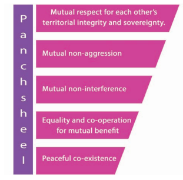
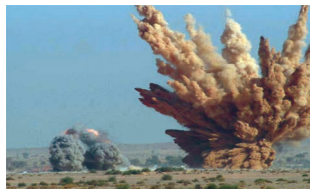
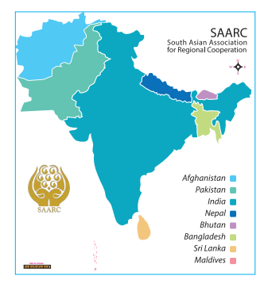

  

# Introduction 

Foreign policy can be defined as a country’s policy that is conceived, designed and formulated to safeguard and promote her national interests in her external affairs, in the conduct of relationships with other countries, both bilaterally and multilaterally. It seeks to secure the best interests of the people, territory and economy of the country. It is a direct reflection of country’s traditional values and overall national policies, her aspirations and self-perception. Nations have also been interdependent. Interdependence has been an incontrovertible fact of international relations. The main tools of foreign policy are treaties and executive agreements, appointing ambassadors, foreign aid, international trade and armed forces.

>**The Constitution of India 1950 Article 51** 
Lays down Directive Principles of India’s foreign policy. 
The state shall endeavour to
1. Promote International peace and security
2. Maintain just and honourable relations between nations
3. Foster respect for international law and international organisation
4. Encourage settlement of international disputes by arbitration

## 4.1Main Objectives of Our Foreign Policy

1. National security 
2. National prosperity 
3. Increasing the number of friendly nations 
4. Achieving world peace and enable every nation to peacefully co-exist 
5. Economic development
 

## 4.2 Panchsheel

>(derived from Sanskrit words, panch = five, _sheel_ = virtues)

The Five Principles of Peaceful Coexistence (Panchsheel) between India (Prime Minister Jawaharlal Nehru) and China (Premier Chou- En-Lai) was signed on 28 April 1954, which stated that the two governments entered into an agreement based on the following principles:

These principles were incorporated in the Bandung Declaration signed in the Afro-Asian Conference held in 1955 in Indonesia.

## 4.3 Basic Determinants of a Foreign Policy

1. Geographical position and size of territory 
2. Nation’s history, traditions and philosophical basis 
3. Natural resources 
4. The compulsion of economic development 
5. Political stability and structure of government 
6. The necessity of peace, disarmament and non-proliferation of nuclear weapons 
7. Military strength 
8. International milieu

**Foreign Policy in 1950s and 1960s** 

The period from Independence through 1950s and 1960s constituted the most   idealistic phase of India’s foreign policy under the guidance of India’s first Prime Minister, Jawaharlal Nehru. The new nations that got independence after the long period of colonial struggle found themselves in a very difficult situation with respect to economic development. So it was necessary to align with either of the blocs – United States of America (USA) or Union Soviet Socialist Republic (USSR). Nehru, India’s first Prime Minister, was opposed to the rivalry of the two superpowers (America and Russia) who were trying to extend their influence over the newly emerged nations of Asia and Africa. So he chose the path of Non-Alignment (i.e., not aligning with any bloc) in the face of the bipolar order of the Cold War and tried to form a third bloc of nations in international affairs.

>“Broadly, non-alignment means not tying yourself off with military blocs…. It means trying to view things, as far as possible, not form the military point of view, though that has to come in sometimes, but independently, and trying to maintain friendly relations with all countries”. – Jawaharlal Nehru

## 4.4 The Non-Aligned Movement (NAM) in 1961 

The term ‘Non-Alignment’ was coined by V. Krishna Menon in his speech at the United Nations in 1953. Non-alignment has been regarded as the most important feature of India’s foreign policy. It aimed to maintain national independence in foreign affairs by not joining any military alliance. The Non- Aligned Movement (NAM) was formed with a membership of 120 countries and 17 states as observers and 10 international organisations. It has transformed from a political movement to an economical movement.

**The founding fathers of Non-Aligned Movement :** Jawaharlal Nehru of India, Tito of Yugoslavia, Nasser of Egypt, Sukarno of Indonesia, and Kwame Nkrumah of Ghana were the founding fathers of NAM.

**India's Foreign Policy during Cold War Era**

The Non-alignment roots did not prevent India from entering into an alignment with the Soviet Union by the Indo-Soviet treaty of 1971 (20-year pact of ‘peace, friendship and co-operation’). Then India embarked on a substantial programme of military modernisation. In 1974, India also conducted its first nuclear test at Pokhran under Subterranean Nuclear Explosions Project, in response to China’s nuclear test in 1964 at Lop Nor.

Changing global conditions determine the foreign policy details. India got her political freedom in the aftermath of a disastrous Second World War, and India had to be redeemed from acute poverty illiteracy, and chaotic socio- economic conditions. Hence our new nation could not afford to military entanglements and military alliances. Avoidance of military blocs was then not an option but a necessity. Non Alliance did not mean neutrality, but the freedom of nations to decide on issues independently. Non-alliance did not mean demilitarisation of nations. It was meant to ensure de-escalation of conflicts and tension. Even wither discarding the ‘Non-Alliance’ India could enormously strengthen her defence system and could become a nuclear power. Flaws or faults in details of foreign policy executions have been addressed time and again but India’s basic policy of non-Alliance is still in force.

**New Developments: in the 1990s and the 20th Century**

During the 1990’s along with the fall of the Soviet Union, a new global economic order (Liberalisation, Privatisation, and Globalisation) emerged with the support of the western powers. India entered into pacts with global economic forum (GATT) and entered into bilateral, trilateral, multilateral agreements. Its nuclear experiments resulted in intimidatory reactions from the western world.

This shifts in India’s policy manifested in various ways such as

1. Better relations with China – the Look East Policy (1992)

2. The second nuclear test at Pokhran (1998) in Rajasthan

3. Defence procurement relationship with Israel

4. Energy diplomacy with Arab countries and Iran

5. Agreeing to US nuclear missile defence program and

6. India’s vote against Iran at the International Atomic Energy Agency

**India in the Resurgent 21st Century**

The foremost task of India’s foreign policy is to enable the domestic transformation of India.

India has adjusted to meet the needs of intensified economic engagement with the world, which is designed to meet the needs of an increased inflow of capital, technology, ideas and innovation for our development and our re-emergence as one of the world’s leading economies.

India engages with current global subjects and articulates its international policies in order to gain a prominent place and makes its presence felt in on a global scale. It has joined new global groups like the Group of 20 (G-20), India, Brazil, South Africa (IBSA), and Brazil, Russia, India, China, South Africa (BRICS), which gives more scope for India to play a larger role in global affairs.

India’s global security concerns are reflected in its military modernisation, maritime security and nuclear policies.

India has emerged as a major voice in global decision-making and management, and as a bridge and balancing power in the emerging global strategic architecture. The response of our policymakers at economic, political and strategic level have enabled India to emerge as a potential great power though it faces enormous developmental challenges. These challenges include sustaining the country’s economic growth rate, ensuring energy and security. Non-military issues like climate change, energy security, competition for scarce resources, food and water security, pandemics and migration. Though numerous and formidable, these challenges are not beyond the reach of India’s policy establishment.

## 4.5 Basic Concepts of India’s Foreign Policy

1. Preservation of national interest 
2. Achievement of world peace 
3. Disarmament 
4. Fostering cordial relationship with other countries 
5. Solving conflicts by peaceful means 
6. Independence of thought and action as per the principle of NAM 
7. Equality in conducting international relations 
8. Anti-colonialism, anti-imperialism, anti-racism 

**Policy of Disarmament**

Since independence, global non- proliferation has been a dominant theme of India’s nuclear policy. So India supported UN disarmament programme. Indian nuclear programme in 1974 and 1998 is only done for strategic purposes. The two themes of India’s nuclear doctrine are

1. No first use 
2. Credible minimum deterrence

It has decided not to use nuclear power for ‘offensive purposes’ and would never use against any non-nuclear state. Indo-US civilian nuclear deal marks a significant progress in India’s foreign policy.  

## 4.6 SAARC – South Asian Association for Regional Cooperation

SAARC is an economic and geopolitical organisation of eight countries that are primarily located in South Asia. The SAARC policies aim to promote welfare economics, collective self- reliance among the countries of South Asia and to accelerate socio-cultural development in the region. SAARC Disaster Management Centre was set up at New Delhi. The Centre is a sleek body of professionals working on various dimensions of disaster risk reduction and management in South Asia. SAARC satellite is a proposed communication–cum-meteorology satellite by Indian Space Research Organisation (ISRO) for the SAARC region.

The member countries are Afghanistan, Bangladesh, Bhutan, India, Nepal, Maldives, Pakistan and Sri Lanka.

>**Foreign Policy** is a combination of strategies carefully formulated by a nation for maintaining relationship with other nations.
**Diplomacy** is the instrument for implementing foreign policy of a state.

  

**4.7 Contemporary context: change and continuity in India’s Foreign Policy**

**a) Prioritising an integrated neighbour- hood: Neighbourhood First policy** 

India’s foreign policy has always regarded the concept of neighbourhood as one of widening concentric circles, around the central axis of historical and cultural commonalties. India gives political and diplomatic priority to her immediate neighbours and the Indian Ocean Island states such as Maldives. This centrality of neighbours in India’s foreign policy stems from the clear understanding that a peaceful periphery is essential for India to achieve her multifarious developmental goals. India provides neighbours with support as needed in the form of resources, equipment and training. Greater connectivity and integration is provided so as to improve the free flow of goods, people, energy, capital and information.

**b) Bridging diplomacy and development** 

One of the major objectives of India’s foreign policy has been to leverage international partnership for India’s domestic development. This includes improving technological access, sourcing capital, gaining market access and securing natural resources.

**c) A gradual transition from ‘Look East’ to ‘Act East’ policy** 

South East Asia begins with North East India. Myanmar is our land bridge to the countries of the Association of the Southeast Asian Nations (ASEAN). The purpose is to ensure a stable and multipolar balance of power

**Difference between Domestic Policy and Foreign Policy**

| Domestic Policy |Foreign Policy |
|------|------|
| **1**. Domestic policy is the nation’s plan for dealing issues within its own nation. **2**. It includes laws focusing on domestic affairs, social welfare, health care, education, civilrights, economic issues and social issues. | **1**. Foreign policy is the nation’s plan for dealing with other nations. **.2** Trade, diplomacy, sanctions, defence, intelligence and global environments are the types of foreign policy. |

in the Indo-Pacific and to become an integral part of Asia. This policy emphasises a more productive role for ASEAN and East Asian countries. The three big elements in our eastern policy are stronger emphasis on physical connectivity, commercial and security-related.

**d) Economic development** 

Currently India’s political moves are being influenced by economic imperatives. Many nations are moving to forge better relationship with India. Accelerated, balanced and inclusive economic development is India’s primary goal. India achieves this by ensuring peace and security and by leveraging the nation’s international partnership, to obtain all that is needed to fuel economic development, markets, investment, technology, linkage, mobility of personnel, fair global governance and a stable and fair environment conducive for growth.

**e) India as a leading power** 

India is a member of the G20, the East Asia Summit and the BRICS coalition, a testament to its status as a large country with a fast-growing economy. India aspires for permanent membership on the UN Security Council. And India now has an increasing range of interests, which are anchored in different parts of the world and which stem from a wide range of factors such as the need to secure energy, vital natural resources, the imperative of maintaining open shipping lanes, seeking investments and trade opportunities overseas and the need to secure trade access.

**Conclusion**

Today India has formal diplomatic relations with most of the nations, besides being the world’s second most populous country, largest democracy and one of the fastest growing country. Though India is not in any major military alliance, our relations with the major powers have acquired a strategic depth. Our common fight against terrorism is a particular element of strength. India has sought to achieve its security and socio-economic advancement while at the same time working for peace, freedom, progress and justice to all nations and peoples. Thus India adheres to the foreign policy principle that **’in international relations there is no permanent friend and no permanent foe, only the interests are permanent’.** New challenges forced India to adjust to new realities. Even then, basic framework of its foreign policy remained more or less the same.

  

