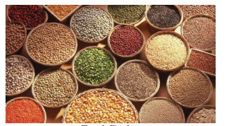
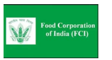
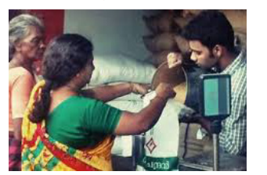
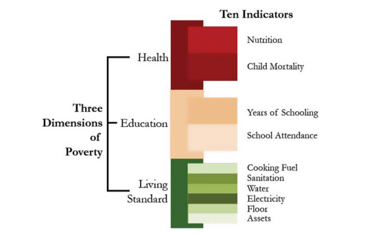
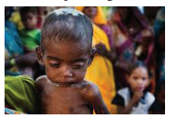
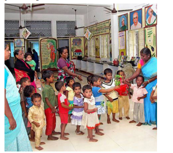

  

# Introduction

Food is defined as any substance that people eat and drink to maintain life and growth. Food security would denote a person’s ability to eat enough, stay active and lead a healthy life.

## 3.1 Food Security

The United Nation’s Food and Agriculture Organisation defines food security as follows:

“Food security exists when all people, at all times, have physical, social and economic access to sufficient, safe and nutritious food which meets their dietary needs and food preferences for an active and healthy life.” (FAO, 2009)

While this comprehensive definition highlights the need for food to be nutritious, in addition to that there are certain other aspects that are required to achieve nutrition security. According to eminent agricultural scientist Dr.M.S.Swaminathan, nutrition security is: “physical, economic and social access to a balanced diet, safe drinking water, environmental hygiene, primary health care and primary education”.

**Basic components of food and nutrition security**

The three basic components of food and nutrition security. They are availability, access and absorption: 

1. **Availability** **of food** is physical availability

of food stocks in desired quantities, which is a function of domestic production, changes in stocks and imports;

2. **Access to food** is primarily a matter of purchasing power and is therefore closely linked with the capabilities and employment opportunities to earn. Capabilities and opportunities in turn are related to one’s access to assets and education.

3. **Absorption** of food is the ability to biologically utilise the food consumed.

## 3.2 Availability and Access to Food Grains

Thus food security for people in a country is not only dependent on the quantum of food available but also on the ability of people to purchase/access food and to stay in appropriate healthy environment. Just as other developmental issues, food security of people is also related to a country’s overall development process. After Independence, India chose to adopt a planned developmental model.

After an initial focus on agriculture, industrialisation was given priority. The recurrent droughts experienced by India pushed her to be dependent on imports of food grains. However, the available foreign exchange reserve could not permit open market purchases and import of grains. India had to plead for food grains from richer countries at concessional rates. United States of America extended assistance through its Public Law 480 (PL 480) scheme to India during early 1960s.

A growing country with a massive population was perceived to be a potential candidate for revolution. The American administration and philanthropic organisations like Ford Foundation formulated a plan to increase food production in the country by introducing High Yielding Varieties (HYV) of wheat and rice. This programme was implemented in select districts where irrigation was assured. The results were promising and the programme was extended to cover a larger number of districts.

Thus, Green Revolution was born in the country paving way for self-sufficiency in food grain production. Increased food grain production was made possible by an increase area cultivated with HYV of rice and wheat as also an increase in the yield of these major cereal crops. Area under food grains was a little more than 98 million hectares during early 1950s. The country was producing just 54 million tonnes of food grains then with an average yield of food grains of 547 kg per hectare. The food situation has steadily improved over a period of 65 years. Area under foodgrain cultivation has grown to 122 million hectares, with an increase of five- fold increase in food grain production. Yield of food grains has increased four-fold between the time of independence and at present.

This growth in food grain production was made possible by the HYV programme, which was implemented as a package. Apart from introducing fertiliser-responsive high-yielding varieties of rice and wheat, it ensured the availability of subsidised chemical fertilisers for the farmers. 

Cheaper farm credit was disbursed to farmers through co- operative banks and societies. Minimum support price (MSP) for the crops were announced at the beginning of the season and the state procured the harvested grains through the Food Corporation of India (FCI). The FCI had built huge storage godowns and built buffer stocks of food grain during the harvest season to be distributed all through the year.

>**Minimum Support Price** 
Minimum Support Price is a price fixed by an expert group for a particular crop by considering various costs involved in the cultivation of that crop. After announcing the MSP, the State will open procurement centres in places where these crops are widely grown. However, the farmers are free to sell in the open market if they get a better price for their crop produce. On the other hand, if the open market price is lower than the MSP, the farmers would get an assured price (the MSP) by selling their produce to the FCI.

The rapid increase in food grain production was accompanied by appropriate technological interventions in the dairy, poultry and fisheries sectors. As a result, the milk production in the country witnessed an eight-fold increase, egg production grew 40-fold and fish production by 13-fold between the time of Independence and mid-2000s. However, India could not succeed in attaining self-sufficiency in the production of pulses and oil seeds. Therefore, India depends on imports to meet the requirements of people.

**Public Distribution System** 

Tamil Nadu has adopted an ‘Universal’ PDS, the rest of the states in India had a ‘Targeted’ PDS. Under universal PDS all the family ration card holders are entitled to the supplies from PDS. In the targeted PDS, the beneficiaries are identified based on certain criteria and given their entitlements, leaving out the rest. Both the Union and the State governments subsidised the supplies distributed through PDS. The level and quantum of subsidy also varied across states.

Subsequently, the National Food Security Act (NFSA) was passed by the Indian parliament in 2013. The NFSA covers 50% of urban households and 75% of the rural households. These households are known as priority households identified based on a set of criteria. Priority households of this country now have the right to food supply through PDS. The Union government supplies rice at the rate of \` 3 per kg, wheat at the rate of \` 2 per kg, and millets at the rate of \` 1 per kg under NFSA. Tamil Nadu continues to have the universal system of PDS and supplies rice at free of cost to all card holders.

>**National Food Security Act in Tamil Nadu** 
On 1 November 2016, National Food Security Act was implemented in Tamil Nadu after holding out for three years.

**Role of Consumer Cooperatives in Food Security**

Consumer cooperatives play an important role in the supply of quality goods at responsible rates to common people. There is a three-tier structure of consumer cooperative societies in India. They are primary consumer cooperative societies. Central consumer cooperative stores and state level consumer federations. More than 50,000 village level societies are engaged in the distribution of consumer goods in rural areas. This scheme is playing an important role in food security in India. For example out of all fair price shops running in Tamil Nadu, around 94% are being run by cooperatives.

>**Buffer Stock** 
Buffer stock is the stock of food grains, namely wheat and rice, procured by the government through the Food Corporation of India (FCI). The FCI purchases wheat and rice from the farmers in states where there is surplus production. The farmers are paid a pre-announced price for their crops. This price is called Minimum Support Price (MSP). The MSP is declared by the government every year before the sowing season to provide incentives to farmers for raising the production of these crops. The purchased foodgrains are stored in granaries.
Buffer stock is done to distribute foodgrains in the deficit areas and among the poorer strata of the society at a price lower than the market price also known as the Issue Price. This also helps resolve the problem of shortage of food during adverse weather conditions or during the periods of calamity.
  

## 3.3 Purchasing Power** 

Purchasing power is the value of a currency expressed in terms of the amount of goods or services that one unit of money can buy. Price increases purchasing power declines and vice versa.

**Factors affecting Purchasing Power** 

**1. Over population**

The population growth rate in India is high as 1.7 per 1000. Large population leads to increasing demand, but supply was not equal to the demand. So, the normal price level will be going an higher. So it affect purchasing power, especially in rural population.

**2. Increasing prices of essential goods** 

Even though there has been a constant growth in the GDP and growth opportunities in the Indian economy, there have been steady increase in the prices of essential goods. The continuous rise in the prices erodes the purchasing power and adversely affect the poor people.

**3. Demand for goods** 

When demand for goods increases, the price of goods increases then the purchasing power is affected.

**4. Price of goods affect the value of currency** 

When the price increases the purchasing power decreases and finally the value of currency decreases.

**5. Production and supply of goods** 

The production and supply of goods decline, the price of goods increases, then the purchasing power is affected.

**6. Poverty and inequality** 

There exists a huge economic disparity in the Indian economy. The proportion of income and assets owned by top 10% of Indian goes on increasing. This has led to an increase in the poverty level in the society. Generally purchasing power is affected by poverty and unequal distribution of wealth also.  

## 3.4 Agricultural Policy in India

The new agricultural policy based on export of agricultural goods was announced by the Central Government in 2018. This policy states that the government has decided to remove export restrictions on most organic and processed agricultural products.

Agricultural policy of a country is mostly designed by the Government for raising agricultural production and productivity and also for raising the level of income and standard of living of farmers within a definite time frame. This policy is formulated for allround and comprehensive development of the agricultural sector.

The following are some of the important objectives of india’s agricultural policy

**1. Raising the productivity of inputs** 

One of the important objectives of India’s agricultural policy is to improve the productivity of inputs so purchased like, HYV seeds, fertilisers, pesticides, irrigation projects etc.

**2. Raising value-added per hectare** 

Agricultural policy is to increase per hectare value-added by raising the productivity of agriculture in general and productivity of small and marginal holding in particular.

**3. Protecting the interests of poor farmers** 

Agricultural policy is proposed to protect the interests of poor and marginal farmers by abolishing intermediaries through land reforms, expanding institutional credit support to poor farmers etc.

**4. Modernising agricultural sector** 

Here the policy support includes the introduction of modern technology in agricultural operations and application of improved agricultural inputs like HYV seeds, fertilizers etc.

**5. Environmental degradation**

Agricultural policy of India has set another objective to check environmental degradation of natural base of Indian agriculture.

 

**6. Removing bureaucratic obstacles** 

The policy has set another objective to remove bureaucratic obstacles on the farmers’ co-operative societies and self-help institutions so that they can work independently.

## 3.5 Multi-dimensional Nature of Poverty

The Multi-dimensional Poverty Index (MPI) was launched by the United Nations Development Programme (UNDP) and the Oxford Poverty Human Development Initiative (OPHI) in 2010. The basic philosophy and significance of MPI is that it is based on the idea that poverty is not unidimensional, and that it is rather multi-dimensional.

Multi-dimensional poverty is made up of several factors that constitute poor people’s expe- rience of deprivation such as health, education, living standards, income, disempowerment, quality of work and threat from violence.

**Multi-dimensional Poverty Index 2018 Report in Tamil Nadu**

Over the last decades, Tamil Nadu has made a significant progress in poverty reduction. The districts in Tamil Nadu are classified into three categories, namely high-poverty districts (more than 40% of the population living below poverty line), moderately poor districts (30% to 40%) and low level poverty districts (below 30%).

After 1994, poverty has declined steadily in both rural and urban areas of Tamil Nadu and the state has a smaller share of India’s poor relative to its population. After 2005, the poverty reduction in this state has been faster than in many other states in India. Tamil Nadu leads in the poverty alleviation programmes during 2014–2017. Government of India is implementing many policies and programmes to eradicate poverty.

These policies and programmes, if continued, will completely eradicate the poverty in the state. In future, Tamil Nadu can become a model of development in india.

**Top and Bottom MPI districts in Tamil Nadu**

| Top 5 Districts |Bottom 5 Districts |
|------|------|
| Kancheepuram |Dharmapuri |
| Chennai |Perambalur |
| Cuddalore |Ramanathapuram |
| Coimbatore |Virudhunagar |
| Nagapattinam |Ariyalur |

## 3.6 Nutrition and Health Status

**Status of Nutrition** 

We noted earlier that food

security includes nutrition security too. Though our country has reached self- sufficiency in food production, the nutrition status of the population has not seen corresponding levels of improvement. In 2015–16, 27% of the rural women and 16% of the urban women (in the age group of 15–49 years) were counted as undernourished or chronically energy deficient by the National Family Health Survey.
 

More than half of the women in the reproductive age group (15–49 years) in both rural and urban India were anaemic in 2015– 16. As regards children, about 60% of the rural and 56% of the urban children (in the age group of 6–59 months) are counted to be anaemic, in 2015–16. About 41% of the rural and 31% of urban children are stunted, that is, they are not of the required height in correspondence to their age. Another indicator of nutrition deficiency among children is “underweight”, which is weight in relation to age. In India, in 2015–16, about 20% of children(in the age group of 6–59 months) in rural and urban India are estimated to be underweight.

**Nutrition and Health Status in Tamil Nadu**

Nutrition plays a crucial role in human health and well-being. At the national level, despite higher economic growth, improvements in human development indicators like nutrition levels of the population have been unacceptably slow. A large number of Indian children are stunted. A substantial number of Indian children and women are underweight, anaemic and suffer from micronutrient deficiencies. To address these concerns, the Central and state governments have been channellising substantial resources into various health and nutrition schemes and programmes like Integrated Child Development Services (ICDS), mid-day meals, Reproductive and Child Health Programmes (RCH) and National Rural Health Mission (NRHM). However, an effective scaling up of these efforts is required to mitigate the incidence of under-nutrition in the country.

Tamil Nadu has played a pioneering role in bringing about significant changes in the health and nutrition status of children under six years of age, pregnant women, lactating mothers and adolescent girls. The Government of Tamil Nadu’s successive budget outlays for nutrition and health are the highest in the country. The performance of the ICDS scheme and the Puratchi Thalaivar MGR Nutritious Meal Programme (PTMGRNMP) in Tamil Nadu are considered one of the best in the country.

The Government of Tamil Nadu’s policy for “A Malnutrition Free Tamil Nadu” guides the state’s long-term multi-sectoral strategy for eliminating malnutrition. The goal is “reducing human malnutrition of all types to the levels of best performing countries”.In Tamil Nadu, ICDS is being implemented through 54,439 Child Centres (comprising 49,499 Anganwadi Centres and 4,940 Mini Anganwadi Centres) in 434 Child Development Blocks (385 rural, 47 urban and 2 tribal).

With steady expansion into unreached areas, increasing coverage of marginalised groups, enhanced allocations and enlarged scope of services, ICDS is now considered to be one of the world’s largest programmes of its kind.

The PTMGRNMP is considered to be the largest noon meal programme in the country for combating malnutrition among children, increasing primary school enrolment and reducing dropout rates. Other states in the country have modelled their noon meal programmes along the lines of Tamil Nadu’s pioneering efforts.

