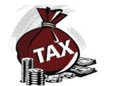
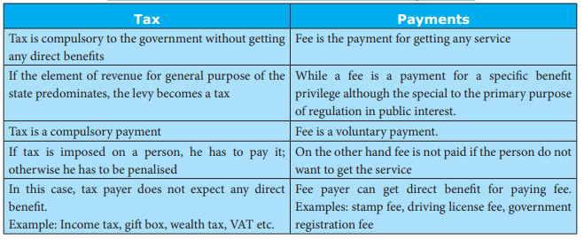

  

# Introduction 

Tax is levied by government for the development of the state’s economy. The revenue of the government depends upon direct and indirect taxes. Direct taxes are levied on income of the persons and the indirect taxes are levied on goods and services by which the government mobilises its “financial resources”.

## 4.1 Role of Government in Development Policies

1. Defence: This is an essential security function to protect our nation from our enemies. The Union government is responsible for creating and maintaining defence forces.

2. **Foreign policy:** In today’s world, we need to maintain friendly relationships with all the other countries in the world. We should also maintain cordial economic relationships through exports and imports, sending and receiving investments and labour. This service is also provided by the Union government.

3. **Conduct of periodic elections:** India is a democratic country. We elect our representatives to Parliament and state assemblies. Similarly the state governments conduct elections to local bodies within the state.

4. **Law and order:** Both the Union and state governments enact numerous laws to protect our rights, properties and to regulate our economy and society. To settle disputes, the Union government has a vibrant judicial system. State governments take the responsibility for administering the police force in respective states.

5. **Public administration and provision of public goods: The government generally** administers the economy and society through various departments, for example, revenue department, schools, hospitals, rural development and urban development. The local governments provide public goods like local roads, drainage, drinking water and waste collection and disposal.

6. **Redistribution of income and poverty alleviation:** Governments collect various taxes to finance the various activities mentioned earlier. The taxes are collected in a way that the high-income people can bring in more tax revenue to the government than the poor. The governments also spend money such that the poor are given some basic necessities of life like food, shelter, clothing education, health care and monthly income to the very poor persons. Thus collecting taxes and spending for the poor to reduce poverty.

**7. Regulate the economy:** The Union government, through the Reserve Bank of India, controls money supply and controls the interest rate, inflation and foreign exchange rate. The main objective is to remove too much of fluctuation in these rates. The Union Government also controls the economy through various other agencies such as Securities Exchange Board of India and Competition Commission of India. All the governments in India run public sector enterprises to provide

>**Tax system** 
Every type of tax has some advantages and so is, a collection of variety of taxes. From Adam Smit taxation. It is important to recall those common am 
**1. Canon of equity**
Since tax is a compulsory payment, all econom designing the tax system. The rich should pay more rich has more ability than the poor to pay the tax. 
**2. Canon of Certainty**
Government should announce in advance the calculate how much tax amount one may have to pa 
**3. Canons of Economy and Convenience**
If the tax is simple, then the cost of collecting very low. Further, tax should be collected from a pe tax. This is called canon of convenience. A convenie 
**4. Canons of Productivity and Elasticity**
Government should choose the taxes that can few taxes that can fetch more tax revenue, instead o paid by the people out their incomes. Therefore the the people automatically pay more tax revenue if the important goods and services at affordable rates to the people.

## 4.2 Tax 

The origin of the word "tax" is from "taxation," which means an estimate.

Taxation is a means by which governments finance their expenditure by imposing charges on citizens and corporate entities. The main purpose of taxation is to accumulate funds for the functioning of the government machinery. Tax has come into forefront on account of the new concept of “welfare state”.

Taxes are compulsory payments to government without expectation of direct return (or) benefit to the tax payer. Prof. Seligman also defined a tax as “a compulsory contribution from a person to the government to defray the expenses incurred in the common interest of all, without reference to special benefits conferred.”

**Why Taxes?** 

States and their functional equivalents throughout history have used money provided by taxation to carry out many functions. Some of these include expenditures on economic infrastructure (transportation, sanitation, public safety, education, healthcare systems, to name a few), military, scientific research, culture and the arts, public works and public insurance and the operation of government itself. A government's ability to raise taxes is called its fiscal capacity.

When expenditures exceed tax revenue, a government accumulates debt. A portion of taxes may be used to service past debts. Governments also use taxes to fund welfare and public services. These services can include education systems, pensions for the elderly, unemployment benefits and public transportation. Energy, water and waste management systems are also common public utilities.

>Taxation in India has its roots from the period of _Manu Smriti_ and Arthasastra. The present Indian tax system is based on this ancient tax system.

## 4.3 Types of Taxes

**Direct Taxes** 

A tax imposed on an individual or organisation, which is paid directly, is a direct tax. The burden of a direct tax cannot be shifted to others. J.S. Mill defines a direct tax as “one which is demanded from the very persons who it is intended or desired should pay it.” Some direct taxes are income tax, wealth tax and corporation tax.

**Income tax** 

Income tax is the most common and most important tax levied on an individual in India. It is charged directly based on the income of a person. The rate at which it is charged varies, depending on the level of income.

>Students are asked to search a Income Tax website and know the Income Tax slab for current year.

**Corporate tax** 

This tax is levied on companies that exist as separate entities from their shareholders. It is charged on royalties, interest gains from sale of capital assets located in India and fees for a technical services and dividends.

Foreign companies are taxed on income that it arises in India.

| Income |For IndianCompanies |For ForeignCompanies |
|------|------|------|
| Less than ` 50c rore |25% |40% |
| More t han ` 50c rore |30% |40% |

**Wealth tax** 

Wealth tax is charged on the benefits derived from property ownership. The same property will be taxed every year on its current market value. The tax is levied on the individuals and companies alike.

>In India taxes are collected by all the three tiers of government. There are taxes that can be easily collected by the Union government. In India almost all the direct taxes are collected by the Union governments. Taxes on goods and services are collected by both Union and State governments. The taxes on properties are collected by local governments.
In India we collect more tax revenue through indirect taxes than through direct taxes. The major indirect taxes in India are customs duty and GST.

**Indirect Taxes** 

If the burden of the tax can be shifted to others, it is an indirect tax. The impact is on one person while the incidence is on the another person. Therefore, in the case of indirect taxes, the tax payer is not the tax bearer.

Some indirect taxes are stamp duty, entertainment tax, excise duty and goods and service tax (GST).

**Stamp duty** 

Stamp duty is a tax that is paid on official documents like marriage registration or documents related to a property and in some contractual agreements.

**Entertainment tax** 

Entertainment tax is a duty that is charged by the government on any source of entertainment provided. This tax can be charged on movie tickets, tickets to amusement parks, exhibitions and even sports events.

**Excise duty** 

An excise tax is any duty on manufactured goods levied at the movement of manufacture, rather than at sale. Excise is typically imposed in addition to an indirect tax such as a sales tax.

**Goods and service tax (GST)** 

The goods and service tax (GST) is one of the indirect taxes. The GST was passed in Parliament on 29 March 2017. The act came into effect on 1 July 2017. The motto is one nation, one market, one tax.

## 4.4 How Are Taxes Levied? 

Tax is levied by the government progressively, proportionately as well as regressively. 

**Progressive tax**

Progressive tax rate is one in which the rate of taxation increases (multiplier) as the tax base increases (multiplicand). In the case of a progressive tax, When income increases, the tax rate also increases.

**Example:**

| Tax Base |Tax Rate |Amount of Tax |
|------|------|------|
| `10,000 |10% |`1000 |
| `20,000 |15% |`3000 |
| `30,000 |25% |`7500 |

**Proportionate taxes** 

Tax levied on goods and service in a fixed portion is known as proportionate taxes. All tax payers contribute the same proportion of their incomes. 

**Example:**

| Tax Base |Tax Rate |Amount of Tax |
|------|------|------|
| `10,000 |10% |`1000 |
| `20,000 |10% |`2000 |
| `30,000 |10% |`3000 |

**Regressive Taxes** 

It implies that higher the rate of tax lower the income groups than in the case of higher income groups. It is a very opposite of progressive taxation.

| Progressive Tax | ProportionalTax | Regressive Tax |
|------|------|------|
| Income increase | Income Increase | Income change |
| Tax also Increase |Tax Decrease | Same Tax always |
| E.g.Income Tax | E.g. Corporate Tax | E.g. Sales Tax |

## 4.5 Black Money

**Black Money**

Black money is funds earned on the black market on which income and other taxes have not been paid. The unaccounted money that is concealed from the tax administrator is called black money.

**Causes of Black Money** 

Several sources of black money are identified as causes. 
1. Shortage of goods 
2. Licensing proceeding 
3. Contribution of the industrial sector 
4. Smuggling 
5. Tax structure

## 4.6 Tax Evasion 

Tax evasion is the illegal evasion of taxes by individuals, corporations and trusts. Tax evasion activities included 

1. Underreporting income 
2. Inflating deductions or expenses 
3. Hiding money 
4. Hiding interest in offshore accounts

**Tax evasion penalties** 

1 If a person wilfully commits the act of tax evasion, he may face felony charges. Tax  evasion penalties include imprisonment of up to five years and high amount as fines.

2 The defendant may also be ordered to pay for the costs of prosecution.

3 Tax evasion penalties can be harsh, depending on the severity of the crime.

## 4.7 Taxes and Development

The role of taxation in developing economies is as follows.

**1. Resource mobilisation**: Taxation enables the government to mobilise a substantial amount of revenue. The tax revenue is generated by imposing direct taxes such as personal income tax and corporate tax and indirect taxes such as customs duty, excise duty, etc.

**2. Reduction inequalities of income**: Taxation follows the principle of equity. The direct taxes are progressive in nature. Also certain indirect taxes, such as taxes on luxury goods, is also progressive in nature.

**3. Social welfare:** Taxation generates social welfare. Social welfare is generated due to higher taxes on certain undesirable products like alcoholic products.

**4. Foreign exchange:** Taxation encourages exports and restricts imports, Generally developing countries and even the developed countries do not impose taxes on export items.

**5. Regional development**: Taxation plays an important role in regional development, Tax incentives such as tax holidays for setting up industries in backward regions, which induces business firms to set up industries in such regions.

**6. Control of inflation:** Taxation can be used as an instrument for controlling inflation. Through taxation the government can control inflation by reducing the tax on the commodities.

**Difference between Tax and other Payments**

