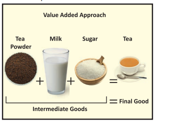
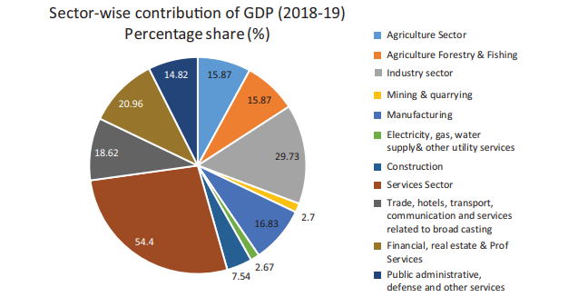
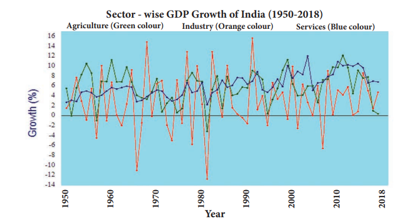
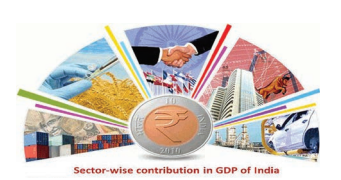

 

# Introduction

To understand how the GDP tells us how India is doing, you should understand what GDP is.

Imagine what happens in a hotel. You place an order for two Idlis and a cup of tea. Someone makes the idlis and tea and someone else serves you.

Idlis and tea are produced . These are tangible, physical things you can touch and feel. Economists call such tangible items “goods”. These goods are not free but have to pay or to be paid.

Though you don’t realise it in addition to these tangible things called goods, something else is being produced : the work done by the cooks and the people who serve the food. The activity of cooking and serving is not something you can feel and touch. Such activities are not tangible but are nevertheless crucial for you to enjoy the food. Economists call such activity “services”.

What happens everyday in a hotel at nation wide: goods and services are produced and paid for and this what the GDP measures.

**DEFINITION OF GDP**

The GDP is the market value of all the final goods and services produced in the country during a time period.

GDP = C + I + G + (X − M ) 
C = Consumption I = Investment 
G = Government Expenditure

( X − M) = X = Exports − M = Imports Every part of the definition is important.

**Goods and services:** As you know by now, goods are tangible items while services are activities which are intangible .

**Market value: This is the price at which** goods and services are sold in the market.

**Final goods and services:** Economists Tyler Cowen and Alex Tabarrok say that “final goods and services” are the goods and services which will be used or consumed. The goods and services which will be used for producing other goods and services and will form a part of the goods and services produced are called “intermediate goods”.

Only the final goods are included in the GDP. Intermediate goods are not counted in calculating the GDP because their value is included in the final goods. So if the intermediate goods are included in the GDP it will result in what is called “double counting”.

For example, a cup of tea bought in a hotel is a final good because it is consumed and does not form a part of producing something else. So the market value of the cup of tea, being a final good, is included in the GDP. Sugar which is mixed in the tea is an intermediate good because it is used in making tea and forms a part of the tea served. Suppose the tea is priced \` 10 a cup, of which the value of sugar used is \` 2. So the price of the cup of tea includes the \` 2 price of the spoon of sugar. If this value of sugar is included in the GDP , it will be counted twice: as a spoon of sugar and again as a part of the cup of tea. This is “double counting” and to avoid it the intermediate goods like sugar are excluded from GDP.  

## 1.1 National Income

‘National Income is a measure of the total money value of goods and services produced by an economy over a period of time, normally a year’. Commonly National Income is called as Gross National Product(GNP) or National Dividend.

**Various terms associated with measuring of National Income**

**1. Gross National Product (GNP)** 

Gross National Product is the total value of goods and services produced and income received in a year by domestic residents of a country. It includes profits earned from capital invested abroad.

GNP = C + I + G + (X–M) + NFIA)

C = Consumption

I = Investment

G = Government Expenditure

X-M = Export – Import

NFIA = Net Factor Income from Abroad)

**2. Gross Domestic Product (GDP)** 

Gross Domestic Product (GDP) is the total value of output of goods and services produced by the factors of production within the geographical boundaries of the country.

**3. Net National Product (NNP)**

Net National Product(NNP) is arrived by making some adjustment with regard to depreciation that is we arrive the Net National Product (NNP) by deducting the value of depreciation from Gross National Product. (NNP = GNP − Depreciation)

**4. Net Domestic Product (NDP)**

Net Domestic Product (NDP) is a part of Gross Domestic Product, Net Domestic Product is obtained from the Gross Domestic Product by deducting the Quantum of tear and wear expenses (depreciation)

NDP = GDP − Depreciation

**5. Per Capita Income (PCI)**

Per capita Income or output per person is an indicator to show the living standard of people in a country. It is obtained by dividing the National Income by the population of a country.

Per capita Income = National Income / Population

>In 1867-68 for the first time Dadabhai Navroji had ascertained the Per Capital Income in his book “_Poverty and Un-British Rule of India_”.

**6. Personal Income (PI)**

Personal income is the total money income received by individuals and households of a country from all possible sources before direct taxes.

**7. Disposable Income (DI)**

Disposable income means actual income which can be spent on consumption by individuals and families, thus, it can be expressed as DPI = PI − Direct Taxes

(From consumption approach DI = Consumption Expenditures + Savings )

## 1.2 Gross Domestic Product (GDP)

**Produced in the country:** GDP of India includes only the market value of goods and services produced in India. For example the market value of apples produced in Kashmir are included in our GDP since Kashmir is in India. The market value of apples produced in California, even if they are sold in Indian markets, are not included in our GDP because California is in the U.S. **Produced during a time period**

The GDP of a country measures the market value of goods and services produced only during the specified time period. The goods and services produced in earlier periods are not included.  

In India the GDP is measured both annually and quarterly. The annual GDP is for a financial year which is from April 1st of say 2017 to March 31st 2018.

**Methods of GDP Calculating**

**1. Expenditure Approach:** In this method, the GDP is measured by adding the expenditure on all the final goods and services produced in the country during a specified period. Y = C + I + G + (X − M)

**2. The Income Approach: This method looks** at GDP from the perspective of the earnings of the men and women who are involved in producing the goods and services. The income approach to measuring GDP (Y) is Y = wages + rent + interest + profit

**3. Value-Added Approach:** A cup of tea served to you in a hotel is a “final good”. The goods used to produce it , tea powder, milk, and sugar, are “intermediate goods” since they form a part of the final good, the cup of tea. One way to measure the market value of the cup of tea is to add the value produced by each intermediate good used to produce it. The sum of the value added by all the intermediate goods used in production gives us the total value of the final goods produced in the economy.

Value added method

Tea powder + Milk + Sugar = Tea

Value of intermediate goods = Value of final goods

**Importance of GDP** 

1. Study of Economic Growth. 
2. Problems of inflation and deflation. 
3. Comparison with developed countries of the world. 
4. Estimate the purchasing power. 
5. Study of Public Sector. 
6. Guide to economic planning.

**Limitations of GDP**

**1 Several important goods and services are left out of the GDP: The GDP includes only** the goods and services sold in the market. The services provided by parents to their children is very important but it is not included in the GDP because it is not sold in the market. Likewise clean air, which is vital for a healthy life, has no market value and is left out of the GDP.

**2 GDP measures only quantity but not quality:** In the 1970s schools and banks did not permit the use of ballpoint pens. This is because the ones available in India were of very poor quality. Since then, not only has there been a substantial increase in the quantity of ballpoint pens produced in India but their quality has also improved a lot. The improvement in quality of goods is very important but it is not captured by the GDP.

**3 GDP does not tell us about the way income is distributed in the country: The GDP** of a country may be growing rapidly but income may be distributed so unequally that only a small percentage of people may be benefitting from it.  

**4 The GDP does not tell us about the kind of life people are living:** A high level of per capita real GDP can go hand-in-hand with very low health condition of people, an undemocratic political system, high pollution and suicide rate.

## 1.3 Composition of Gross Domestic Product (GDP)

Indian economy is broadly divided into three sector

**1) Primary Sector: (Agricultural Sector)**

Agricultural sector is known as primary sector, in which agricultural operations are undertaken. 

Agriculture based allied activities, production of raw materials such as cattle farm, fishing, mining, forestry, corn, coal etc. are also undertaken.

**2) Secondary Sector: (Industrial Sector)**

Industrial sector is secondary sectors in which the goods and commodities are produced by transforming the raw materials. 

Important industries are Iron and Steel industry, cotton textile, Jute, Sugar, Cement, Paper, P e t r o c h e m i c a l , automobile and other small scale industries.

**3) Tertiary: (Service Sector)**

Tertiary sector is known as service sector which includes Government, scientific research, transport communication, 

trade, postal and telegraph, Banking, Education, Entertainment, Healthcare and Information Technology etc..

**Sector-wise Contribut in GDP of India** 

| Year |Agriculture(%) |Industry(%) |Service(%) |
|------|------|------|------|
| 1950-51 |51.81 |14.16 |33.25 |
| 1960-61 |42.56 |19.30 |38.25 |
| 1970-71 |41.95 |20.48 |37.22 |
| 1980-81 |35.39 |24.29 |39.92 |
| 1990-91 |29.02 |26.49 |44.18 |
| 2000-01 |23.02 |26.00 |50.98 |
| 2010-11 |18.21 |27.16 |54.64 |
| 2011-12 |17.86 |27.22 |54.91 |
| 2012-13 |17.52 |26.21 |56.27 |
| 2013-14 |18.20 |24.77 |57.03 |
| 2015-16 |17.07 |29.08 |52.05 |
| 2016-17 |17.09 |29.03 |52.08 |
| 2017-18 |17.01 |29.01 |53.09 |
| Source: Central Statistical Organisation |

In the 20th century, economists began to suggest that, traditional tertiary services could be further distinguished from “quaternary” and “quinary” service sectors.

## 1.4 Contribution of different sectors in GDP of India**

Services sector is the largest sector of India. Gross Value Added (GVA) at current prices for Services sector is estimated at 92.26 lakh crore in 2018-19.

**Source:** Statistics times.com.
**Note:** The Diagram shows that Sector-wise contribution in GDP of India for the year 2018 - 2019.

**Source:** Statistics times.com.
**Note:** : The chart Diagram shows that Sector-wise contribution in GDP of India for the year 1950-2018

India is 2nd largest producer of agricultural products. India accounts for 7.39 percent of total global agricultural output.

In Industrial sector, India's world rank is 6 and in Service sector, India's world rank is 8. Contribution of Agriculture sector in Indian economy is much higher than world's average (6.4%). Contribution of Industry and Services sector is lower than world's average 30% for Industry sector and 63% for Services sector.

>**Gross value added (GVA)** is the measure of the value of goods and services produced in an area, industry or sector of an economy.
GVA = GDP + subsidies - (direct, sales) taxes.

## 1.5 Economic Growth and Development

As per the economist Amartya Sen, economic growth is one aspect of economic development. 

Also, United Nation see it like this “Economic development focuses not only on man’s materialistic need but it focuses on overall development or rise in its living standards.

**Economic Growth**

It is the quantitative measure which considers the rise in the output produced in an economy or nation in a particular period in its monetary value. The key parameters of economic growth in any economy are its Gross Domestic Product (GDP) and gross national product which helps in measuring the actual size of an economy.

**Economic Development**

Economic development projects a broader picture of an economy which takes into account an increase in production level or output of an economy along with an improvement in the living standard of its citizens. It focuses more on socioeconomic factors rather than the just quantitative increase in production. Economic development is a qualitative measure which measures improvement in technology, labour reforms, rising living standards, broader institutional changes in an economy.

Human development Index (HDI) is apt tool to measure the real development in an economy.

## 1.6 Developmental Path based on GDP andEmployment

In the development path of India, it first undertook the policy of closed trade. This was to give a thrust to domestic industries and reduce dependence on foreign products and companies. Trade and interaction with the outside world

**Differences between Economic Growth and Economic Development**

| Comparison betweenEconomic Growthand EconomicDevelopment |Economic Growth |Economic Development |
|------|------|------|
| Denition / Meaning |It i s t he p ositive q uantitative change in t he o utput o f a n economy in a p articular t ime period |It co nsiders t he r ise in t he o utput in a n economy  along  with  the  advancement  of HDI index which considers a rise in living standards, ad vancement in t echnolog y and overall happiness index of a nation. |
| C oncept |Economic g rowth i s t he “Narrower” concept |Economic de velopment i s t he “ Broader” concept |
| Nature of Approach |Quantitative in nature |Qualitative in nature |
| Scope |Rise in p arameters li ke GD P, GNP, FDI,FII etc. |Rise in lif e exp ectancy ra te, infa nt, improvement in li teracy  rate, infa nt mortality rate and poverty rate etc. |
| Term / Tenure |Short term in nature |Long-term in nature |
| Applicability |Developed nation |Developing economies |
| Measurement Techniques |Increase in national income |Increase in r eal n ational in come i .e. p er capita income |
| Frequenc y of Occurrence |In a certain period of time |Continuous process |
| Government Aid |It  is  an  automatic  process  so may n ot r equire g overnment support/aid or inter vention |Highly dep endent o n g overnment inter vention a s i t in cludes w idespread policies c hanges s o w ithout g overnment inter vention it is not possible |

remained limited. This outlook continued till 1991 when India finally decided to open its borders to free trade and liberalized its economy by allowing foreign companies to enter the Indian economy.

A thrust was given to employment generation under the Five Year plans. This was to make up for a rising population and lacking jobs to absorb the increased workforce size. Rural development was also given importance in India, for the important constituent it was of the Indian landscape.

Poverty alleviation came as a corollary of rural development and a part of the development path of India. India inherited a poverty-stricken economy from the British rule, which had destroyed its resource base completely.

The public sector was given significant importance, Private companies and industries were subject to strict regulations and standards. It was believed that the government was the sole protector of the people and would work towards social welfare.

India has sustained rapid growth of GDP for most of the last two decades leading to rising per capita incomes and a reduction in absolute poverty. Per capita incomes have doubled in 12 years. In Per capita income, placing India comes just inside the Middle Income Country category.

Life expectancy at birth is 65 years and 44% of children under 5 are malnourished. The literacy rate for the population aged 15 years and above is only 63% compared to a 71% figure for lower middle income countries.

India has followed a different path of development from many other countries.

**Factors supporting Indian development**

A fast-growing population of working age is an important factor. There are 700 million Indians under the age of 35 and the demographics look good for Indian growth in the next twenty years at least. India is experiencing demographic transition that has increased the share of the working-age population from 58 percent to 64 percent over the last two decades.

India has a strong legal system and many English-language speakers. This has been a key to attracting inward investment from companies such as those specialising in Information Technology.

India's economy has successfully developed in highly advanced and attractive clusters of businesses in the technology space. For example witness the rapid emergence of Bangalore as a hub for global software businesses. External economies of scale have deepened their competitive advantages in many related industries.  

## 1.7 Growth of GDP and Economic Policies

Many Economic Policies have been framed by the Government of India since independence for increasing rate of economic growth and economic development. The important economic policies are

**1. Agriculture policy**

Agricultural policy is the set of government decisions and actions relating to domestic agriculture and imports of foreign agricultural products. Some over arching themes include risk management and adjustment, economic stability , natural resources and environmental sustainability research and development, and market access for domestic commodities.

Some Agricultural policies are Price policy, land reform policy, Green Revolution, Irrigation policy, Food policy, Agricultural Labour Policy and Co-operative policy.

**2. Industrial Policy**

Industrial development is a very important aspect of any economy. It creates employment, promotes research and development, leads to modernization and ultimately makes the economy self-sufficient. In fact, industrial development even boosts other sectors of the economy like the agricultural sector (new farming technology) and the service sector. It is also closely related to the development of trade.

>**Gross National Happiness (GNH)** The term Gross National Happiness was co journalist for the Financial Times at Bombay airp Wangchuck, said "Gross National Happiness is mo
In 2011, The UN General Assembly passed Re to development" urging member nations to follow and well-being and calling happiness a "fundamen
The four pillars of GNH's are 
1. sustainable and equitable socio-economic 
2. environmental conservation 
3. preservation and promotion of culture 
4. good governance. The nine domains of GNH are psychological
diversity and resilience, good governance, commu and living standards.
The nine domains of GNH are psychological well-being, health, time use, education, cultural diversity and resilience, good governance, community vitality, ecological diversity and resilience, and living standards. 

Several industrial policies have been enacted. Since 1948, Industrial policy on large scale industries Eg. Textile Industry policy, Sugar Industry policy, Price policy of industrial growth, Small scale industrial policy and Industrial Labour policy.

**3. New Economic Policy**

The economy of India had undergone policy in the beginning of the 1990s. This new model of economic reforms is commonly known as the LPG known as Liberalisation, Privatisation and Globalisation. These economic reforms had influenced the overall economic growth of the country in a significant manner.

