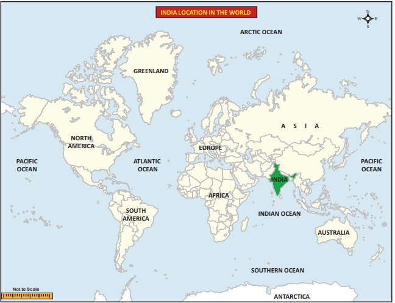
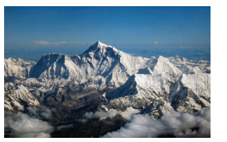
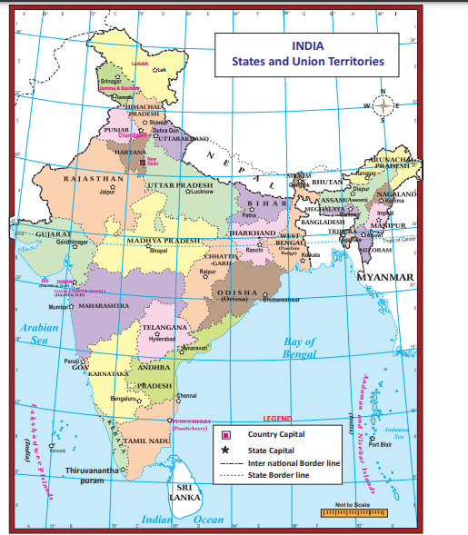
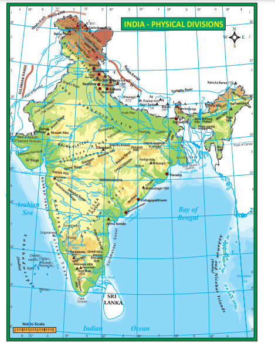
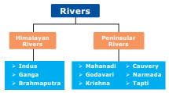
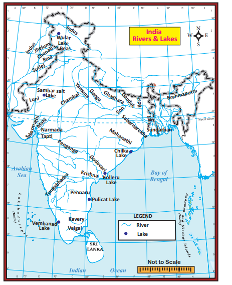
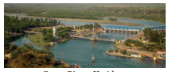

# Introduction

India is the seventh largest country in the world and second largest country in Asia. It is separated by the Himalayas from the rest of the continent. India accounts for about 2.4 % of the total area of the world with an area of 32,87,263 sq.km. many of the India states are larger than several countries of the world.

**India’s Land and Water Frontiers**

India shares its 15,200 km long land frontier with Pakistan and Afghanistan in the north-west, China, Nepal and Bhutan in the north and Bangladesh and Myanmar in the east.

India’s longest border is with Bangladesh (4156 km)while the shortest border is with Afghanistan.(106 km)

About 6,100 km long coastline of India is washed on three sides of the country by the Indian Ocean and its two arms namely the Arabian sea in the west and the Bay of Bengal in the east. The total length of the coast line of India including the islands is 7,516.6 km. India and Sri Lanka are separated by a narrow and shallow sea called Palk Strait.

The Indian land mass has a central location between, the East and the West Asia and the southward extension of the Asian continent. The trans Indian ocean routes which connect the countries of Europe in the west and the countries of East Asia provide a strategic central location to India. Thus it helps India to establish close trade contact with West Asia, Africa and Europe from the western coast and with South East, east Asia from the eastern coast.

**India: A Subcontinent**

India along with the countries of Myanmar, Bangladesh, Pakistan, Nepal, Bhutan and Sri Lanka is called a subcontinent.

This region possesses a distinct continental characteristics in physiography, climate, natural vegetation, minerals, human resources etc. Hence India is known as ‘**subcontinent’**.

**1.1 Location and Extent** 

India extends from **8°4 'N** to **37°6 'N** latitudes and **68°7 'E** to **97°25 'E** longitudes. Hence India is located in the north Eastern hemisphere

The southern most point of the country is Pygmalion Point or Indira Point (6°45'N latitude) located in the Andaman and Nicobar Islands. The southern most point of main land of India is **Cape Comorin** (Kanyakumari). The northern point is Indira Col.

The north-south extent of India is **3,214** km and it extends from **Indira Col** in Jammu and Kashmir in the north to Kanyakumari in the south. The east-west extension is **2933** km and it stretches from Rann of Kutch (Gujarat) in the west to Arunachal Pradesh in the east. The Tropic of Cancer (23°30’ N) passes through the middle of the country dividing it into two halves as northern temperate and southern tropical lands. 

**Indian Standard Time (IST)**

The longitudinal difference between Gujarat in the west and Arunachal Pradesh in the east is about 30°.

Since Arunachal Pradesh is towards east, it will have sunrise about two hours earlier than the sunrise at Gujarat which is in the west. In order to avoid these differences, Indian standard time is calculated. The local time of the central meridian of India is the standard time of India. **India’s central meridian is 82°30’ E longitude.** It passes through Mirzapur and roughly bisects the country in terms of longitude. The IST is 5.30 hrs ahead of Greenwich Mean Time (GMT).

India has been politically divided into 28 states and 9 union territories for administrative convenience.

>**Find out the following** 
� West - East and North - South extened of India. 
� Area wise which is the smallest and the largest state? 
� The states which do not have an international border.

  

## 1.2 Major Physiographic Divisions of India

The majestic Himalayan peaks in the north, the beautiful beaches in the south, the great Indian desert in the west and the breathtaking natural heritage in the east make India a geographically vibrant, colourful and truly incredible country.

There is a varied nature of physiographic divisions in India. Though the country has many landforms based on the major differences, it is divided into the following five physiographic divisions:

1. The Northern Mountains 
2. The Northern Plains 
3. The Peninsular plateau 
4. The Coastal Plains 
5. The Islands

**The Northern Mountains** 

The Northern Mountains consist of the youngest and the loftiest mountain chains in the world. It was formed only few millions years ago and formed by the folding of the earth crust due to tectonic activity. It stretches for a distance of 2,500 km from the Indus gorge in the west to Brahmaputra gorge in the east. The width of the Northern Mountains varies from 500 km in Kashmir to 200 km in Arunachal Pradesh. The Pamir Knot, popularly known as the **“Roof of the World”** is the connecting link between the Himalayas and the high ranges of Central Asia. From the Pamir, Himalayas extend eastward in the form of an arc shape. The term “Himalaya” is derived from Sanskrit. It means “The Abode **of Snow”**.

The Northern Mountains that function as a great wall is grouped into three divisions.

1. The Trans-Himalayas 
2. Himalayas 
3. Eastern Himalayas or Purvanchal hills.

>Aravalli range is the oldest fold mountain range in India.

**1. The Trans-Himalayas**

It lies to the north of the great Himalayan range. It lies in Jammu and Kashmir and Tibetian plateau. As its areal extent is more in Tibet, it is also known as Tibetean Himalayas. The Trans-Himalayas are about 40 km wide in its eastern and western extremities and about 225 km wide in its central part. They contain the Tethys sediments. The rocks of this region contain fossils bearing marine sediments which are underlain by ‘Tertiary granite’. It has partly metamorphosed sediments and constitutes the core of the Himalayan axis. The prominent ranges of Trans Himalayas are Zaskar, Ladakh, Kailash, and Karakoram.

**2. The Himalayas**

It constitutes the core part of northern mountains. It is an young fold mountain. It was formed by the movement of Eurasia land mass in the north and Gondwana land mass in the south. The Tethys sea found between these two land masses was uplifted by the compression and the resultant landform was the Himalayas.It consists of many ranges. The main divisions of the Himalayas are the

(i) The Greater Himalayas/The Himadri 
(ii) The Lesser Himalayas /The Himachal  
(iii) The Outer Himalayas/The Siwaliks

**(i) The Greater Himalayas or the Himadri** The Greater Himalayas rise abruptly like a

wall north of the Lesser Himalayas. The Greater Himalayas are about 25 km wide. Its average height is about 6,000 m. The Greater Himalayas receive lesser rainfall as compared to the Lesser Himalayas and the Siwaliks. Physical weathering is less effective over the Greater Himalayas as compared to the other ranges. Almost all the lofty peaks of Himalayas are located in this range. The notable ones are Mt. Everest (8,848

  

m) and Kanchenjunga (8,586 m). Mt.Everest is located in Nepal and Kanchenjunga is located between Nepal and Sikkim. This range is the most continuous of all ranges. It is region of permanent snow cover. So, it has many glaciers. **Gangothri, Yamunothri and Siachen** are some of them.

**(ii) The Lesser Himalayas or The Himachal** 

It is the middle range of Himalayas. Height of this range varies from 3, 700 to 4,500 m. Its width varies upto 80 km. The major rocks of this range are slate, limestone and quartzite. This region is subjected to extensive erosion due to heavy rainfall, deforestation and urbanization. Pir Panjal, Dhauladhar and Mahabharat are the mountain ranges found in this part. Major hill stations of the Himalayas are located in this range. **Shimla, Mussourie, Nainital, Almora, Ranikhet and Darjeeling** are the familiar ones.

>• The major passes in the Himalaya are Karakoram pass (Jammu and Kashmir), Zojila pass, Shipkila pass (Himachal Pradesh), Bomdila pass (Arunachal Pradesh), Nathula pass and Jhelepla pass (Sikkim).
• The Khyber pass which connects Pakistan and Afganisthan, and Bolan pass in Pakistan are theimportant passes of the Indian subcontinent

**(iii) The Outer Himalayas/The Siwaliks**

The Siwaliks extend from Jammu and Kashmir to Assam. It is partly made by the debris brought by the Himalayan rivers. The altitude varying between 900-1100 metres average elevation of this range is 1000 m. The width of Siwaliks varies from 10 km in the east to 50 km in the west. It is the most discontinuous range. The longitudinal valleys found between the Siwaliks and the Lesser Himalayas are called Duns in the west and Duars in the east. These are the ideal sites for the development of settlements in this region.

**3. Purvanchal Hills** 

These are the eastern off-shoot of Himalayas. It extended in the north-eastern states of India. Most of these hills are located along the border of India and Myanmar while others are inside India. Dafla Hills, Abor Hills, Mishmi Hills, Patkai Bum Hills, Naga Hills, Manipur Hills, Mizo Hills, Tripura Hills, Mikir Hills, Garo Hills, Khasi Hills and Jaintia Hills are the hills which are collectively known as **purvanchal Hills**.

**Importance of Himalayas**

• Himalayas blocks southwest monsoon winds and causes heavy rainfall to north India.

• It forms a natural barrier to the sub- continent.

• It is the source for many perennial rivers like Indus, Ganges, Brahmaputra etc.

• The Northern Mountains are described as the paradise of tourists due to its natural beauty.

• Many hill stations and pilgrim centres like Amarnath, Kedarnath, Badrinath and Vaishnavidevi temples are situated here.

• It provides raw material for many forest based industries.

• It prevents the cold winds blowing from the central Asia and protects India from severe cold.

• Himalayas are renowned for the rich biodiversity.

**The Great Northern Plains** 

This fertile plain lies to the south of the northern mountains. This plain is one of the most extensive stretches of the alluvium in the world and is deposited by the rivers Indus, Ganga, Brahmaputra and their tributaries. The length of the plain is about 2,400 km and the width varies from 240 to 320 km. Its width increases from east to west. It covers an area of over 7 lakh sq.km.

The Great Plains of India is remarkably a homogeneous surface with an imperceptible slope. They are formed mostly by the depositional process of the Himalayan and Vindhyan rivers. These rivers deposit enormous quantity of sediments deposited along the foothills and flood plains. The important characteristics featuress of sediment deposition in the plains areas as follows.

**a) The Bhabar Plain**

This plain is made up of gravels and unassorted sediments deposited by the Himalayan rivers. The porosity of this plain is so high that most of the small streams flow over this region disappear. Its width varies from 8 to 15 km. It is wider in the western plains (Jammu Division) than in the east (Assam). This plain is not suitable for cultivation, only big trees with large roots thrive in this region.

**b) The Tarai Tract**

It is a zone of excessive dampness, thick forests and rich wild life. This tract lies to the south of Bhabar plains. The width of this belt is 15-30 km. The Tarai is wider in the eastern parts of the Great Plains, especially in Brahmaputra Valley due to heavy rainfall. In many states, the Tarai forests have been cleared for cultivation.

**c) The Bhangar Plains**

The Bhangar represent the upland alluvial tracts of the Great Plains of India, formed by the older alluviums. The Bhangar land lies above the flood limits of the rivers. This soil is dark in colour, rich in humus content, well drained and useful for agriculture.  

**d) The Khadar Plains**

The new alluvium tracts along the courses of the rivers are known as the ‘Khadar’ or ‘Bet’ lands. The Khadar tracts are enriched by fresh deposits of silt every year during rainy seasons. The Khadar land consists of sand, silt, clay and mud. It is highly fertile soil.

**e) Delta**

Triangle shaped fertile land at the mouth of Ganga and Brahmaputhra rivers is called as the Sundarban delta. It is the biggest and fastest growing delta. It is an area of deposition as the river flows in this tract sluggishly. The deltaic plain consists mainly of old mud, new mud and marsh. In the delta region, the uplands are called ‘**Chars**’ while the marshy areas are called ‘**Bils**’.

On the basis of deposition of sediments by various rivers and topographical characteristics, the Northern Plains of India is divided into the following four major regions:

**1) Rajasthan Plains:** It is located to the west of Aravalli range. It covers an area of about 1,75,000 sq.km. Rajasthan plain is formed by the deposition of the river Luni and the long vanished river Saraswathi. There are several salt lakes in Rajasthan. The Sambhar salt lake (Pushkar Lake) near Jaipur is the prominent one.

The Thar desert, also known as the Great Indian desert is a large arid region in the north western part of the Indian subcontinent that covers an area of 2,00,000 km2 and forms a natural boundary between India and Pakistan. It is the world 7th largest desert.

The desert lies in the western part of the aravalli range and covers 2/3 of Rajastan state. There are two major divisions in the Thar desert. They are known as the Actual desert region (Marusthali) and the semi desert region (Bhangar). Many different types of sand dunes and salt lakes (Dhands) are seen here.

**2) Punjab - Haryana Plains:** It lies to the north- east of the Great Indian Desert. This plain is found over an area of about 1.75 lakh sq.km. The Punjab - Haryana plains are formed by the deposition of the rivers Sutlej, Beas and Ravi. This plain acts as water - divide (doab). The two major watershed it divides are Yamuna – Sutlej and Ganga – Yamuna.

**3) Ganga Plains:** It extends from the Yamuna River in the west to Bangladesh in the east. The total area covered by this plain is about 3.75 sq.km. River Ganga and its tributaries such as Ghaghra, Gandak, Kosi, Yamuna, Chambal, Betwa etc. constitute this plain by their sediments and make a great plain in India. It is the largest plain of India. The general slope of the entire plain (upper, middle and lower Ganga plains) is towards east and south-east.

**4) Brahmaputra Plains:** It is located mainly in the state of Assam. It is a low - level plain located in the eastern part of the Great Plains of India and is formed by the deposits of river Brahmaputra. It covers an area of about 56,275 sq.km. These plains create alluvial fans and marshy tracts.

**The Peninsular Plateaus**

The plateau region lies to the south of the Great Northern Plains. This is the largest physiographic division of our country. It covers an area of about 16 lakh sq.km (about half of the total area of the country). It is an old rocky plateau region. The topography consists of a series of plateaus and hill ranges interspersed with river valleys.

Aravalli hills mark the north-western boundary of the plateau region. Its northern and north-eastern boundaries are marked by the Bundelkhand upland, Kaimur and Rajmahal hills. The Western Ghats and the Eastern Ghats mark the western and eastern boundaries respectively. The altitude of a large portion of the plateau is more than 600 m from mean sea level. The peak of Anaimudi is the highest **point in the plateau**. Its height is 2,695 m and is located in Anaimalai. The general slope of this plateau is towards east. The Great Plateau is a part of the Gondwana (very ancient one) land mass. Due to the old age, the rivers in this region attained their base level and developed broad and shallow valleys.

The river Narmada divides the plateau region of India broadly into two parts. The region lying to the north of the Narmada is called the Central Highlands and the region lying to the south of Narmada is called the Deccan Plateau. All the major rivers (Mahanadi, Godavari, Krishna, Kaveri etc.) lying to the south of the Vindhyas flow eastwards and fall into the Bay of Bengal. Narmada and Tapti are the two rivers situated to the south of the Vindhyas flow westward. Their movement towards west is due to the presence of a rift valley in the region.

**a) Central Highlands**

The Central Highlands extend between the river Narmada and the Northern Great Plains. The Aravallis form the west and northwestern edge of the Central Highlands. These hills extend from Gujarat, through Rajasthan to Delhi in the northwesterly direction for a distance of about 700 km. The height of these hills is about 1,500 m in southwest while near Delhi the height is hardly 400 m. **Gurushikhar with 1,722 m is the highest peak of this range**.

The Western part of the Central Highland is known as the Malwa Plateau. It lies to the southeast of Aravallis and to the north of Vindhyachal Range. The rivers Chambal, Betwa and Ken drain the Malwa Plateau before they join the river Yamuna. The part of the Central Highlands which extends to the east of Malwa Plateau is known as Bundelkhand and its further extension is known as Bagelkhand. The eastern part of the Central High lands which lies in the north-eastern part of the Indian Plateau is known as Chhota-Nagpur Plateau. It covers much of Jharkhand, adjacent parts of Odisha, West Bengal, Bihar and Chhattisgarh. This region is very rich in mineral resources particularly iron ore and coal.

**b) Deccan Plateau**

This physiographic division is the largest part of the plateau region of India. The shape of this plateau is roughly triangular. One of the sides of this triangle is marked by the line joining Kanyakumari with Rajmahal Hills and this line passes through the Eastern Ghats. The second arm is marked by the Satpura Range, Mahadeo Hills, Maikal Range and the Rajmahal Hills. The third arm is marked by the Western Ghats. The area of this Plateau is about 7 lakh square km and the height ranges from 500 to 1000 m above sea level.

**1. The Western Ghats**

The Western Ghats forms the western edge of the Peninsular Plateau. It runs parallel to the Arabian Sea coast. The northern part of this range is called as Sahyadris. The height of the Sahyadris increases from north to south. Anaimudi is a sort of tri-junction of the Anaimalai Range, the Cardamom Hills and the Palani Hills. Kodaikanal is a beautiful hill resort situated on the Palani Hills.

**2. The Eastern Ghats**

Eastern Ghats run from southwest to northeast form the eastern edge of this Plateau. This range is also called as Poorvadri. The Eastern Ghats join the Western Ghats at the Nilgiri hills, bordering Karnataka and Tamil Nadu. The Eastern Ghats are not continuous like the Western Ghats. The rivers of Mahanadi, Godavari, Krishna, Pennar and Kaveri have dissected this range at many places.

**The Coastal Plains**

The Peninsula Plateau of India is flanked by narrow coastal plains of varied width from north to south. They were formed by the depositional action of the rivers and the erosional and depositional actions of the sea- waves. The Indian coastal plains are divided into the following two divisions:

1) The Western Coastal Plains

2) The Eastern Coastal Plains.  

**1. The Western Coastal Plain**

It lies between the Western Ghats and the Arabian Sea. It extends from Rann of kutch in the north to Kanyakumari in the south and its width varies from 10 to 80 km. It is mainly characterised by sandy beaches, coastal sand dunes, mud flats, lagoons, estuary, laterite platforms and residual hills. The northern part of the West Coastal Plain is known as Konkan Plain. The middle part of this plain is known as Kanara. The southern part of the plain is known as Malabar coast which is about 550 km long and 20-100 km wide. This part of the coast is characterized by sand dunes. Along the coast, there are numerous shallow lagoons and backwaters called **Kayals** and **Teris**. **Vembanad** is a famous back water lake found in this region.

**2. The Eastern Coastal Plain**

It lies between the Eastern Ghats and the Bay of Bengal and, stretches along the states of West Bengal, Odisha, Andhra Pradesh and Tamil Nadu. These plains are formed by the alluvial fillings of the littoral zone by the east flowing rivers of India. The coastal plain consists mainly of the recent alluvial deposits. This coastal plain has a regular shoreline with well-defined beaches. The coastal plain between Mahanadi and Krishna river is known as the Northern Circars and the southern part lies between Krishna and Kaveri rivers is called Coromandal coast. Among the back water lakes of this coast, lake **Chilka** (Odisha) is the largest lake in India located to the southwest of the Mahanadi delta, the **Kolleru Lake** which lies between the deltas of Godavari and Krishna and the **Pulicat Lake** lies in the border of Andhra Pradesh and Tamil Nadu are the well known lakes in the east coastal plain.

**The Islands**

India has two major island groups namely Andaman and Nicobar and Lakshadweep. The former group consists of 572 islands and are located in Bay of Bengal, and the later one has 27 islands and are located in Arabian Sea. The islands of Andaman and Nicobar are largely tectonic and volcanic origin. India’s only active volcano is found on Barren Island in Andaman and Nicobar group of Islands.

**a) Andaman and Nicobar Islands**

These islands are located in an elevated portion of the submarine mountains. Since these islands lie close to the equator, the climate remains hot and wet throughout the year and has dense forests. The area of the island group is about 8,249 sq.km. The entire group of islands is divided into two. They are Andaman in the north and the Nicobar in the south. These island groups are of great strategic importance for the country. Port Blair is the administrative capital of the Andaman and Nicobar islands. The Ten Degree Channel separates Andaman from Nicobar group. The southernmost tip, the **Indira Point** is a part of Nicobar Island.

**b) Lakshadweep Islands**

This is a small group of coral islands located off the west coast of India. It covers an area of 32 sq. km. Kavaratti is its administrative capital. Lakshadweep islands are separated from the Maldive Islands by the Eight Degree Channel. The uninhabited “Pitt Island” of this group has a bird sanctuary. Earlier, it had three divisions namely Laccadive, Minicoy and Amindivi. It was named as Lakshadweep in 1973.

**c) Offshore Islands**

Besides the two group of islands, India has a number of islands along the Western Coast, Eastern Coast, in the delta region of Ganga and in the Gulf of Mannar. Many of these islands are uninhabited and are administered by the adjacent states.

## 1.3 Drainage System of India

A drainage system is an integrated system of tributaries and a trunk stream which collects and drains surface water into the sea, lake or some other body of water. The total area drained by a river and its tributaries is known as a drainage basin. The drainage pattern of an area is the result of the geological structure of the respective areas. The drainage system of India is broadly divided into two major groups on the basis of their location. They are Himalayan rivers and the Peninsular rivers.

**Himalayan Rivers**

These rivers are found in north India and originate from Himalayas. So, they are also called as Himalayan rivers. These are perennial rivers.

**a) The Indus River System** 

The Indus River is one of the largest rivers of the world. It originates from the northern slope of the Kailash range in Tibet near Manasarovar Lake at an elevation of about 5,150 m. Its length is about 2,880 km (Only 709 km is in India). The river has a total drainage area extending 11,65,500 sq km in which 321,289 sq km areas are drained in India. The river flows through the Ladakh and Zaskar ranges and creates deep gorges. The river runs through Jammu and Kashmir, turns south near Chillar and enters Pakistan. Its major tributaries are Jhelum, Chenab (Largest tributary of Indus), Ravi, Beas and Sutlej. It enters into with the Arabian Sea.

**b) The Ganga River System**

The Ganga River system is the largest drainage system of India. It extends over an area of 8,61,404 sq km. The Ganga plain is the most densely populated place in India and many towns are developed on the banks of this river. The river Ganga originates as Bhagirathi from the Gangotri Glacier in Uttar Khasi District of Uttarkhand state, at an elevation of 7,010 m.

The length of the river Ganga is about 2,525 km. Its major tributaries from the north are Gomti, Gandak, Kosi and Ghaghra and from south, Yamuna (largest tributary of Ganga), Son, Chambal etc. The river Ganga is known as the River Padma in Bangladesh. The combined river of Ganga and Brahmaputra creates the World’s largest delta known as Sundarbans in Bangladesh before joining the Bay of Bengal.

**c) The Brahmaputra River System**

The river Brahmaputra originates from the Chemayungdung Glacier of the Kailash range to the east of Lake Manasarovar in Tibet at an elevation of about 5,150 m. The total area is about 5,80,000 sq km but the drainage area found in India is 1,94,413 sq km This river is known as Tsangpo (Purifier) in Tibet. The length of this river is about 2,900 km (900 km in India). It enters into India through a gorge in Arunachal Pradesh namely Dihang. It has many tributaries. Tista, Manas, Barak, Subansiri are some of them. This river is called as Jamuna in Bangladesh. After it joins with the river Ganga in Bangladesh, the river is called as Meghna.

**Characteristics of Himalayan Rivers** 

1. Long and wide 
2. Perennial in nature 
3. Unsuitable for hydro power generation 
4. Middle and lower courses are navigable

**Peninsular Rivers**

The rivers in south India are called the Peninsular rivers. Most of these rivers originate from the Western Ghats. These are seasonal rivers (non–perennial). They have a large seasonal fluctuation in volume of water as they are solely fed by rain. These rivers flow in valleys with steep gradients. Based on the direction of flow, the peninsular rivers are divided into the

1. West flowing rivers

2. East flowing rivers

**East Flowing Rivers**

**a) Mahanadi**

The river Mahanadi originates near Sihawa in Raipur district of Chattisgarh and flows through Odisha. Its length is 851 km. Seonath, Telen, Sandur and Ib are its major tributaries. The main stream of Mahanadi gets divided into several distributaries such as Paika, Birupa, Chitartala, Genguti and Nun. All these distributaries form the Delta of Mahanadi which is one of the largest deltas in India. The Mahanadi empties its water in Bay of Bengal.

**b) Godavari**

**Godavari** is the longest river (1,465 km) with an area of 3.13 lakh km2 among the Peninsular rivers. It is also called Vridha Ganga. It originates in Nasik district of Maharashtra, a portion of Western Ghats. It flows through the states of Telangana and Andhra Pradesh before joining Bay of Bengal. Purna, Penganga, Pranitha, Indravati, Tal and Salami are its major tributaries. The river near Rajahmundry gets divided into two Channels called Vasistha and Gautami and forms one of the largest deltas in India. Kolleru, a fresh water lake is located in the deltaic region of the Godavari.

**c) Krishna**

The river Krishna originates from a spring at a place called Mahabaleshwar in the Western Ghats of Maharashtra. Its length is 1,400 km and an area of 2.58 lakh sq km. It is the second longest Peninsular river Bhima, Peddavagu, Musi, Koyna and Thungabhadra are the major tributaries of this river. It also flows through Andhra Pradesh and joins in Bay of Bengal, at Hamasaladeevi.

**d) Kaveri**

The river Kaveri originates at Talakaveri, Kudagu hills of Karnataka. Its length is 800 km. The river kaveri is called Dhakshin Ganga or Ganga of south. In Karnataka the river bifurcates twice, forming the sacred islands of Srirangapatnam and Sivasamudram. While entering Tamil Nadu, the Kaveri continues through a series of twisted wild gorges until it reaches Hogenakkal Falls and flows through a straight, narrow gorge near Salem. The Kaveri breaks at Srirangam Island with two channels, river Coleroon and Kaveri. At last, it empties into the Bay of Bengal at Poompuhar.

**West Flowing Rivers** 

**a) Narmada**

This river rises in Amarkantak Plateau in Madhya Pradesh at an elevation of about 1057 m and flows for a distance of about 1,312 km. It covers and area of 98,796 sq km and forms 27 km long estuary before outfalling into the Arabian Sea through the Gulf of Cambay. It is the largest among the west flowing rivers of Peninsular India. Its principal tributaries are Burhner, Halon, Heran, Banjar, Dudhi, Shakkar, Tawa, Barna and Kolar.

**b) Tapti**

The Tapti is one of the major rivers of Peninsular India with the length of about 724 km. It covers an area of 65,145 sq km. Tapti river rises near Multai tank in the Betul district of Madhya Pradesh at an elevation of about 752 m. It is one of only the three rivers in Peninsular India that run from east to west - the others being the Narmada and the Mahi. The major tributaries are Vaki, Gomai, Arunavati, Aner, Nesu, Buray, Panjhra and Bori. It outfalls into the Arabian Sea through the Gulf of Cambay.

>In which river the Gerosappa (jog) fall is found?

**Characteristics of South Indian Rivers**

1. Originate from Western Ghats
2. Short and narrow
3. Non perennial in nature
4. Suitable for hydro power generation
5. Not useful for navigation 
