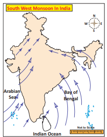
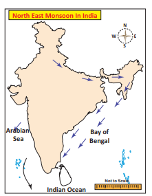
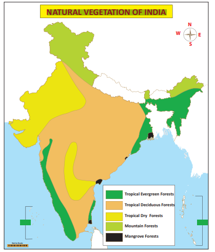
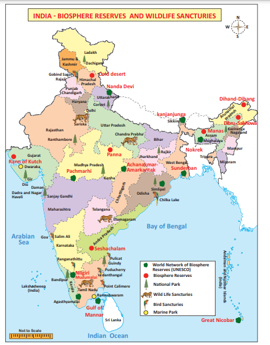

  

**Introduction**

We drink more water during summer and do not drink the same amount of water during winter. Why do we wear cotton or lighter clothes during summer season and heavy woollen clothes during cold weather season in north India? Why do not we wear woollen clothes in south India? This is because of the prevalence of varying weather conditions between north and south India.

>Equable climate is also called as the British climate, Which is neither too hot nor too cold.

## 2.1 The factors affecting the climate

Climate of India is affected by the factors of latitude, altitude, distance from the seas, monsoon wind, relief features and jet stream.

**Latitude** 

Latitudinally, India lies between 8°4'N and 37°6'N latitudes. The Tropic of cancer divides the country into two equal halves. The area located to the south of Tropic of cancer experiences high temperature and no severe cold season throughout the year whereas, the areas to the north of this parallel enjoys sub- tropical climate.

**Altitude**

When the altitude increases, The temperature decreases. Temperature decreases at the rate of 6.50C for every 1000 metres of ascent. It is called **normal lapse rate.**

Hence, places in the mountains are cooler than the places on the plains. Ooty and several other hill stations of south India and of the Himalayan ranges like Mussourie, Shimla etc., are much cooler than the places located on the Great Plains.

>Find out the temperature of Ooty (2240m) when it is 350C in Chennai (6.7m)

**Distance from the Sea**

A large area of India, especially the peninsular region, is not very far from the sea and this entire area has a clear maritime influence on climate. This part of the country does not have a very clearly marked winter and the temperature is equable almost throughout the year. Areas of central and north India experience much seasonal variation in temperature due to the absence of influence of seas. Here, summers are hot and winters are cold. The annual temperature at Kochin does not exceed 30°C as its location is on the coast while it is as high as 40°C at Delhi, since it is located in the interior part. Air near the coast has more moisture and greater potential to produce precipitation. Due to this fact, the amount of rainfall at Kolkata located near the coast is 119 cm and it decreases to just 24 cm at Bikaner which is located in the interior part.

**Monsoon Wind**

The most dominant factor which affects the climate of India is the monsoon winds. These are seasonal reversal winds and India remains in the influence of these winds for a considerable part of a year. Though, the sun’s rays are vertical over the central part of India during the mid- June, the summer season ends in India by the end of May. It is because the onset of southwest monsoon brings down the temperature of the entire India and causes moderate to heavy rainfall in many parts of the country. Similarly, the climate of southeast India is also influenced by northeast monsoon.

**Relief**

Relief of India has a great bearing on major elements of climate such as temperature, atmospheric pressure, direction of winds and the amount of rainfall. The Himalayas acts as a barrier to the freezing cold wind blows from central Asia and keep the Indian subcontinent warm. As such the north India experiences tropical climate even during winter. During southwest monsoon, areas on the western slope of the Western Ghats receive heavy rainfall. On the contrary, vast areas of Maharashtra, Karnataka, Telangana, Andhra Pradesh and Tamil nadu lie in rain shadow or leeward side of the Western Ghats receive very little rainfall. During this season, Mangalore, located on the coast gets the rainfall of about 280 cm whereas the Bengaluru located on the leeward side receives only about 50 cm rainfall.

**Jet Streams**

Jet streams are the fast moving winds blowing in a narrow zone in the upper atmosphere. According to the Jet stream theory, the onset of southwest monsoon is driven by the shift of the sub tropical westerly jet from the plains of India towards the Tibetan plateau. The easterly jet streams cause tropical depressions both during southwest monsoon and retreating monsoon.

## 2.2 Monsoon

The word ‘monsoon’ has been derived from the Arabic word ‘**Mausim**’ which means ‘season’. Originally, the word ‘monsoon’ was used by Arab navigators several centuries ago, to describe a system of seasonal reversal of winds along the shores of the Indian Ocean, especially over the Arabian Sea. It blows from the south-west to north-east during summer and from the north- east to south-west during winter.

Meteorologists have developed a number of concepts about the origin of monsoons. According to the Dynamic concept, Monsoon wind originates due to the seasonal migration of planetary winds and pressure belts following the position of the sun. During summer solstice, the sun’s rays fall vertically over the Tropic of cancer. Therefore, all the pressure and wind belts of the globe shift northwards. At this time,

**Inter -Tropical Convergence Zone** (ITCZ) also moves northward, and a major part of Indian landmass comes under the influence of southeast trade winds. While crossing equator this wind gets deflected and takes the direction of southwest and becomes south-west monsoon. During the winter season, the pressure and wind belts shift southward, thereby establishing the north-east monsoon (trade winds) over this region. Such systematic change in the direction of planetary winds is known as monsoon.

**Seasons**

The meteorologists recognize the four distinct seasons in India. They are; 

**1. Winter season**

During this period, the vertical rays of the sun falls over tropic of capricorn which is far away from India. Hence, India receives the slanting sun’s rays which results in low temperature. The cold weather season is characterized by clear skies, fine weather, light northerly winds, low humidity and large day time variations of temperature. During this season a high pressure develops over north India and a north-westerly wind blows down the Indus and Ganges valleys. In south India, the general direction of wind is from east to west.

The rain during this season generally occurs over the Western Himalayas, Tamil nadu and Kerala. Western disturbances and associated trough in westerlies are main rain bearing system in northern part of the country. The jet stream plays a dominant role in bringing these disturbances to India. Western disturbances cause rainfall in Punjab, Haryana and Himachal Pradesh, and snowfall in the hills of Jammu and Kashmir. This rainfall is very useful for the cultivation of winter wheat.

**2. Summer season**

During this season, the vertical rays of the sun falls over the peninsular India. Hence, there is a steady increase in temperature from south to north. It is practically hot and dry in the entire country in the initial part of this season. Weather over the land areas of the country is influenced by thunderstorms associated with rain and sometimes with hail mostly in the middle and later part.

During this season, temperature starts increasing all over the country and by April, the interior parts of south India record mean daily temperatures of 30°C–35°C. Central Indian land mass becomes hot with day-time maximum temperature reaching about 40°C at many locations.

Because of the atmospheric pressure conditions, the winds blow from southwest to northeast direction in Arabian Sea and Bay of Bengal. They bring pre monsoon showers to the west coast during the month of May. There are few thunder showers called “**Mango Showers**” which helps in quick ripening of mangoes along the coast of Kerala and Karnataka.

“**Norwesters**” or “**Kalbaisakhis**” are the local storms with thunder that blow from north western part and rain lasting for short durations. It occurs over the eastern and north eastern parts over Bihar, West Bengal and Assam during April and May. They approach the stations from the northwesterly direction.

**3. Southwest monsoon or Rainy Season**

The southwest monsoon is the most significant feature of the Indian climate. The onset of the southwest monsoon takes place normally over the southern tip of the country by the first week of June, advances along the Konkan coast in early June and covers the whole country by 15th July. The monsoon is influenced by global phenomenon like ElNino.

Prior to the onset of the southwest monsoon, the temperature in north India reaches upto 46°C. The sudden approach of monsoon wind over south India with lightning and thunder is termed as the ‘**break**’ or ‘**burst of monsoon’. The monsoon wind strikes against** the southern tip of Indian land mass and gets divided into two branches. One branch starts from Arabian sea and the other from Bay of Bengal.

The Arabian sea branch of southwest monsoon gives heavy rainfall to the west coast of India as it is located in the windward side of the Western Ghats. The other part which advances towards north is obstructed by Himalayan Mountains and results in heavy rainfall in north. As Aravalli Mountain is located parallel to the wind direction, Rajasthan and western part do not get much rainfall from this branch.

The Bay of Bengal branch moves towards northeast India and Myanmar. This wind is trapped by a chain of mountains namely Garo, Khasi and Jaintia are mainly responsible for the heaviest rainfall caused at **Mawsynram** located in Meghalaya. Later on, this wind travel towards west which results in decrease in rainfall from east to west. Over all about **75% of Indian rainfall is received from this monsoon**.

**4. Northeast monsoon season**

The southwest monsoon begins to retreat from north India by the end of September due to the southward shifting pressure belts. The southwest monsoon wind returns from Indian landmass and blows towards Bay of Bengal. The coriolis force deflects this wind and makes it to blow from northeast. Hence, it is known as Northeast monsoon or Post-monsoon season. The season is associated with the establishment of the north-easterly wind system over the Indian subcontinent. Andhra Pradesh, Tamil nadu, Kerala and south interior Karnataka receive good amount of rainfall accounting for 35% of their annual total. Many parts of Tamil nadu and some parts of Andhra Pradesh and Karnataka receive rainfall during this season due to the storms forming in the Bay of Bengal. Large scale losses to life and property occur due to heavy rainfall, strong winds and storm surge in the coastal regions. The day time temperatures start falling sharply all over the country.

## 2.3 Distribution of rainfall 

**The average annual rainfall of India is 118 cm**. However, spatial distribution of rainfall in the country is highly uneven.The Western coast, Assam, South Meghalaya, Tripura, Nagaland and Arunachal Pradesh are the heavy rainfall areas which get more than 200 cm rainfall. The whole of Rajasthan, Punjab, Haryana, Western and Southwestern parts of Uttar Pradesh, Western Madhya Pradesh, the entire Deccan Trap or Plateau region east of Western Ghats except for a narrow strip along Tamil nadu coast receive a low rainfall of less than 100 cm. The rest of the areas receive a rainfall ranging between 100 and 200 cm.

## 2.4 Natural Vegetation 

Natural vegetation refers to a plant community unaffected by man either directly or indirectly. It has its existence in certain natural environment. Natural vegetation includes all plant life forms such as trees, bushes, herbs and forbs etc, that grow naturally in an area and have been left undisturbed by humans for a long time.

Climate, soil and landform characteristics are the important environmental controls of natural vegetation.

On the basis of the above factors the natural vegetation of India can be divided into the following types.

**Tropical Evergreen Forest**

These forests are found in areas with 200 cm or more annual rainfall. The annual temperature is about more than 22°C and the average annual humidity exceeds 70 percent in this region. Western Ghats in Maharashtra, Karnataka, Kerala, Andaman-Nicobar Islands, Assam, West Bengal, Nagaland, Tripura, Mizoram,Mawsynram, the place which receives highest rainfall (1141 cm) in the world. It is located in Meghalaya.  

Manipur and Meghalaya states have this type of forests. The most important trees are rubber, mahogany, ebony, rosewood, coconut, bamboo, cinchona, candes, palm, iron wood and cedar. These have not been fully exploited due to lack of transport facilities.

**Tropical Deciduous Forest**

These are found in the areas with 100 to 200cm. annual rainfall. These are called ‘**Monsoon Forests**’. The mean annual temperature of this region is about 27oC and the average annual relative humidity is 60 to 70 percent. The trees of these forests drop their leaves during the spring and early summer. (Sub Himalayan - Region from Punjab to Assam, Great Plains- Punjab, Haryana, Uttar Pradesh, Bihar, West Bengal, Central India - Jharkhand, Madhya Pradesh, Chattisgarh, South India - Maharashtra, Karnataka, Telangana, Andhra Pradesh, Tamilnadu and Kerala states are notable for this type of natural vegetation.) Teak and sal are the most important trees. Sandalwood, rosewood, kusum, mahua, palas, haldu, amla, padauk, bamboo and tendu are the other trees of economic importance. These forests also provide fragrant oil, varnish, sandal oil and perfumes.

**Tropical Dry Forest**

These are found in the areas with 50 to 100 cm. annual rainfall. They represent a transitional type of forests. These are found in east Rajasthan, Haryana, Punjab, Western Uttar Pradesh, Madhya Pradesh, Eastern Maharashtra, Telangana, West Karnataka and East Tamilnadu. The important species are mahua, banyan, amaltas, palas, haldu, kikar, bamboo, babool, khair etc.,

**Desert and Semi-desert Vegetation: These** are also called as ‘Tropical thorn forests’. These are found in the areas having annual rainfall of less than 50 cm. They have low humidity and high temperature. These forests are found in north-west India which includes west Rajasthan, south-west Haryana, north Gujarat and south- west Punjab. They are also found in the very

dry parts of the Deccan plateau in Karnataka, Maharashtra and Andhra Pradesh. Babul, kikar and wild palms are common trees found here.

**Mountain or Montane Forest**

These forests are classified on the basis of altitude and amount of rainfall.

**i. These are found on the slopes of the** mountains in north-east states. These forests found in the altitude of 1200-2400m. Sal,Oak, Laurel, Amura, Chestnut, Cinnamon are the main trees found here. Oak, birch, silver, fir, fine, spruce and juniper are the major trees found at the altitude of 2400 to 3600m.

**ii. The rainfall of this region is moderate. These** forests are found in Jammu & Kashmir, Himachal Pradesh and Uttarakhand. Upto 900 m altitude semi desert vegetation is found and it is known for bushes and small

  

trees. In altitude from 900 to 1800m, chir is the most common tree. From 1800 to 3000m is covered with semi temperate coniferous forests.

**Alpine Forest**

It occurs all along the Himalayas with above 2400 m altitude. These are purely having coniferous trees. Oak, silver fir, pine and juniper are the main trees of these forests. The eastern parts of Himalayas has large extent of these forests.

**Tidal Forest**

These forests occur in and around the deltas, estuaries and creeks prone to tidal influences and as such are also known as delta or swamp forests. The delta of the Ganga- Brahmaputra has the largest tidal forest. The deltas of Mahanadi, Godavari and Krishna rivers are also known for tidal forests. These are also known as **mangrove forest**.

## 2.5 Wildlife

The term ‘Wildlife’ includes animals of any habitat in nature. Wild animals are non-domesticated animals and include both vertebrates (fish, amphibians, reptiles, birds and mammals) and invertebrates (bees, butterflies, moths etc.). India has a rich and diversified wildlife. The Indian fauna consists of about 81,251 species of animals out of the world’s total of about 1.5 million species.

Our country is home to tigers, lions, leopards, snow leopards, pythons, wolves, foxes, bears, crocodiles, rhinoceroses, camels, wild dogs, monkeys, snakes, antelope species, deer species, varieties of bison and the mighty Asian elephant. Hunting, poaching, deforestation and other anthropogenic interferences in the natural habitats have caused extinction of some species and many are facing the danger of extinction. 

**The Indian Board for Wildlife (IBWL)**

It was constituted in 1952 to suggest means of protection, conservation and management of wildlife to the government. 

The Government of India enacted Wildlife (Protection) Act in 1972 with the objective of effectively protecting the wild life of the country and to control poaching, smuggling and illegal trade in wildlife and its diversities.

To preserve the country’s rich and diverse wildlife a network of **102 National Parks** and about **515 Wildlife Sanctuaries** across the country have been created.

**Biosphere Reserves**

Biosphere reserves are protected areas of land coastal environments 

The Indian government has established **18 Biosphere Reserves** in India which protect large areas of natural habitat which often include few National Parks with buffer zones that are open to some economic uses.

**Biosphere Reserves in India**

Eleven of the eighteen biosphere reserves (Gulf of Mannar, Nandadevi, the Nilgiris, Nokrek, Pachmarhi, Simlipal, Sundarbans Agasthiyamalai, Great Nicobar, Kanjanjunga and Amarkantak) of India fall under the list of Man and Biosphere programme of UNESCO.