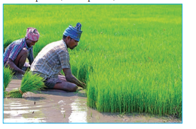
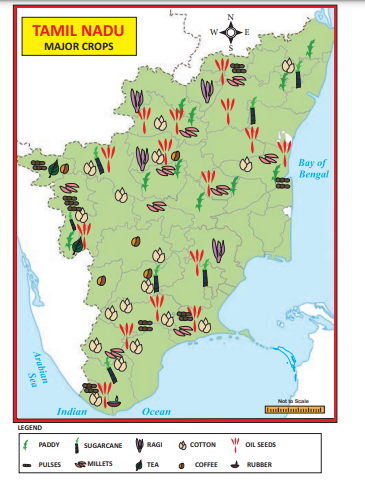
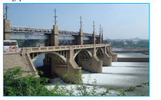
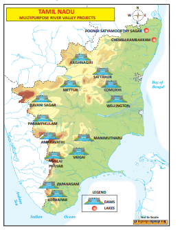
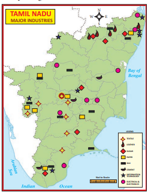
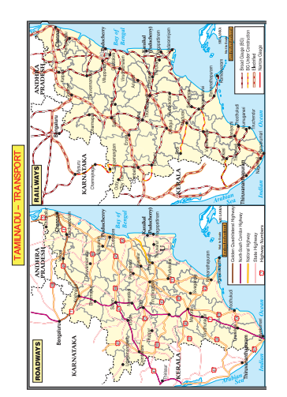
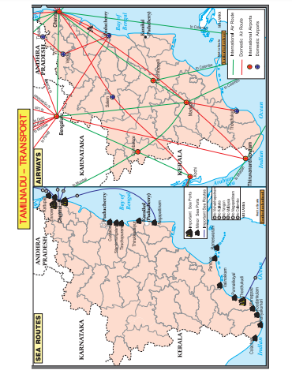
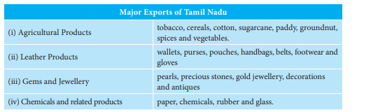

  

# Introduction

Human geography refers to the study of ways of development of human societies and their operation in relation to their physical environment. This chapter focuses on the distribution, characteristics and utilisation of different resources in Tamil Nadu. We have studied earlier that the earth is endowed with a variety of natural resources such as landforms, rivers, soil, natural vegetation, water and wildlife. These resources are useful only when they are utilised. Human beings use these resources using their intelligence and skill. Thus, the human beings are the most significant resource on the earth surface. They turn all these natural resources into useful products with their skills and abilities.

## 7.1 Agriculture

The word "agriculture" is derived from the Latin words **"ager and cultura"**, which means field and growing. Agriculture is a practice of farming that includes the cultivation of crops, rearing of animals, birds, forestry, fisheries and other related activities. Agriculture is the major occupation in Tamil Nadu. Agriculture has been the mainstay of the state’s economy since independence with more than 65% of the population depends upon this sector for their living. Agriculture provides employment for rural people on a large scale. There is a strong link between agriculture and economic growth. Paddy, millets and pulses are the principal food crops of the state. Sugarcane, cotton, sunflower, coconut, cashew, chillies, gingelly, groundnut, tea, coffee, cardamom and rubber are the major commercial crops.

## 7.2 Geographical determinants of Agriculture

Landform, climate, soil and irrigation are the factors that determine the growth of agriculture.

**Landform** 

Tamil Nadu is a land of diverse landscape comprising of hills, plateaus and plains. Among them the plains are most suitable for agriculture. The plains with alluvial soil enhances agricultural productivity. Example: Plains of cauvery. Agriculture in the plateau is moderate and is poor on the hills.

**Climate**

Tamil Nadu is situated in the tropical zone, which is nearer to the equator. The state experiences a tropical climate. Hence, the temperature in Tamil Nadu is relatively high almost throughout the year. So, only the tropical crops are cultivated. Water is another limiting factor of agriculture. Northeast monsoon is the major source of rainfall for Tamil Nadu. Therefore, the major cropping season begins with this season. The rainfall in this season and the irrigation facilities affect agriculture to a large extent.

**Soil** 

Soil is one of the most essential elements of agriculture. It provides essential minerals or nutrients for the growth of crops and vegetation. The regions of river valleys and the coastal plains are the most agriculturally productive regions of the state as they are covered with fertile alluvial soil.

**Irrigation** 

Monsoon rainfall in the state is highly irregular. Further it is seasonal. Hence, irrigation becomes necessary for successful cultivation of crops in the state. In the dry regions, rain-fed crops are cultivated.

**Types and regions of Agriculture Practices in Tamil Nadu**

| Farming type |Area practiced |
|------|------|
| Subsistence intensive agriculture |Practiced all over Tamil Nadu with few exceptions. |
| Plantation Agriculture |Hill slopes of Eastern and Western Ghats. |
| Mixed farming |Banks of River Cauvery and Thenpennai. |

## 7.3 Cropping Seasons in Tamil Nadu

Farmers select different crops for different seasons of cultivation. It is based on the temperature and availability of moisture in the soil. Accordingly, the state has the following cropping seasons.

| Name |Sowing |Harvesting |Major crops |
|------|------|------|------|
| Sornavari(chittirai pattam ) |April-May |August-September |Millets and cotton |
| Samba (Adipattam) |July-August |January-Februar y |Paddy and sugarcane |
| Navarai |November-December |Februar y-March |Fruits, vegetables,cucumber andwatermelon |

## 7.4 Distribution of major crops in Tamil Nadu

**Paddy** 

Paddy is the most important staple food crop of Tamil Nadu. Ponni and kichadi samba are the major varieties of paddy grown in Tamil Nadu. Though it is cultivated all over Tamil Nadu, its cultivation is highly concentrated in Thanjavur, Tiruvarur, Tiruvallur, Kancheepuram, Villupuram, Cuddalore and

Tirunelveli districts. It ranks third in the production of rice among the states of India. The deltaic region of river cauvery (the undivided Thanjavur district) is the major rice-producing region of Tamil Nadu. So, this region is rightly called as the **"Granary of Tamil Nadu."**

**Millets** 

Millets form staple food of nearly one-third of human population of Tamil Nadu. Sorghum/jowar (cholam), ragi (kezhvaragu) and bajra (kambu) are the major millets. These are grown not only in drier areas but also in the coastal plains. Sorghum is grown in the Coimbatore plateau and Kambam valley. Ragi is grown in Coimbatore, Dharmapuri, Vellore and Cuddalore districts. Bajra is mostly cultivated in Ramanathapuram, Tirunelveli, Karur, Perambalur and Salem districts.

>India observed 2018 as national year of millets. FAO has decided to observe 2023 as the International year of millets.

**Pulses** 

Pulses are the major source of protein.Bengal gram, black gram, green gram, cowpea and horse gram are the important pulses grown in Tamil Nadu. Pulses are grown in a wide range of climatic conditions mostly in drier regions with or without irrigation. Mild cool climate and a low to moderate rainfall are best suited for these crops. Pulses serve as excellent fodder. Pulses are grown in almost all districts in the state except Chennai, Nilgiris and Kanyakumari. Coimbatore leads in the production of Bengal gram. Vellore and Kanyakumari districts produce red gram.

Tiruvarur, Nagapattinam and Thoothukudi districts are the principal producers of green gram and black gram. Horse gram is widely cultivated in Dharmapuri and Krishnagiri districts.

**Oil Seeds** 

Groundnut, gingelly castor, coconut,sunflower and mustard are some of the oilseeds that are grown in Tamil Nadu. Apart from its use in food preparation, it is used in industries as a lubricant, in the manufacture of varnish, soaps, candles, cosmetics and pharmaceuticals. Groundnut is the major oilseed of the state. The cultivation of groundnut is mostly concentrated in Vellore, Tiruvannamalai, Villupuram, Salem and Pudukottai districts. It is also grown to some extent in Dharmapuri, Cuddalore, Perambalur and Madurai. Erode, Ramanathapuram, Sivagangai and Virudhunagar districts are its minor producers. Coconut is grown in Coimbatore, Thanjavur and Kanyakumari districts.

**Sugarcane** 

It is one of the major cash crops of the state. It is an annual crop. It requires high temperature and heavy rainfall. It grows well in the tropical region. Major sugarcane-producing districts are Tiruvallur, Kancheepuram, Vellore, Cuddalore, Tiruchirapalli, Coimbatore, Erode and Tirunelveli.

**Cotton** 

Cotton is a fibre and cash crop. It requires black soil, long frost-free condition and warm and humid weather for its cultivation. Humid weather in the early stages and hot, dry weather during harvest period is suitable for this crop. It is predominantly cultivated in Coimbatore plateau and Vaigai-Vaippar river basins. It is also cultivated in Madurai, Ramanathapuram, Virudhunagar, Tirunelveli, Thoothukudi, Salem and Dharmapuri districts.

**Plantation crops** 

Tea, coffee, cashew, rubber and cinchona are the major plantation crops of the state. Tamil Nadu ranks second in area and production of tea in India next to Assam. Tea plantations are found in the hills of the Nilgiris and Coimbatore. The Nilgiris is the notable regions for tea plantations. Coffee plants are grown in the hills of Western Ghats as well as Eastern Ghats. It is also found in the hilly slopes of Dindigul, Madurai, Theni and Salem districts. Yercaud, Kolli Hills and Kodaikanal are notable for coffee plantations. Tamil Nadu stands second in area and production of coffee next to Karnataka. Rubber plantations are significant in Kanyakumari. Pepper is confined to the warm and wet slopes of Eastern and Western Ghats of Tamil Nadu. Cashew is extensively cultivated in Cuddalore district.

>To promote organic farming a central scheme named ‘National Project on Organic Farming’ was launched Apart from general things (creating awareness, promoting organic fertilizers, training, capacity building etc.), the scheme provides financial assistance through Capital Investment Subsidy Scheme for agro-waste compost production units, bio-fertilizers/bio-pesticides production units, development and implementation of quality control regime, human resource development etc.

## 7.5 Livestock/Animal Husbandry

Livestock has remained an integral part of socio-economic fabric of rural people.

**Goat** Goat is also known as **‘poor man’s cow’** in India. It forms a very important component in dry land farming system. In the marginal or undulating lands unsuitable for rearing of other types of cattle like cow or buffalo, goat is the best alternative. With very low investments, goat rearing can be made into a profitable venture for small and marginal farmers.

**Sheep** 

Sheep is used for multiple purposes like wool, meat, milk, skins and manure, and forms an important component of the rural economy, particularly in the arid, semi-arid and mountainous areas of Tamil Nadu. It provides a dependable source of income to the shepherds through the sale of wool and animals.

**Fishing**

Since Tamil Nadu is a coastal state, fishing is one of the major occupations in the state. With widespread reservoirs and rivers, inland fishing also is also seen to a considerable extent.

**Marine Fishing** 

An area of 41,412 sq.km of continental shelves of the state favours coastal fishing and Tamil Nadu is one of the leading states in marine fish production. Marine fishing is also called inshore fish or neritic fishing, carried out in oceans and seas. Large mechanised boats are used for fishing. In ocean or seawaters, fishing within few kilometres from the shoreline is called inshore fishing and the fishing far from the shore typically 20–30 miles out in water hundreds and thousands of feet deep is called off-shore fishing. The fish varieties caught are sharks, flying fish, counch, catfish, silver bellies, and crabs. Chennai, Kanyakumari, Tirunelveli, Nagapattinam, Thanjavur and Ramanathapuram districts contribute about 40% to marine fish production in the state. Their coastal location favours fishing in these regions.

  

**Inland Fishing** 

Inland fishing is carried out in lakes,rivers, ponds, estuaries, backwaters and swamps. Oysters and prawns are cultured in original nurseries. Catamaran, diesel boats and floating nets are used in fishing. Tamil Nadu Fisheries Department has introduced several programmes for the betterment of fishing. Vellore district leads in the production of inland fish production with 10% of state’s production. Cuddalore, Sivagangai and Virudhunagar districts stand second with 9% of inland fish catch each.

## 7.6 Water Resource

Water is the precious gift of nature to humankind and millions of other species living on the earth.

Tamil Nadu constitutes 4% of India’s land area and is inhabited by 6% of India’s population, but has only 2.5% percent of India’s water resources. More than 95% of the surface water and 80% of the ground water have already been put into use.

| Surface Water Resources | Numbers |
| ------- | ------ | 
| River Basin | 17 |
| Reservoirs | 81 |
| Tanks | 41,127 | 
| Tube wells and other wells | 4,98,644 |
| Open wells | 15,06,919 | 
| Total (Million Cubic metres) | 2046788 MCM | 

**Multipurpose River Valley Projects**

Multipurpose river valley projects are basically designed for the development of irrigation for agriculture and hydropower generation. However, they are used for many other purposes as well.  

**Mettur Dam** 

The Mettur Dam was constructed in a gorge, where river Cauvery enters the plains. It is one of the oldest dam in India. It provides irrigation to Salem, Erode, Karur, Tiruchirappalli, Thanjavur, Tiruvarur and Nagapattinam districts farmlands.

**Bhavani Sagar Dam**

The Bhavani Sagar Dam is located 80 km away from Coimbatore city in the district of Erode. It has been constructed across the river Bhavani. This dam is one of the biggest earthen dams in the country.

**Amaravathi Dam**

The Amaravathi dam is situated 25 km away from Udumalpet in Tirupur district. The dam has been constructed across the river Amaravathi, a tributary of Cauvery. The dam was built primarily for irrigation and flood control. A small hydropower station has also been installed recently.

**Krishnagiri Dam**

Krishnagiri dam is situated at a distance of 7 km from Krishnagiri towards Dharmapuri.

**Sathanur Dam**

Sathanur Dam was constructed across the river Thenpennai in Chengam taluk. It is in the midst of Chennakesava hills. It irrigates the land in Thandrampet and Tiruvannamalai blocks. There is also a large crocodile farm and a fish grotto. Parks are maintained inside the dam for tourists and the gardens are used by the film industry.

**Mullaiperiyar Dam**

Mullaiperiyar dam was built by the British administration in 1895. It has been constructed on the Periyar river, which originates from Thekkady hills of Kerala. The dam was built mainly for watering the farming land of Tamil Nadu, which is perennially drought-prone.

**Vaigai Dam**

This dam built across the river Vaigai near Andipatti. The dam with a height of 111 feet can store water up to 71 feet. It is located 7 km from Andipatti and 70 km from Madurai. This dam was opened on 21 January, 1959.

**Manimuthar Dam**

Manimuthar dam is located about 47 km from Tirunelveli.

**The Papanasam Dam**

It is also known as Karaiyar dam and is located about 49 km away from Tirunelveli. The dam is used to irrigate Tirunelveli and Thoothukudi districts.

**Parampikulam Aliyar Project**

It is a joint venture of Tamil Nadu and Kerala states. It envisages the construction of seven interconnected reservoirs by harnessing the water of seven rivers, which include major rivers of Parambikulam and Aliyar.

Parappalar project is located near Ottanchatram. Its storage capacity is 167 million cubic feet of water. It is about 75 km from Madurai and is in Palani taluk.

**Water Resource Management**

Water resource management is the activity of planning, developing, distributing and managing the optimum use of water resources. The demand for water in Tamil Nadu is increasing at a fast rate both due to increasing population and also due to larger per capita needs triggered by economic growth. Demands from other sectors such as domestic and industries have been growing significantly. The state is heavily dependent on monsoon rains. Since the state is entirely dependent on rains for recharging its water resources, monsoon failures lead to acute water scarcity and severe droughts. So, it is important to save water for us and the future generation.

## 7.7 Mineral Resources 

Tamil Nadu is the leading holder of country's resources of vermiculite, magnetite, dunite, rutile, garnet, molybdenum and ilmenite. The state accounts for the country's 55.3% of lignite, 75% of vermiculite, 69% of dunite, 59% of garnet, 52% of molybdenum and 30% of titanium mineral resources.

Important minerals are found in the state are as follows: Neyveli has large lignite resources. Coal is also availablein Ramanathapuram. Oil and gas are found in the Cauvery basin.

Iron deposits are found in Kanjamalai region in Salem district and Kalrayan Malai region of Tiruvannamalai district. Magnesite ores are available near Salem. Bauxite is found in Servarayan Hills, Kotagiri, Udagamandalam, Palani and Kollimalai areas. Gypsum is obtained in Tiruchirappalli, Tirunelveli, Thoothukudi and Virudhunagar districts. Ilmenite and rutile are found in the sands of Kanyakumari beach. Limestone is available in Coimbatore, Cuddalore, Dindigul, Kancheepuram, Karur, Madurai, Nagapattinam, Namakkal, Perambalur, Ramanathapuram, Salem and Tiruvallur districts. Magnesite is obtained in Coimbatore, Dharmapuri, Karur, Namakkal, the Nilgiris, Salem, Tiruchirapalli, Tirunelveli and Vellore districts. Feldspar, quartz, copper and lead are also found in some parts of the state.

## 7.8 Industries

Industries use raw materials and convert them into usable product or goods. Textiles, sugar, paper, leather, cement, electrical equipment, automobiles, information technology and tourism are the major industries of Tamil Nadu.

**Textile Industry** 

Textile industry is one of the traditionally well-developed industries in Tamil Nadu. The textile mills are concentrated in Coimbatore, Tirupur, Salem, Palladam, Karur, Dindigul, Virudhunagar, Tirunelveli, Thoothukudi, Madurai and Erode. Erode in Tamil Nadu is well known for marketing of handloom, power loom and readymade garments. Coimbatore is also known as the ‘Manchester of Tamil Nadu’. Coimbatore, Tirupur and Erode contribute a major share to the state’s economy through textiles. So, this region is referred as **‘Textile Valley of Tamil Nadu’. Karur is known as ‘The Textile capital of Tamil Nadu’.**

 

**Silk Textiles**

Tamil Nadu occupies fourth position in the country in silk production. Kancheepuram silk is unique in its quality and is known for its traditional value all over the world. Kancheepuram, Arani, Kumbakonam, Salem, Coimbatore, Madurai and Tirunelveli are the important silk-weaving centres in Tamil Nadu. Ramanathapuram has some specialised areas for the manufacturing of synthetic silk clothes.

**Leather Industry**

Tamil Nadu accounts for 60% of leather tanning processes of India and 38% of all leather footwear, garments and components. Hundreds of leather tanneries are located around Vellore and nearby towns, such as Ranipet, Ambur and Vaniyambadi. The Vellore district is the top exporter of finished leather goods in the country. Central Leather Research Institute

>?**GI Tag** GI(Geographical Indication)is a name or sign used on products which corresponds to a specific geographical location. It provides rights and protection of holders.
Some important GI Tags of Tamil Nadu are:
| Place |Products |
|------|------|
| Arani |Silk |
| Kancheepuram |Silk |
| Coimbatore |Wet Grinder and Coracotton |
| anjavur |Paintings, Art plate, Doll and veenai |
| Nagercoil |Temple Jeweller y |
| Erode |Turmeric |
| Salem |Venpattu(salem silk) |
| Bhavani |Jamakkalam |
| Madurai |Sungudi |
| Swamimalai |Bronze Icons |
| Nachiarkovil |Kuthuvilakku |
| Pattamadai |Mat |
| Nilgiri |Orthodox Embroider y |
| Mahabalipuram |Stone sculpture |
| Sirumalai |Hill banana |
| Eathomozhi |Coconut |
  

(CLRI), a CSIR research laboratory, is located in Chennai.

**Paper Industry** 

Tamil Nadu Newsprint and Papers Limited (TNPL) is a government of Tamil Nadu enterprise producing newsprint and printing and writing paper at its mill located at Kagithapuram in Karur district. TNPL is one of the most accomplished mills in the world, producing different varieties paper of acceptable quality primarily from bagasse and pulpwood. Other paper mills of the state are found in Pukkathurai of Kancheepuram district, Bhavanisagar, Pallipalayam, Paramathi Vellore, Coimbatore, Udamalaipet, Thoppampatti, Nilakkotai and Cheranmahadevi.

**Cement Industry** 

Cement production and consumption continue to grow despite the general recession in the economy. India is one of the largest cement producers and ranked second in the world with an annual production capacity of 181 million tons. Tamil Nadu Cements Corporation Limited (TANCEM) is one among the major cement producers in Tamil Nadu operating two cement units: one at Ariyalur and another at Alangulam. Asbestos cement sheet plant at Alangulam and stoneware pipe unit at Virudhachalam are the other units of TANCEM. Sankar Cement, Zuari Cement, Ultratech Cement, Madras Cement and Dalmia Cement are the major private cement brands produced in Tamil Nadu.

## 7.9 Information Technology

According to National Association of Software and Services Companies (NASSCOM), the southern states continue to account for more than half of the country's total export of software. Tamil Nadu and Andhra Pradesh together account for 59.6% of India's total software exports. Tamil Nadu is the second largest software exporter in the country next to Karnataka.  

**Special Economic Zones** 

Special economic zones (SEZs) provide an internationally competitive and hassle- free environment for exports. Units in SEZ manufacture goods and provide a range of services. SEZs are located in Nanguneri, Ennore, Hosur and Perambalur. IT & ITES SEZ named TIDEL-II and TIDEL-III and Bio- Pharmaceuticals SEZ are located in Chennai and Coimbatore SEZ called the TIDEL Park–IV is located in the city. 

**Manufacturing & Engineering Industry**

The manufacturing industry is one of the vibrant sectors of the state economy and contributes significantly to the industrial output. The manufacturing industry broadly covers manufacture of machinery and equipment, motor vehicles, basic metal and alloy industries, metal products and repair of capital goods.

**Automobile Industries** 

Tamil Nadu accounts for about 21% of passenger cars, 33% of commercial vehicles and 35% of automobile components produced in India. Major automobile manufacturers like Ford, Hyundai, HM-Mitsubishi, Ashok Leyland, and TAFE have their manufacturing base in Tamil Nadu.

**Handlooms and Powerlooms** 

The handloom sector in the state is the single largest cottage industry providing livelihood to a large number of rural people and promoting export earnings. These societies mainly produce the cloth required for the scheme of ‘Free Supply of Uniforms to School Children and Free Distribution of Sarees and Dhotis Scheme’.

**Sugar Industry**

Sugar industry in Tamil Nadu is an important agro-based industry. It plays a vital role in the economic development of the state, particularly in rural areas. The sugar industry provides large-scale direct employment to several thousands and indirect employment to several lakhs of farmers and agricultural labourers in the rural areas who are involved in cultivation of sugarcane, harvesting, transporting and other services.

**Tourism Industry**

Tourism is considered as an industry because of its enormous potential in creating employment for a large number of people. In recent years, the state has emerged as one of the leading tourist destinations for both domestic and foreign tourists. Tourism in Tamil Nadu is promoted by Tamil Nadu Tourism Development Corporation (TTDC). The presence of ancient monuments, pilgrim centres, hill stations, a variety of natural landscapes, long coastline, along with rich culture and heritage make Tamil Nadu the best destination for tourists.  

## 7.10 Population

The term ‘population’ refers to the number of people living in a defined area. The statistical study of the characteristics of human population is called demography.

**Regions of High Population**

Coimbatore, Chennai, Tiruvallur, Kancheepuram, Villupuram, Dharmapuri, Salem, Madurai and Tirunelveli are the most populous districts in the state. Agriculture and industrial development are the main causes of high concentration of population of these districts.

**Regions of Moderate Population**

Tiruvannamalai, Cuddalore, Tiruchirapalli and Thanjavur districts have a population 30– 35 lakh. Vellore, Dindugal, Virudhunagar and Thoothukudi districts each have a population of 15–20 lakh. Other than agriculture, small-scale industries and fishing along the coastal areas are the major occupations of people in these districts.

**Regions of Sparse Population**

The coastal districts Nagapattinam, Tiruvarur, Pudukottai, Ramanathapuram and Sivagangai have a less than 15 lakh. The Nilgiris district has a population of less than 10 lakh population.

**Population Density**

The state ranks 12th among the Indian states in population density. The national average density of population as per the 2011 Census is 382. Chennai is the densest district with 26,903 persons per sq.km followed by Kanyakumari, Tiruvallur, Kancheepuram, Madurai, Coimbatore, Cuddalore, Thanjavur, Nagapattinam, Salem, Vellore and Tiruchirappalli. These are the regions with high density of population. The least density of population is recorded in the Nilgiris and the other districts have moderate density of population.

**Religion**

Hinduism, Christianity and Islam are the major religions in the state. The Hindus constitute the largest of the population, followed by Christians and Muslims. Jainism, Sikhism and Buddhism and people of other religions also presence in the state.

**Sex Ratio**

The sex ratio represents the number of females per 1000 males.

The highest sex ratio is found in the Nilgiris district followed by Thanjavur district. The lowest sex ratio is reported in Dharmapuri district followed by Salem district.

**Literacy Rate**

The district of Kanyakumari has reported the highest literacy rate while Dharmapuri district has the lowest rate. A high level of literacy rate is also seen in Chennai, Thoothukudi, the Nilgiris and Kancheepuram districts.

## 7.11 Transport and Communication

**Roadways**

The State has a total road length of 167,000 km, In which 60,628km are maintained by state Highways Department. It ranks second in India with a share of over 20% in total road projects under operation in the **Public-Private Partnership (PPP)** model.
  

**Railways**

Tamil Nadu has a well-developed rail network as part of Southern Railway, headquartered at Chennai. The present Southern Railway network extends over a large area of India’s southern peninsula, covering Tamil Nadu, Kerala, Puducherry, minor portions of Karnataka and Andhra Pradesh. Chennai has a well-established suburban railway network, a **mass rapid transport system(MRTS)** and is currently developing a Metro system, with its first underground stretch in operation since May 2017.

**Airways**

Tamil Nadu has four major international airports. Chennai International Airport is currently the third largest airport in India after Mumbai and Delhi. Other international airports in Tamil Nadu include Coimbatore, Madurai and Tiruchirapalli airports. It also has domestic airports at Tuticorin and Salem.

**Waterways** 

Tamil Nadu has three major ports. They are in Chennai, Ennore and Tuticorin. It has an intermediate port at Nagapattinam and 15 minor ports. All the minor ports are managed by the Tamil Nadu Maritime Board, Chennai Port. This is an artificial harbour and the second principal port in the country for handling containers.

## 7.12 Communication

Communication is derived from the Latin word communicare, meaning ‘to share’. The act of conveying or exchanging information is called means of communication. They are mass communication and personal communication.

**Postal Districts and Headquarters in Tamil Nadu**

| Zone/districts | Head quarters | 
| ------ | ------ |
| Chennai | Chennai | 
| Western | Coimbatore | 
| Central | Thiruchirapalli | 
| Southern | Madurai |

## 7.13 Trade

Export and import are the two components of trade. Export means goods and services sold for foreign currency. Tamil Nadu contributes 12.2% to the country’s exports. Import refers to goods and services are brought from overseas producers. Tamil Nadu imports many goods from outside. The difference between the values of export and import is called the balance of trade.

The above discussion shows that Tamil Nadu is an important state of India in terms of size, population, resources and economic development. People in the state are well secured. The new schemes introduced by the state government periodically have enabled notable progress in various fields

##  7.14 Imports of Tamil Nadu

Machineries like transport equipment, machine tools, non-electrical machinery, electrical machinery, pharmaceutical products, petroleum, fertilizers and newsprint are its major imports. The state contributes 10.94% to the country’s trade through major ports.
