  

# Introduction

Soil is one of the most important natural resources. India’s varied natural environments resulted in a great variety of soils compared to any other country of similar size in the world. The rich, deep and fertile soils support high density of population through agricultural prosperity.

## 3.1 Soils

Soil is the uppermost layer of the land surface, usually composed of minerals, organic matter, living organisms, air and water. Grains in the soil are of three categories namely, clay, silt, and sand. Soils are generally formed by the weathering of rocks under different conditions. Some soils are formed by the deposition of agents of denudation. Soils can vary greatly from one region to the other.

**Types of Soils** 

The Indian Council of Agriculture Research (ICAR) set up in 1953 divides the soils of India into the following eight major groups. They are

1. Alluvial soil 
2. Black soils 
3. Red soils 
4. Laterite soils 
5. Forest and mountain soils 
6. Arid and desert soils 
7. Saline and alkaline soils 
8. Peaty and marshy soils

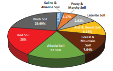

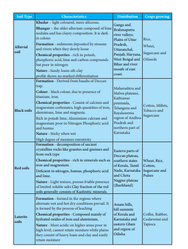

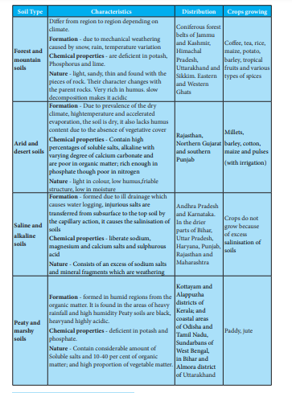

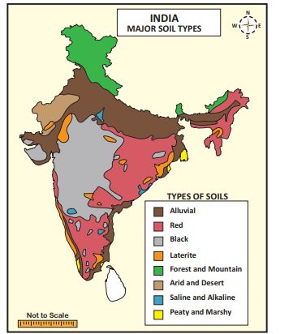

## 3.2 Irrigation

Watering of agricultural plants through artificial means is called irrigation. Being a hot country with seasonal and irregular rainfall, it always needs irrigation to carry out agricultural activities during dry period.

**Sources of Irrigation** 

In India, different sources of irrigation are used depending upon the topography, soils, rainfall, availability of surface or groundwater, nature of river (whether perennial or non- perennial), requirements of crops etc. The main sources of irrigation used in different parts of the country are

1. Canal irrigation 

2. Well irrigation and 

3. Tank irrigation

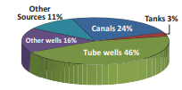

**a) Canal Irrigation**

It is the second most important source of irrigation in our country.

Canals are the effective source of irrigation in areas of low level relief, deep, fertile soils, perennial source of water and extensive command area. The canals are of two types:

**1. Inundation Canals:** In this, water is taken out directly from the rivers without making any kind of barrage or dam. Such canals are useful for the diversion of flood water from the rivers and remain operational during rainy season.

**2. Perennial Canals: These are developed** from perennial rivers by constructing barrage to regulate the flow of water. About 60 percent of the canal irrigated area falls in the northern plains of India,  

**b) Well Irrigation**

A well is a hole or trough, usually vertical, excavated in the earth for bringing groundwater to the surface. Well irrigation is the most important source of irrigation. It is a cheap, dependable, and popular source of irrigation in the country. Well irrigation is unavoidable in the region of low rainfall and becomes an essential one where the canals and tank irrigation are not available. Wells are of two types:

i) Open wells 
ii) Tube wells

**1. Open Wells: This type of irrigation** is widely practiced in the areas where groundwater is sufficiently available. The areas are in Ganga Plains, the deltaic region of Mahanadi, Godavari, Krishna, Cauvery and parts of Narmada and Tapti valleys.

**2. Tube Wells:** Tube wells are developed in the areas of low water table, sufficient power supply and soft subsurface geological units. Tube wells are predominant in the states of Gujarat, Maharashtra, Punjab, Madhya Pradesh and Tamil Nadu.

**c) Tank Irrigation** 

A tank is a natural or man-made hollow on the surface developed by constructing a small bund around it across a stream. It is used to collect and store water for irrigation and other purposes. Irrigation by tanks is a very old system in India. It also includes irrigation from lakes and ponds.

The tank irrigation is popular in the peninsular India due to the following reasons: 

1. The undulating relief and hard rocks make difficult to dig canals and wells. 

2. Natural depressions serve as reservoirs. 

3. Absence of perennial rivers. 

4. Impermeable rock structure which do not permit percolation. 

5. The scattered nature of population and agricultural fields

**Modern irrigation methods**

There are many ways in Modern Irrigation. Among them mostly practiced in India are drip irrigation, sprinklers and Rain Gun and central pivot irrigation

**Drip Irrigation Method**

It was first developed. In this method, water is supplied in the form of drops through nassals. water can be saved upto 70%.

**Springler Method**

It is the simplest and easiest method of all. In this method, water is supplied to the field from the source through the pipes with have small holes. It can be used in the areas of uneven surface also.

**Rain Gun**

Rain gun is used to spread water like rain. It can be used to water the crops which grow upto 4 feet. It is useful to irrigate the crops like sugarcane and maize.

**Central - Pivot Irrigation**

It is also called water wheel and circle irrigation. It is a method of crop irrigation in which equipment roatates around a pivot and crops are watered with springlers.

**Multipurpose River Valley Projects**

It is a scientific management of water resources in our country. Construction of dam across rivers is aimed at many purposes. Hence, it is termed as multi-purpose river valley projects. The various purposes of a dam serves are irrigation, hydro power generation, water supply for drinking and industrial purpose, controlling floods, development of fisheries, navigation etc. Generally, majority of multipurpose projects are combination of irrigation and hydro-power which are the major aims of the projects.  

## 3.3 Agriculture

Agriculture is the process of producing food for people, fodder for cattle, fiber and many other desired products by the cultivation of certain plants and the raising of domesticated animals (livestock).

**Determinants of Agriculture**

Agriculture in India is determined by a set of factors. Some of the important factors:

1. Physical factors: relief, climate and soil.

2. Institutional factors: Size of farm holdings, land tenure, and land reforms.

3. Infrastructural factors: Irrigation, power, transport, credit, market, insurance and storage facilities.

4. Technological factors: High yielding varieties of seeds, chemical fertilisers, insecticides and machinery.

**Types of Farming**

**a) Subsistence Farming**

A considerable proportion of farmers in the country practice subsistence farming. Farmers grow crops with the help of family members and consumes almost the entire farm produce with little surplus to sell in the market. Preference is given to food crops. In addition to the food crops, sugarcane, oilseeds, cotton, jute and tobacco are also cultivated. Traditional farming method results in low productivity.

**b) Shifting Agriculture**

This type of agriculture is performed by tribal people in a piece of forest land after clearing the trees through felling and burning the trunks and branches. Once the land is

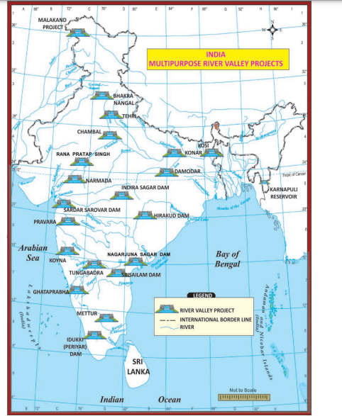

| Name of projects |River |Benet States |
|------|------|------|
| Damodar Valley project |Damodar |Jharkhand, West Bengal |
| Bhakra-Nanga l P roject (hig hest g ravity d am in t heworld) |Sutlej |Punjab, Har yana and Rajasthan |
| Hirakud Project(longest dam in the world) |Mahanadi |Orissa |
| Kosi Project |Kosi |Bihar & Nepal |
| Tungabhadra Project |Tungabhadra |Andhra Pradesh and Karnataka |
| Tehri Dam: |Bhagirathi |Uttarakhand |
| Chambal Valley Project |Chambal |Rajasthan and Madhya Pradesh |
| Nagarjuna Sagar Project |Krishna |Andhra Pradesh |
| Sardar Sarover Project |Narmada |Madhya Pradesh, Ma harasht ra, R aj as t ha n |
| Indira Gandhi Canal Project |Satlaj |Rajasthan, Pun j ab a nd  H ar ya na |
| Mettur Dam |Cauveri |Tamil Nadu 

cleared, crops are grown for two to three years and the land will get abandoned as the fertility of the soil decreases. The farmers then move to new areas and the process will be repeated. They cultivate some grains and vegetable crops using the manual labour. It is also called as “Slash and burn” cultivation.

**Different names of shifting  agriculture indifferent regions in India**

| Name | Place |
| ------ | ------ |
| Jhum | Assam |
| Poonam |Kerela |
| Podu |Andhra Pradesh, Odisha |
| B eewar, Mashan, Penda, B eera || Madhya Pradesh |

**c) Intensive Farming**

Intensive farming is an agricultural intensification and mechanization system that aims to maximize yields from available land through various means, such as heavy use of pesticides and chemical fertilizers.

**d) Dry Farming**

This type of farming is practiced in arid areas where irrigation facilities are lacking. Crops cultivated in these areas can withstand dry conditions. The crops grown generally with the help of irrigation are also grown under dry farming. In such circumstances, the yields are generally low. Most of the areas under dry cultivation entertain only one crop per year.

**e) Mixed Farming**

Mixed farming is defined as a system of farm which includes crop production, raising livestock, poultry, fisheries, bee keeping etc. to sustain and satisfy as many needs of the farmer as possible.

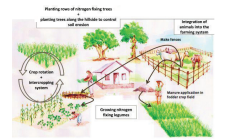

**f) Terrace Farming**

This type of cultivation is practiced specially in hilly areas, where lands are of sloping nature. The hill and mountain slopes are cut to form terraces and the land is used in the same way as in permanent agriculture. Since the availability of flat land is limited, terraces are made to provide small patches of level land. Soil erosion is also checked due to terrace formation on hill slopes.

## 3.4 Major Crops Cultivated in India

The major crops of India are divided into four major categories as follows: 

1. Food crops (wheat, maize, rice, millets,pulses etc.). 
2. Cash crops (sugarcane, tobacco, cotton,jute, oilseeds etc.). 
3. Plantation crops (tea, coffee and rubber). 
4. Horticulture crops (fruits, flowers and vegetables).

**1. Food Crops** 

Due to its large population, Indian agriculture is largely dominated by the food crops.

**Rice** 

Rice is an indigenous crop. India is the second largest producer of rice in the world after China. It is mainly a tropical crop, growing mainly with mean temperatures of 24°C and annual rainfall of 150 cm. Deep fertile clayey or loamy soils are suited well for rice cultivation. It also needs abundant supply of cheap labour.

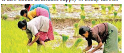

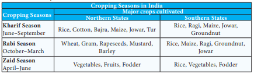

Rice in India is sown in three ways: 
i) Broadcasting, 
ii) Ploughing or drilling 
iii) Transplanting

Due to increased use of High Yielding Variety (HYV) seeds (CR Dhan 205, AR Dhan 306, CRR 451 etc.), many of the indigenous varieties were disappeared. In 2016, the first 10 leading rice producing states are West Bengal (First in India) Uttar Pradesh, Punjab, Tamil Nadu, Andhra Pradesh, Bihar, Chhattisgarh, Odisha, Assam, and Haryana.

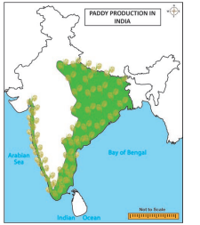

**Wheat**

Wheat is the second most important food crop of the country, after rice. It accounts for 22 percent of the total area and 34 percent of the total production of food grains in the country. It requires 10-15°C at the time of sowing and 20-25°C at the time of ripening of grains.

Over 85% of the India’s wheat production comes from 5 states namely Uttar Pradesh, Punjab, Haryana, Rajasthan and Madhya Pradesh. Apart from these regions, the black soil tract of the Deccan covering parts of Maharashtra and Gujarat also contribute a major wheat production.

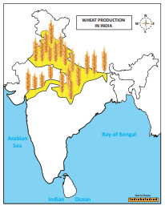

**Jowar**

Jowar is the third important food crop of our country. It is an indigenous plant of Africa. The plant has a tendency to grow in adverse climatic conditions. Its grains are rich in carbohydrates, protein, minerals, and vitamins. Hence, it provides cheap food to the large section of the poor population. It is also used as fodder in many parts of the country. Jowar is essentially a crop of the Peninsular India. Maharashtra, Karnataka, and Madhya Pradesh are the leading producers of Jowar.

**Bajra**

Bajra is an indigenous plant of Africa. This forms the staple food for poor people. Its stalks   are used as fodder for cattle and for thatching purposes. Bajra is a crop of dry region. Rajasthan is the largest producer of bajra followed by Uttar Pradesh, Haryana, Gujarat and Maharashtra.

**Barley**

Barley is one of the important cereals of our country. Besides, being poor man’s diet, it is used for making barley water, beer and whiskey. Rajasthan and Uttar Pradesh are the two leading producers of Barley.

**Pulses**

Pulses include a large number of crops which are mostly leguminous and rich in vegetable protein. They are used as human food and feeding cattle. They fix atmospheric nitrogen in the soil and hence are usually rotated with other crops. India is the largest producer of pulses.

**2. Cash Crops**

The crops which are cultivated for commercial purpose are called cash crops. These crops include sugarcane, tobacco, fibre crops (cotton, jute, and mesta) and oilseeds.

**Sugarcane**

It is the second largest producer in the world. This crop provides raw material for the sugar industry which is the second largest industrial category of our country. Besides providing sugar, gur and khandsari, it supplies molasses for alcohol industry and bagasse for paper industry. India is ranked third in sugar production in the world after Cuba and Brazil. At the state level, Uttar Pradesh is the leading producer of sugarcane followed by Maharashtra, Karnataka, Tamil Nadu and Gujarat.

**Cotton** 

Cotton is the most important cash crop of India. It provides raw material to the largest industry of India. India ranks second next to China in the production of cotton.

About 79% of the total area and production in the country were contributed by four states viz., Gujarat, Maharashtra, Andhra Pradesh and Punjab.

**Jute**

It is a tropical fibre crops, grows well in the alluvial soil. It provides raw material for Jute industry. It is used for manufacturing of gunny bags, carpets, hessian, ropes and strings, rugs, clothes, tarpaulins, upholstery etc. West Bengal is the leading state both in cultivation and production of jute. The other cultivators of jute are Bihar, Assam and Meghalaya.

**Oil Seeds**

Oil seeds, the premier source of fat in the Indian diet are derived from number of crops like groundnut, rapeseed, mustard, sesame, linseed, sunflower, castor seed, cotton seed, niger seed etc. These provide oil and oilcake which are used for making lubricants, varnish, medicine, perfume, candles, soaps, manure and cattle feed. Gujarat is India’s largest oilseeds producing state. In groundnut production, India is the second largest producer in the world after China.

**3. Plantation Crops**

Plantation crops are cultivated for the purpose of exports. These are cultivated in large estates on hilly slopes. Tea, coffee, rubber and spices are the major plantation crops of India.  

**Tea**

Tea is an evergreen plant that mainly grows in tropical and subtropical climates. Tea is a labour intensive and grows faster under light shade. Tea plants require high rainfall but its root cannot tolerate water logging. Two major varieties of tea are cultivated in India. They are

**i) BOHEA - originated from China**

**ii) ASSAMICA - from India**

A number of hybrid varieties have been developed by mixing these two. India is the second largest producer of tea after China in the world. Assam is the larger producer of tea in India. Other states are Tamil Nadu, Kerala and West Bengal.

**Coffee**

Coffee is grown in shade and it grows effectively in the altitudes between 1,000 and 1,500 m above mean sea level. There are two main varieties of coffee. They are

**i) Arabica (High quality-cultivated more in India)**

**ii) Robusta (Inferior quality).**

India is the 7th largest producer of coffee globally. Karnataka is the leading producer of coffee in India. It produces 71% in India, and 2.5 % in the world (source; coffee board of India-2018).

**Rubber**

Rubber plantation were first established in Kerala in 1902. It needs hot and wet climatic conditions (temperature above 20°C and rainfall above 300cm). Most of the land under rubber belongs to small land holders. The major rubber growing areas are Tamil Nadu, Kerala, Karnataka and Andaman and Nicobar Islands.

**Spices**

India has been world famous for its spices since ancient times. These spices mostly used for flavouring or tampering cooked food and for preparing medicines, dyes etc. Pepper, chillies, turmeric, ginger, cardamom, clove and areca nut are the major spices cultivated in India. Kerala is the leading producer of spices in India.

**4. Horticulture Crops**

It refers to the cultivation of fruits, flowers and vegetables. Fruits and vegetables are important supplement to the human diet, as they provide essential minerals, vitamins, and fibres required for maintaining health. India is in the second position in the production of fruits and vegetables.

## 3.5 Livestock 

Livestock is an integral component of the farming system in India. The livestock sector is socially and economically very significant due to its multi-functional outputs and contribution to socio-cultural security. It also helps to improve food and nutritional security by providing nutrient-rich food products, generate income and employment and act as a cushion against crop failure, provide draught power and manure inputs to the crop subsector.

**Cattle**

Cattle constitute 37.3 percent of livestock population in India. India has second largest cattle population after Brazil at World level. Cattle population in India belongs to different breeds. These include:

**1) Milch Breed**

**2) Draught breed**

**3) Mixed or General breed.**

**Goats**

The goat is the poor man’s cow providing milk, meat, skin and hair. It is the main source of meat for the country.

**Buffaloes**

Buffaloes are an important source of milk supply for India. Uttar Pradesh has the highest number of buffaloes (28.2%) followed by Rajasthan (9.6%) and Andhra Pradesh (7.9%).  

**Dairy, Meat and Wool Production**

According to 2016-17 Census held by State /UT Animal Husbandry Department, Uttar Pradesh, Rajasthan and Madhya Pradesh.

While looking at the meat, Uttar Pradesh is the leading producer following Maharashtra and West Bengal.

The leading state in the wool production is Rajasthan followed by Karnataka

## 3.6 Fisheries

Fisheries in India are a very important economic activity and a flourishing sector with varied resources and potentials. Fishing in India is a major industry in its coastal states, employing over 14 million people. It produces about 3 percent of World’s fish and occupies second place among the fish producing nations of the world after China. It also helps in augmenting food supply, generating employment, raising nutritional level and earning valuable foreign exchange. In India, fishing is categorised into two types: They are

**1. Marine or Sea Fisheries**

**2. Inland or Fresh Water Fisheries**

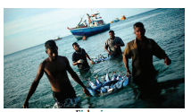

1. **Marine or Sea Fisheries:** It includes coastal, off-shore and deep sea fisheries mainly on the continental shelves. Kerala leads in the marine fish production in India.

2. **Inland or Fresh Water Fisheries:** Rivers, lakes, canals, reservoirs, ponds, tanks etc. are the sources of fresh water fresh water fisheries. About 50 percent of the country’s total fish production comes from the inland fisheries and Andhra Pradesh is the leading producer in India.

In India, the important varieties of fishes caught by the fisherman are Cat fish, Herrings, Mackerels, Perches, Eels, Mullets etc.

## 3.7 Major issues faced by farmers in india

**Small and fragmented land-holdings**

The problem of small and fragmented holdings is more serious in densely populated and intensively cultivated states in India.

**High Costs of Inputs**

Good quality seeds are out of reach for many small and marginal farmers due to their high price.

**Infertile Soil**

Indian soils have been used for growing crops over thousands of years without caring much for replenishing. This has led to depletion and exhaustion of soils resulting in low productivity.

**Lack of Irrigation**

Only one-third of the cropped area falls under irrigated area. To make agriculture reliable, irrigation facility has to be developed.  

**Lack of mechanization**

In spite of the large scale mechanization of agriculture in some parts of the country, most of the agricultural operations in larger parts are carried on by human hand using simple and conventional tools.

**Soil erosion**

Large tracts of fertile land suffer from soil erosion by wind and water.

**Agricultural marketing**

Due to the absence of sound marketing facility, the farmers have to depend on local traders and middlemen for the disposal of their farm products which is sold at low price. Besides, there is a fluctuation in the prices of agriculture products. **Inadequate storage facilities**

Storage facilities in the rural areas are either totally absent or grossly inadequate. Under such conditions the farmers are compelled to sell their products immediately after the harvest irrespective of the condition of market.

**Inadequate transport**

One of the main handicaps with Indian agriculture is the lack of cheap and efficient means of transportation.

**Scarcity of capital**

Agriculture is an important industry which requires a huge capital. The role of capital plays a major role in the purchase of advanced farm machineries and equipments.

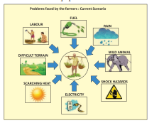

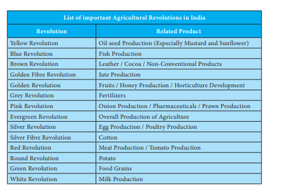