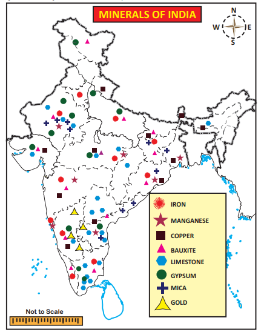
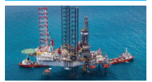
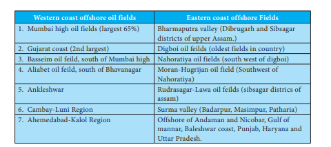
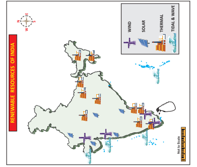
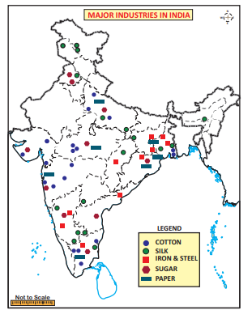
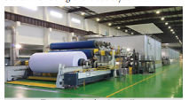
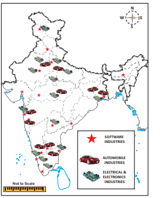
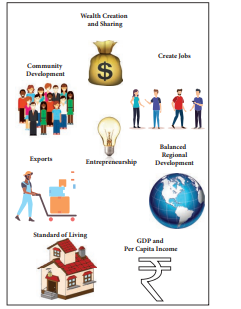

# Introduction

Any matter or energy derived from the environment that is used by living things including humans is called a natural resource. Natural resources include air, water, soil, minerals, fossil fuels, plants, wild life etc. Many natural resources are used as raw materials. They play a vital role in the economic development of any region. Natural resources are classified on several basis. Based on continued availability, the resources are categorised into two types. Renewable Resources are those which have natural regeneration after their utilisation.

Solar energy, wind energy, biogas, tidal energy, wave energy etc. are the renewable resources. Non- Renewable resources are the sources that cannot be replaced again after utilisation. Coal, petroleum, natural gas etc. fall under this category.

## 4.1 Minerals

Mineral is a natural substance of organic or inorganic origin with definite chemical and physical properties. The process of extracting mineral from the earth is known as mining. The mines near the earth crust are known as open pit mines while the deep mines are known as shaft mines.

**Types of Minerals**

On the basis of chemical and physical properties, minerals are broadly grouped under two categories. They are metallic and non-metallic minerals.

**a) Metallic Minerals**

Metallic minerals are the minerals which contain one or more metallic elements in them. Metallic minerals occur in rare, naturally formed concentrations known as mineral deposits. These deposits consist of a variety  

of valuable metals such as iron, manganese, copper, bauxite, nickel, zinc, lead, gold etc.

**1. Iron ore**

Iron ore is the most widely distributed elements of the earth crust, rarely occurs in a

The iron is usually found in following form.

| The Form of Iron ores |Iron Content(%) |
|------|------|
| Magnetite |72.4% |
| Hematite |69.9% |
| Goethite |62.9% |
| Limonite |55% |
| Siderite |48.2% |

free state. It enters into the composition of many rocks and minerals especially from igneous and metamorphic rocks. The total recoverable reserves of iron ore in India are haematite and magnetite

Jharkhand is the leading producer of iron ore with 25% the country’s production. Singhbhum, Hazaribagh, Dhanbad and Ranchi districts are its major producers. Odisha with 21% production ranks second. Sundargarh, Mayurbhanj, Sambalpur and Keonjhar districts are its major producers. The magnetite production of Chhattisgarh is 18% (Rajgarh and Bilaspur are its leading districts) and the Karnataka is 20% (Chikmangalur, Chitradurga, Shimoga and Dharwad districts are its major producers). Andhrapradesh and Tamil Nadu produce about 5% each. Kurnool, Guntur, Cuddapah and Anantapur districts in Andhra Pradesh and Salem, Namakkal, Tiruvannamalai, Tiruchirappalli, Coimbatore, Madurai and Tirunelveli districts in Tamil Nadu are notable for the production of iron ore.

>SAIL (Steel Authority of India Limited): The Ministry of Steel is responsible for planning and development of iron and steel industry in India.

**2. Manganese**

Manganese is a silvery grey element. It is very hard and brittle in nature. It is always available in combination with iron, laterite and other minerals. It is an important mineral used for making iron and steel and serves as basic raw material for alloying. It is the most important mineral for making iron and steel. Nearly 10 kg manganese is required for manufacturing one ton of steel. It is also used in the manufacturing of bleaching powder, insecticides, paints and batteries.

>**MOIL-** **Manganese Ore India Limited** state-owned manganese-ore mining company headquartered in Nagpur. With a market share of 50%. It was the largest producer of manganese ore in India.

Manganese deposits occur mainly as metamorphosed bedded sedimentary deposits. The largest deposits of manganese is found in Odisha followed by Karnataka, Madhya Pradesh, Maharashtra, Goa, Andhra Pradesh, Jharkhand, Rajasthan, Gujarat, Telengana and West Bengal together constitute about 2% of the India’s manganese resource. India is the fifth largest producer of manganese in the world.

**3. Copper**

Copper is the first metal that prehistoric man has started using for many purposes. Being flexible, it can be made into utensils of any shape. Brass and Bronze are obtained when the copper alloys with zinc and tin respectively. Copper has been commonly used for making cooking utensils and other objects of common utility. In modern days, it is extensively used in vast variety of electrical machinery, wires and cables

Largest reserves of copper ore is in the state of Rajasthan followed by Jharkhand and Madhya Pradesh. The states of Andhra Pradesh, Gujarat, Haryana, Karnataka, Maharashtra, Meghalaya, Nagaland, Odisha, Sikkim, Tamil Nadu, Telangana, Uttarakhand

>**Hindustan Copper Ltd** is a Government-owned-corporation in the central public Enterprise under the Ministry of minies, India.

and West Bengal account for 7.9% of the total copper reserves of India.

**4. Bauxite**

Bauxite is an important ore from which aluminium is extracted. It is found in the rock consisting mainly of hydrated aluminium oxides. Bauxite is widely distributed as surface deposits in the areas of laterite soil. Being light in weight and tough, aluminium is used in the manufacture of aircraft s and automobile engines. Bauxite is also used in the manufacture of cement and chemicals.

>Bauxite is an oxide of aluminium; the name has been derived after the French word Le Baux.

The main bauxite deposits occur in Odisha, Gujarat (Junagadh, Amreli and Bhavnagar districts), Jharkhand (Ranchi and Gumila districts), Maharashtra (Sindhu durg and Ratnagiri), Chhattisgarh (Ballarpur and Durg districts), and Tamil nadu.

>**National Aluminium Company Limited,** abbreviated as NALCO, (incorporated 1981) has units in Odisha at places like Angul and Damanjodi. It was incorporated as a public sector enterprise of the Ministry of Mines, Government of India in 1981.

**b) Non-Metallic Minerals**

These minerals do not contain metal in them. Mica, limestone, gypsum, nitrate, potash, dolomite, coal, petroleum etc are the non- metallic minerals.

**Mica**

In ancient time, Mica was used in ayurvedic medicine. Mica became very popular with the development of electrical industry. Abhrak is a good quality mica. It is translucent, easily splitable into thin sheets, flat, colourless, elastic and incompressible. Mica is used in making of insulating properties, as it withstands high voltage and has low power loss factor. Since it is a non conductor of electricity, it is exclusively used in electrical goods. It is also used in making of lubricants, medicines, paints and varnishes.

The major deposits of mica are found in Andhra Pradesh, Rajasthan, Odisha and Jharkhand.

**Lime Stone**

Limestone is associated with rocks composed of either calcium carbonate or the double carbonate of calcium and magnesium or mixture of both. Limestone also contains small quantities of silica, alumina, iron oxides, phosphorous and sulphur.

Limestone is used in the industries of chemicals for soda ash, caustic soda, bleaching powder, paper, cement, iron and steel, glass and fertilizers. The major producing areas: Karnataka, Andhra Pradesh, Telangana, Rajasthan, Madhya Pradesh, Tamil Nadu, Meghalaya, Gujarat and Chhattisgarh

**Gypsum**

Gypsum is a hydrated sulphate of calcium which occurs as white, opaque or transparent minerals in beds of sedimentary rocks such as limestone, sandstone and shale. Gypsum is used in the manufacture of cement, fertilizers, wall board, plaster of paris and in soil conditioning. Rajasthan, Tamil nadu, Gujarat, Himachal Pradesh, Karnataka, Uttarakhand, Andhra Pradesh and Madhya Pradesh are the major producers.

## 4.2 Energy Resources 

The resources from which the electricity generated are called energy resources. Electricity is an important component of our life. No day to day activity takes without the use of this energy. It is also the key factor for all economic activities and industrial development. Energy resources can be classified into renewable and non-renewable. Coal, petroleum, natural gas and nuclear minerals are the sources of non renewable energy. Water, sun light, wind, bio gas, tides etc., are the sources of renewable energy.

**Non-Renewable Energy Resources**

**a) Coal**

Coal is an inflammable organic substance composed mainly of hydrocarbons.

Coal is available in the form of sedimentary rocks. It is used in the generation of thermal power. It has close association with the industrial development of any country. Since it is a valuable one, it is called as “**Black Gold”. Based on carbon content, it is classified** in to the following types.

**Anthracite:** 80 to 90%

**Bituminous:** 60 to 80%

**Lignite:** 40 to 60%

**Peat:** less than 40%

Coal is an important source of energy in India with its varied and innumerable uses. It can be converted into gas, oil, electricity and thermal power. Besides, it forms a basic raw material for the production of chemicals, dyes, fertilizers, paints, synthetic and explosives.

Indian coal is mostly associated with Gondwana series of rocks and is primarily found in Peninsular India. The states of Jharkhand, odisha, West Bengal and Madhya Pradesh alone account for nearly 90% of coal reserves of the country. About 2% of India’s coal is of tertiary type and is found mostly in Assam and Jammu & Kashmir.

>Coal India Limited (CIL) is an Indian state-controlled coal mining company headquartered in Kolkata, West Bengal.  

Jharkhand is the largest coal producing state in the country followed by odisha, Chhattisgarh, West Bengal, Madhya Pradesh, Andhra Pradesh and Maharashtra.

Indian lignite (brown coal) deposits occur in the southern and western parts of Peninsular India particularly in Tamil nadu, Pudhucherry and Kerala.

The Ministry of coal has over all responsibility of determining policies and strategies in respect of exploration and development of coal resource in India. Coal India Limited (CIL), NLC India Limited (NLCIL) and Singareni Collieries Company limited (SCCL) are its public sector under takings.

**b) Petroleum (or) Crude oil**

The word petroleum has been derived from two Latin words petro (meaning – Rock) and oleum (meaning oil). Thus petroleum is oil obtained from rocks of the earth. Therefore, it is also called mineral oil. Petroleum is an inflammable liquid that is composed of hydrocarbons which constitute 90-95% of petroleum and the remaining is chiefly organic compounds containing oxygen, nitrogen, sulphur and traces of organ metallic compounds.

>The Ministry of Petroleum and Natural Gas (MOP&NG) is a ministry of the Government of India. It is responsible for the exploration, production, refining, distribution, marketing, import, export, and conservation of petroleum, natural gas, petroleum products, and liquefied natural gas in India.

Petroleum is used as a source of power and fuel for automobiles, aeroplanes, ships and locomotives. Lubricants, kerosene, vaseline, tar, soap, terylene and wax are its by products. Oil in India is obtained from both from on-shore and off-shore areas.

**c) Natural Gas**

Natural gas usually accompanies the petroleum accumulations. It is naturally occurring hydro carbon gas mixture consisting primarily of methane, but commonly includes varying amounts of other higher alkanes and sometimes a small percentage of carbon dioxide, nitrogen and hydrogen sulphides. It is formed when layers of decomposed plants and animals are exposed to intense heat and pressure over thousands of years. It is used as a source of energy for heating, cooking and electricity generation. It is also used as fuel for vehicles and as a chemical feedstock in the manufacture of plastics and other commercially important organic chemicals.

>**GAIL** (formerly known as Gas Authority of India Limited) is the largest state-owned natural gas processing and distribution company in India. It is headquartered in New Delhi.
 

India has a very large proportion of tertiary rock and alluvial deposits particularly in the extra peninsular India. These sedimentary rocks, which were once under the shallow seas, hold the possibility of harbouring oil and gas deposits. The highest concentration of natural gas is found in the Mumbai high and basseim oil fields. Gujarat, Assam, Neypaltur, Mangmadam in Thanjavur district in Tamil nadu, Tripura, Rajasthan, Arunachal Pradesh, Punjab, West Bengal are the other areas where natural gas reserves have been discovered.

>Compressed natural gas (CNG) (methane stored at high pressure) is a fuel which can be used in place of gasoline, diesel fuel and propane/LPG. In comparison to other fuels, natural gas poses less of a threat in the event of a spill, because it is lighter than air and disperses quickly when released. Biomethane – cleaned-up biogas from anaerobic digestion or landfills – can be used. Natural gas run vehicles are increasingly used in Delhi, Ahmedabad, Mumbai, Pune, Kolkata Lucknow, Kanpur, Varanasi, etc.

**Conventional Energy Sources**

**a) Thermal power**

Thermal power is generated using fossil fuels like coal, diesel, petroleum and Natural

gas. National Thermal Power Corporation [NTPC] was established in 1975. At present NTPC has 13 coal based super thermal power projects and 7 gas / liquid fuel based combined cycle projects in the states of Assam, Bihar, Jharkhand, Chhattisgarh, Mizoram and West Bengal. Neyveli, Mettur, Thoothukudi and Ennore (Chennai) are the important thermal power stations in Tamil nadu.

**b) Nuclear power**

The energy released during nuclear fission or fusion is used to generate electricity. Nuclear energy is generated mainly from the minerals of Uranium and Thorium. The first nuclear power station was setup at Tarapur near Mumbai in 1969. Later atomic reactors were installed at Rawatbhata (335 MW), near Kota in Rajasthan (100 MW), Kalpakkam (440 MW) and Kudankulam (2,000 MW) in Tamil nadu and Narora (235 MW) in Uttar Pradesh, Kaiga in (235 MW) in Karnataka and Kakarapara (235 MW) in Gujarat.

>The Nuclear Power Corporation of India Limited (NPCIL) is an Indian public sector undertaking based in Mumbai, Maharashtra. It is wholly owned by the Government of India and is responsible for the generation of nuclear power for electricity.

**Renewable Energy Resources**

**a) Hydro power**

Power generated from water is termed as hydroelectricity. Hydro power is the energy harnessed from running water. Hydro power is considered as one of the most economic and non-polluting sources of energy. It contributes nearly 7% of global electricity production. The cost of production of hydroelectricity is relatively low, making it a competitive source of renewable energy. It is also a flexible mode of power generation as the quantity of production can either be increased or decreased very quickly adapting to changing demands.

**b) Solar Energy**

Solar Power is the conversion of sunlight into electricity, either directly using photovoltaics (PV) or indirectly using concentrated solar power (CSP). Concentrated solar power systems use lenses or mirrors and tracking system to focus a large area of sunlight into a small beam. Photovoltaics convert light into an electric current using the photovoltaic effect.

>**Solar Energy Corporation of India Limited** is a Government of India Enterprise.Its head quarter is located at New Delhi.

The mass objectives of the solar thermal energy programme, being implemented by the Ministry of Non-Conventional Energy Source (MNES) are market development, commercialisation and utilisation of heat energy requirement of different applications in domestic, institutional and industrial sectors. Solar power is used in water heaters, refrigerators, drying, street lighting, cooking, pumping, power generator, photovoltaic cells, salon parts etc. Andhra Pradesh, Gujarat, Rajasthan, Maharashtra and Madhya Pradesh are the major solar power producers.

**c) Wind Energy**

Wind energy is extracted from air flow using wind turbines. It is a cheap and pollution free source of energy. Power from wind mills are used for pumping water and to sail propel ships. Wind power is plentiful, renewable, widely distributed, clean and produces no greenhouse gas emissions during operation. These plants occupy only a less space.

The development of wind power in India began in 1986 with first wind farms were set up in coastal areas of Gujarat (Okha), Maharashtra (Ratnagiri) and Tamil nadu (Thoothukudi) with 55 KW Vestas wind turbines. The capacity has significantly increased in the last few years. India has the fourth largest installed wind power capacity in the world.

>The National Institute of Wind Energy (NIWE), Chennai was established in Tamil Nadu in 1998 as an autonomous institution under the administrative control of the Ministry of New and Renewable Energy. NIWE main activities include resource assessment testing and certification.

**d) Biomass Energy**

Bio energy may be obtained through bio- degradable materials like animal dung, kitchen wastes, water hyacinth, agricultural residues and city wastes etc. It is clean and cheap source of energy. Energy derived from biomass is mostly used for domestic purposes.

**e) Tidal and wave Energy**

There are two main sources of ocean energy. They are Ocean tides and Ocean waves. The Gulf of Cambay is the best suited area for tidal energy. This is followed by Gulf of Kachch (1,000MW) and sunderbans (100MW).

An wave energy power plant of 150 KW(maximum) has been installed at vizhinjam  near Thiruvananthapuram. An another plant of this kind has been set up near Andaman& Nicobar Islands.

## 4.3 Industries 

It refers to the activities which converts the raw materials into finished products. This sector is called as the value addition sector. On the basis of the source of raw materials, Industries are classified into the Agro based industries, Forest based industries and Mineral based industries.

**Agro based industries**

These industries draw their raw materials from agricultural sector. The following part discusses the agro based industries in India.

**a) Cotton Textile Industry**

Textile is a broad term which includes cotton, jute, wool, silk and synthetic fibre textiles. This sector in India is the second largest in the world.

Traditional sectors like hand loom, handicrafts and small power-loom units are the biggest source of employment for millions of people in rural and semi urban areas.

Currently, India is the third largest producer of cotton and has the largest loom arc and ring spindles in the world. At present, cotton textile industry is the largest organized modern industry of India.

>Ginning is the process of separating cotton seed from cotton.

The higher concentration of textile mills in and around Mumbai, makes it as “**Manchester of India**”. Presence of black cotton soil in

Maharastra, humid climate, presence of Mumbai port, availability of hydro power, good market and well developed transport facility favour the cotton textile industries in Mumbai.

The major cotton textile industries are concentrated in the states of Maharashtra, Gujarat, West Bengal, Uttar Pradesh and Tamil nadu. Coimbatore is the most important centre in Tamil nadu with 200 mills out of its 435 and called as “**Manchester of South India”**. Erode, Tirupur, Karur, Chennai, Thirunelveli, Madurai, Thoothukudi, Salem and Virudhunagar are the other major cotton textiles centres in the state.

**b) Jute Textiles** Jute is a low priced fibre used mainly for

making package materials like gunny bags. Today jute is blended with cotton and wool to produce textiles. This is the second important textile industry in India after cotton textiles. Jute is the golden fibre which meets all the standards of goods packing with its natural, renewable, bio degradable and eco-friendly products.

The first jute mill in India was established at Rishra near, Kolkata in 1854 by the English man George Auckland. India tops in the production of raw jute and jute goods and second in the export of jute goods next to Bangladesh. Jute production includes gunny bags, canvas, pack sheets, jute web, carpets, cordage, hessians and twines. Now jute is also being used in plastic furniture and insulation bleached fibres to blend with wool. It is also mixed with cotton to make

>National jute board is headquarter at Kolkata.

>CSTRI is the only research institute in the country dedicated to the Research & Developmental activities related to silk technology. CSTRI was established in the year 1983 by the Central Silk Board, Ministry of Textiles, Govt. of India having head quarter at Bengaluru  

carpet and blankets. The major jute producing areas are in West Bengal and concentrated along the Hooghly river within the radius of six kilometre of Kolkata. Titagarh, Jagatdat, Budge- Budge, Haora and Bhadreshwar are the chief centres of jute industry. Andhra Pradesh, Bihar, Uttar Pradesh, Assam, Chhattisgarh and Odisha are the other jute goods producing areas.

**c) Silk Industry**

India has been well known for the production of silk since the ancient times. India is the second largest producer of raw silk next only to China.

Karnataka is the largest producer of silk. Other major producers of silk are West Bengal, Jammu Kashmir, Bihar, Jharkhand, Chhattisgarh, Uttar Pradesh, Punjab, Assam and Tamil nadu states.

**d) Sugar Industry** Sugar can be produced from sugar cane,

sugar-beets or any other crop which have sugar content. In India, sugar cane is the main source of sugar. At present this is the second largest agro based industry of India after cotton textiles. India is the world’s second largest producer of sugar cane after Brazil. Sugar industry is decentralized and located near the sugarcane growing areas as they are weight loosing and bulky to transport.

Uttar Pradesh is the largest producer of sugar, producing about 50% of the country’s total. Other major producers are Maharashtra, Uttar Pradesh, Karnataka, Andhra Pradesh, Tamil nadu, Bihar, Punjab, Gujarat, Haryana and Madhya Pradesh states. These states account for more than 90% of the sugar mills and sugar production.

**Forest based industries**

Forest provide us with different types of material which are used as raw material for certain industries like paper, lac, sports goods, plywood etc.

**a) Paper industry**

Paper Industry produces numerous types of papers that comes in various use such as sheet paper, paper boxes, tissues, paper bags, stationery, envelopes and printed-paper products such as books, periodicals, and newspapers. In India the Soft wood is the principal raw material used for making paper especially newsprint and high class printing papers. Paper is the pre-requisite for education and literacy and its use is an index of advancement in these two fields as well as the overall well being of the society.

>The first paper mill of India was started in 1812 at Serampore in West Bengal.

The first successful effort was made in 1867 with the setting up of the Royal Bengal paper mills at Ballyganj near Kolkata. The raw materials for paper industry includes wood pulp, bamboo, salai and sabai grasses, waste paper and bagasse. West Bengal is the largest producer of paper in the country followed by Madhya Pradesh, Odisha and Tamil nadu.

**Mineral based industries**

Mineral based industries use both metallic & non metallic minerals as raw materials. The major mineral based industry of country is the iron steel industry

**a) Iron and steel industries**

Iron and steel industry is called a basic metallurgical industry as its finished product is used as raw material by host of other industries. Several industries like engineering, heavy machines and machine tools, automobile, locomotives and railway equipment industries use iron and steel as their primary raw material. Due to this, the steel producing capacity of a country is generally taken as an indicator of its level of industrial development.

The modernization of the industry was started in 1907 with the establishment of Tata Iron and Steel Company at Sakchi, now called Jamshedpur. Iron and steel industry of India is mainly concentrated in the states of Jharkhand, West Bengal and Odisha. Proximity to the coal fields of Jharia, Raniganj, Bokaro and Karanpura and the iron ore mines of Mayurbhanj, Keonjar and Brona are responsible for this. This area also  has sufficient deposits of limestone, dolomite, manganese and silicon which are required for the industry.

**Automobile Industry**

India is set to emerge not only as a large domestic market for automobile manufacturers, but also as a crucial link in the global automotive chain. It is one of the most dynamic industrial groups in India.

The first automobile industry of India was started in 1947. The industry is the Premier Automobiles Ltd located at Kurla (Mumbai). It was followed by the Hindustan Motors Ltd at Uttarpara (Kolkata) in 1948. At present, India is the 7th largest producer of automobile manufacturers which include two wheelers, commercial vehicles, passenger car, jeep, scooty, scooters, motor cycles, mopeds and three wheelers. Major centres are at Mumbai, Chennai, Jamshedpur, Jabalpur, Kolkata, Pune, New Delhi, Kanpur, Bengaluru, Sadara, Lucknow and Mysuru.

>Chennai is nicknamed as the “Detroit of Asia” due to the presence of major automobile manufacturing units and allied industries around the city.

Tata Motors, Maruti Suzuki, Mahindra & Mahindra and Hindustan Motors are the largest passenger car manufacturers of Indian companies in the country. Presence of foreign car companies such as Mercedes Benz, Fiat, General Motors, Toyota and the recent entry of passenger car manufacturers BMW, Audi, Volkswagen and Volvo makes the Indian automobile sector a special one. Tata Motors, Ashok Leyland, Eicher Motors, Mahindra & Mahindra and Ford Motors are the major Indian companies which manfacture commercial vehicles. MAN, ITEC, Mercedes-Benz, Scania and Hyundai are the foreign companies engage in the manfacture of commercial vehicles. Two-wheeler manufacturing is dominated by Indian companies like Hero, Bajaj Auto and TVS.

| S.No |Name of Industr y |Place |Establishment Year |Product |
|------|------|------|------|------|
| 1 |Tata Iron and Steel Company(TISCO) |Jamshedpur,Jharkhand |1911 |Pig Iron |
| 2 |Indian Iron and Steel Company (IISCO) |Burnpur,Hirapur, Kulti, West Bengal |1972 |Pig Iron & Crude  steel |
| 3 |Visweshwaraya Iron Steel Ltd(VISL) |Bhadravati,Karnataka |1923 |Alloy and Sponge steel |
| 4 |Hisdustan Steel Ltd (HSL) Collaborated with Russia |Bhilai, Chattisgarh |1957 |Railway Equipments and Ship Building |
| 5 |Hindustan Steel Ltd(HSL) Collaborated with Germany |Rourkela,Odisha |1965 |Hot and Cold rolled sheets, Galvanized  sheets and electrical plates |
| 6 |Hindustal Steel Ltd(HSL) Collaborated with United kingdom |Durgapur,West Bengal |1959 |Alloy steel, Construction materials and railway equipments |
| 7 |Hisdustan Steel Ltd(HSL) Collaborated with Russia |Bokaro, Jharkhand |1972 |Sludge and Slog |
| 8 |Salem Steel Ltd |Salem, Tamil Nadu |1982 |Stainless Steel |
| 9 |Vijayanagar Steel Plant |Tornagal,Karnataka |1994 |Flat steel and Long Steel |
| 10 |Visakhapatnam SteelPlant(VSP) |Visakhapatnam,Andhra Pradesh |1981 |Hot Metal |

**Electrical and Electronic Industries**

Heavy electrical industries manufacture equipment used for power generation, transmission and utilization. Turbines for steam and hydro power plants, boilers for thermal power plants, generators, transformers, switch gears etc. are the chief products of this industry. The most important company in the field of heavy electrical is Bharat Heavy Electricals Ltd (BHEL). It has its plants at Hardwar, Bhopal, Hyderabad, Jammu, Bengaluru, Jhansi and Tiruchirappalli. This Industry covers a wide range of products including television sets, transistor sets, telephone exchanges, cellular telegram, computers and varied equipments for post and railway, defence and meteorological department.

Bengaluru is the largest producer of electronic goods in India, hence it is called as the “Electronic Capital of India”. The other major producers of electronic goods centers are Hyderabad, Delhi, Mumbai, Chennai, Kolkata, Kanpur, Pune, Lucknow, Jaipur and Coimbatore.

**Software Industry**

India is home to some of the finest software companies in the world. The software companies in India are reputed across the globe for their efficient IT and business related solutions. The Indian Software Industry has brought about a tremendous success for the emerging economy.

In India, software industry began in 1970 with the entry of Tata Consultancy Services (TCS). Along with this, L & T, Infotech, i-Flex, Accenture, Cognizant, GalexE Solutions India Pvt Ltd and ITC Infotech are the major software industries in the country. At present, there are more than 500 software companies all over India. It exports software service to nearly 95 countries in the world.  

The main centres of IT parks are located in Chennai, Coimbatore, Thiruvananthapuram, Bengaluru, Mysuru, Hyderabad, Visakhapatnam, Mumbai, Pune, Indore, Gandhi Nagar, Jaipur, Noida, Mohali and Srinagar.

**Major challenges of Indian Industries**

Industries in India face many problems. Some major problems are listed below.

• Shortage and fluctuation in Power Supply.

• Non- availability of large blocks of land.

• Poor access to credit.

• High rate of interest for borrowed loan.

• Non- availability of cheap labourers.

• Lack of technical and vocational training for employees.

• Inappropriate living conditions nearby industrial estates.

