  

# Introduction 

The study of one’s own region is the first step to become a global citizen. The purpose of studying our local territory is to understand life in our environment. In the last five lessons, you have learnt about various geographical characterstics of our country. In this lesson and those that follow, we shall learn about the geography of Tamil Nadu. You will get to know about the etymology, history of formation, location, size, physical divisions, rivers, climate, soil and natural vegetation of Tamil Nadu in this chapter.

Its exquisite physiography and climate makes our state unique in India. It has long and sunny beaches, waterfalls, hills, forests and varied flora and fauna.

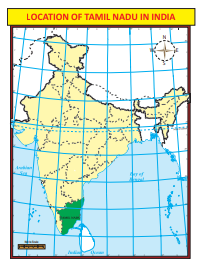

>1. Name the first state of India created on linguistic basis.
2. Why was the capital of Tamil Nadu renamed?

## 6.1 Location and Size

Tamil Nadu is one of the 28 states of India, located in the southern most part of the country. It extends from 8°4'N to 13°35'N latitudes and from 76°18'E to 80°20'E longitudes. Its extremities are

1. in eastern - Point Calimere

2. in western - hills of Anaimalai

3. in northern - Pulicat lake

4. in southern - Cape Comorin

It covers an area of 1,30,058 sq.km and is the 11th largest state in India. It covers 4% of the area of our country.

**Boundaries and Neighbours**

Tamil Nadu is bounded by the Bay of Bengal in the east, Kerala in the west, Andhra Pradesh in the north, Karnataka in the northwest and Indian Ocean in the south. Gulf of Mannar and Palk Strait separate Tamil Nadu from the Island of Sri Lanka, which lies to the southeast of India. The state has 940 km long coastline, the second-longest in India after Gujarat.

**Administrative Divisions**

Already we have learnt that the state of Tamil Nadu had only 13 districts at the time of its formation. After that, the state was reorganised several times for the administrative convenience.
 

**Find out and write:**

| Divisions |Numbers |
|------|------|
| Districts |
| Revenue Divisions |
| Taluks |
| Firkas |
| Revenue Villages |
| Municipal Corporations |
| Municipalities |
| Panchayat Unions (Blocks) |
| Town Panchayats |
| Village Panchayats |
| Lok Sabha Constituen cies |
| Assembly Constituen cies |

**Physiographic Divisions**

Let’s see the major physical features of Tamil Nadu and their characteristics.

Tamil Nadu is located on the Peninsular Plateau, known as Deccan Plateau. It is also a part of the ancient Gondwana land that broke away 135 million years ago during Cretaceous Period. Tamil Nadu is divided into the physical divisions of Western Ghats, Eastern Ghats, Plateaus, Coastal and Inland plains.

## 6.2 Western Ghats

Western Ghats extend from the Niligris in the north to Marunthuvazh Malai at Swamithope in Kanyakumari district in the south. Height of the Western Ghats ranges from 2,000 to 3,000 metres. It covers an area of about 2,500 sq.km. Though the Western Ghats is a continuous range, it has some passes. The passes are Palghat, Shencottah, Aralvaimozhi, and Achankoil. The Niligris, Anaimalai, Palani hills, Cardamom hills, Varusanadu, Andipatti and Agasthiyar hills are the major hills of Western Ghats .

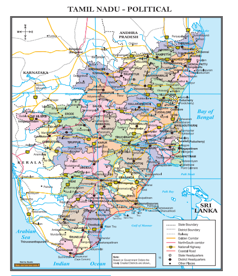  

**Nilgiri Hills**

The Nilgiri hills is located in the Northwestern part of Tamil Nadu. It consists of 24 peaks with more than 2,000 metres height. Doddabetta is the highest peak (2,637 metres) of this hills followed by Mukkuruthi (2,554 metres). Ooty and Coonoor are the major hill stations located on this hills. It has more than 2,700 species of flowering plants and the state animal Nilgiri Tahr is found in this hill.

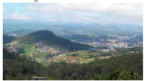

**Anaimalai**

Anaimalai is located in the border of Tamil Nadu and Kerala. It is located to the south of Palghat Gap. Anaimalai Tiger Reserve, Aliyar Reserved Forest, Valparai hill station, Kadamparai hydroelectric Power Plant are located on this hills. Aliyar and Tirumurthy dams are located at the foothills of this range.

**Palani Hills** 

Palani hills are the eastward extension of the Western Ghats. These hills are located in Dindigul district. Vandaravu (2,533 metres) is the highest peak in the Palani hills. Vembadi Shola (2,505 metres) is its second highest peak. The hill station of Kodaikanal (2,150 metres) lies in the south central portion of the range.

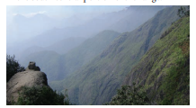  

| Peaks in Western Ghats |Height(m) |
|------|------|
| doddabetta |2,637 |
| Mukkuruthi |2,554 |
| Vembadisolai |2,505 |
| Perumalmalai |2,234 |
| Kottaimtalai |2,019 |
| Pagasura |1,918 |

**Cardamom Hills**

These hills are also known as Yela Mala hills located in the southwestern part of Tamil Nadu. It acquires its name from the cardamom spice, which is commonly grown here. Pepper and coffee are the other crops cultivated over the hills. They meet the Anaimalai hills in the northwest, the Palani hills in the northeast and Varusanadu and Andipatti hills in the southeast.

**Varusanadu and Andipatti Hills**

Another eastward extension of Western Ghats is Varusanadu and Andipatti hills. Megamalai (the highway mountain), Kalugumalai, Kurangani hill station, and Suruli and Kumbakarai waterfalls are found on these hills. Srivilliputhur Grizzled Squirrel Wild life Sanctuary is located in the southern slope of these hills in Virudhunagar district. Vaigai river and its tributaries originate in this region.

**Pothigai Hills**

Its major part lies in Tirunelveli district with its southern slope in the Kanyakumari district. Pothigai hills are called with different names such as the Shiva Jothi Parvath, Agasthiyar hills and Southern Kailash. These hills feature richest biodiversity in the Western Ghats. This area is known for its rich evergreen forest, waterfalls and ancient temples. Kalakkad Mundanthurai Tiger Reserve is located in this region.

**Mahendragiri Hills** 

This continous range is situated along the border of Kanyakumari and Tirunelveli districts and is a part of the southern range of the Western Ghats. Its average height is 1,645 metres.

## 6.3 The Eastern Ghats 

Unlike Western Ghats, Eastern Ghats is a discontinuous and irregular one. It is dissected at many places by the rivers, which drain into the Bay of Bengal. Its height ranges from 1,100 to 1,600 metres. These hills separate the plains from plateaus. Javadhu, Servarayan, the Kalrayan, Kollimalai and Pachaimalai are the major hills of the Eastern Ghats of Tamil Nadu and are located in northern districts of the state.

**Javadhu Hills**

Javadhu hills are an extension of the Eastern Ghats spread across parts of Vellore and Tiruvannamalai districts and separates these two districts. Many peaks with the height of 1,100–1,150 metres are located in this range. Melpattu is its highest peak. Many parts of this range are covered with bluish grey granites. It is noted for its fruit bearing trees, medicinal herbs and sandalwoods. Due to illegal logging, sandalwood trees are disappeared now.

**Kalvarayan Hills**

The name ‘Kalvarayan’ comes from the word ‘Karalar’, the ancient name of the present tribes. It is another major range of hills in the Eastern Ghats of Tamil Nadu. This range, along with the Pachaimalai, Aralvaimalai, Javadhu and Servarayan hills, separates the river basins of Cauvery and Palar. The height of this hill ranges from 600 to 1,220 metres.

**Servarayan Hills**

It is a mountain range located near the Salem city with the height ranging from 1,200 to 1,620 metres. The name of the range comes

| Pea ks in Eastern Ghats |Height(m) |
|------|------|
| Sher varayan temple |1,623 |
| Mazhamalai |1,500 |
| Urgamalai |1,486 |
| Kuttirayan |1,395 |
| Muganur |1,279 |
| Valsamalai |1,034 |

**Major hills in Tamil Nadu Districts Hills**

| Districts |Hills |
|------|------|
| Coimbatore |Maruthamalai, Velliangiri and Anaimalai |
| Dharmapuri |eertha malai, Chitteri and Vathalmalai |
| Dindigul |Pazhamalai and Kodaikanal |
| Erode |Chenni hills and Sivan hills |
| Vellore |Javadhu, Yelagiri and Rathinamalai hills |
| Namakkal |Kolli hills |
| Salem |Servarayan, Kanjamalai and Chalk hills |
| Kallakurichi |Kalvarayan |
| Villupuram |Gingee hills |
| Perambalur |Pachaimalai |
| Kanyakumari |Marunthuvazhmalai |
| Tirunelveli |Mahendragiri and Agasthiyarmalai |
| The Nilgiris |Nilgiri hills |

from a local deity, Servarayan. The highest peak in the southern part of the Eastern Ghats is located in this range. The peak is Solaikaradu and its height is 1,620 metres. The hill station Yercaud, which is known as poor man’s Ooty, is located on this range. Servarayan temple is its highest point (1623 metres).

**Kolli Hills**

It is a small mountain range located in Namakkal district. It covers an area of about 2,800 sq.km. It rises up to 1300 metres. This is a mountain range that runs almost parallel to the east coast of South India. Arpaleeswarar temple located on this range is an important pilgrim centre. It has the largest cover of evergreen or shola forest when compared to other parts of the Eastern Ghats. Several coffee plantations, fruits, flowers and silver-oak estates are found in this region.

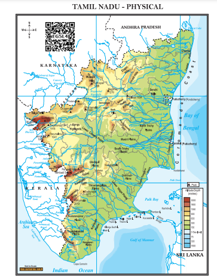

**Pachaimalai**

It is the lowest hill range, spreads over the districts of Perambalur, Tiruchirapalli and Salem. In Tamil language, pachai means green. The vegetation in this range is greener than the vegetative cover of the other hills in this region. Hence it is named as ‘**Pachai malai**’. Jackfruit is a popular seasonal agricultural product of this hills.

## 6.4 Plateaus

Plateaus of Tamil Nadu are located between the Western Ghats and the Eastern Ghats. It is roughly triangular in shape and covers an area of about 60,000 sq.km.

Bharamahal plateau is a part of the Mysore plateau situated in the northwestern part of Tamil Nadu. Its height ranges from 350 to 710 metres. Dharmapuri and Krishnagiri districts are located in this region.

Coimbatore plateau lies between the Nilgiris and Dharmapuri districts. Its height varies from 150 to 450 metres. This region includes Salem, Coimbatore and Erode districts. Moyar river separates this plateau from the Mysore plateau.

Rivers like Bhavani, Noyyal and Amaravathi, which originate from Western Ghats, form valleys in this region. Many intermontane plateaus are found in the region of the Nilgiris. Sigur plateau is one such plateau.

Madurai plateau found in Madurai district extends up to the foothills of the Western Ghats. Vaigai and Thamirabarani basins are located in this zone.

## 6.5 Plains

The plains of Tamil Nadu may be divided into two, namely

1. Inland plains

2. Coastal plains

Inland plains are drained by the rivers Palar, Ponnaiyar, Cauvery and Thamirabarani. Cauvery plains is one of the most important fertile plains of the state. The plains of Cauvery is found in Salem, Erode, Karur, Tiruchirapalli, Pudukottai, Thanjavur, Tiruvarur and Nagapattinam districts.

Coastal plains of Tamil Nadu are also called Coromandel or Cholamandalam (land of Cholas) plain, which extends from Chennai to Kanyakumari. It is formed by the rivers that flow towards east drain in the Bay of Bengal. It is more than 80 kilometres wide at some places. Though it is an emerged coast, some parts are submerged into the sea. The sand dunes formed along the coast of Ramanathapuram and Thoothukudi districts are called Teri. Coral rocks are found at the head of Gulf of Mannar in the east coastal plain.

**Beaches**

The Coromandel Coast along the Bay of Bengal consists of many beautiful and exotic beaches. The golden sands of Tamil Nadu beaches are scattered with palm and casuarinas groves. Marina and Elliot beaches of Chennai, Kovalam beach in Kanchipuram and Silver beach in Cuddalore are some of the famous beaches in Tamil Nadu.

## 6.6 Drainage

Rivers of Tamil Nadu are its lifeline. Though it has many rivers, the rivers of Cauvery, Palar, Ponnaiyar, Vaigai and Thamirabarani are the notable ones. Most of the rivers of Tamil Nadu originate from Western Ghats and flow towards east and drain into the Bay of Bengal. All the rivers of the state are non-perennial except Thamirabarani. It is perennial as it is fed by both the southwest and northeast monsoons.

**Cauvery**

The river Cauvery originates at Talacauvery in the Brahmagiri hills of Kodagu(coorg) district of Karnataka in the Western Ghats. Total length of Cauvery river is 805 km. About 416 km of its course falls in Tamil Nadu. It serves as the boundary between Karnataka and Tamil Nadu for a distance of 64 km. It forms Hogenakkal waterfalls in Dharmapuri district. Mettur Dam, also called as the Stanley Reservoir, is located across this river in Salem district. A tributary called Bhavani joins Cauvery on the right bank about 45 km from the Mettur Reservoir. Thereafter, it takes easterly course to enter into the plains of Tamil Nadu. Two more tributaries, Noyyal and Amaravathi, confluence the river on the right bank at Thirumukkudal 10 km from Karur. The river is wider in this region, where it is called as ‘Agandra Cauvery’.

In Tiruchirappalli district, the river branches into two parts. The northern branch is called Coleroon or Kollidam and the southern branch remains Cauvery. From here, the Cauvery delta begins. After flowing for about 16 km, the two branches join again to form the ‘**Srirangam Island**’. The Grand Anaicut, also called as Kallanai was built across the river Cauvery. After Kallanai, the river breaks into a large number of distributaries and forms a network all over the delta. The network of distributaries within the delta of Cauvery in the coast is called as the ‘**Garden of Southern India**’. It merges into Bay of Bengal to the south of Cuddalore.

**Palar** 

The Palar river rises beyond Talagavara village in the Kolar district of Karnataka. The Palar drains an area of 17,871 sq.km, out of which nearly 57% lies in Tamil Nadu and the rest in the states of Karnataka and Andhra Pradesh. Ponnai, Goundinya Nadhi, Malattar, Cheyyar and Kiliyar are its major tributaries. Its total length is 348 km, out of which 222 km of its course falls in Tamil Nadu. It flows through the districts of Vellore and Kancheepuram before entering into Bay of Bengal near Kuvattur.  

**Then Pennaiyar/Then Ponnaiyar**

It originates from the eastern slope of Nandi Durga hills in eastern Karnataka. It drains an area of 16,019 sq.km, of which nearly 77% lies in Tamil Nadu. It flows for a distance of 247 km in the southeasterly direction in the districts of Krishnagiri, Dharmapuri, Vellore, Tiruvannamalai, Cuddalore and Villupuram. It branches into two, viz. Gadilam and the Ponnaiyar near Tirukoilur Anaicut. Gadilam joins the Bay of Bengal near Cuddalore and Ponnaiyar near the Union Territory of Puducherry. Chinnar, Markandanadhi, Vaniar and Pambar are its tributaries. Heavy rain at the river’s source cause sudden but short-lived floods. The river is extensively dammed for irrigation, especially in Tamil Nadu. There are reservoirs at Krishnagiri and Sathanur across this river. The Ponnaiyar is considered sacred by Hindus and festivals are held during the Tamil month of Thai (January– February).

**Vaigai**

Vaigai river rises from the eastern slopes of the Varusanadu hills of Western Ghats of Tamil Nadu. It drains an area of 7,741 sq.km, which lies entirely in the state of Tamil Nadu. It flows through the districts of Madurai, Sivaganga and Ramanathapuram. Its length is 258 km. It discharges its water into the Ramnad Big Tank and some other small tanks. The surplus water from the tanks is finally discharged into Palk Strait near Ramanathapuram.

**Thamirabarani** 

The name is interpreted as Thamiram (copper) and Varuni (streams of river). The water of this river gives a copper like appearance due to the presence of dissolved suspended red soil. It originates from a peak in Pothigai hills on the Western Ghats above Papanasam in the Ambasamudram taluk. The origin of the river is associated with Sage Agasthiyar. It courses through the districts of Tirunelveli and Thoothukudi and finally flow into the Bay of Bangal near Punnaikayal in Thoothukudi district. Karaiyar, Servalar, Manimuthar, Gadananathi, Pachaiyar, Chittar

  

and Ramanathi are its main tributaries. It is the only perennial river in South India.

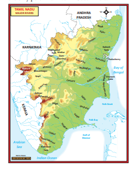

**Major waterfalls in Tamil Nadu**  

| District |Waterfalls |
|------|------|
| Dharmapuri |Hogenakkal |
| irunelveli |Kalyanatheertham |
| Tenkasi |Courtallam |
| eni |Kumbakkarai and Suruli |
| Namakkal |Agayagangai |
| e Nilgiri |Catherine and Pykara |
| Salem |Kiliyur |
| Virudhunagar |Ayyanar |
| Coimbatore |Vaideki, Sengupathi, Siruvani and Kovaikutralam |
| Tiruppur |Tirumurthy |
| Madurai |Kutladampatti |
| Kanyakumari |Tirparappu, Kaalikesam, Ulakkai and Vattaparai |

## 6.7 Climate 

You have already learnt that the Tropic of Cancer divides India roughly into two equal parts and the state Tamil Nadu lies to the south of Tropic of Cancer, which is near the Equator. As it receives vertical sunrays, the temperature of the state is relatively high throughout the year. Though the state falls within the hot climatic zone, the east coast of Tamil Nadu enjoys tropical maritime climate. The Bay of Bengal and Indian Ocean influence the climate of the coastal regions.

While the east coast experiences tropical maritime climate, the western region of the state enjoys the mountainous climate. Low altitude and distance from the sea are the reasons for high temperature and dry conditions in the central part of Tamil Nadu. The migration of vertical sun’s rays leads to the formation of different seasons in Tamil Nadu as follows.

**Seasons of Tamil Nadu**

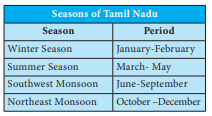

**Winter Season**

During January and February, the vertical rays of the sun fall between the Tropic of Capricorn and the Equator. Hence, Tamil Nadu and India on the whole receive slanting rays from the sun. So, the weather is slightly cooler during these months. Winter temperature in Tamil Nadu varies from 15°C to 25°C. However, in the hill stations, the winter temperature drops below 5°C occasionally. Some valleys in the Nilgiris record even 0°C. This drop in temperature leads to the formation of thick mist and frost. This season is practically dry.

**Summer Season** The apparent migration of the sun towards

north during March, April and May results in the reception of vertical sun’s rays by South India. Thus there is a steady rise in temperature from the equator. Hence, Tamil Nadu located to the south of Tropic of Cancer, experiences high temperature. Generally the temperature varies from 30°C to more than 40°C. During this season particularly in the month of May, southern part of the state receives some rainfall from pre-monsoon showers (Mango/ Blossom showers) and some parts experience convectional rainfall.

>1. What is Agni Nakshatram?
2. Group the districts of Tamil Nadu into low, moderate and heavy rainfall regions.

**Southwest Monsoon**

The intense heating of the landmass of the north by the sun during March to May creates a well-developed low pressure in North India, which draws wind from the Indian Ocean. This results in the formation of southwest monsoon. During this season, Tamil Nadu is located in the rain shadow region for the wind, which blows from the Arabian Sea. As a result, Tamil Nadu receives only a meagre rainfall from this monsoon. Rainfall during this season decreases from west to east. Coimbatore plateau receives an average of 50 cm rainfall. However, the southern districts like Kanyakumari, Tirunelveli and The Nilgiris record 50–100 cm rainfall during this period. The rainfall is scanty in the eastern part of the state.

**Northeast Monsoon** 

The northeast monsoon season commences from the month of October and lasts till mid- December. The high pressure created over Central Asia and northern part of India becomes the source for the northeast monsoon winds. The apparent migration of the sun from Tropic of Cancer to the Tropic of Capricorn causes a change in receiving temperature and air pressure during this season. It makes the wind to blow towards Bay of Bengal from North India and get deflected by Coriolis force and takes the northeast direction. Hence it is known as northeast monsoon. As the northeast monsoon is a part of returning of southwest monsoon wind, it is also called as the retreating monsoon. This is the main rainy season for Tamil Nadu, accounting for its 48% of annual rainfall. Coastal districts of the state get nearly 60% of their annual rainfall and the interior districts get about 40–50% of the annual rainfall during this season.

Tropical cyclones are common during this season. Cyclone originating from the Bay of Bengal bring heavy rainfall to the east coastal regions of Tamil Nadu. More than 50% of the state’s rainfall is received from tropical cyclones during this period and east coastal region receives 100 to 200 cm of rainfall. The rainfall received by the central and northwestern parts is 50–100 cm. The cyclones sometimes disturb the cultivation of crops and cause severe damage to life and property.

.

## 6.8 Soils of Tamil Nadu 

The soils in Tamil Nadu are broadly classified into five types according to their characteristics. They are 1. alluvial soil, 2. black soil, 3. red soil, 4. laterite soil, 5. saline soil.

**Alluvial Soil**

Alluvial soils are formed by the deposition of silt by the rivers. It is found in the river valley regions and the coastal plains of Tamil Nadu. Generally this type of soil is found in the districts of Thanjavur, Tiruvarur, Nagapattinam, Villupuram, Cuddalore, Tirunelveli and Kanyakumari. It is also found to a small extent along the river valleys in few interior districts.

**Black Soil**

Black soils are formed by the weathering of igneous rocks. It is also known as regur soil. As cotton grows well in this soil, it is also called as black cotton soil. Black soils are found extensively in the districts of Coimbatore, Madurai, Virudhunagar, Tirunelveli and Thoothukudi.

**Red Soil**

Red soils cover over two-thirds of the total area of Tamil Nadu. They are found particularly in the central districts of the state. It is dominantly found in Sivagangai and Ramanathapuram districts.

**Laterite Soil**

This soil is formed by the process of intense leaching. Laterite soils are found in some parts of Kancheepuram, Tiruvallur and Thanjavur districts and some patches over the mountainous region in the Nilgiris.

**Saline Soil**

Saline soils in Tamil Nadu are confined to the Coromandel coast. Vedaranyam has a pocket of saline soil. However, the tsunami waves on December 26, 2004 brought a lot of sand and deposited it all along the east coast of Tamil Nadu. The tsunami made the coastal areas unsuitable for cultivation to a considerable extent.

## 6.9 Soil Erosion 

Soil is a non-renewable resource. It is very difficult to replace the soil once it gets degraded. Deforestation, overgrazing, urbanisation and heavy rain are responsible for soil erosion in Tamil Nadu. Soil erosion reduces the fertility of soils, which in turn reduces agricultural productivity. So, it is necessary to take intensive care to conserve the soil resources.

## 6.10 Natural Vegetation 

Natural vegetation refers to the forest cover. Landforms, nature of soil, temperature and rainfall are the major factors that control the distribution of natural vegetation. As per National Forest Policy, 1988, a minimum of one-third of the total geographical area must be under forest cover. The total forest cover of Tamil Nadu is far lower than this. According to the Tamil Nadu State of Forest Report - 2017 assessment, the area under forest in the state is 26,281 sq.km, which constitutes 20.21% of the total area. Tamil Nadu constitutes 2.99% of India’s forest cover. The forest types in the state varies from wet evergreen to scrub forests.

**Forest Types**

The forest in the state is broadly divided into five types as follows

**Tropical Evergreen Forest**

This forest type is found in the regions that receive heavy rainfall. It is a dense, multi-layered forest. It is found in the upper slopes of Western Ghats of Tirunelveli, Kanyakumari, the Nilgiris and Coimbatore districts. The major tree species of this forest are cinnamon, Malabar ironwood, panasa, java plum/jamun, jack, kindal, ayani and crape myrtle. The semi-evergreen type of forest in the state is found over the regions of sub-tropical climate over the Eastern Ghats. The prominent regions are Servarayan, Kollimalai and Pachaimalai. Species of Indian mahogany, monkey teak, woolly cassia, jack and mango trees are common in this region.

**Montane Temperate Forest**

It is found in sheltered valleys of Anaimalai, Nilgiris and Palani hills over a 1000 metres altitude. They are known as ‘Sholas’. The trees in this forest are evergreen and usually short. Nilgiri champa, wights litsea and rose apple are the common trees found in this forest.

**Tropical Deciduous Forest**

This type of forest lies in the margin of semi-evergreen and evergreen forests. The trees in this forest shed their leaves during the dry season. The trees reach up to a height of 30 metres. Some trees of this forest are silk cotton, kapok, kadamba, dog teak, woman's tounge, axlewood and siris. Bamboos are also common in this type of forests. Some trees of this forest are economically important.

**Mangroves Forest** This type of forest is found in the coastal

areas, river deltas, tails of islands and over sea faces where accretion is in progress. The vegetation is typically evergreen, moderate in height and has leathery leaves. The vegetation of this forest is adapted to survive in tidal mud and salt water. Asiatic mangrove, white mangrove, wild jasmine/Indian pivot etc. are some of the notable trees of this forest. Pichavaram, Vedaranyam, Muthupet, Chatram and Thoothukudi are the places in Tamil Nadu where the mangrove forest is found to a considerable extent.

>**Role of Mangroves in Coastal Zone Management.** Mangroves helps in the prevention of coastal erosion from waves and storms. It also protects coral reefs and sea grass meadows from being smothered in sediments.

**Tropical Thorn Forest** 

Thorn forest in Tamil Nadu is found where there is a little rainfall. These forests are found from plains up to 400 meters altitude. The common trees of this forest are rusty acacia, wheel, neem and palm. Shrubs are common vegetation in this type of forest. This type of forest is found in the districts of Dharmapuri, Ramanathapuram, Virudhunagar and some parts of interior districts.

**Districts with prominent forest cover in Tamil Nadu**

| Districts with prominent forest cover in Tamil Nadu |
|------|------|
| District |Area (sqkm) |
| Dharmapuri |3,280 |
| Coimbatore |2,627 |
| Erode |2,427 |
| Vellore |1,857 |
| TheNilgiris |1,583 |
| Dindigul |1,662 |

## 6.11 Wild life

Animals and birds live in forests constitute the wild life. Tamil Nadu has a variety of wild animals, birds and reptiles. hills are an ideal refuge for elephants, bisons, tigers, deer and monkeys.

Several Wildlife sanctuaries and National Parks have been set up to protect the animal life in the state.

| S. No |Biosphere Reserves in Tamil Nadu |
|------|------|
| 1 |Nilgiri Biosphere Reser ve |
| 2 |Gulf of Mannar Biosphere Reser ve |
| 3 |Agasthiyarmalai Biosphere Reser ve |

Tamil Nadu is a state with varied climate, landforms and resources. This makes our state a distinct one among the Indian states. In Tamil Nadu, If the available resources are utilised rationally, it may continue to be at top in the country. So, it is the duty of the every individual to strive towards achieving this goal.

## 6.12 Natural Disasters in Tamil Nadu

A sudden natural catastrophe that causes great damage or loss to lives and properties is called as disaster.

According to United Nations office for Disaster Risk Reduction, Disaster Risk Reduction( UNDRR) is the concept and practice of reducing disaster risks through systematic efforts to analyse and reduce the causal factors of disasters. This includes reducing exposure to hazards, lessening the vulnerability of people and property, wise management of land and environment, and improving preparedness and early warning for adverse events.

Here we will discuss about the natural disasters in Tamil Nadu and the measures to be adopted before, during and after different disasters.

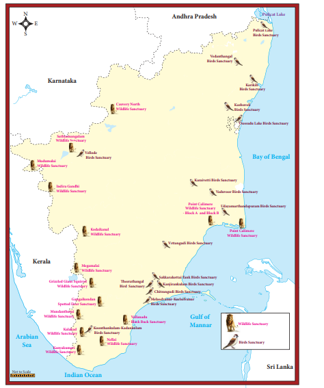

**Landslide**

A collapse of a mass of earth or rock from a mountain or cliff is called landslide. Water is the most common trigger of a **landslide.** Nilgiris in Tamil Nadu is identified as one of the most vulnerable districts in the country and landslides pose a major threat in this area. The other regions which are prone to land slides are Coimbatore and palani hill of Dindigul district where Kodaikanal hill station is located.

**Risk Reduction Measures**

**Before:** Create awareness; stay alert and awake; monitor the news updates; make evacuation plan; listen for any unusual sounds that might indicate moving debris such as trees cracking, boulders knocking and consider leaving the place of landslide if it is safe to do so.

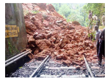

**After** - Stay away from the slide area; listen to local radio or television stations for the latest emergency information; watch for flooding, which may occur after a landslide or debris flow; check for injured and trapped persons near the slide, without entering the direct slide area.

**Flood**

Flood is a common one in the coastal districts of Tamil Nadu during northeast monsoon. The recent flood occurred in the state was in 2015.

**Risk Reduction Measures**

**Before:** Know about relief centres and evacuation routes; keep emergency phone numbers and important information; fold and roll up things on to higher ground.

**During:** Be quick, keep safe and ensure that children and elderly are safe by leaving the house to a higher ground; turn off all electrical appliances and gas; leave the area before its get too late; do not drive through the water; stay away from power lines or broken power transmission cables and try to keep away from flood water.

**After: Make sure to get back inside your** house, keep all power and electrical appliances off before it is okay to put them on and wear appropriate dress before cleaning house which is necessary to clean the contamination.

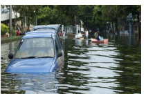

**Cyclone**

The coastal regions of Tamil Nadu are often hit by the tropical cyclones formed in Bay of Bengal during northeast monsoon. Occurrence of flood, losses to lives and properties are the recurring one in the state. Based on the cyclone hit areas, the state of Tamil Nadu can be divided into five zones namely very high, high, medium, low and very low cyclone prone zones.

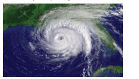

**Risk Reduction Measures**

**Before:** Ignore rumours, stay calm, don’t be panic; Keep your mobile phones charged to ensure connectivity; use sms; listen to radio; watch TV; read newspapers for weather updates. Keep your documents and valuables in water proof containers; prepare an emergency kits with essential items for survival; secure your house; carry out repairs; don’t leave sharp objects loose; untie cattle/animals for their safety. Fishermen should keep a radio set with extra batteries handy; keep boats and rafts tied up safely and don’t venture out in the sea.

**During:** Take care of the old and young, keep all family members inside the house; switch of all electrical appliances, stay in an empty room, movable items should be kept securely tied; try to help your neighbours but, don't go out during cyclone.

**After**: Those who shifted to the cyclone centre must remain there till instructions are received; strictly avoid loose electrical wires after the cyclone; beware of snakes and other animals immediately after the cyclone; clear debris and carcasses from/near the premise after the cyclone and report losses truthfully and accurately to the authorities.

**Drought**

Tamil Nadu is water deficit state. It is almost a regular one and not a seasonal one. It depends mostly on northeast monsoon for its rain. Its failure ends in disastrous.

To manage the water deficit, rain water harvesting and water conservation methods have to be implemented strictly.

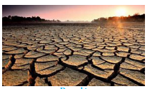  

**Fire Accident**

Tamil Nadu is a tropical state. The high temperature during summer leads to occasional forest fire in deciduous and thorn forests.

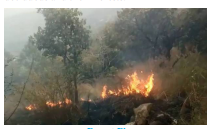 

**Risk Reduction Measures**

**Before:** Create defensible space to separate your home from flammable vegetation and materials (30 feet); follow all local fire and building codes; keep all trees and shrubs trimmed. Use approved fire resistant materials; make evacuation plans with family members which include several options with an outside meeting place.

**During:** Listen to radio; watch tv; read newspapers for updates; if adequate water are available fill buckets with water. turn a light on a room in case of smoke; turn off gas and electrical appliances and be ready to evacuate all family members.

**After: Check with fire officials before attempting** to return to your home; use caution when re- entering a burned area - flare ups can occur; check grounds for hot spots and check the roof and exterior areas for sparks and embers.

**Tsunami**

Though Tsunami is not a common one in India, its incident in 2004 alerted India and the state of Tamil Nadu on this aspect.

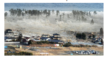 

**Risk Reduction Measures**

**Before:** if you live in a coastal area, know about tsunami risk and local warning arrangements; develop household emergency plan; know where the nearest high ground is and how you will reach it.

**During:** Take your get away kit, don’t travel areas at risk; move immediately nearest high ground; if you can’t escape tsunami, go to an upper storey of the building or climb onto a roof or tree or grab a floating objects; never go to the shore to watch tsunami and listen to local radio stations as emergency management.

**After**: Continue to listen to the radio; don’t return to the evacuation zone until authorities have given all clear; check yourself for injuries and get first aid and help others.

### 6.12.7 Earthquakes

India is a vast country which experiences many earthquakes at different periods. Generally high risk zones of the country are located in the north and central parts. The state of Tamil Nadu is located in the moderately low risk zone.

**Risk Reduction Measures**

**During:** Take cover under a strong table or any other piece of furniture and remain under cover until the shaking stops.
**After**: Proceed cautiously once the earthquake has stopped and always avoid roads, bridges that might have been damaged by the earthquake.

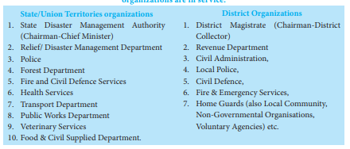