  

# Introduction 

On 23 June 1757 the Nawab of Bengal Siraj-ud-daulah was defeated by the East India Company at the Battle of Plassey. The battle was orchestrated by Robert Clive, commander-in- chief of the East India Company, who managed to get the clandestine support from Mir Jafar, the uncle of Siraj-ud-daulah and the chief of the Nawab’s army. Clive was helped by the Jagat Seths (moneylenders from Bengal) who were aggrieved by Siraj-ud-daulah’s policy. Between 1757 and 1760, the company received ₹ 22.5 million from Mir Jafar, who became the new Nawab of Bengal. The same money was later invested to propel the industrial revolution in Britain, which rapidly mechanised the British textile industry. On the other hand, India was led to the path of de-industrialisation and forced to create a market for the products manufactured in Britain. The plunder of India by the East India Company continued for another 190 years.

In this lesson the story of resistance and a varied range of response against the British rule in the Indian subcontinent from the early and mid-nineteenth century to the early twentieth century are outlined.

## 7.1 Peasant and Tribal Resistance

While the urban elite of India was busy responding to the western ideas and rationality by engaging in various socio-religious reform movements, a far more aggressive response to the British rule emerged in rural India. The traditional elite and peasantry along with the tribals revolted. They were not necessarily seeking the removal of British but rather the restoration of the pre-colonial order.

  

**a. Restorative rebellions –** Agitation of this type relates to attempts to restore old order and old social relations.

**b. Religious Movements –** Such agitations were led by religious leaders who fought for the liberation of the local populace by restructuring society on certain religious principles.

**c. Social Banditry – The leaders of such** movements were considered criminal by the British and the traditional elite but were looked upon by their people as heroes or champions of their cause.

**d. Mass Insurrection –** Usually leaderless and spontaneous uprising.

**Changes in the Revenue System**

The East India Company restructured the Mughal revenue system across India in such a manner that it increased the financial burden on the peasants. There was no widespread system of private ownership of the land in pre- British India.

**Subletting of Land**

The practice of letting out and subletting of land complicated the agrarian relations. The zamindar often sublet land to many subordinate lords who in return collected a fixed amount of revenue from the peasant. This increased the tax burden on the peasants.

**(a) Peasant Uprising**

Peasant revolts began to erupt in the early 19th century and continued till the very end of British rule in India.

**Farazi Movement** 

Farazi movement was launched by Haji Shariatullah in 1818. After the death of Shariatullah in 1839, the rebellion was led by his son Dudu Mian who called upon the peasants not to pay tax. It gained popularity on a simple doctrine that land

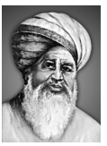

and all wealth should be equally enjoyed by the common folk. Dudu Mian laid emphasis on the egalitarian nature of religion and declared that “Land belongs to God”, and collecting rent or levying taxes on it was therefore against divine law. Large numbers of peasants were mobilised through a network of village organisations. After the death of Dudu Mian in 1862, the was revived in the 1870s by Noah Mian.

**Wahhabi Rebellion in Barasat**

The Wahhabi rebellion was an anti- imperial and anti-landlord movement. It originated in and around 1827, in the Barasat region of Bengal. 

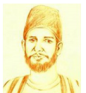

It was led by an Islamic preacher Titu Mir who was deeply influenced by the Wahhabi teachings. He became an influential figure among the predominately Muslim peasantry oppressed under the coercive zamindari system.

**(b) Tribal Uprising**

Under colonial rule, for the first time in Indian history, government claimed a direct proprietary right over forests. The British rule and its encouragement of commercialisation of forest led to the disintegration of the traditional tribal system. It encouraged the incursion of tribal areas by the non-tribal people such as moneylenders, traders, land-grabbers, and contractors. This led to the widespread loss of adivasi land and their displacement from their traditional habitats.

Tribal resistance was therefore, a response against those who either introduced changes in the peaceful tribal life or took undue advantage of the innocence of the tribal people.

**(i) Kol Revolt**

One major tribal revolt, the Kol uprising of 1831-32, took place in Chota Nagpur and Singbhum region of present day Jharkhand and Odisha, under the leadership of Bindrai and Singhrai. The Raja of Chhota Nagpur had leased out to moneylenders the job of revenue collection. The usury and forcible eviction of tribals from their land led to the resentment of Kols. The initial protest and resistance kols was in the form of plunder, arson and attacks on the properties of outsiders. This was followed by the killing of moneylenders and merchants. The tribal leaders adopted varied methods to spread their message such as the beating of drums accompanied by a warning to all outsiders to leave. `The British suppressed the rebellion with great violence.

**(ii) Santhal Hool (Insurrection)**

Santhals, scattered in various parts of eastern India, when forced to move out of their homeland during the process of creation of zamins under Permanent Settlement, cleared the forest area around the Rajmahal Hills. They were oppressed by the local police and the European officers engaged in the railway construction. Pushed out of their familiar habitat, the Santhals were forced to rely on the moneylenders for their subsistence. Soon they were trapped in a vicious circle of debt and extortion. Besides this, Santhals also felt neglected under the corrupt British administration and their inability to render justice to their legitimate grievances.

**Outbreak**

Around 1854 activities of social banditry led by a person named Bir Singh was reported from different places. These were directed against mahajans and traders.

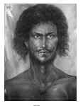

In 1855, two Santhal brothers Sidhu and Kanu proclaimed that they had received a divine message from the God, asking them to lead the rebellion.

By July 1855 the rebellion has taken the form of open insurrection against the mahajans, the zamindars and the British officials. They marched with bows, poisoned arrows, axes and swords taking over the Rajmahal and Bhagalpur by proclaiming that the Company rule was about to end. In response villages were raided and properties destroyed by the British. In 1855 an act was passed to regulate the territories occupied by the Santhals. The Act formed the territory into a separate division called Santhal Pargana division.

**(c) Munda Rebellion**

One of the prominent tribal rebellions of this period occurred in Ranchi, known as Ulugulan rebellion (Great Tumult).The Munda people were familiar with the co-operative or collective farming known as Khuntkatti (joint holding) land system. It was totally eroded by the introduction of private ownership of land and the intrusion of merchants and moneylenders. The Munda people were also forcefully recruited as indentured labourers to work on plantations. In the 1890s tribal chiefs offered resistance against the alienation of tribal people from their land and imposition of bethbegari or forced labour.

The movement received an impetus when Birsa Munda declared himself as the messenger of God. Birsa claimed that he had a prophecy and promised supernatural solutions to the problem of Munda people and the establishment of Birsaite Raj. The Munda leaders utilised the cult of Birsa Munda to recruit more people to their cause. A series of night meetings were held and a revolt was planned. On the Christmas day of 1889, they resorted to violence. Buildings were burnt down and arrows were shot at Christian missionaries and Munda Christian converts. Soon police stations and government officials were attacked. Similar attacks were carried out over the next few months. Finally the resistance was crushed and Birsa Munda was arrested in February 1900 who later died in jail. Birsa Munda became a folk hero who is to this day celebrated in many folk songs. The Munda rebellion prompted the British to formulate a policy on Tribal land. The Chotanagpur Tenancy Act (1908) restricted the entry of non- tribal people into the tribal land.

## 7.2 The Great Rebellion of 1857

In 1857, British rule witnessed the biggest challenge to its existence. Initially, it began as a mutiny of Bengal presidency sepoys but later expanded to the other parts of India involving a large number of civilians, especially peasants. The events of 1857–58 are significant for the following reasons: 

1. This was the first major revolt of armed forces accompanied by civilian rebellion. 

2. The revolt witnessed unprecedented violence, perpetrated by both sides. 

3. The revolt ended the role of the East India Company and the governance of the Indian subcontinent was taken over by the British Crown.

**(a) Causes**

**1. Annexation Policy of British India**

In the 1840s and 1850s, more territories were annexed through two major policies:

**The Doctrine of Paramountcy. British** claimed themselves as paramount, exercising supreme authority. New territories were annexed on the grounds that the native rulers were inept.

**The Doctrine of Lapse. If a native ruler did** not have male heir to the throne, the territory was to ‘lapse’ into British India upon the death of the ruler. Satara, Sambalpur, parts of the Punjab, Jhansi and Nagpur were annexed by the British through the Doctrine of Lapse.

**2. Insensitivity to Indian Cultural Sentiments**

In 1806 the sepoys at Vellore mutinied against the new dress code, which prohibited Indians from wearing religious marks on their foreheads and having whiskers on their chin, while proposing to replace their turbans with a round hat. It was feared that the dress code was part of their effort to convert soldiers to Christianity.

Similarly, in 1824, the sepoys at Barrackpur near Calcutta refused to go to Burma by sea, since crossing the sea meant the loss of their caste.

The sepoys were also upset with discrimination in salary and promotion. Indian sepoys were paid much less than their European counterparts. They felt humiliated and racially abused by their seniors.

**(b) The Revolt**

The precursor to the revolt was the circulation of rumors about the cartridges of the new Enfield rifle. There was strong suspicion that the new cartridges had been greased with cow and pig fat. The cartridge had to be bitten off before loading (pork is forbidden to the Muslims and the cow is sacred to a large section of Hindus).

On 29 March a sepoy named Mangal Pandey assaulted his European officer. His fellow soldiers refused to arrest him when ordered to do so. Mangal Pandey along with others were court-martialled and hanged. This only fuelled the anger and in the following days there were increasing incidents of disobedience. Burning and arson were reported from the army cantonments in Ambala, Lucknow, and Meerut.

**Bahadur Shah Proclaimed as Emperor of Hindustan**

On 11 may 1857 a band of sepoys from Meerut marched to the Red Fort in Delhi. The sepoys were followed by an equally exuberant crowd who gathered to ask the Mughal 

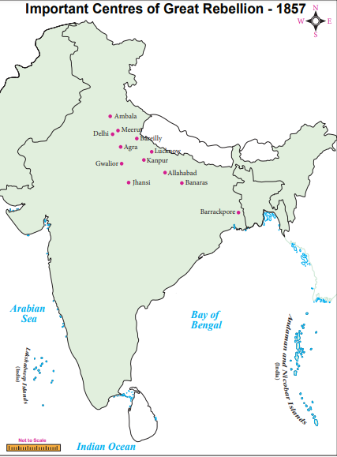

Emperor Bahadur Shah II to become their leader. After much hesitation he accepted the offer and was proclaimed as the Shahenshah-e- Hindustan (the Emperor of Hindustan). Soon the rebels captured the north-western province and Awadh. As the news of the fall of Delhi reached the Ganges valley, cantonment after cantonment mutinied till, by the beginning of June, British rule in North India, except in Punjab and Bengal, had disappeared.

**Civil Rebellion**

The mutiny was equally supported by an aggrieved rural society of north India. Sepoys working in the British army were in fact peasants in uniform. They were equally affected by the restructuring of the revenue administration. The sepoy revolt and the subsequent civil rebellion in various parts of India had a deep-rooted connection with rural mass. The first civil rebellion broke out in parts of the North-Western provinces and Oudh. These were the two regions from which the sepoys were predominately recruited. A large number of Zamindars and Taluqdars were also attracted to the rebellions as they had lost their various privileges under the British government. The talukdar–peasant collective was a common effort to recover what they had lost. Similarly, artisans and handicrafts persons were equally affected by the dethroning of rulers of many Indian states, who were a major source of patronage. The dumping of British manufactures had ruined the Indian handicrafts and thrown thousands of weavers out of employment. Collective anger against the British took the form of a people’s revolt.

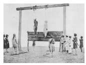 

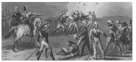

**Prominent Fighters against the British**

The mutiny provided a platform to aggrieved kings, nawabs, queens, and zamindars to express the anti-British anger. Nana Sahib, the adopted son of the last Peshwa Baji Rao II, provided leadership in he Kanpur region. He had been denied pension by the Company. Similarly, Begum Hazrat Mahal in Lucknow and Khan Bahadur in Bareilly took the command of their respective territories, which were once ruled either by them or by their ancestors.

Another such significant leader was Rani Lakshmi Bai, who assumed the leadership in Jhansi. In her case Dalhousie, the Governor General of Bengal had refused her request to adopt a son as her successor after her husband died and the kingdom was annexed under the Doctrine of Lapse. Rani Lakshmi Bai battled the mighty British Army until she was defeated.

Bahadur Shah Jafar, Kunwar Singh, Khan Bahadur, Rani Lakshmi Bai and many others were rebels against their will, compelled by the bravery of the sepoys who had defied the British authority.

**(c) Suppression of Rebellion**

By the beginning of June 1857, the Delhi, Meerut, Rohilkhand, Agra, Allahabad and Banaras divisions of the army had been restored to British control and placed under martial law.

**(d) Causes of Failure**

There is hardly any evidence to prove that the rebellion of 1857 was organised and planned. It was spontaneous. However, soon after the siege of Delhi, there was an attempt to seek the support of the neighboring states. Besides a few Indian states, there was a general lack of enthusiasm among the Indian princes to participate in the rebellion. The Indian princes and zamindars either remained loyal or were fearful of British power. Those involved in the rebellion were left with either little or no sources of arms and ammunition. The emerging English-educated middle class too did not support the rebellion.

One of the important reasons for the failure of the rebellion was the absence of a central authority. There was no common agenda that united the individuals and the aspirations of the Indian princes and the various other feudal elements fighting against the British.

In the end, the rebellion was brutally suppressed by the British army. The rebel leaders were defeated due to the lack of weapons, organisation, discipline, and betrayal by their aides. Delhi was captured by the British troops in late 1857. Bahadur Shah was captured and transported to Burma.

**e) India Becomes a Crown Colony**

The British Parliament adopted the Indian Government Act, in November 1858, and India was pronounced as one of the many crown colonies to be directly governed by the Parliament. The responsibility was given to a member of the cabinet, designated as the Secretary of State for India.

**Changes in the Administration**

British rule and its policies underwent a major overhaul after 1857. British followed a cautious approach to the issue of social reform. Queen Victoria proclaimed to the Indian people that the British would not interfere in traditional institutions and religious matters. It was promised that Indians would be absorbed in government services. Two significant changes were made to the structure of the Indian army. The number of Indians was significantly reduced. Indians were restrained from holding important ranks and position. The British took control of the artillery and shifted their recruiting effort to regions and communities that remained loyal during 1857. For instance, the British turned away from Rajputs, Brahmins and North Indian Muslims and looked towards non-Hindu groups like the Gorkhas, Sikhs,and Pathans. British also exploited the caste, religious, linguistic and regional differences in the Indian society through what came to be known as “Divide and Rule” policy.

## 7.3 Peasant Revolts under Crown

**(a) Indigo Revolt 1859-60**

Before synthetic dyes were created, natural indigo dye was highly valued by cloth makers around the world. Many Europeans employed peasants to grow the indigo, which was processed into dye at the planters factories. The dye was then exported to Europe. The peasants were forced to grow the crop. The British planter gave the cultivator a cash advance to help pay for the rent of the land and other costs. This advance needed to be repaid with interest. The planters forced the peasant grow indigo, rather than food crops. At the end of the season, the planters paid the cultivators low prices for their indigo. Moreover, the small amount the peasant earned was not enough to pay back the cash advance with interest. So they fell into debt. However, the peasants again would be forced to enter into another contract to grow indigo. The peasants were never able to clear their debts. Debts were often passed from father to son.

The Indigo Revolt began in 1859. The rebellion began as a strike, as the peasants of a village in Bengal’s Nadia district refused to grow any more indigo. The movement quickly spread to the other indigo-growing districts of Bengal. The revolt then turned violent. The peasants, both Hindu and Muslim, participated in the revolt, and women—armed with pots and pans—fought alongside the men. Indian journalists in Calcutta wrote articles about the brutality of the planters. The 1860 play Nil Darpan (“Mirror of the Indigo”) by Dina Bandhu Mitra, did much to draw attention in India and Europe to the plight of the indigo growers.

**(b) Deccan Riots 1875**

Heavy taxation ruined agriculture. Famine deaths increased. The first recorded incident of rioting against the moneylenders in the Deccan was in May 1875, in Supa a village near Poona. Similar cases of riots were reported from close to 30 villages in Poona and Ahmadnagar. The rioting was directed mostly at the Gujarat moneylenders. Under British rule peasants were forced to pay revenue directly to the government. Also, under a new law moneylenders were allowed to attach the mortgaged land of the defaulters and auction it off. This resulted in a transfer of lands from the cultivators to the non-cultivating classes. Trapped in the vicious cycle of debt and unable to pay the outstanding amount the peasant was forced to abandon cultivation.

## 7.4 The Foundation of Indian National Congress (1870 – 1885)

**(a) Rise of Nationalism**

The second half of the 19th century saw the emergence of national political consciousness among a new social class of English educated Indians. The Indian intelligentsia played a critical role in generating a national consciousness by exposing a large number of people to the idea of nation, nationalism and various democratic aspirations. The flourishing of print media both in the vernacular and in English played a significant role in circulating such ideas.

Even though they were numerically small they had a national character and capacity to establish contacts on an all India scale. They were working as lawyers, journalists, government employees, teachers or doctors. They took the initiative to float political outfits, such as Madras Native Association (1852) East India Association (1866), Madras Mahajana Sabha (1884), Poona Sarvajanik Sabha (1870), The Bombay Presidency Association (1885) and many others.

**(b) Economic Critique of Colonialism** One of the most significant contributions

of early Indian nationalists was the formulation of an economic critique of colonialism.

Dadabhai Naoroji, Justice Ranade, and Romesh Chandra Dutt, played a significant role in making this criticism about colonial economy. They clearly understood that the prosperity of the British lay in the economic and political subjugation of India. They concluded that colonialism was the main obstacle to the Indian’s economic development.

**(c) Objectives and Methods**

The formation of the Indian National Congress in 1885 was intended to establish an all India organisation. It was the culmination of attempts by groups of educated Indians politically active in three presidencies: Bombay, Madras, and Calcutta. A.O. Hume lent his services to facilitate the formation of the Congress. Womash Chandra Banarjee was the first President (1885) Indian National Congress.

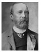

The first session of the Indian National Congress was held on 28 December 1885. The early objectives were to develop and consolidate sentiments of national unity; but also professed loyalty to Britain. The techniques included appeals, petitions and delegations to Britain, all done within a constitutional framework. Some of the key demands were the following:

1. creation of legislative councils at provincial and central level

2. increasing the number of elected members in the legislative council

3. separating judicial and executive functions 

4. reducing military expenditure 

5. reduction of Home Charges

6. extension of trial by jury 

7. holding civil services exams in India as well as in England. 

8. police reforms 

9. reconsideration of forest laws 

10. promotion of Indian industries and an end to unfair tariffs and excise duties.

**(d) Militant Nationalism**

The methods of moderate leaders failed to yield any substantive change in the British attitude towards the moderate demands of early Indian nationalists. They were criticised by a group of leaders known as “extremists”. Instead of prayers and petitions, these militants were more focused on self-help.

**7.5 Partition of Bengal** 

Partition of Bengal in 1905 was the most unpopular of all. The partition led to widespread protests all across India, starting a new phase of the Indian national movement.

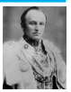

The idea of partition was devised to suppress the political activities against the British rule in Bengal by creating a Hindu-Muslim divide.

**(a) Hindu–Muslim Divide**

It was openly stated that the objective of partition was to curtail Bengali influence and weaken the nationalist movement. By placing Bengal under two administrative units Curzon reduced the Bengali - speaking people to a linguistic minority in a divided Bengal. Curzon assured Muslims that in the new province of East Bengal Muslims would enjoy a unity, which they never enjoyed since the days of the Mughals.

Instead of dividing the Bengali people along the religious line partition united them. The growth of regional language newspapers played a role in building a sense of proud Bengali identity.
  

**(b) Anti- Partition Movement**

With the failure to annul the partition moderate leaders were forced to rethink their strategy and look for new techniques of protest. The boycott of British goods was one such method. However, the agenda of Swadeshi Movement was still restricted to secure an annulment of partition and the moderates were very much against utilising the campaign to start a full-fledged passive resistance. The militant nationalists, on the other hand, were in favour of extending the movement beyond Bengal and to initiate a full-scale mass struggle.

The day Bengal was officially partitioned – 16 Oct 1905 – was declared as a day of mourning. Thousands of people took bath in the Ganga and marched on the streets of Calcutta singing Bande Mataram.

**(c) Boycott and Swadeshi Movement in Bengal (1905–1911)**

Boycott and swadeshi were always interlinked to each other and part of the wider plan to make India self-sufficient. Four major trends can be discerned during the Swadeshi Movement in Bengal. 

1. The Moderate Trend 
2. Constructive Swadeshi 
3. Militant Nationalism 
4. Revolutionary terrorism

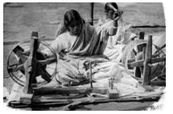

**Constructive Swadeshi**

The constructive programmes largely stressed upon self-help. It focused on building alternative institutions of self-governance that would operate free of British control. Swadeshi shops sprang all over the place selling textiles, handlooms, soaps, earthenware, match and leather goods.

**Passive Resistance**

From 1906 the Swadeshi Movement took a turn. Under this new direction, the swadeshi programme included four points: boycott of foreign goods, boycott of government schools and colleges, courts, titles and government services, development of Swadeshi industries, national schools, recourse to armed struggle if British repression went beyond the limits of endurance.

**Militant Nationalism**

Lala Lajpat Rai of Punjab, Bala Gangadhar Tilak of Maharashtra and Bipin Chandra Pal of Bengal were three prominent leaders during the Swadeshi period and were referred to as Lal-Bal-Pal triumvirate. Punjab, Bengal, and Maharashtra emerged as the hotbed of militant nationalism during the Swadeshi Movement. In South India Tuticorin became the most important location of Swadeshi activity with the launch of a Swadeshi Steam Navigation company by V.O. Chidambaranar.

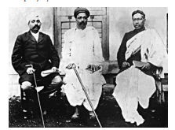

**Swaraj or Political Independence**

One of the common goals of the extremist leaders was to achieve Swaraj or Self Rule. However, the leaders differed on the meaning   of Swaraj. For Tilak Swaraj was the attainment of complete autonomy and total freedom from foreign rule.

## 7.6 Home Rule Movement (1916–1918)

The Indian national movement was revived and also radicalised during the Home Rule Movement (1916-1918), led by Lokamanya Tilak and Annie Besant. World War I and Indian’s participation in it was the background for the Home Rule League. When Britain declared war against Germany in 1914, the moderate and liberal leadership extended their support to the British cause. It was hoped that, in return, the British government would give self-government after the war. Indian troops were sent to several theatres of World War. But the British administration remained non-committal to such goals. What was seen as a British betrayal to the Indian cause of self-government led to a fresh call for a mass movement to pressurise the British government.

**(a) Objectives of the Home Rule Movement**

1. To attain self-government within the British Empire by using constitutional means.

2. To obtain the status of dominion, a political position accorded later to Australia, Canada, South Africa, and New Zealand.

3. To use non-violent constitutional methods to achieve their goals.

**(b) Lucknow Pact (1916)**

The Home Rule Movement and the subsequent reunion of moderate and the

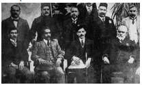

militant nationalists opened the possibility of fresh talks with the Muslims. Under the Lucknow Pact (1916), the Congress and the Muslim League agreed that there should be self-government in India as soon as possible. In return, the Congress leadership accepted the concept of separate electorate for Muslims.

**(c) British Response**

As the demand for Swaraj was raised by Tilak and Annie Besant that gained popularity, the British used the same old ploy to isolate the leaders by repressing their activities. 

In 1919 the British government announced the Montagu-Chelmsford reforms which promised gradual progress of India towards self-government. This caused deep disappointment to Indian nationalists. In a further blow the government enacted what was called the Rowlatt Act which provided for arbitrary arrest and strict punishment.