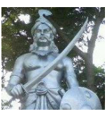
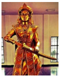
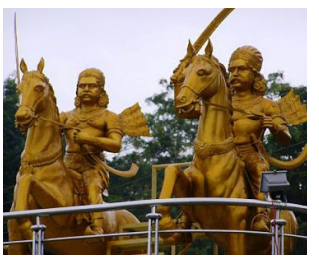
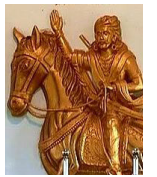
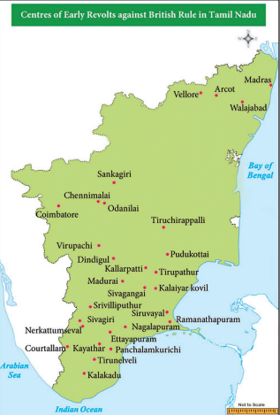

  

# Introduction

After defeating the French and their Indian allies in the three Carnatic Wars, the East India Company began to consolidate and extend its power and influence. However, local kings and feudal chieftains resisted this. The first resistance to East India Company’s territorial aggrandisement was from Puli Thevar of Nerkattumseval in the Tirunelveli region. This was followed by other chieftains in the Tamil country such as Velunachiyar, Veerapandiya Kattabomman, the Marudhu brothers, and Dheeran Chinnamalai. Known as the Palayakkarars Wars, the culmination of which was Vellore Revolt of 1806, this early resistance to British rule in Tamilnadu is dealt with in this lesson.

## 6.1 Resistance of Regional Powers against the British

**(a) Palayams and Palayakkarars**

The word “palayam” means a domain, a military camp, or a little kingdom. Palayakkarars (Poligar is how the British referred to them) in Tamil refers to the holder of a little kingdom as a feudatory to a greater sovereign. Under this system, palayam was given for valuable military services rendered by any individual. This type of Palayakkarars system was in practice during the rule of Prataba Rudhra of Warangal in the Kakatiya kingdom. The system was put in place in Tamilnadu by Viswanatha Nayaka, when he became the Nayak ruler of Madurai in 1529, with the support of his minister Ariyanathar. Traditionally there were supposed to be 72 Palayakkarars.

The Palayakkarars were free to collect revenue, administer the territory, settle disputes and maintain law and order. Their police duties were known as Padikaval or Arasu Kaval. On many occasions the Palayakarars helped the Nayak rulers to restore the kingdom to them. The personal relationship and an understanding between the King and the Palayakkarars made the system to last for about two hundred years from the Nayaks of Madurai, until the takeover of these territories by the British.

**Eastern and Western Palayams** Among the 72 Palayakkarars, created by the

Nayak rulers, there were two blocs, namely the prominent eastern and the western Palayams. The eastern Palayams were Sattur, Nagalapuram, Ettayapuram, and Panchalamkurichi and the prominent western palayams were Uthumalai, Thalavankottai, Naduvakurichi, Singampatti, Seithur.

## 6.2 Palayakkarars’ Revolt 1755-1801

**(a) Revolt of Puli Thevar 1755–1767** 

In March 1755 Mahfuzkhan (brother of the Nawab of Arcot) was sent with a contingent of the Company army under Colonel Heron to Tirunelveli. Madurai easily fell into their hands. 

Thereafter Colonel Heron was urged to deal with Puli Thevar as he continued to defy the authority of the Company. Puli Thevar wielded much influence over the western palyakkarars. For want of cannon and of supplies and pay to soldiers, Colonel Heron abandoned the plan and retired to Madurai. Heron was recalled and dismissed from service.

**Confederacy and Alliance with Enemies of the British**

Three Pathan officers, Nawab Chanda Sahib’s agents, named Mianah, Mudimiah and Nabikhan Kattak commanded the Madurai and Tirunelveli regions. They supported the Tamil playakkarars against Arcot Nawab Mohamed Ali. Puli Thevar had established close relationships with them. Puli Thevar also formed a confederacy of the Palayakkars to fight the British. With the exception of the Palayakkarars of Sivagiri, all other Maravar Palayams supported him. Ettayapuram and Panchalamkurichi also did not join this confederacy. Further, the English succeeded in getting the support of the rajas of Ramanathapuram and Pudukottai. Puli Thevar tried to get the support of Hyder Ali of Mysore and the French. Hyder Ali could not help Puli Thevar as he was already locked in a serious conflict with the Marathas.

**Kalakadu Battle**

The Nawab sent an additional contingent of sepoys to Mahfuzkhan and the reinforced army proceeded to Tirunelveli. Besides the 1000 sepoys of the Company, Mahfuzkhan received 600 more sent by the Nawab. He also had the support of cavalry and foot soldiers from the Carnatic. Before Mahfuzkhan could station his troops near Kalakadu, 2000 soldiers from Travancore joined the forces of Puli Thevar. In the battle at Kalakadu, Mahfuzkhan's troops were routed.

**Yusuf Khan and Puli Thevar**

The organized resistance of the palayakkarars under Puli Thevar gave an opportunity to the English to interfere directly in the affairs of Tirunelveli. Aided by the Raja of Travancore, from 1756 to 1763, the palyakkarars of Tirunelveli led by Puli Thevar were in a constant state of rebellion against the Nawab’s authority. Yusuf Khan (also known as Khan Sahib or, before his conversion to Islam, Marudhanayagam) who had been sent by the Company was not prepared to attack Puli Thevar unless the big guns and ammunition from Tiruchirappalli arrived. As the English were at war with the French, as well as with Hyder Ali and Marathas, the artillery arrived only in September 1760. Yusuf Khan began to batter the Nerkattumseval fort and this attack continued for about two months. On 16 May 1761 Puli Thevar’s three major forts (Nerkattumseval, Vasudevanallur and Panayur) came under the control of Yusuf Khan.

In the meantime, after taking Pondicherry the English had eliminated the French from the picture. As a result of this the unity of palyakkarars began to break up as French support was not forthcoming. Travancore, Seithur, Uthumalai and Surandai switched their loyalty to the opposite camp. Yusuf Khan who was negotiating with the palayakkarars, without informing the Company administration, was charged with treachery and hanged in 1764.

**Fall of Puli Thevar**

After the death of Khan Sahib, Puli Thevar returned from exile and recaptured Nerkattumseval in 1764. However, he was defeated by Captain Campbell in 1767. Puli Thevar escaped and died in exile.

>**Ondiveeran:** Ondiveeran led one of the army units of Puli Thevar. Fighting by the side of Puli Thevar, he caused much damage to the Company’s army. According to oral tradition, in one battle, Ondiveeran’s hand was chopped off and Puli Thevar was saddened. But Ondiveeran said it was a reward for his penetration into enemy’s fort causing many heads to roll.

**(b) Velunachiyar (1730–1796)**

Born in 1730 to the Raja Sellamuthu Sethupathy of Ramanathapuram, Velunachiyar was the only daughter of this royal family. The king had no male heir. The royal family brought up the princess Velunachiyar, training her in martial arts like valari, stick fighting and to wield weapons. She was also adept in horse riding and archery, apart from her proficiency in English, French and Urdu.

At the age of 16, 

Velunachiyar was married to Muthu Vadugar, the Raja of Sivagangai, and had a daughter by name Vellachinachiar. In 1772, the Nawab of Arcot and the Company troops under the command of Lt. Col. Bon Jour stormed the Kalaiyar Kovil Palace. In the ensuing battle Muthu Vadugar was killed. Velunachiyar escaped with her

>**Gopala Nayak, the Palayakkarar of Virupachi:** Gopala Nayak spearheaded the famous Dindigul League, which was formed with Lakshmi Nayak of Manaparai and Poojai Nayak of Devadanapatti. He drew inspiration from Tipu Sultan who sent a deputation to show his camaraderie. He led the resistance against the British from Coimbatore and later joined Oomaidurai, Kattabomman’s brother. He put up a fierce fight at Aanamalai hills where the local peasants gave him full support. But Gopala Nayak was overpowered by the British forces in 1801.

daughter and lived under the protection of Gopala Nayak at Virupachi near Dindigul for eight years.

During her period in hiding, Velunachiyar organised an army and succeeded in securing an alliance with not only Gopala Nayakar but Hyder Ali as well. Dalavay (military chief) Thandavarayanar wrote a letter to Sultan Hyder Ali on behalf of Velunachiyar asking for 5000 infantry and 5000 cavalry to defeat the English. Velunachiyar explained in detail in Urdu all the problems she had with East India Company. She conveyed her strong determination to fight the English. Impressed by her courage, Hyder Ali ordered his Commandant Syed in Dindigul fort to provide the required military assistance.

Velunachiyar employed agents for gathering intelligence to find where the British had stored their ammunition. With military assistance from Gopala Nayak and Hyder Ali she recaptured Sivagangai. She was crowned as Queen with the help of Marudhu brothers. She was the first female ruler or queen to resist the British colonial power in India.

**(c) Rebellion of Veerapandya Kattabomman 1790-1799**

Veerapandya Kattabomman became the Palayakkarar of Panchalamkurichi at the age of thirty on the death of his father, Jagavira Pandya Kattabomman. The Company’s administrators, James London and Colin Jackson, had considered him a man of peaceful disposition. However, soon several events led to conflicts between Veerapandya Kattabomman and the East India Company. 

The Nawab, under the provisions of a treaty signed in 1781, had assigned the revenue of the Carnatic to the Company to be entirely under their management and control during the war with Mysore Sultan. One-sixth of the revenue was to be allowed to meet the expenses of Nawab and his family. The Company had thus gained the right to collect taxes from Panchalamkurichi. The Company appointed its Collectors to collect taxes from all the palayams. The Collectors humiliated the palayakkarars and adopted force to collect the taxes. This was the bone of contention between the English and Kattabomman.

**Confrontation with Jackson**

The land revenue arrear from Kattabomman was 3310 pagodas in 1798. Collector Jackson, an arrogant English officer, wanted to send an army to collect the revenue dues but the Madras Government did not give him permission. On 18 August 1798, he ordered Kattabomman to meet him in Ramanathapuram. But Kattbomman’s attempts to meet him in between proved futile, as Jackson refused to give him audience both in Courtallam and Srivilliputhur. At last, an interview was granted and Kattabomman met Jackson in Ramanathapurm on 19 September 1798. It is said that Kattabomman had to stand for three hours before the haughty Collector Jackson. Sensing danger, Kattabomman tried to escape, along with his minister Sivasubramanianar. Oomaithurai suddenly entered the fort with his men and helped the escape of Kattabomman. At the gate of the Ramanathapuram fort there was a clash, in which some people including Lieutenant Clarke were killed. Sivasubramanianar was taken prisoner.

**Appearance before Madras Council**

On his return to Panchalamkurichi, Kattabomman represented to the Madras Council about how he was ill-treated by the collector Jackson. The Council asked Kattabomman to appear before a committee with William Brown, William Oram and John Casamajor as members. Meanwhile, Governor Edward Clive, ordered the release of Sivasubramanianar and the suspension of the Collector Jackson. Kattabomman appeared before the Committee that sat on 15 December 1798 and reported on what transpired in Ramanathapuram. The Committee found Kattabomman was not guilty. Jackson was dismissed from service and a new Collector S.R. Lushington appointed. Kattabomman cleared almost all the revenue arrears leaving only a balance of 1080 pagodas.

**Kattabomman and the Confederacy of Palayakkarars**

In the meantime, Marudhu Pandiyar of Sivagangai formed the South Indian Confederacy of rebels against the British, with the neighbouring palayakkars like Gopala Nayak of Dindigul and Yadul Nayak of Aanamalai. Marudhu Pandiyar acted as its leader. The Tiruchirappalli Proclamation had been made. Kattabomman was interested in this confederacy. Collector Lushington prevented Kattabomman from meeting the Marudhu Brothers. But Marudhu Brothers and Kattabomman jointly decided on a confrontation with the English. Kattabomman tried to influence Sivagiri Palayakkarars, who refused to join. Kattabomman advanced towards Sivagiri. But the Palayakkarars of Sivagiri was a tributary to the Company. So the Company considered the expedition of Kattabomman as a challenge to their authority. The Company ordered the army to march on to Tirunelveli.

**The Siege of Panchalamkurichi**

In May 1799, Lord Wellesley issued orders from Madras for the advance of forces from Tiruchirappalli, Thanjavur and Madurai to Tirunelveli. Major Bannerman commanded the troops. The Travancore troops too joined the British. On 1 September 1799, an ultimatum was served on Kattabomman to surrender. Kattabomman’s “evasive reply” prompted Bannerman to attack his fort. Bannerman moved his entire army to Panchalamkurichi on 5 September. They cut off all the communications to the fort. Bannerman deputed Ramalinganar to convey a message asking Kattabomman to surrender. Kattabomman refused. Ramalinganar gathered all the secrets of the Fort, and on the basis of his report, Bannerman decided the strategy of the operation. In a clash at Kallarpatti, Sivasubramanianar was taken a prisoner.

**Execution of Kattabomman**

Kattabomman escaped to Pudukottai. The British put a prize on his head.  

Betrayed by the rajas of Ettayapuram and Pudukottai Kattabomman was finally captured. Sivasubramanianar was executed at Nagalapuram on the 13 September. Bannerman made a mockery of a trial for Kattabomman in front of the palayakarars on 16 October. During the trial Kattabomman bravely admitted all the charges levelled against him. Kattabomman was hanged from a tamarind tree in the old fort of Kayathar, close to Tirunelveli, in front of the fellow Palayakkars. Thus ended the life of the celebrated Palayakkarars of Panchalamkurichi. Many folk ballads on Kattabomman helped keep his memory alive among the people.

**(d) The Marudhu Brothers** Periya Marudhu or Vella Marudhu (1748–1801) and his younger brother Chinna Marudhu (1753-1801) were able generals of Muthu Vadugar of Sivagangai. After Muthu Vadugar's death in the Kalaiyar Kovil battle Marudhu brothers assisted in restoring the throne to Velunachiyar. In the last years of the eighteenth century Marudhu Brothers organised resistance against the British. After the death of Kattabomman, they worked along with his brother Oomathurai. They plundered the granaries of the Nawab and caused damage and destruction to Company troops.

**Rebellion of Marudhu Brothers (1800–1801)**

Despite the suppression of Kattabomman’s revolt in 1799, rebellion broke out again in 1800. In the British records it is referred to as the Second Palayakarar War. It was directed by a confederacy consisting of Marudhu Pandyan of Sivagangai, Gopala Nayak of Dindugal, Kerala Verma of Malabar and Krishnappa Nayak and Dhoondaji of Mysore. In April 1800 they meet at Virupachi and decided to organise an uprising against the Company. The uprising, which broke out in Coimbatore in June 1800, soon spread to Ramanathapuram and Madurai. The Company got wind of it and declared war on Krishnappa Nayak of Mysore, Kerala Varma of Malabar and others. The Palayakars of Coimbatore, Sathyamangalam and Tarapuram were caught and hanged.

In February 1801 the two brothers of Kattabomman, Oomathurai and Sevathaiah, escaped from the Palayamkottai prison to Kamudhi, from where Chinna Marudhu took them to Siruvayal his capital. The fort at Panchalamkurichi was reconstructed in record time. The British troops under Colin Macaulay retook the fort in April and the Marudhu brothers sought shelter in Sivagangai. The English demanded that the Marudhu Pandyars hand over the fugitives (Oomathurai and Sevathaiah). But they refused. Colonel Agnew and Colonel Innes marched on Sivagangai. In June 1801 Marudhu Pandyars issued a proclamation of Independence which is called Tiruchirappalli Proclamation.

**Proclamation of 1801**

The Proclamation of 1801 was an early call to the Indians to unite against the British, cutting across region, caste, creed and religion. The proclamation was pasted on the walls of the Nawab’s palace in Tiruchirappalli fort and on the walls of the Srirangam temple. Many palayakkars of Tamil country rallied together to fight against the English. Chinna Marudhu collected nearly 20,000 men to challenge the English army. British reinforcements were   rushed from Bengal, Ceylon and Malaya. The rajas of Pudukkottai, Ettayapuram and Thanjavur stood by the British. Divide and rule policy followed by the English spilt the forces of the palayakkarars soon.

**Fall of Sivagangai**

In May 1801, the English attacked the rebels in Thanjavur and Tiruchirappalli. The rebels went to Piranmalai and Kalayarkoil. They were again defeated by the forces of the English. In the end the superior military strength and the able commanders of the English Company prevailed. The rebellion failed and Sivagangai was annexed in 1801. The Marudhu brothers were executed in the Fort of Tirupathur near Ramanathapuram on 24 October 1801. Oomathurai and Sevathaiah were captured and beheaded at Panchalamkurichi on 16 November 1801. Seventy-three rebels were exiled to Penang in Malaya. Though the palayakkarars fell to the English, their exploits and sacrifices inspired later generations. Thus the rebellion of Marudhu brothers, which is called South Indian Rebellion, is a landmark event in the history of Tamil Nadu.

**Carnatic Treaty, 1801**

The suppression of the Palayakkarars rebellions of 1799 and 1800–1801 resulted in the liquidation of all the local chieftains of Tamilnadu. Under the terms of the Carnatic Treaty of 31 July 1801, the British assumed direct control over Tamilagam and the Palayakarar system came to an end with the demolition of all forts and disbandment of their army.

**(e) Dheeran Chinnamalai (1756–1805)**

Born as Theerthagiri in 1756, Dheeran was well trained in silambu, archery, horse riding and modern warfare. He was involved in resolving family and land disputes in the

Kongu region. As this region was under the control of the Mysore Sultan, tax was collected by Tipu’s Diwan Mohammed Ali. Once, when the Diwan was returning to Mysore with the tax money, Theerthagiri blocked his way and confiscated all the tax money. He let Mohammed Ali go by instructing him to tell his Sultan that “Chinnamalai”, who is between Sivamalai and Chennimalai, was the one who took away taxes. Thus he gained the name “Dheeran Chinnamalai”. The offended Diwan sent a contingent to attack Chinnamalai and both the forces met and fought at the Noyyal river bed. Chinnamalai emerged victorious.

After Tipu’s death Dheeran Chinnamalai built a fort and fought the British without leaving the place. Hence the place is called Odanilai. He launched guerrilla attacks and evaded capture. Finally the English captured him and his brothers and kept them in prison in Sankagiri. When they were asked to accept the rule of the British, they refused. So they were hanged at the top of the Sankagiri Fort on 31 July 1805.

## 6.3 Vellore Revolt 1806

Before reducing all palayakkarars of south Tamilnadu into submission the East India Company had acquired the revenue districts of Salem, Dindigul at the conclusion of the war with Tipu in 1792. Coimbatore was annexed at the end of the Anglo-Mysore War in 1799. In the same year the Raja of Thanjavur whose status had been reduced to that of a vassal in 1798 gave up his sovereign rights over that region to the English. After the suppression of resistance of Kattabomman (1799) and Marudhu Brothers (1801), the British charged the Nawab of Arcot with disloyalty and forced a treaty on him. According to this Treaty of 1801, the Nawab was to cede the districts of North Arcot, South Arcot, Tiruchirappalli, Madurai and Tirunelveli to the Company and transfer all the administrative powers to it.  

**(a) Grievances of Indian Soldiers**

But the resistance did not die down. The dispossessed little kings and feudal chieftains continued to deliberate on the future course of action against the Company Government. The outcome was the Vellore Revolt of 1806. The objective conditions for a last ditch fight existed on the eve of the revolt. The sepoys in the British Indian army nursed a strong sense of resentment over low salary and poor prospects of promotion. The English army officers’ scant respect for the social and religious sentiments of the Indian sepoys also angered them. The state of peasantry from which class the sepoys had been recruited also bothered them much. With new experiments in land tenures causing unsettled conditions and famine breaking out in 1805 many of the sepoys’ families were in dire economic straits. The most opportune situation come with the sons and the family members of Tipu being interned in Vellore Fort. The trigger for the revolt came in the form of a new military regulation notified by the Commander-in- Chief Sir John Cradock.

According to the new regulations, the Indian soldiers were asked not to wear caste marks or ear rings when in uniform. They were to be cleanly shaven on the chin and maintain uniformity about how their moustache looked. The new turban added fuel to fire. The most objectionable addition was the leather cockade made of animal skin. The sepoys gave enough forewarning by refusing to wear the new turban. Yet the Company administration did not take heed.

**(b) Outbreak of the Revolt**

On 10 July 1806, in the early hours, guns were booming and the Indian sepoys of the 1st and 23rd regiments raised their standard of revolt. Colonel Fancourt, who commanded the garrison, was the first victim. Colonel MeKerras of the 23rd regiment was killed next. Major Armstrong who was passing the Fort heard the sound of firing. When he stopped to enquire he was showered with bullets. About a dozen other officers were killed within an hour or so.

Among them Lt. Elly and Lt. Popham belonged to His Majesty’s battalion.

**Gillespie’s Brutality**

Major Cootes, who was outside the Fort, informed Colonel Gillespie, the cavalry commandant in Arcot. Gillespie reached the fort along with a squadron of cavalry under the command of Captain Young at 9.00 am. In the meantime, the rebels proclaimed Fateh Hyder, Tipu’s eldest son, as their new ruler and hoisted the tiger flag of Mysore sultans in the Fort. But the uprising was swiftly crushed by Col. Gillespie, who threw to winds all war ethics. In the course of suppression, according to an eyewitness account, eight hundred soldiers were found dead in the fort alone. Six hundred soldiers were kept in confinement in Tiruchirappalli and Vellore awaiting Inquiry.

**(c ) Consequences of Revolt**

Six of the rebels convicted by the Court of Enquiry were blown from the guns; five were shot dead; eight hanged. Tipu’s sons were ordered to be sent to Calcutta. The officers

and men engaged in the suppression of the revolt were rewarded with prize money and promotion. Col. Gillespie was given 7,000 pagodas. However, the commander–in-chief Sir John Cradock, the Adjutant General Agnew and Governor William Bentinck were held responsible for the revolt, removed from their office, and recalled to England. The military regulations were treated as withdrawn.

**(d) Estimate of Revolt**

The Vellore Revolt failed because there was no immediate help from outside. Recent studies show that the organising part of the revolt was done perfectly by Subedars Sheik Adam and Sheik Hamid and Jamedar Sheik Hussain of the 2nd battalion of 23rd regiment and two Subedars and the Jamedar Sheik Kasim of the 1st battalion of the 1st regiment. Vellore Revolt had all the forebodings of the Great Rebellion of 1857. The only difference was that there was no civil rebellion following the mutiny. The 1806 revolt was not confined to Vellore Fort. It had its echoes in Bellary, Walajabad, Hyderabad, Bengaluru, Nandydurg, and Sankaridurg.