  

## Introduction

Tamil Nadu showed the lead in resisting colonial rule. As early as the late eighteenth century the Palayakarars, resisted the English attempts to establish their political hegemony in Tamil Nadu. Even after the defeat of the Palayakarars, an uprising was organised by Indian sepoys and officers in Vellore Fort in 1806 that had its echoes in several cantonments in south India. Thanks to the introduction of Western education and eventual emergence of educated Indian middle class, the struggle against the British took the constitutional path. The freedom struggle in Tamil Nadu was unique, because from the beginning it was not only a struggle for independence from the English rule but also a struggle for independence from social disability imposed by the obnoxious caste system. In this lesson we shall study the role played by nationalists wedded to diverse ideologies in Tamil Nadu.

## 9.1 Early Nationalist Stirrings in Tamil Nadu

**(a) Madras Native Association**

The Madras Native Association (MNA) was the earliest organisation to be founded in south India to articulate larger public rather than sectarian interests. It was started by Gazulu Lakshminarasu, Srinivasanar and their associates in 1852. It consisted primarily of merchants. The objective was to promote the interests of its members and their focus was on reduction in taxation. It also protested against the support of the government to Christian missionary activities. It drew the attention of the government to the condition and needs of the people. One of the important contributions of the MNA was its agitation against torture of the peasants by revenue officials. These efforts led to the establishment of the

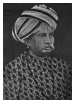
  

Torture Commission and the eventual abolition of the Torture Act, which justified the collection of land revenue through torture. However, by 1862, the Madras Native Association had ceased to exist.

**(b) Beginnings of the Nationalist Press: The Hindu and Swadesamitran**

The appointment of T. Muthuswami as the first Indian Judge of the Madras High Court in 1877 created a furore in Madras Presidency. The entire press in Madras criticized the appointment of an Indian as a Judge. The press opposed his appointment and the educated youth realized that the press was entirely owned by Europeans. The need for a newspaper to express the Indian perspective was keenly felt. G. Subramaniam, M. Veeraraghavachari and four other friends together started a newspaper The Hindu in 1878. It soon became the vehicle of nationalist propaganda. G. Subramaniam also started a Tamil nationalist periodical Swadesamitran in 1891 which became a daily in 1899. The founding of The Hindu and Swadesamitran provided encouragement to the starting of other native newspapers such as Indian Patriot, South Indian Mail, Madras Standard, Desabhimani, Vijaya, Suryodayam and India.

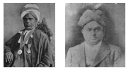

**(c) Madras Mahajana Sabha**

Madras Mahajana Sabha (MMS) was the earliest organisation in south India with clear nationalist objectives. On 16 May 1884 MMS was started by M. Veeraraghavachari, P. Anandacharlu, P. Rangaiah and few others. P. Rangaiah became its first president. P. Anandacharlu played an active role as its secretary. The members met periodically, debated public issues in closed meetings, conducted hall meetings and communicated their views to the government. Its demands included conduct of simultaneous civil services examinations in England and India, abolition of the Council of India in London, reduction of taxes and reduction of civil and military expenditure. Many of its demands were adopted later by the Indian National Congress founded in 1885.

**(d) Moderate Phase**

Provincial associations such as the Madras Mahajana Sabha led to the formation of an all-India organisation, the Indian National Congress Leaders from different parts of India attended several meetings before the formation of the Congress. One such meeting was held in December 1884 in Theosophical Society at Adyar. It was attended by Dadabhai Naoroji, K.T. Telang, Surendranath Banerjee and other prominent leaders apart from G. Subramaniam, Rangaiah and Anandacharlu from Madras.

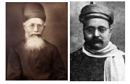

The first session of the Indian National Congress was held in 1885 at Bombay. Out of a total of 72 delegates 22 members were from Madras.

The second session of the Indian National Congress was held in Calcutta in 1886, with Dadabhai Naoroji in the Chair. The third session was held at Makkis Garden, now known as the Thousand lights, in Madras in 1887 with

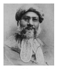

Badruddin Tyabji as president. Out of the 607 all India delegates of 362 were from Madras Presidency.

>Tamil Nadu was then part of the Madras Presidency which included large parts of the present-day states of Andhra Pradesh (Coastal districts and Rayalaseema), Karnataka (Bengaluru, Bellary, South Canara), Kerala (Malabar) and even Odisha (Ganjam).

## 9.2 Swadeshi Movement 

The partition of Bengal (1905) led to the Swadeshi Movement and changed the course of the struggle for freedom. In various parts of India, especially Bengal, Punjab and Maharashtra popular leaders emerged. They implemented the programme of the Calcutta Congress which called upon the nation to promote Swadeshi enterprise, boycott foreign goods and promote national education.

**(a) Response in Tamilnadu**

V.O. Chidambaranar, V. Chakkaraiyar, Subramania Bharati and Surendranath Arya were some of the prominent leaders in Tamilnadu. Public meetings attended by thousands of people were organised in various parts of Tamilnadu. Tamil was used on the public platform for the first time to mobilise the people. Subaramania Bharati’s patriotic songs were especially important in stirring patriotic emotions. Many journals were started 

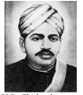

to propagate Swadeshi ideals. Swadesamitran and India were prominent journals. The extremist leader Bipin Chandra Pal toured Madras and delivered lectures which inspired the youth. Students and youth participated widely in the Swadeshi Movement.

**Swadeshi Steam Navigation Company**

One of the most enterprising acts in pursuance of swadeshi was the launching of the Swadeshi Steam Navigation Company at Thoothukudi by V.O. Chidambaranar. He purchased two ships Gallia and Lavo and plied them between Thoothukudi and Colombo.

**Tirunelveli Uprising**

V.O.C joined with Subramania Siva in organising the mill workers in Thoothukudi and Tirunelveli. In 1908, he led a strike in the European-owned Coral Mills. It coincided with the release of Bipin Chandra Pal. V.O.C and Subramania Siva, who organised a public meeting to celebrate the release of Bipin, were arrested. The two leaders were charged with sedition and sentenced to rigorous imprisonment. Initially V.O.C. was given a draconian sentence of two life imprisonments. The news of the arrest sparked riots in Tirunelveli leading to the burning down of the police station, court building and municipal office. It led to the death of four people in police firing. V.O.C. was treated harshly in prison and was made to pull the heavy oil press. To avoid imprisonment Subramania Bharati moved to Pondicherry which was under French rule. Bharati’s example was followed by many other nationalists such as Aurobindo Ghosh and V. V. Subramanianar.

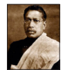

**(b) Revolutionary Activities in Tamil Nadu**

Pondicherry provided a safe haven for the revolutionaries. Many of these revolutionaries in Tamil Nadu were introduced and trained in revolutionary activities at India House in London and in Paris. M.P.T. Acharya, V.V. Subramanianar and T.S.S. Rajan were prominent among them. Revolutionary literature was distributed by them in Madras through Pondicherry. Radical papers such as India, Vijaya and Suryodayam came out of Pondicherry.

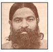

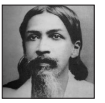

**Ashe Murder**

In 1904 Nilakanta Brahmachari and others started Bharata Matha Society, a secret society. The objective was to kill British officials and thereby kindle patriotic fervour among the people. Vanchinathan of Senkottai, was influenced by this organisation. On 17 June 1911 he shot dead Robert W.D’E. Ashe, Collector of Tirunelveli in Maniyachi Junction. After this he shot himself.

**(c) Annie Besant and the Home Rule Movement**

While the extremists and revolutionaries were suppressed with an iron hand, the moderates hoped for some constitutional reforms. However, they were disappointed with the Minto-Morley reforms as it did not provide for responsible government.

Thus when the national movement was in its ebb, Annie Besant, an Irish lady and leader of the Theosophical Society, proposed the Home Rule Movement on the model of Irish Home Rule League. She started Home Rule League in 1916 and carried forward the demand for home rule all over India. G.S. Arundale, B.P. Wadia and C.P. Ramaswamy assisted her in this campaign. They demanded home rule with only a nominal allegiance to British Crown. She started the newspapers New India and Commonweal to carry forward her agenda. She remarked, “Better bullock carts and freedom than a train deluxe with subjection”. Under the Press Act of 1910 Annie Besant was asked to pay hefty amount as security. She wrote two books, How India wrought for Freedom and India: A Nation and a pamphlet on self-government.

## 9.3 Non-Brahmin Movement and the Challenge to Congress

**(a) The South Indian Liberal Federation**

The non-Brahmins organised themselves into political organisations to protect their interests. In 1912 the Madras Dravidian Association was founded. C. Natesanar played an active role as its secretary. In June 1916 he established the Dravidian Association Hostel for non-Brahmin students. On 20 November 1916 a meeting of about thirty non-Brahmins was held under the leadership of P. Thyagarayar, Dr. T.M. Nair and C. Natesanar at Victoria Public Hall in Chennai. The South Indian Liberal Federation (SILF) was founded to promote the interests of the non-Brahmins.

**Justice Ministry**

The Congress boycotted the elections of 1920. The Justice Party won 63 of 98 elected seats in the Legislative Council. A. Subburayalu of the Justice Party became the first chief minister. After the 1923 elections, Raja of Panagal of the Justice Party formed the ministry.

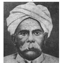

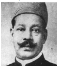

**(b) Government’s Repressive Measures: Rowlatt Act**

A draconian Anarchical and Revolutionary Crimes Act, popularly known as the Rowlatt Act, after the name of Sir Sidney Rowlatt, who headed the committee that recommended it was passed in 1919. Under the Act anyone could be imprisoned on charges of terrorism without due judicial process. Indians were aghast at this. Gandhi gave voice to the anger of the people and adopted the Satyagraha method that he had used in South Africa.

**Rowlatt Satyagraha** 

On 18 March 1919 Gandhi addressed a meeting on Marina Beach. On 6 April 1919 hartal was organised to protest against the “Black Act”. Protest demonstrations were held at several parts of Tamil Nadu. Processions 

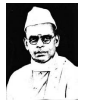  

from many areas of the city converged in the Marina beach where there was a large gathering. They devoted the whole day to fasting and prayer in the Marina beach. Madras Satyagraha Sabha was formed. Rajaji, Kasturirangar, S. Satyamurty and George Joseph addressed the meeting. A separate meeting of workers was addressed by V. Kalyanasundaram (Thiru. V. Ka) B.P. Wadia and V.O.C. An important aspect of the movement was that the working classes, students and women took part in large numbers.

**(c) Khilafat Movement** Following the Jallianwala Bagh Massacre

General Dyer who was responsible for it was not only acquitted of all charges but rewarded. After the First World War the Caliph of Turkey was humiliated and deprived of all powers. To restore the Caliph the Khilafat Movement was started. Muslims who had largely kept from the nationalist movement now joined it in huge numbers. In Tamil Nadu Khilafat Day was observed on 17 April 1920, with a meeting presided over by Maulana Shaukat Ali. Another such conference was held at Erode. Vaniyambadi was as the epicenter of Khilafat agitation.

## 9.4 Non-Cooperation Movement

Tamil Nadu was active during the Non-cooperation Movement. C. Rajaji and

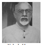

E.V. Ramaswamy (EVR, later known as Periyar) provided the leadership. Rajaji worked closely with Yakub Hasan, founder of the Madras branch of the Muslim League. As a result, the Hindus and the Muslims cooperated closely during the course of the movement in Tamil Nadu.

**(a) No Tax Campaigns and Temperance Movement**

As part of the non-cooperation movement, in many places, cultivators refused to pay taxes. A no-tax campaign took place in Thanjavur. Councils, schools and courts were boycotted. Foreign goods were boycotted. There were a number of workers’ strikes all over region, many of them led by nationalist leaders. One of the important aspects of the movement in Tamil Nadu was the temperance movement or movement against liquor. In November 1921 it was decided to organise civil disobedience. Rajaji, Subramania Sastri and EVR were arrested. The visit of Prince of Wales on 13 January 1922 was boycotted. In the police repression two were killed and many injured. The Non-Cooperation Movement was withdrawn in 1922 after the Chauri Chaura incident in which 22 policemen were killed.

**(b) Swarajists–Justicites Rivalry**

Following the withdrawal of the Non- Cooperation Movement, the Congress was divided between ‘no-changers’ who wanted to continue the boycott of the councils and ‘pro- changers who wanted to contest the elections for the councils. Rajaji along with other staunch Gandhian followers opposed the council entry. Along with Kasturirangar and M.A. Ansari, Rajaji advocated the boycott of the councils. Opposition to this led to the formation of the Swaraj Party within the Congress by Chittaranjan Das and Motilal Nehru. In Tamil Nadu the Swarajists were led by S. Srinivasanar and S. Satyamurti.

**(c) Subbarayan Ministry**

In Madras provincial elections held in 1926, the Swarajists won the majority of the elected seats. However, it did not accept office in accordance with the Congress policy. Instead they supported an independent, 

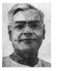 

to form the ministry. The Swarajists did not contest the 1930 elections leading to an easy victory for the Justice Party. The Justice Party remained in office till 1937.

**(d) Simon Commission Boycott**

In 1927 a statutory commission was constituted under Sir John Simon to review the Act of 1919 and to suggest reforms. However, to the great disappointment of Indians, it was an all-white commission with not a single Indian member. So the Congress boycotted the Simon Commission. In Madras, the Simon Boycott Propaganda Committee was set up with S. Satyamurti as the president. The arrival of Simon Commission in Madras on 18 February 1929 black flags were waved against the Commission.

>**Agitation for Removal of Neill Statue (1927)** 
James Neill of the Madras Fusiliers (infantry men with firearms) was brutal in wreaking vengeance at Kanpur (‘the Cawnpur massacre’, as it was called) in which many English women and children were killed in the Great Rebellion of 1857. Neill was later killed by an Indian sepoy. A statue was erected for him at Mount Road, Madras. Nationalists saw this as an insult to Indian sentiments, and organised a series of demonstrations in Madras. The statue was finally moved to Madras Museum when Congress Ministry, led by C. Rajaji, formed the government in 1937.

## 9.5 Civil Disobedience Movement

**(a) Towards Poorna Swaraj**

The Madras session of the Indian National Congress in 1927 declared complete independence as its goal. In the 1929 Lahore session of the Congress, Poorna Swaraj (complete independence) was adopted as the goal and on 26 January 1930 the national flag was hoisted by Jawaharlal Nehru on the banks of river Ravi as the declaration of independence.

**(b) Salt March to Vedaranyam**

When the Viceroy did not accept the demands put forward by Gandhi, he launched the Civil Disobedience Movement. Rajaji organised and led a salt satyagraha march to Vedaranyam. The march started from Tiruchirappalli on 13 April 1930 and reached Vedaranyam in Thanjavur district on 28 April. A special song was composed for the march by Namakkal V. Ramalinganar with the lines, “A War is ahead sans sword, sans bloodshed… Join this march.” Despite a brutal crackdown by the police, the marching satyagrahis were provided a warm reception along the route. On reaching Vedaranyam 12 volunteers under the leadership of Rajaji broke the salt law by picking up salt. Rajaji was arrested. T.S.S. Rajan, Rukmani Lakshmipathi, Sardar Vedarathnam, C. Swaminathar and K. Santhanam were among the prominent leaders who participated in the Vedaranyam Salt Satyagraha.

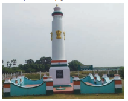

**(c) Widespread Agitations in Tamil Districts**

The satyagrahis under the leadership of T. Prakasam and K. Nageswara Rao set up a camp at Udayavanam near Madras. However, the police arrested them. It led to  

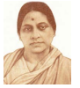

a hartal in Madras. The clashes with the police in Tiruvallikeni which lasted for three hours on 27 April 1930 left three dead. Volunteers who attempted to offer salt Satyagraha in Rameswaram were arrested. Mill workers struck work across the province. Woman participated enthusiastically. Rukmani Lakshmipathi was the first woman to pay penalty for violation of salt laws. Police used brutal force to suppress the movement. Bhashyam, popularly known as Arya, hoisted the national flag atop Fort St. George on 26 January 1932.

**Martyrdom of Tirupur Kumaran**

On 11 January 1932 a procession carrying national flags and singing patriotic songs was brutally beaten by the police in Tirupur. 

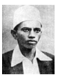

O.K.S.R. Kumaraswamy, popularly Tirupur Kumaran, fell dead holding the national flag aloft. He is hailed as Kodikatha Kumaran.

**(d) First Congress Ministry**

In the 1937 election the Congress emerged victorious. The Justice Party was trounced. Congress victory in the elections clearly indicated its popularity with the people.

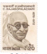

Rajaji formed the first Congress Ministry. He introduced prohibition on an experimental basis in Salem. To compensate for the loss of revenue he introduced a sales tax. When the British involved India in the Second World War without consulting the elected Congress ministries, the latter resigned.

**(e) Anti-Hindi Agitation**

One of the controversial measures of Rajaji was the introduction of Hindi as a compulsory subject in schools. This was considered to be a form of Aryan and North Indian imposition detrimental to Tamil language and culture, and therefore caused much public resentment. E.V.R. led a massive campaign against it. He organised an anti-Hindi Conference at Salem. It formulated a definite programme of action. The Scheduled Castes Federation and the Muslim League extended its support to the anti-Hindi agitation. Natarajan and Thalamuthu, two of the enthusiastic agitators died in prison. A rally was organised from Tiruchirappalli to Madras. More than 1200 protestors including E.V.R. were arrested. After the resignation of the Congress Ministry, the Governor of Madras who took over the reigns of administration removed Hindi as compulsory subject.

## 9.6 Quit India Struggle 

On 8 August 1942 the Quit India resolution was passed and Gandhi gave the slogan ‘Do or Die’. The entire Congress leadership was arrested overnight. K. Kamaraj while returning from Bombay noticed that at every railway station the police waited with a list of local leaders and arrested them as they got down. 

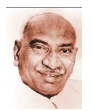

Kamaraj gave the police the slip and got down at Arakkonam itself. He then worked underground and organised people during the Quit India Movement.

**Undying Mass Movement**  
All sections of the society participated in the movement. There were a large number of workers strike such as strikes in Buckingham and Carnatic Mills, Madras Port Trust, Madras Corporation and the Electric Tramway. Students of various colleges took active part in the protests. Many young men and women also joined the INA. The Quit India Movement was suppressed with brutal force. 

The Royal Indian Navy Mutiny, the negotiations initiated by the newly formed Labour Party Government in England resulting in India’s independence but sadly with partition of the country into India and Pakistan has formed part of the Lesson in Unit VIII.