  

# Introduction

Mahatma Gandhi arrived in India in 1915 from South Africa after fighting for the civil rights of the Indians there for about twenty years. He brought with him a new impulse to Indian politics. He introduced satyagraha, which he had perfected in South Africa, that could be practiced by men and women, young and old. As a person dedicated to the cause of the poorest of the poor, he instantly gained the goodwill of the masses. In this lesson we shall see how Gandhi transformed the Indian National Movement.

## 8.1 Gandhi and Mass Nationalism

**(a) Evolution of Gandhi**

Mohandas Karamchand Gandhi was born on 2 October 1869 into a well to do family in Porbandar, Gujarat. His father Kaba Gandhi was the Diwan of Porbandar and later became the Diwan of Rajkot. His mother Putlibai, influenced the young Gandhi. After passing the matriculation examination, Gandhi sailed to England in 1888 to study law. After becoming a barrister in June 1891 Gandhi returned to India as a firm believer in British sense of justice and fair play.
  

On returning to India, Gandhi’s attempt to practice in Bombay failed. It was during this time that a Gujarati firm in South Africa, sought the services of Gandhi for assistance in a law-suit. Gandhi accepted the offer and left for South Africa in April 1893. Gandhi faced racial discrimination for the first time in South Africa. On his journey from Durban to Pretoria, at the Pietermaritzburg railway station, he was physically thrown out of the first class compartment. Gandhi was determined to fight.

Gandhi called a meeting of the Indians in the Transvaal and exhorted them to form an association to seek redress of their grievances. He continued to hold such meetings, petitioned to the authorities about the injustices which were in violation of their own laws. Indians in the Transvaal had to pay a poll tax of £ 3, could not own land except in areas marked for them, and could not move outdoors after 9 p.m. without a permit. He launched a struggle against such unjust laws.

Gandhi was introduced to the works of Tolstoy and John Ruskin. He was deeply influenced by Tolstoy’s The Kingdom of God is _Within You, Ruskin’s Unto this Last and Thoreau’s Civil Disobedience_. Gandhi’s ideas were formed due to a blend of Indian and Western thought. Despite being deeply influenced by Western thinkers he was highly critical of Western civilisation and industrialisation. Inspired by Ruskin, Gandhi established the Phoenix Settlement (1905) and the Tolstoy Farm (1910). Equality, community living and dignity of labour were inculcated in these settlements. They were training grounds for the satyagrahis.

**Satyagraha as a Strategy in South Africa**

Gandhi developed satyagraha (devotion to the truth, truth-force) as a strategy, in which campaigners went on peaceful marches and presented themselves for arrest in protest against unjust laws. He experimented with it for fighting the issues of immigration and racial discrimination. Meetings were held and registration offices of immigrants were picketed. Even when the police let loose violence no resistance was offered by the satyagrahis. Gandhi and other leaders were arrested. Indians, mostly indentured labourers turned hawkers continued the struggle despite police brutality. Finally, by the Smuts-Gandhi Agreement the poll tax on indentured labourers was abolished.

**8.2 Gandhi’s Early Satyagrahas in India**

Gandhi regarded Gopal Krishna Gokhale, whom he had met on previous visits to India, as his political guru. On his advice, Gandhi travelled the length and breadth of the country before plunging into politics. This enabled him to understand the conditions of the people. It is on one of these journeys through Tamil Nadu that Gandhi decided to discard his following robes and wear a simple dhoti.

**(a) Champaran Satyagraha**

In Champaran in Bihar the _tinkathia_ system was practiced. Under this exploitative system the peasants were forced by the European planters to cultivate indigo on three-twentieths of their land holdings. Towards the end of nineteenth century German synthetic dyes had forced indigo out of the market. The European planters of Champaran, while realising the necessity of relieving the cultivators of the obligation of cultivating indigo, wanted to turn the situation to their advantage. They enhanced the rent and collected illegal dues as a price for the release of cultivators from the obligation. Resistance erupted. Rajkumar Shukla, an agriculturist from Champaran who suffered hardships of the

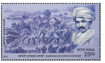

system, prevailed on Gandhi to visit Champaran. On reaching Chamaparan, Gandhi was asked by the police to leave immediately. When he refused he was summoned for trial. The news spread like wild fire and thousands swarmed the place in support of Gandhi. According to Gandhi, “The country thus had its first object- lesson in Civil Disobedience”. He was assisted by Brajkishore Prasad, a lawyer by profession, and Rajendra Prasad, who became the first President of independent India. The Lieutenant Governor eventually formed a committee with Gandhi as a member which recommended the abolition of the _tinkathia_ system, thereby ending the oppression of the peasants by the Indigo Planters.

The success of Champaran satyagraha, followed by his fruitful intervention in Ahmedabad mill strike (1918) and the Kheda Satyagraha (1918) helped Gandhi establish himself as a leader of mass struggle. Unlike earlier leaders, Gandhi demonstrated his ability to mobilise the common people across the country.

**(b) Rowlatt Satyagraha and Jallianwala Bagh Massacre**

The Government of India Act 1919, however, caused disappointment, as it did not transfer real power to the Indians. Besides, the government began to enforce the permanent extension of war time restrictions. The Rowlatt Act was enacted which provided for excessive police powers, arrest without warrant and detention without trial. Gandhi called it a ‘Black Act’ and in protest called for a nation- wide satyagraha on 6 April 1919. It was to be a non-violent struggle with fasting and prayer, and it was the earliest anti-colonial struggle spread across the country. The anti-Rowlatt protest was intense in Punjab, especially in Amritsar and Lahore. Gandhi was arrested and prevented from visiting Punjab. On 9 April two prominent local leaders Dr. Saifuddin Kitchlew and Dr. Satyapal were arrested in Amritsar.  

**General Dyer’s Brutality**

On 13 April 1919 a public meeting was arranged at Jallianwala Bagh in Amritsar. As it happened to be Baisaki day (spring harvest festival of Sikhs) the villagers had assembled there in thousands. General Reginald Dyer, on hearing of the assemblage, surrounded the place with his troops and an armoured vehicle. The only entrance to the park that was surrounded on all sides by high walls was blocked, and firing took place without any warning. The firing lasted for ten minutes till the troops ran out of ammunition. According to official report 379 were killed and more than thousand injured. Unofficial estimates put the toll at more than a thousand. After the incident martial law was declared and many people in the Punjab especially Amritsar were flogged and forced to crawl on the streets. The brutality enraged Indians. Rabindranath Tagore returned his knighthood. Gandhi surrendered his Kaiser-i-Hind medal.

**(c) Khilafat Movement**

The First World War came to an end in 1918. The Caliph of Turkey, who was considered the head of Muslims of the world, was given a harsh treatment. A movement was started called Khilafat Movement led by the Ali brothers, Maulana Mohamed Ali and Maulana Shaukat Ali. Gandhi supported the movement and saw in it an opportunity to unite Hindus and Muslims. He presided over the All India Khilafat Conference held at Delhi in November 1919. Gandhi supported Shaukat Ali’s proposal of three national slogans, Allaho Akbar, Bande Mataram and Hindu-Musslamanki Jai. The Khilafat Committee meeting in Allahabad on 9 June 1920 adopted Gandhi’s non-violent non- cooperation programme. Non-Cooperation was to begin on 1 August 1920.

## 8.3 Non-Cooperation Movement and Its Fallout

The Indian National Congress approved the non-cooperation movement in a special session held in Calcutta on September 1920. It was subsequently passed in the Nagpur Session held on December 1920, Chaired by Salem C.Vijayaraghavachariar. The programme of non-cooperation included:

1. Surrender of all titles of honours and honorary offices.

2. Non-participation in government functions.

3. Suspension of practice by lawyers, and settlement of court disputes by private arbitration.

4. Boycott of government schools by children and parents.

5. Boycott of the legislature created under the 1919 Act.

6. Non-participation in government parties and other official functions.

7. Refusal to accept any civil or military post. 

8. Boycott of foreign goods and spreading the doctrine of Swadeshi.

**(a) No-Tax Campaign and Chauri Chaura Incident** 

Gandhi announced a no-tax campaign in Bardoli in February 1922. These movements greatly enhanced Gandhi’s reputation as a national leader, especially the peasants. Gandhi made a nation-wide tour. Wherever he visited there was a bonfire of foreign cloth. Thousands left government jobs, students gave up their studies in large numbers and the lawyers gave up thriving practices. Boycott of British goods and institutions were effective. The boycott of the Prince of Wales’ visit to India was successful.

On 5 February 1922 a procession of the nationalists in Chauri Chaura, a village near Gorakhpur in present-day Uttar Pradesh provoked by the police turned violent. The police finding themselves outnumbered shut themselves inside the police station. The mob burnt the police station 22 policemen lost their lives. Gandhi immediately withdrew the movement.

**(b) Swarajists**

Meanwhile Congress was divided into two groups viz. pro-changers and no-changers. Some of the Congressmen led by Motilal Nehru and C.R. Das wanted to contest the elections and enter the legislature. They argued that the national interest could be promoted by working in the Legislative Councils under Dyarchy and wrecking the colonial government within. They were called the pro-changers. Staunch followers of Gandhi like Vallabhbhai Patel, C. Rajaji and others, known as no-changers, wanted to continue non-cooperation with the government. Despite the opposition C.R. Das and Motilal Nehru formed the Swaraj Party on 1 January 1923, which was later approved by a special session of the Congress. Swaraj Party members were elected in large numbers to the Imperial Legislative Assembly and the various Provincial Legislative Councils. They effectively

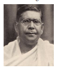

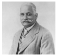

>Dyarchy, a system of dual government introduced under the Government of India Act 1919, divided the powers of the provincial government into Reserved and Transferred subjects. The Reserved Subjects comprising finance, defence, the police, justice, land revenue, and irrigation were in the hands of the British. The Transferred Subjects that included local self-government, education, public health, public works, agriculture, forests and fisheries were left under the control of Indian ministers. The system ended with the introduction of provincial autonomy in 1935.

used the legislature as a platform for propagation of nationalist ideas. In Bengal, they refused to take charge of transferred subjects, as they did not want to cooperate with the government. They exposed the true nature of the colonial government. However, the Swaraj Party began to decline after the death of its leader C.R. Das in 1925.

**(c) Constructive Programme of Gandhi**

After the Chauri Chaura incident, Gandhi felt that the volunteers and the people had to be trained for a non-violent struggle. As a part of this effort he focused on promoting Khadi, Hindu-Muslim unity and the abolition of untouchability. He exhorted the Congressmen, “Go throughout your districts and spread the message of Khaddar, the message of Hindu- Muslim unity, the message of anti-untouchability and take up in hand the youth of the country and make them the real soldiers of Swaraj.” He made it compulsory for all Congress members to wear khaddar. The All India Spinner’s Association was formed.

**(d) Boycott of Simon Commission** 

On 8 November 1927, the British Government announced the appointment of the Indian Statutory Commission. Composed of seven members headed by Sir John Simon it came to be widely known as the Simon Commission. It was an all-white commission with no Indian member. Indians were angered that they had been denied the right to decide their own constitution. All sections of India including the Congress and the Muslim League decided to boycott the commission. Wherever

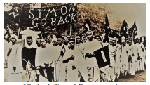  

the Commission went there were protests, and black flag marches with the slogan ‘Go Back Simon’. The protesters were brutally assaulted by the police. In one such assault in Lahore, Lal Lajpat Rai was seriously injured and died a few days later.

**(e) Nehru Report**

The Simon boycott united the different political parties in India. An all party conference was held in 1928 with the objective to frame a constitution for India as an alternative to the Simon Commission proposals. A committee under the leadership of Motilal Nehru was formed to outline the principles on the basis of which the constitution was to be drafted. The committee’s report, known as the Nehru Report, recommended,

1. Dominion status for India. 

2. Elections of the Central Legislature and the Provincial Legislatures on the basis of joint and mixed electorates.

3. Reservation of seats for Muslims in the Central Legislature and in provinces where they are in a minority and for the Hindus in North-West Frontier Province where they were in a minority.

4. Provision of fundamental rights, and universal adult franchise. 

Jinnah proposed an amendment to the reservation of seats in the Central Legislature. He demanded that one-third of the seats be reserved for Muslims. Tej Bahadur Sapru supported him and pleaded that it would make no big difference. 

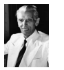

However, it was defeated in the All Party Conference. Later he proposed a resolution which came to be known as Jinnah’s Fourteen Points. However, it was also rejected. Jinnah who was hailed as Ambassador of Hindu–Muslim Unity thereafter changed his stand and began to espouse the cause of a separate nation for Muslims.

## 8.4 The Struggle for Poorna Swaraj and Launch of Civil Disobedience Movement

Meanwhile some congressmen were not satisfied with dominion status and wanted to demand complete independence. In the Congress session held in Lahore in December 1929 with Jawaharlal Nehru as the President, Poorna Swaraj was declared as the goal. It was also decided to boycott the Round Table Conference and launch a Civil Disobedience Movement. 26 January 1930 was declared as Independence Day and a pledge was taken all over the country to attain Poorna Swaraj non-violently through civil disobedience including non-payment of taxes. The Indian National Congress authorised Gandhi to launch the movement.

**(a) Salt Satyagraha Movement**

A charter of demands presented to the Viceroy Lord Irwin with an ultimatum to comply by 31 January 1930 included: 

1. Reduction of expenditure on army and civil services by 50% 

2. Introduction of total prohibition of liquor 

3. Release of all political prisoners 

4. Reduction of land revenue by 50% 

5. Abolition of salt tax.

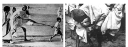 

When the Viceroy did not respond to the charter of demands, Gandhi launched the Civil Disobedience Movement. The inclusion of abolition of salt tax was a brilliant tactical decision. At the break of dawn on 12 March 1930 Gandhi set out from Sabarmati Ashram with 78 of its inmates. The procession became larger and larger when hundreds joined them along the march. At the age of 61 Gandhi covered a distance of 241 miles in 24 days to reach Dandi at sunset on 5 April 1930. The next morning, he took a lump of salt breaking the salt law.

**Salt Satyagraha in Provinces** 

In Tamil Nadu, C. Rajaji led a similar salt march from Tiruchirappalli to Vedaranyam. Salt marches took place in Kerala, Andhra and Bengal. In the North West Frontier Province Khan Abdul Ghaffar Khan led the movement. He organized the Khudai Khidmatgar, also known as the Red Shirts.

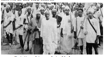

>The British enacted the first forest act in 1865. This act restricted the access of the forest dwellers to the forest areas to collect firewood, cattle fodder and other minor forest produce such as honey, seeds, nuts, medicinal herbs. The Indian Forest Act of 1878 claimed that original ownership of forests was with the state. Waste lands and fallow lands were included as forest. Shifting cultivation practiced by, the tribal people, was prohibited. Alienation of forests from local control was stiffly resisted by the aggrieved adivasis (tribals) and the nationalists.

>The most striking evidence of continuing struggles of the tribal groups was the one waged by Alluri Sitarama Raju in Rampa. Raju’s efforts at fighting corrupt officials to protect the interests of Rampa tribals prompted the British to target his life. A special Malabar Police team was sent to quell the uprisings (1922-24) of Rampa Adivasis. Alluri Sitarama Raju attained martyrdom for the cause of forest dwellers.

Gandhi was arrested at midnight and sent to Yeravada Jail. Jawaharlal Nehru, Khan Abdul Ghaffar Khan and other leaders were swiftly arrested. Soon other forms of protests such as boycott of foreign cloth, picketing of liquor shops, non-payment of taxes, breaking of forest laws etc. were adopted. Women, peasants, tribals, students, even children and all sections participated in the nation-wide struggle. It was the biggest mass movement India had ever witnessed.

**(b) Round Table Conferences**

In the midst of the movement the First Round Table Conference was held at London in November 1930. Ramsay Macdonald, the British Prime Minister, proposed a federal government with provincial autonomy. The Congress did not attend it as its leaders were in jail. The Conference closed without any decision on the question.

**(c) Gandhi-Irwin Pact**

Lord Irwin held talks with Gandhi which resulted in the Gandhi–Irwin Pact on 5 March 1931. The British agreed to the demand of immediate release of all political prisoners not involved in violence, return of confiscated land and lenient treatment of government employees who had resigned. It also permitted the people of coastal villages to make salt for consumption and non-violent picketing. The Congress agreed to suspend the Civil Disobedience Movement and attend the conference. Gandhi attended the Second Round Table Conference which began on 7 September 1931. Gandhi refused to accept

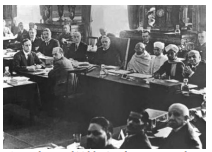  

separate electorates for minorities. As a result, the second conference ended without any result.

**(d) Renewal of Civil Disobedience Movement.**

On returning to India, Gandhi revived the Civil Disobedience Movement. This time the government was prepared to meet the resistance. Martial law was enforced and Gandhi was arrested on 4 January 1932. Soon all the Congress leaders were arrested too. Protests and picketing by the people were suppressed with force.

In the meantime, the Third Round Table Conference was held from 17 November to 24 December 1932. The Congress did not participate in the conference as it had revived the Civil Disobedience Movement.

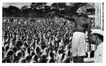

**(e) Communal Award and Poona Pact**

On 16 August 1932, Ramsay MacDonald, announced the Communal Award. It provided separate electorates to the minorities, viz. Muslims, Sikhs, Indian Christians, Anglo- Indians and women and the “depressed classes”. B.R. Ambedkar, the leader of the depressed classes, strongly argued for the separate electorate, as it, according to him, would give them political representation and power. On 20 September 1932, Gandhi went on a fast unto death against the separate electorates for the depressed classes. Madan Mohan Malaviya, Rajendra Prasad and others held talks with Ambedkar and M.C. Rajah the leaders of the depressed classes. After intense negotiations an agreement was arrived between Gandhi and Ambedkar. Known as the Poona Pact, its main terms were:

1. The principle of separate electorates was abandoned. Instead, the principle of joint electorate was accepted with reservation of seats for the depressed classes.

2. Reserved seats for the depressed classes were increased from 71 to 148. In the Central Legislature 18 percent of the seats were reserved.

**(f) Campaign Against Untouchability**

Gandhi devoted the next few years towards abolition of untouchability. His engagement with Dr. B.R. Ambedkar made a big impact on his ideas about the caste system. He shifted his base to the Satyagraha Ashram at Wardha. He undertook an all-India tour called the Harijan Tour. 

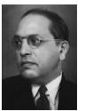

He started the Harijan Sevak Sangh to work for the removal of discriminations. He worked to promote education, cleanliness and hygiene and giving up of liquor among the depressed class. An important part of the campaign was the Temple Entry Movement. 8 January 1933 was observed as ‘Temple Entry Day’.

## 8.5 Beginnings of Socialist Movements

Inspired by the Russian Revolution of 1917 the Communist Party of India (CPI) was founded at Tashkent, Uzbekistan in October 1920. M.N. Roy, Abani Mukherjee, and M.P.T. Acharya were some of its founding members.The British government in India made vigorous efforts to suppress the communist movement by

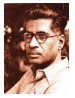 

foisting a series of cases in the 1920s. In a further attempt to eliminate the threat of communism M.N. Roy, S.A. Dange, Muzaffar Ahmed, M. Singaravelar among others were arrested and tried in the Kanpur Conspiracy Case of 1924.

**(a) Foundation of Communist Party**

The communists used it as a platform to propagate their views and to expose the ‘true colour of British rule in India’. In an attempt to form a party an All India Communist Conference was held at Kanpur in 1925. 

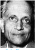

Singaravelar gave the Presidential Address. It led to the founding of the Communist Party of India in Indian soil. Their efforts eventually led to the establishment of the All India Workers’ and Peasants’ Party in 1928.

**(b) Revolutionary Activities**

The youths who were disillusioned with the sudden withdrawal of the Non Cooperation Movement by Gandhi took to violence. In 1924 Hindustan Republican Army (HRA) was formed in Kanpur to overthrow the colonial rule by an armed rebellion. In 1925 Ram Prasad Bismil, Ashfaqulla Khan and others held up a train carrying government money and looted in Kakori, a village near Lucknow. They were arrested and tried in the Kakori Conspiracy Case. Four of them were sentenced to death while the others were sentenced to imprisonment.

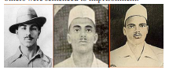 

Sukhdev Bhagat Singh, Sukhdev and their comrades reorganized the HRA in Punjab. Influenced by socialist ideas they renamed it as Hindustan Socialist Republican Association in 1928. Sanders, a British police officer, responsible for the lathi charge that led to Lala Lajpat Rai’s death was assassinated. Bhagat Singh along with B.K. Dutt threw a smoke bomb inside the Central Legislative Assembly in 1929. They shouted ‘Inquilab Zindabad’ and ‘Long Live the Proletariat’. He along with Rajguru was arrested and sentenced to death. Bhagat Singh’s daring and courage fired the imagination of the youth across India, and he became popular across India.

In April 1930, the Chittagong Armoury Raid was carried out by Surya Sen and his associates. They captured the armories in Chittagong and proclaimed a provisional revolutionary government. 

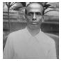

They survived for three years raiding government institutions. In 1933 Surya Sen was caught and hanged after a year.

**(c) Left Movement in the 1930s**

By the 1930s the Communist Party of India had gained strength in view of the economic crisis caused by world-wide Great Depression. Britain transmitted the effects of Depression to its colonies. The effects of Depression were reflected in decline in trade returns and fall in agricultural prices. The governmental measures included forcible collection of land revenue which in real terms had increased two-fold due to a 50% fall in agricultural prices, the withdrawal of money in circulation, retrenchment of staff and expenditure on developmental works.

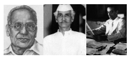

In this context, the Communist Party, fighting for the cause of peasants and industrial workers hit by loss of income and wage reduction, and problems of unemployment gained influence and was therefore banned in 1934. The Congress, as a movement with a wide spectrum of political leanings, ranging from the extreme Left to the extreme Right, welded together by the goal of Swaraj, emerged as a powerful organisation. In 1934 the Congress Socialist Party was formed by Jayaprakash Narayan, Acharya Narendra Dev and Minoo Masani.

>‘Real Swaraj will come not by acquisition of authority by a few, but by the acquisition of the capacity by all to resist authority, when abused.’ - M. K. Gandhi

## 8.6 First Congress Ministries under Government of India Act, 1935

The Government of India Act 1935 was one of the important positive outcomes of the Civil Disobedience Movement. The key features of the Act were provincial autonomy and dyarchy at the centre. The Act provided for an all India Federation with 11 provinces, 6 Chief commissioner’s provinces and all those Princely states which wished to join the federation. The Act also provided autonomy to the provinces. All the subjects were transferred to the control of Indian ministers. Dyarchy that was in operation in provinces was now extended to the central government. The franchise, based on property, was extended though only about ten percent of the population enjoyed the right to vote. By this Act Burma was separated from India.

**(a) Congress Ministries and their Work**

The Government of India Act 1935 was implemented with the announcement of elections in 1937. The Congress immensely benefitted because of the Civil Disobedience Movement. The Congress called off its programme of boycott of legislature and contested elections. It emerged victorious in seven out of the eleven provinces. It formed ministries in 8 provinces – Madras, Bombay, Central Provinces, Orissa, Bihar, United Provinces, North West Frontier Province. In Assam it formed a coalition government with Assam Valley Muslim Party led by Sir Muhammad Sadullah. The Congress Ministries functioned as a popular government and responded to the needs of the people. The salaries of ministers were reduced from Rs. 2000 to Rs. 500 per month. Earlier action taken against nationalists were rescinded. They repealed the Acts which vested emergency powers in the government, lifted the ban imposed on political organisations except the Communist Party, and removed the restrictions on the nationalist press. Police powers were curbed and reporting by the CID on political speeches discontinued. Legislative measures were adopted for reducing indebtedness of the peasantry and improving the working conditions of the industrial labour. Temple entry legislation was passed. Special attention was paid to education and public health.

**(b) Resignation of Congress Ministries**

In 1939 the Second World War broke out. The colonial government of India entered the War on behalf of the Allies without consulting the Congress ministries. The Congress ministries resigned in protest. By 1940 he was demanding a separate state for the Muslims.

**(c ) National Movement during the Second World War, 1939–45**

In 1939 Subhas Chandra Bose became the President of the Congress by defeating Pattabhi Sitaramayya, the candidate of Gandhi. 

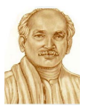

When Gandhi refused to cooperate, Subhas Chandra Bose resigned his post and started the Forward Bloc.
  

## 8.7 Developments leading to Quit India Movement

**(a) Individual Satyagraha**

In August 1940 Viceroy Linlithgow made an offer in return for Congress’ support for the war effort. Hence Gandhi declared limited satyagraha which would be offered by a few individuals. 

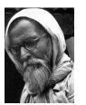

Vinobha Bhave was the first to offer satyagraha on 17 October 1940. The satyagraha continued till the end of the year. During this period more than 25,000 people were arrested.

**(b) Cripps Mission**

On 22 March 1942, the British government sent a mission under Cabinet Minister Sir Strafford Cripps. The negotiations between the Cripps Mission and the Congress failed as Britain was not willing to transfer effective power immediately. The Cripps Mission offered:

1. Grant of Dominion Status after the War 

2. Indian Princes could sign a separate

agreement with the British implying the acceptance for the demand of Pakistan.

3. British control of defence during the War.

Both the Congress and the Muslim League rejected the proposal. Gandhi called the proposals as a post-dated cheque on a crashing bank.

**(c) "Do or Die" Call by Gandhi**

The outcome of the Cripps Mission caused considerable disappointment. Popular discontent was intensified by war time shortages and steep rise in prices. The All India Congress Committee that met at Bombay on 8 August 1942 passed the famous Quit India Resolution demanding an immediate end to British rule in India. Gandhi gave a call to do or die. Gandhi said, ‘We shall either free India or die in the attempt; we shall not live to see the perpetuation of our slavery.” A non-violent mass struggle under Gandhi was to be launched. But early next morning on 9 August 1942 Gandhi and the entire Congress leadership was arrested.

**(d) Role of Socialists**

With Gandhi and other prominent leaders of the Congress in jail, the Socialists provided the leadership for the movement. 

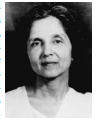

Jayaprakash Narayan and Ramanand Misra escaped from prison and organised an underground movement. Women activists like Aruna Asaf Ali played a heroic role. Usha Mehta established Congress Radio underground which successfully functioned till November 1942.

**(e) People’s Response**

As news spread to different parts of India, a spontaneous protest broke out everywhere. The people protested in whatever form that they could, such as hartals, strikes, picketing. The government suppressed it with brute force. People attacked government buildings, railway stations, telephone and telegraph lines and all that stood as symbols of British authority. This was particularly widespread in Madras. Parallel governments were established in Satara, Orissa, Bihar, United Provinces and Bengal.

**(f) Subhas Chandra Bose and INA**

Subhas Chandra Bose who had left the Congress was now under house arrest. He wanted to strike British hard by joining its enemies. In March 1941, he made a dramatic escape from his house in disguise and reached Afghanistan. Initially he wanted to get the support of Soviet Union. After the Soviet Union joined the Allied Powers which included Great Britain, he went to Germany. In February 1943, he made his way to Japan on a submarine and took control of the Indian National Army. The Indian National Army Captain Lakshmi Sahgal headed it (Azad Hind Fauj) had earlier been organized by Gen. Mohan Singh with Indian prisoners of war with the support of Japanese in Malaya and Burma. Bose reorganised it into three brigades: Gandhi Brigade, Nehru Brigade and a women’s brigade named after Rani of Jhansi. Subhas Chandra Bose formed the Provisional Government of Free India in Singapore. He gave the slogan ‘Dilli Chalo’. INA was deployed as part of the Japanese forces. However, the defeat of Japan stopped the advance of INA. The airplane carrying Subhas Chandra Bose crashed bringing to an end his crusade for freedom.

The British government arrested the INA officers and put them on trial in the Red Fort. The trial became a platform for nationalist propaganda. The Congress set up a defence committee comprising Nehru, Tej Bahadur Sapru, Bhulabhai Desai and Asaf Ali. Though the INA officers were convicted they were released due to public pressure. The INA exploits and the subsequent trials inspired the Indians.

## 8.8 Towards Freedom

**(a) Royal Indian Navy Revolt**

The Royal Indian Navy ratings revolted at Bombay in February 1946. It soon spread

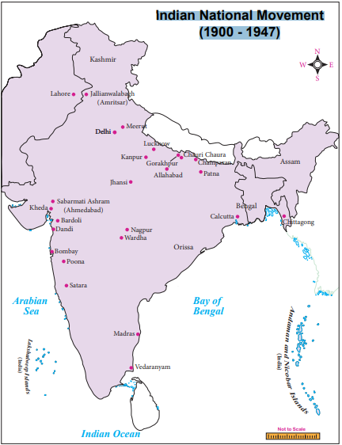  

to other stations involving more than 20,000 ratings. Similar strikes occurred in the Indian Air Force and the Indian Signal Corps at Jabalpur. Thus the British hegemonic control ceased even in the armed forces.

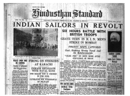

**(b) Negotiating Independence: Simla Conference**

The Wavell Plan was announced on 14 June 1945. It provided for an interim government, with an equal number of Hindus and Muslims in the Viceroy’s Executive Council. All portfolios, except war portfolio, was to be held by Indian ministers. However, in the Simla Conference, the Congress and the Muslim League could not come to an agreement. Jinnah demanded that all the Muslim members should be from the Muslim League and they should have a veto on all important matters. In the provincial elections held in early 1946 the Congress won most of the general seats and the Muslim League won most of the seats reserved for the Muslims thus bolstering its claim.

**(c) Cabinet Mission**

In Britain, the Labour Party had won a landslide victory and Clement Atlee became the Prime Minister. He declared that he wanted to transfer power at the earliest. He sent a Cabinet Mission comprising Pethick Lawrence, Sir Strafford Cripps and A.V. Alexander. Rejecting the demand for Pakistan, it provided for a Federal government with control over defence, communications  and foreign affairs. The provinces were divided into three groups viz. Non-Muslim Majority Provinces, Muslim Majority Provinces in the Northwest and the Muslim Majority Provinces in the Northeast. A Constituent Assembly was to be elected and an interim government set up with representation for all the communities. The Congress and the Muslim League accepted the plan. However, both interpreted it differently.

**(d) Direct Action Day Call by Muslim League**

Difference arose between Congress and Muslim League when the former nominated a Muslim member. The League argued it was to be the sole representative of the Muslims and withdrew its approval. Jinnah declared 16 August 1946 as the ‘Direct Action Day’. Hartals and demonstrations took place which soon turned into Hindu-Muslim conflict. It spread to other districts of Bengal. The district of Noakhali was the worst affected.

**(e) Mountbatten Plan**

The interim government headed by Jawaharlal Nehru was formed in September 1946. After some hesitation the Muslim League joined it in October 1946. Its representative Liaqat Ali Khan was made the Finance Member. In February 1947, Clement Atlee declared that power would be transferred by June 1948. Lord Mountbatten was sent as Viceroy to India with the specific task of transfer of power. On 3 June 1947 the Mountbatten Plan was announced. It proposed:

1. Power would be transferred on the basis of dominion status to India and Pakistan.

2. Princely states would have to join either India or Pakistan.

3. Boundary commission was to be set up under Radcliffe Brown and the award would be announced after the transfer of power.

4. Punjab and Bengal Legislative Assemblies would vote on whether they should be partitioned.

**(f) Independence and Partition**

The Mountbatten Plan was given effect by the enactment of the Indian Independence Act on 18 July 1947 by the British Parliament. The Act abolished the sovereignty of the British Parliament over India. India was partitioned into two dominions – India and Pakistan. On 15 August 1947 India won independence.

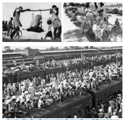