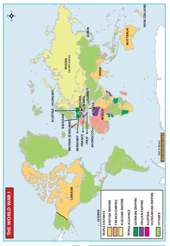
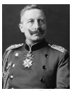
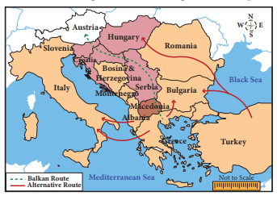
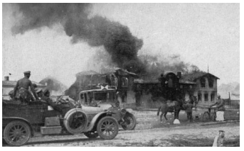
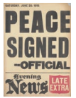
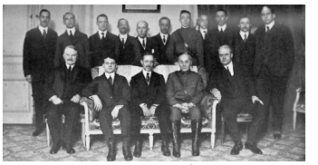
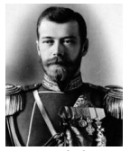

# Introduction 
1914 is a turning point in world history. The political and social processes that began in 1789 culminated in the First World War that broke out in that year and decisively shaped the course of the twentieth century. Historians therefore call this as ‘the long nineteenth century’. This was the first industrial war that drew on the economic resources of the entire world, and also affected large sections of the civilian population. The political map of the world was redrawn. Three major empires lay shattered by the end of the War: Germany, Austria–Hungary, and the Ottomans. The biggest outcome of the War was the Russian Revolution. It was a unique event as well as the first revolution of its kind in world history. For the first time, countries tried to bring about world peace through the League of Nations. In this lesson, we discuss the circumstances leading to the outbreak of the First World War and its repercussions, including the Russian Revolution and the formation of an international peace organisation, namely the League of Nations.

## 1.1 Scramble for Colonies Capitalist Countries’ Race for Markets

The aim of capitalistic industry was to produce more and more. The surplus wealth thus produced was used to build more factories, railways, steamships and other such undertakings. Revolution in the means of communication and transportation in the latter half of the nineteenth century facilitated the process of European expansion in Africa and other places.

A striking feature of nineteenth century was that Europe emerged as the dominant power while Asia and Africa were colonized and exploited. Within Europe, England held a pre-eminent position as the world leader of capitalism. An ever-growing demand for markets and raw materials made the capitalist powers race around the world for expanding their empire for exploitation.

  

**Rise of Monopoly Capitalism** 
After 1870, the alliance of industry and finance seeking profits in markets for goods and capital, which was an essential characteristic of imperialism, became evident in the latter half of the nineteenth century. The old ideas of free trade collapsed. There were trusts in the USA and cartels in Germany.

>A trust is an industrial organisation engaged in the production or distribution of any commodity. The trust would possess adequate control over the supply and price of that commodity to its own advantage.

**Imperialism and its Essential Characteristics**

Capitalism inevitably led to imperialism. According to Lenin, imperialism is the highest stage of capitalism. Besides being a market for surplus goods, colonies served another purpose. Imperialism was not just about colonies. It became a total system, the logic of which was total militarisation and total war.

## 1.2 Rivalry of Great Powers

**Europe**

In the nineteenth century, European powers had colonised many other countries. By1880, most of the Asian countries had been colonised. Only Africa was left. The occupation, division and colonisation of Africa took place from 1881 to 1914. After 1870, England, France, Belgium, Italy and Germany joined in the scramble for colonies.

**Clashes amongst Great Powers**

Despite the lead in industrial growth and the control of a vast empire England was not satisfied. England was in competition with Germany and the United States, which were producing cheaper manufactured goods and thus capturing England’s markets. National rivalry led to frequent clashes between these great powers in Asia and Africa and Europe.  

**Asia: The Rise of Japan**

In Asia, Japan during this period (Meiji era from 1867 to 1912), imitating Western nations had become their equal in many respects. Though the outlook of the rulers still remained feudal, Japan took to Western education and machinery. With a modern army and navy, Japan had emerged as an advanced industrialised power. In 1894 she forced a war on China. The crushing defeat of China by little Japan in the Sino-Japanese War (1894-95) surprised the world. Despite the warning of the three great powers Russia, Germany and France – Japan annexed the Liaotung peninsula with Port Arthur. By this action Japan proved that it was the strongest nation of the East Asia.

Japan, however, in view of the pressure mounted by European Powers, soon gave up its claim over Port Arthur. Russia took advantage of this and sent a large army to Manchuria. Japan entered into an alliance with England in 1902 and demanded that Russia withdraw troops from Manchuria. Russia underestimated Japan. In 1904 the war began between the two countries. In this Russo-Japanese War, Japan defeated Russia and got back Port Arthur. After this War Japan entered the “circle of the great Powers”.

**Strong-arm Diplomacy of Japan**

After 1905 Japan took control of Korean domestic and foreign policy. The assassination of a prominent Japanese diplomat provided the excuse in 1910 for Japan’s annexation of Korea. The confusion in China following the downfall of the Manchu dynasty in 1912 provided Japan an opportunity for further expansion. Japan demanded the transfer of German rights in Shantung to Japan and the recognition of Japanese hold over Manchuria. This strong-arm diplomacy aroused the hostility of both China and the European Powers.

**Colonisation and its Fallout**

In 1876 barely 10 percent of Africa was under European rule. By 1900 practically the

  

whole of Africa was colonised. Britain, France and Belgium had divided the continent between them, leaving a few areas for Germany and Italy. Britain, France, Russia and Germany also established “spheres of influence” in China. Japan took over Korea and Taiwan. France conquered Indo-China. The US took the Philippines from Spain, and Britain and Russia agreed to partition Iran.

The first European attempts to carve out colonies in Africa resulted in bloody battles. The French had to fight a long and bitter war to conquer Algeria and Senegal. The British lost to the Zulus (1879) and to the Sudanese Army (1884). The Italian army suffered a devastating defeat at the hands of an Ethiopian army at Adowa (1896).

**1.3 Causes, Course and Results of World War I**

**(a) Causes** 
***European Alliances and Counter-Alliances**

In 1900 five of the European Great Powers were divided into two armed camps. One camp consisted of the Central Powers-Germany, Austria-Hungary and Italy. Under the guidance of Bismarck, they had formed the Triple Alliance in 1882. The understanding was that Germany and Austria would help each other. The other camp consisted of France and Russia. Their alliance was formed in 1894 with the promise of mutual help if Germany attacked either of them. An isolated Britain wanted to break her isolation and approached Germany twice but in vain. As Japan was increasingly hostile towards Russia, as France was the ally of Russia, it preferred to ally with Britain (1902). The Anglo-Japanese Alliance prompted France to seek an alliance with Britain to resolve colonial disputes over Morocco and Egypt. This resulted in the Entente Cordiale (1904). In return for letting the French have a free hand in Morocco, France agreed to recognize the British occupation of Egypt. Britain subsequently reached an agreement with Russia over Persia, Afghanistan and Tibet.  

Thus was formed the Triple Entente of Britain, France and Russia.

**Violent Forms of Nationalism**

With the growth of nationalism, the attitude of “my country right or wrong I support it” developed. The love for one country demanded hatred for another country. England’s jingoism, France’s chauvinism and Germany’s Kultur were militant forms of nationalism, contributing decisively to the outbreak of War.

**Aggressive Attitude of German Emperor**

Emperor Kaiser Wilhelm II of Germany proclaimed that Germany would be the leader of the world. The German navy was expanded. The sea being considered a preserve of England ever since Napoleon’s defeat at Trafalgar (1805),

 Germany’s aggressive diplomacy and rapid building of naval bases convinced Britain that a German navy could be directed only against her. Therefore, Britain embarked on a naval race, which heightened the tension between the two powers.

**Hostility of France towards Germany**

France and Germany were old rivals. Bitter memories of the defeat of 1871 and loss of Alsace and Lorraine to Germany rankled in the minds of the French. German interference in Morocco added to the bitterness. The British agreement with France over Morocco was not consented by Germany. So Kaiser Wilhelm II intentionally recognised the independence of the Sultan and demanded an international conference to decide on the future of Morocco.

**Imperial Power Politics in the Balkans**

The Young Turk Revolution of 1908, an attempt at creating a strong and modern government in Turkey, provided both Austria and Russia with the opportunity to resume their activities in the Balkans. Austria and Russia met and agreed that Austria should annexe Bosnia and Herzegovina, while Russia should have freedom to move her warships, through the Dardanelles and the Bosporus, to the Mediterranean. Soon after this, Austria announced the annexation of Bosnia and Herzegovina. Austria’s action aroused intense opposition from Serbia. Germany gave Austria firm support. Germany went to the extent of promising that if Austria invaded Serbia and in consequence Russia helped Serbia, Germany would come to Austria’s assistance. The enmity between Austria and Serbia led to the outbreak of war in 1914.

**The Balkan Wars**

Turkey was a powerful country in the south west of Europe in the first half of eighteenth century. The Ottoman empire extended over the Balkans and across Hungary to Poland. The Empire contained many non-Turkish people in the Balkans. Both the Turks and their subjects of different nationalities in the Balkans indulged in the most frightful massacres and atrocities. The Armenian genocide is a frightful example.

Taking advantage of the political and economic instability of the Turkish Empire from the second half of the eighteenth century, Greeks followed by others began to secede, one after another, from Turkish control. Macedonia had a mixed population. There were rivalries among Greece, Serbia, Bulgaria and later Montenegro for the control of it. In March 1912 they formed the Balkan League. The League   attacked and defeated Turkish forces in the first Balkan War (1912–13). According to the Treaty of London signed in May 1913 the new state of Albania was created and the other Balkan states divided up Macedonia between them. Turkey was reduced to the area around Constantinople.

The division of Macedonia, however, did not satisfy Bulgaria. Bulgaria attacked Serbia and Greece. But Bulgaria was easily defeated. The Second Balkan War ended with the signing of the Treaty of Bucharest in August 1913.

**Immediate Cause**

The climax to these events in the Balkans occurred in Sarajevo in Bosnia. On 28 June 1914 the Archduke Franz Ferdinand, heir to Franz Joseph, Emperor of Austria-Hungary, was assassinated by Princip, a Bosnian Serb. Austria saw in this an opportunity to eliminate Serbia as an independent state. Germany thought that it should strike first. It declared war on Russia on 1 August. Germany had no quarrel with France, but because of the Franco-Russian Alliance, the German army which was planning a war against both France and Russia wanted to use the occasion to its advantage. The German violation of Belgian neutrality forced Britain to enter War.

**(b) Course of the War**

**Two Warring Camps**

**Central Powers**

The warring nations were divided into two. The Central powers consisted of Germany, Austria–Hungary, Turkey and Bulgaria. Italy which was earlier with Germany and Austria had left, as her attempt to recover Trentino in north east Italy, where Italians lived in majority but remained as part and parcel of Austria- Hungary, was not supported by Germany. Italy remained a neutral country when the War broke out. But it decided to enter the War hoping to gain the territory in the north - east. Britain, France and Italy signed the secret Treaty of London in April 1915, by which Italy agreed to enter the War against the Central Powers in return for this territory after the War.

**Allies**

Nine states that opposed the Central powers were: Russia, France, Britain, Italy, the United States, Belgium, Serbia, Romania and Greece. Romania and Greece declared war on the Central Powers in 1916 and 1917 respectively but played little part in the war. Most Americans wanted their country to remain neutral and so in the first three years the United States gave only moral support and valuable material aid to Britain and France.

**Tsar’s Abortive Attempts for Peace**

Tsar Nicholas II of Russia suggested to the Powers that they meet together to bring about an era of universal peace. In response, two Peace Conferences were held at The Hague in Holland in 1899 and 1907 but in vain.

**War in Western or French Front**

Germany steamrolled and smashed the resistance of the people of Belgium. On the side of the Allies, the burden of the fighting fell on the French army. Within a month Paris seemed almost doomed.

**Battles of Tannenberg and Marne**

Meanwhile Russian forces invaded East Prussia. Germany defeated them decisively. At the Battle of the Marne (early September 1914), the French succeeded in pushing back the Germans. Paris was thus saved. The battle of Marne is a memorable for **trench warfare.**

**Battle of Verdun**

Between February and July 1916, the Germans attacked Verdun, the famous fortress in the French line. In the five-month Battle of Verdun two million men took part and half of them were killed. The British offensive against Germans occurred near the River Somme. In this four-month Battle of Somme Britain lost 20,000 men on the first day. The battle of Verdun, however, decided the fortunes of the War in favour of the Allies.

**War in Eastern or Russian front**

In the eastern front, Russian troops repeatedly defeated the Austrians. But the Russians were in turn defeated by the Germans. Russia had the worst trained and equipped army and therefore Russian losses were the greatest. In 1917, the Tsarist regime in Russia was overthrown in a revolution. Russia wanted peace and consequently it signed the Treaty of Brest-Litovsk (3 March 1918) with Germany.

**Minor Theatres of War**

**In the Middle East**

Turkey also fought on the side of the central powers.Though Turkey met with initial success and the Allies suffered reverses, particularly in Mesopotamia and Gallipoli, ultimately Turkey was defeated.The Turks tried to attack Suez Canal, but were repulsed. Britain attacked Turkey in Iraq, and later in Palestine and Syria.
  

**In the Far East**

China also joined the allies. Japan was able to capture the province of Kiauchau given by the Germans to China in the province of Shantung. There was no war in the Far East. Japan made use of the occasion to threaten China into ceding valuable concessions and privileges.

**In the Balkans**

The Austro-German army in coordination with Bulgaria crushed Serbia. Serbia came under German rule. Rumania watched the course of the War and in August 1916 joined the Allies. Rumania also passed under Austro- German occupation.

**Fate of Colonies of Germany in Africa**

The German colonies in western and eastern Africa were also attacked by the Allies. As these colonies were quite far from Germany they could not receive any immediate help, and therefore surrendered to the Allies.

**Italy falls to Austrian onslaught**

Italy formally joined the Allies in the war in May 1916. Italians were fighting with the Austrians and continued to sustain their resistance. But when the Germans came to Austria’s help, the Italians collapsed.

**Central Powers’ Victories**

The Central Powers successfully occupied Belgium and a part of France in the north-east, Poland, Serbia and Romania.

The epicentre of the struggle was the western front and the seas. As the Allies controlled the sea-routes, they cut off the supply of food and other material reaching the Central Powers. In Germany and Austria women and children suffered from hunger and privation. Germany attacked England by air. Bombs were thrown on London and places where there were major factories. Later aeroplanes were used for targeting civilian population. The Germans introduced poison gas and soon both sides resorted to its use.  

**Naval Battles and America’s Entry into the War**

In 1916 a naval battle **(Battle of Jutland)** had taken place in the North Sea. The British won the battle. Thereafter Germany started their submarine warfare and their cruisers went roaming about, interfering with the shipping of the Allies. One of these was the famous Emden, which bombarded Madras. As a counter measure to the blockade the Germans proclaimed in January 1917 that they would sink even neutral ships in certain waters. _Lusitania_, an American ship, was torpedoed by a German submarine. There was a lot of resentment in the USA and President Wilson declared war against Germany in April 1917. America’s entry with its enormous resources made Allied victory a foregone conclusion.

**(c) The Armistice and Treaty of Versailles**

Germany ultimately surrendered in November 1918. The armistice took effect from 11 November 1918. Germany was forced to accept harsh terms by the political situation at home with the abdication of the Kaiser William II.

**Peace Conference in Paris**]

The Peace Conference opened in Paris in January 1919, two months after the signing of the armistice. Woodrow Wilson (USA), Lloyd George (Prime Minister of England) and Clemenceau (Prime Minister

of France) played a very important part in the deliberations.

Faced with a threat of a renewed war, the German government was forced to agree to the terms. On 28 June, 1919 the peace treaty was signed in the Hall of Mirrors at Versailles. 

**Provisions of the Treaty** 
1. Germany was found guilty of starting the War and therefore was to pay reparations for the losses suffered. All Central Powers were directed to pay war indemnity.

2. The German army was to be limited to 100,000 men. A small navy was allowed.

3. The union of Austria and Germany was forbidden.

4. All German colonies became mandated territories under the League of Nations.

5. Germany was forced to revoke the Treaty of Brest-Litovsk (with Russia) and Bucharest (Bulgaria).

6. Alsace–Lorraine was returned to France. 

7. The former Russian territories of Finland,Estonia, Latvia and Lithuania were to be independent

8. Northern Schleswig was given to Denmark and some small districts to Belgium.

9. Poland was recreated. 

10. The Rhineland was to be occupied by the Allies. The area on the east bank of the Rhine was to be demilitarized.

>President Wilson laid down his Fourteen Points, which were to be followed by the Allies. The most important one he highlighted was the need for ‘a general association of nations for the purpose of affording mutual guarantees of political independence and territorial integrity to great and small states like’.  

Separate treaties were drawn up and signed by the Allies with Austria, Hungary, Bulgaria and Turkey. The Treaty with Turkey (Treaty of Sevres), though accepted by the Sultan, failed because of the resistance of Mustafa Kemal Pasha and his followers.

**Fallout of the First World War**

The First World War left a deep impact on European society and polity. Through conscription, and through air raids, the War had involved and affected far more of the population than in the past. 8 million had died in four years, while more than twice as many were wounded, and many crippled for life. Millions more had succumbed to the worldwide influenza of 1918. The outcome, in all countries, was imbalance between the sexes—a shortage of men. Soldiers came to be placed above civilians.

The War and its aftermath turned out to be a stirring period of history. The most striking of all was the rise and consolidation of the Soviet Union, the U.S.S.R or the Union of Socialist and Soviet Republics, as it was called. America entered the War as a debtor country but it emerged as the money-lender to the world in the aftermath of the War.

Another outstanding event of this period was the awakening of the colonies and their inspired attempts to gain freedom.

Mustafa Kemal Pasha played a remarkable role for Turkey’s rebirth as a nation. Kemal Pasha modernised Turkey and changed it out of all recognition.

**Impact on India**

The First World War had a significant impact on India. The British recruited a vast contingent of Indians to serve in Europe, Africa and West Asia. After the War, the soldiers came back with new ideas which had an impact on the Indian society. India contributed £ 230 million in cash and over £ 125 million in loans towards war expenses. India also sent war materials to the value £ 250 million. This caused enormous economic distress. There were grain riots as poor people looted shops. Towards the end of the War India too suffered under the world-wide epidemic of influenza. (£ - symbol of Pound sterling)

The War conditions led to the rise of Home Rule Movement in India. The Congress was reunited during the war.

India and Indians had taken an active part in the War believing that Britain would reward India's loyalty. But only disappointment was in store.Thus the War had multiple effects on Indian society, economy and polity.

## 1.4 Russian Revolution and its Impact

**Introduction**

The biggest outcome of the War, the Russian revolution, was unique in world history. The socio- political and economic conditions prevailing in

Russia were brought to a head by the vast losses and sufferings caused by the War. There were really two revolutions in the year 1917, one in March and the other in November. On the abdication of the Tsar the bourgeois government which followed, wanted to continue the war. But the people were against it. So there was a second great uprising under the guidance their leader Lenin, who seized power and established a communist government in Russia.

**Causes of the Revolution** 

**Social Causes**

In Russia Peter the Great and Catherine II attempted westernisation without changing the social conditions. The Russian peasants were serfs tied to lands owned by wealthy Russians. After Russia’s defeat in the Crimean War, some reforms were introduced. In 1861 Tsar Alexander II abolished serfdom and emancipated the serfs. But they were not given enough land to subsist. These peasants became the powder keg for the revolution. The labourers and workers whose number had increased on account of industrialisation were aggrieved as they got very low wages.

**Role of Revolutionaries**

The spread of revolutionary ideas among the intelligentsia and their repression by the Tsar’s government made the socialistically inclined students to carry their propaganda to the peasantry. Soon, based on the Marxist philosophy, new ideas began to take shape and a Social and Democratic Labour Party was formed.

**Autocracy of the Tsar**

Tsar Nicholas II of Romanov dynasty had little experience of government. His wife Tsarina Alexandra was a dominant personality and Nicholas was under her strong influence. 

Determined that Russia should not be left out in the scramble for colonial possessions, Nicholas encouraged Russian expansion in Manchuria. This provoked a war with Japan in 1904. The resulting Russian defeat led to strikes and riots. On 22 January 1905 Father Gapon, a priest, organised a march of men, women and children on the Tsar’s Winter Palace in St. Petersburg demanding a representative national assembly and agrarian and industrial reforms. But police and soldiers fired on the procession. Hundreds were killed and many thousands wounded. The events of this day (known as Bloody Sunday) led to riots, strikes and violence. Nicholas was forced to grant a constitution and establish a parliament, the Duma. This was no longer satisfactory to the left-wing parties that formed a Soviet (council) of worker's delegates in St Petersburg, led by Trotsky.

**Opposition to Tsar and**
**Dissolution of Duma**

The outbreak of the First World War had temporarily strengthened the monarchy, as Russia allied to France and Britain. As there was rumour of a palace revolution. Nicholas made himself the Commander-in-Chief of the army. At the end of 1916, Rasputin, who had a domineering influence over the Tsar and the Tsarina, was murdered by a member of the Tsar’s family. The members of the St. Petersburg Soviet were arrested. Whenever the Duma opposed the Tsar’s move, it was dissolved and fresh elections held. Without change of government policy, the fourth Duma ended with the revolution of 1917.

**Popular Uprisings**

The bread shortages among women textile workers, many with husbands in the army, forced them to go on strike anyway and march through the factory areas of Petrograd, the capital of the Russian Empire. Masses of women workers demanding “Bread for workers” waved their arms towards factory workers and shouted “Come out!” “Stop work!” The city’s 400,000 workers joined the movement the next day (24 February).

**Abdication of Tsar**

The government used the troops to break the strike. But soon mutinies broke out in the barracks. The Tsar ordered a declaration of martial law. But his order was not broadcast in the city, as there was no one to do this job. The Tsar then tried to return to Petrograd. The railway workers stopped his train. The generals at the front and some leaders in Petrograd, frightened by these developments pleaded with the Tsar to abdicate. On 15 March, Nicholas II abdicated.  

>The revolutionary Tamil poet Bharathiyar cheerfully welcomed the revolution in Russia by penning these poetic lines…..
The Mother Great, the Power supreme, Turned her glance benign towards Russia, The Revolution of the Age, Behold the wonder, rises high The tyrant howling falls down limp, The shoulders of the heavenly gods, Are swelling now with joy and pride, Eyes hot with unshed tears, the demons, Perish. O people of the world, Behold this mighty change!

**Provisional Government**

There were two parallel bodies to take on government functions. One was of the bourgeois politicians of the old state Duma, comprising propertied classes. On the other there were workers’ delegates drawn together in a workers’ council, or Soviet. Those in the Duma were able to form a provincial government with the consent of the Soviets. The Soviet was dominated by Mensheviks and the minority Bolsheviks were timid and undecided. The situation changed with the arrival of Lenin.

**Failure of Provisional Government**

Lenin was in Switzerland when the revolution broke out. Lenin wanted continued revolution. His slogan of ‘All power to the Soviets’ soon won over the workers’ leaders. Devastated by war time shortages, the people were attracted by the slogan of ‘Bread, Peace and Land.’ But the Provisional government made two grave mistakes. First, it postponed a decision on the demand for the redistribution of land and the other was government decided to continue with the war. Frustrated peasant soldiers deserted their posts and joined those who had resorted to land grabbing. This intensified the rising in Petrograd led by Bolsheviks. The government banned _Pravda_ and arrested all Bolsheviks. Trotsky was also arrested.

**Takeover by the Bolshevik Party under Lenin’s leadership**

In October Lenin persuaded the Bolshevik Central Committee to decide on immediate revolution. Trotsky prepared a detailed plan. On 7 November the key government buildings, including the Winter Palace, the Prime Minister’s headquarters, were seized by armed factory workers and revolutionary troops. On 8 November 1917 a new Communist government was in office in Russia. Its head this time was Lenin. The Bolshevik Party was renamed the Russian Communist Party.

**Outcome of the Revolution**

The Russian Communist Party eliminated illiteracy and poverty in Russia within a record time. Russian industry and agriculture developed remarkably. Women were given equal rights, including rights to vote. Industries and banks were nationalised. Land was announced as social property. Land was distributed to poor peasants. Lenin thought the most important factor for the fall of Provisional government was its failure to withdraw from World War. So Lenin immediately appealed for peace. Unmindful of the harsh terms dictated by the Central Powers, Lenin opted for withdrawing from the War to concentrate on the formation of new government. In March 1918 the Treaty of Brest– Litovsk was signed.  

**Global Influence of the Russian Revolution**

The revolution fired people’s imagination across the world. In many countries, communist parties were formed. The Russian communist government encouraged the colonies to fight for their freedom. Debates over key issues, land reforms, social welfare, workers’ rights, and gender equality started taking place in a global context.

>Pravda is a Russian word meaning “Truth”. It was the official newspaper of the Communist Party of the Soviet Union from 1918 to 1991.

## 1.5 League of Nations

**Structure and Composition**

The Covenant of the League was worked out at the Paris Peace Conference and included in each of the treaties that were signed after the First World War. It was largely due to the pressure from President Wilson that this task was accomplished. In drawing up the constitution of this organization, the ideas of Britain and America prevailed.

The League which was formed in 1920 consisted of five bodies: the Assembly, the Council, the Secretariat, the Permanent Court of Justice, and the International Labour Organisation. Each member-country was represented in the Assembly. The Council was the executive of the League. Britain, France, Italy, Japan and the United States were originally declared permanent members of the Council. Each member had one vote and since all decisions had to be unanimous, even the small nations possessed the right of veto.

The secretariat of the League of Nations was located at Geneva. Its first Secretary General was Sir Eric Drummond from Britain. The staff of the secretariat was appointed by the Secretary General in consultation with the Council. The International Court of Justice was set up in The Hague. The court was made of fifteen judges. The International Labour Organisation comprised a secretariat and general conference which included four representatives from each country.

**Objectives of the League**

The two-fold objective of the League of Nations was to avoid war and maintain peace in the world and to promote international cooperation in economic and social affairs. The League intended to act as conciliator and arbitrator and thereby resolve a dispute in its early stages. If wars should break out despite arbitration, the members should apply sanctions to the aggressor first economic and then military.

The difficulty in achieving the objectives was increased from the beginning by the absence of three Great Powers namely USA (did not become a member), Germany (a defeated nation) and Russia. The latter two joined in 1926 and 1934. While Germany resigned in 1933, Russia was expelled in 1939.

**Activities of the League**

The League was called in to settle a number of disputes between 1920 and 1925. The League was successful in three issues. In 1920 a dispute arose between Sweden and Finland over the sovereignty of the Aaland Islands. The League ruled that the islands should go to Finland. In the following year the League was asked to settle the frontier between Poland and Germany in Upper Silesia, which was successfully resolved by the League. The third dispute was between Greece and Bulgaria in 1925. Greece invaded Bulgaria, and the League ordered a ceasefire. After investigation it blamed Greece and decided that Greece was to pay reparations. Thus the League had been successful until signing of the Locarno Treaty in 1925. By this treaty, Germany, France, Belgium, Great Britain, and Italy mutually guaranteed peace in Western Europe. Thereafter Germany joined the League and was given a permanent seat on the Council.  

After two years the US and Russia began to participate in the non-political activities of the League.

**Violations**

One of the major problems confronting the European powers was how to achieve disarmament. In 1925 the Council of the League set up a commission to hold a Disarmament Conference to sort out the problem. But the proposed conference materialised only in February 1932. In this Conference, Germany’s demand of equality of arms with France was rejected. In October Hitler withdrew Germany from the Conference and the League.

Japan attacked Manchuria in September 1931 and the League condemned Japan. So Japan also followed the example of Germany and resigned from the League. In the context of Italy’s attack on Ethiopia, the League applied sanctions. As the sanctions came into effect, Italy resigned from the League in 1937. Thereafter the League was a passive witness to events, taking no part in the crises over the Rhineland, Austria, Czechoslovakia and Poland. The last decisive action it took was in December 1939 when Russia was expelled for her attack on Finland. The Assembly did not meet again and the League of Nations was finally dissolved in 1946.

**Causes of Failure**

The League appeared to be an organisation of those who were victorious in the First World War.

Since it lacked the military power of its own, it could not enforce its decisions.

The founders of this peace organisation underestimated the power of nationalism. The principle of “collective security’ could not be applied in actual practice.

When Italy, Japan and Germany, headed by dictators, refused to be bound by the orders of the League, Britain and France were the only major powers to act decisively.