  

# Introduction

English education, introduced with the object of producing clerks, also produced a new English-educated middle class. This class came under the influence of western ideas and thoughts. Christianity also had its effect on the newly emerging middle class. Though small in number, the educated middle class began to take a lead in political as well as in reform movements. The Indian reformers were, however, quite hesitant to subject their old notions and habits to critical scrutiny. Instead they attempted to harmonize both Indian and Western cultures. Their ideas and their actions helped to mitigate social evils such as sati, female infanticide, and child marriage and various superstitious beliefs.

The reform movements of nineteenth century in the realm of religion fall under two broad categories: reformist movements like the Brahmo Samaj, the Prarthana Samaj and the Aligarh Movement; and the revivalist movements such as the Arya Samaj, the Ramakrishna Mission and the Deoband Movement. There were also attempts to challenge the oppressive social structure by Jyotiba Phule in Pune, Narayana Guru and Ayyankali in Kerala and Ramalinga Adigal, and Iyothee Thassar of Tamil Nadu.

## 5.1 Early Reform Movements in Bengal

**(a) Raja Rammohan Roy and Brahmo Samaj**

Rammohan Roy (1772–1833) was one of the earlier reformers influenced by the Western ideas to initiate reforms. He was a great scholar, well-versed in Sanskrit, Arabic, Persian, and English apart from his knowledge in his mother tongue, Bengali. 

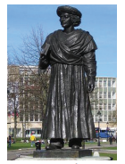

Rammohan Roy was opposed to meaningless religious ceremonies and all forms of pernicious social customs. Yet he wanted to preserve continuity with the past. In his religio–philosophical social outlook, he was deeply influenced by monotheism and anti-idolatry. Based on his interpretation of the Upanishads, he argued that all the ancient texts of the Hindus preached monotheism or worship of one God.

Deeply concerned with the prevailing customs of sati, child marriage, and polygamy he published tracts against them and petitioned the government to legislate against them. He advocated the rights of widows to remarry. He wanted polygamy to end. He appealed to reason and humanity and compassion of the people. His campaign played a key role in forcing the Governor-General William Bentinck’s legislation abolishing sati in 1829.

Rammohan Roy condemned the subjugation of women and opposed the prevailing ideas that women were inferior to men. He strongly advocated education for women. He gave his full support for the introduction of English language and western sciences in schools and colleges.

Rammohan Roy founded the Brahmo Samaj on 20 August 1828. He opened a temple in Calcutta, where there was no image. There he laid down that ‘no religion should be reviled or slightly or contemptuously spoken off or alluded to.’ The Samaj forbade idol-worship and condemned meaningless religious rites and ceremonies. However, from the beginning, the appeal of the Brahmo Samaj remained limited to the intellectuals and enlightened Bengalis. Though the Samaj failed to attract the people from the lower sections of society, its impact on the culture of modern Bengal and its middle class was quite significant.
 

**(b) Maharishi Debendranath Tagore**

After the death of Rammohan Roy (1833), Maharishi Debendranath Tagore (1817–1905), the poet Rabindranath Tagore’s father, carried on the work. He laid down four articles of faith:

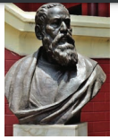

1. In the beginning there was nothing. The one Supreme Being alone existed who created the Universe.

2. He alone is the God of Truth, Infinite Wisdom, Goodness, and Power, eternal, omnipresent, the One without second.

3. Our salvation depends on belief in Him and in His worship in this world and the next.

4. Belief consists in loving Him and doing His will.

**(c ) Keshab Chandra Sen & Brahmo Samaj of India**

Debendranath was a moderate reformer. But his younger colleagues in the Sabha were for rapid changes. The greatest of these, Keshab Chandra Sen, (1838–84) joined the movement in 1857. 

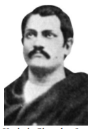

But in 1866 a split occurred in the ranks of Brahmo Samaj. Keshab left the Samaj and founded a new organization. Debendranath’s organization, thereafter, came to be known as Adi Brahmo Samaj. After Keshab had his fourteen-year-old daughter married to an Indian prince, in contravention of the Samaj’s condemnation of child marriages, the opponents of child marriage left the Brahmo Samaj of India and started the Sadharan Samaj.

**(d) Ishwar Chandra Vidyasagar**

Another outstanding reformer in Bengal was Ishwar Chandra Vidyasagar (1820–1891).

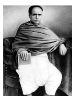

While Ram Mohan Roy and others looked to western rationalist ideas to reform society, Vidyasagar argued that the Hindu scriptures were progressive. He provided evidence from scriptures that there was no sanction for burning of widows or for the prohibition on the remarriage of widows. He wrote a number of polemical tracts, and was the pioneer of modern Bengali prose. He played a leading role in promoting education of girls and helped them in setting up a number of schools. He dedicated his whole life for the betterment of the child widows of the Hindu society. The movement led by Vidyasagar, resulted in the Widows’ Remarriage Reform Act of 1856. This Act was intended to improve the lot of child widows and save them from perpetual widowhood.

>It was also to the credit of Vidyasagar that the first age of consent was included in the Indian Penal code, which was enacted in 1860. The age for marriage was fixed as ten years. It was raised to twelve and thirteen years in 1891 and 1925 respectively. Sadly, as reported in the Age of Consent Committee (1929), the law remained on paper and the knowledge of it was confined to judges, lawyers and a few educated men.

**(e) Prarthana Samaj**

The Maharashtra region was another region where reform activities gained steam. A movement similar to the Brahmo Samaj, but founded in Bombay in 1867, was Prarthana Samaj. Its founder was Dr. Atma Ram Pandurang (1825–1898). The two distinguished members of this Samaj were R.C. Bhandarkar and Justice Mahadev Govind Ranade. They devoted themselves to activities such as inter- caste dining, inter-caste marriage, widow remarriage and improvement of women and depressed classes. Ranade (1842–1901) was the founder of the Widow Marriage Association (1861), the Poona Sarvajanik Sabha (1870) and the Deccan Education Society (1884).

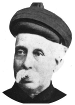 

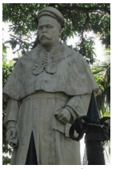

## 5.2 Hindu Revivalism 

**(a) Swami Dayanand Saraswati and Arya Samaj 1875**

In the Punjab, the reform movement was spearheaded by the Arya Samaj. It was founded (1875) by a wandering ascetic in the western Gangetic plain, Swami Dayanand Saraswati (1824–83).

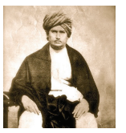

Swami Dayanand later settled in the Punjab to preach his ideas. His book, Satyarthaprakash, enjoyed wide circulation. He declared the practices such as child marriage, the prohibition of widow remarriage, and the alleged polluting effects of foreign travel had no scriptural sanction. The positive principles enunciated by Dayanand were: strict monotheism, condemnation of idolatry, and rejection of Brahman domination of ritual and social practices. He also rejected superstitious beliefs in Hinduism and his cry was “go back to Vedas.”

Arya Samaj attempted to check the incidence of religious conversion in British India. One of its main objectives was counter- conversion, prescribing a purificatory ceremony called suddhi, directed at Hindus who had converted to Islam and Christianity.

The primary achievements of the Arya Samaj were in the field of social reform and spread of education. The Samaj started a number of Dayananda Anglo–Vedic schools and colleges.

**(b) Ramakrishna Paramahamsa**

Ramakrishna (l836–86), a simple priest of Dakshineswar near Kolkata, emphasised the spiritual union with god through ecstatic practices such as singing bhajans. An ardent worshipper of goddess Kali, the sacred mother, he declared that the manifestations of the divine mother were infinite. In his view, all religions contain the universal elements which, if practised, would lead to salvation. He said, “Jiva is Siva” (all living beings are God). Service for man, must be regarded as God.’

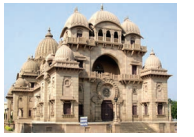

**Ramakrishna Mission**

Ramakrishna’s primary achievement was his ability to attract educated youth who were dissatisfied with the rational orientation of religious reform organizations such as the Brahmo Samaj. After his death in 1886, his disciples organised themselves as a religious community and undertook the task of making his life and teaching known in India and abroad. The chief spirit behind this task was Vivekananda. Following the organizational structure of Christian missionaries, Vivekananda established the Ramakrishna Mission which did not restrict itself to religious activities but was actively involved in social causes such as education, health care and relief in times of calamities.  

**(c) Swami Vivekananda**

Narendra Nath Datta (l863–1902), later known as Swami Vivekananda, was the prime follower of Ramakrishna Paramahamsa. An educated youth, he was drawn to Ramakrishna’s message.

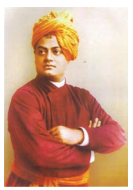

Dissatisfied with conventional philosophical positions and practices, he advocated the practical Vedanta of service to humanity and attacked the tendency to defend every institution simply because it was connected with religion. He emphasized a cultural nationalism and made a call to Indian youth to regenerate Hindu society. His ideas bred a sense of self-confidence among Indians who felt inferior in relation to the materialist achievements of the West. He became famous for his addresses on Hinduism at the 1893 World Congress of Religions in Chicago. Despite his fame, he was condemned by orthodox Hindus for suggesting that the lower castes should be allowed to engage in the Hindu rituals from which they were traditionally excluded. Vivekananda’s activist ideology rekindled the desire for political change among many western-education young Bengalis. Many of the youths who were involved in the militant nationalist struggle during the Swadeshi movement following the Partition of Bengal were inspired by Vivekananda.

**(d) Theosophical Movement**

The Theosophical Society was founded by Madame H.P. Blavatsky (1831–1891) and Colonel H.S Olcott (1832–1907). Founded in the USA in 1875, it later shifted to India at Adyar, Chennai in 1886.

Theosophical Society stimulated a study of the Hindu classics, especially the Upanishads and the Bhagavad Gita. The Theosophical Society also played an important role in the revival of Buddhism in India. Western interest in Hindu scriptures gave educated Hindus great pride in their tradition and culture.

**Contribution of Annie Besant**

In India the movement became further popular with the election of Annie Besant (1847–1933) as its president after the death of Olcott. 

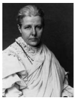

She played a role in Indian nationalist politics, and formed the Home Rule League demanding home rule to India on the lines of Ireland. Annie Besant spread Theosophical ideas through her newspapers called New India and Commonweal.

## 5.3 Anti-Caste Movements (a) Jyotiba Phule

Jyotiba Govindrao Phule was born in 1827 in Maharashtra. He opened the first school for “untouchables” in 1852 in Poona. He launched the Satyashodak Samaj (Truth-Seekers Society) in 1870 to stir the non-Brahman masses to self-respect. Phule opposed child marriage and supported widow remarriage. Jyotiba and his wife Savitribai Phule devoted their lives for the uplift of the depressed classes and women. Jotiba opened orphanages and homes for widows. His work, Gulamgiri (Slavery) is an important text that summarized many of his radical ideas.

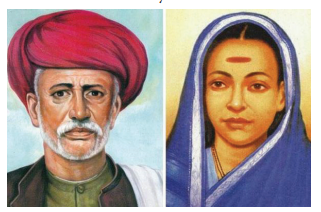

**(b) Narayana Guru**

Born to poor parents in Kerala, Narayana Guru (1854–1928) evolved into a poet and scholar in Malayalam, Tamil and Sanskrit. Disturbed by the terrible caste tyranny, that the lower caste people suffered, he dedicated his whole life for the betterment of the oppressed. 

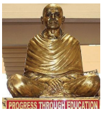

He set up the Sri Narayana Dharma Paripalana Yogam, an organization to work for the uplift of the “depressed classes”. He established a grand temple at Aruvipuram and dedicated it to all. Thinkers and writers such as Kumaran Asan and Dr Palpu were influenced by his ideas and carried forward the movement.

**(c) Ayyankali**

Ayyankali was born in 1863 at Venganoor in Thiruvananthapuram then in the princely state of Travancore. The discrimination he faced as a child turned him into a leader of an anti-caste movement and who later fought for basic rights including access to public spaces and entry to schools.

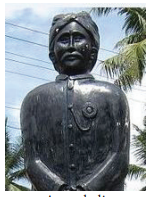

Inspired by Sree Narayana Guru, Ayyankali founded the Sadhu Jana Paripalana Sangam (Association for the Protection of the Poor) in 1907.

## 5.4 Islamic Reforms 

After the suppression of great revolt of 1857 Indian Muslims looked to Western culture with suspicion. The community feared that Western education, Western culture and Western ideas would endanger their religion. Therefore only a small section of Muslims accepted the new avenues for modern education.

**Sir Sayyid Ahmed Khan**

Born in Delhi into a noble Muslim family, Sayyid Ahmed Khan thought that lack

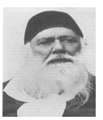

of education, especially modern education, had harmed the Muslims greatly and kept them backward. He exhorted the Muslims to accept Western science and take up government services. He founded a scientific society and translated many English books, especially science books into Urdu. He believed that the interest of the Muslims would be best served if they bonded with the British Government rather than pitch in with the rising nationalist movement. So he advised the Muslims to take to English education and to concentrate on it.

**Aligarh Movement** 

Sayyid Ahmed Khan’s movement, the “Aligarh movement,” is so called because it was centred around the Aligarh Mohammedan Anglo-Oriental college founded by him in 1875, which is a landmark in the history of Indian Muslim education. The college was raised to the status of a university in 1920.

**Deoband Movement** 

Deoband was a revivalist movement organized by the orthodox Muslim Ulema. The Ulema under the leadership of Muhammad QasimWanotavi (1832-80) and Rashid Ahmad Gangotri (1828-1905) founded the school at Deoband in the Saharanpur district of the U.P in 1866. The school curricula shut out English education and western culture. The instruction imparted was in original Islamic religion and the aim was moral and religious regeneration of the Muslim community.

Maulana Mahmud-ul-Hassan became the new Deoband leader. The Jamait-Ul-Ulema (council of theologians) led by him gave a concrete shape to Hassan’s ideas of protection of the religious and political rights of the Muslims in the overall context of Indian unity.

## 5.5 Parsi Reform Movement 

In the middle of the nineteenth century the reform activities began in Mumbai. Furdunji Naoroji founded the Rahnumai Mazdayasnan Sabha (Parsis’ Reform Society) in 1851. Rast Goftar (The Truth Teller) was the main voice of the movement. Behrramji Malabari organized a campaign for legislation against the practice of child marriage. The community produced many leaders such as Pherozeshah Mehta and Dinshaw Wacha who played a big role in the early Congress.

## 5.6 Sikh Reform Movement (Nirankaris and Namdharis)

Among the Sikhs of Punjab too there were attempts to reform. Baba Dayal Das, founder of the Nirankari Movement, stressed the worship of god as Nirankar (formless). Rejection of idols, rejection of rituals associated with idolatry, reverence for the authority of Guru Nanak and of the Adi Granth formed the essence of his teachings. He reiterated the prohibition on meat-eating, and liquor consumption.

The Namdhari Movement, founded by Baba Ram Singh, was another socio-religious movement among the Sikhs. The Namdharis insisted on wearing the symbols of Sikhism except the kirpan (sword). Instead Baba Ram Singh wanted his followers to carry a lathi. It considered both men and women equal and accepted widow remarriage. It prohibited the dowry system and child marriage.

In the wake of the gathering influence of Arya Samaj and the Christian missionaries, the Singh Sabha of Amritsar was established. Its main objective was to restore the purity of Sikhism. With the support of British, it established Khalsa College for the Sikhs in Amritsar. Singh Sabha was a forerunner of Akali Movement.

## 5.7 Social Reformers of Tamilnadu

**(a) Ramalinga Swamigal**

Popularly known as Vallalar, Ramalinga Swamigal or Ramalinga Adigal (1823–1874),was born in Marudhur, a village near Chidambaram. After his father’s death, his family moved to his brother’s house at Chennai. Despite having no formal education he gained immense scholarship. Ramalinga emphasised the bonds of responsibility and compassion between living beings. He expressed the view that ‘those who lack compassion for suffering beings are hard-hearted, their wisdom clouded’. He showed his compassion and mercy on all living beings including plants. This he called jeevakarunya. He established the Samarasa Vedha Sanmarga Sangam in 1865 and it was renamed “Samarasa Suddha Sanmarga Satya Sanga” which means “Society for Pure Truth in Universal self-hood”. Ramalinga also established a free feeding house for everyone irrespective of caste at Vadalur (1867), in the wake of a terrible famine in south India in 1866. His voluminous songs were compiled and published under the title Thiruvarutpa (Songs of Grace).

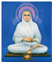

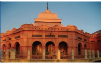

>Ramalinga bore witness to hunger and poverty in the country: “I saw poor people, emaciated with hunger and terribly weary, going to every house, yet their hunger was not removed, and my heart suffered intensely. Those who suffer with relentless disease, I saw them in front of me and my heart trembled. I saw those people, poor and of unmatched honor, their hearts weary, and I grew weak.”  

**b. Iyothee Thassar**

Pandithar Iyothee Thassar (1845–1914) was a radical Tamil scholar, writer, siddha medicine practitioner, journalist and socio- political activist. Born in Chennai, he was fluent in Tamil, English, Sanskrit and Pali languages. He campaigned for social justice and worked for the emancipation of the “untouchables” from the caste clutches. He worked for the construction of a casteless identity and castigated caste hegemony and untouchability. He considered education as an important tool for empowerment and became the driving force behind the establishment of several schools for the “untouchables” in Tamil Nadu.

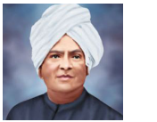

Pandithar Iyothee Thassar founded the Advaidananda Sabha to raise the voice for the temple entry of the “untouchables”. In 1882, John Rathinam and Iyothee Thassar established a movement called, Dravida Kazhagam and launched a magazine called Dravida Pandian in 1885. He founded the Dravida Mahajana Sabha in 1891and organised the First Conference of the association at Nilgiris.

Pandithar Iyothee Thassar was disappointed with the Hindu dharma, which served as the basis for propagating and validating caste in Hindu society. Influenced by the Theosophist organizer, Colonel H.S. Olcott, he went to Sri Lanka in 1898 and converted to Buddhism. In the same year, he founded the Sakya Buddhist Society at Madras to construct the rational religious philosophy through Buddhist religion.

He started a weekly journal, Oru Paisa Tamilan, in 1907 and published it until his demise in 1914.