  

# Introduction

Europeans established their political power over Indian subcontinent in the latter half of the eighteenth century. While they were concerned with annexing India, by the beginning of the nineteenth century they were reordering Indian society. New revenue settlements were made. Influenced by British Utilitarian ideas and evangelicals they also tried to impose their cultural superiority over the Indian people.

This caused a reaction among the Indians. During the nineteenth century, educated Indians from different parts of the country began to feel the humiliation and responded by seeking their socio-cultural identity from their past. However, they understood some merits in the colonial arguments and were ready to reform. It resulted in the social and religious reform movements in modern India. This particular historical development is also identified as the Indian renaissance.

Renaissance is an ideological and cultural phenomenon. It is closely tied to modernity,rationalism and the progressive movement of the society. Critical thinking is at its root. This ideology of humanism stimulated creative energy in all spheres of social life and knowledge such as language, literature, philosophy, music, painting, architecture, etc.

## 10.1 Tamil Renaissance

The cultural hegemony of colonialism and the rise of humanism brought several changes in the socio-cultural life of the Indian subcontinent. Modern Tamil Nadu too experienced such a historical transition. Tamil language and culture played a significant role in their identity construction. The introduction of printing press, linguistic research on Dravidian languages, etc... underpinned the process of Tamil renaissance. Although religious literature was taken up predominantly for publication in the early years after the advent of printing technology, things began to change gradually. Works that can be described as secular were taken up for publishing.
  

**Advent of the Printing Technology**

Tamil was the first non- European language that went into print. As early as in 1578, Tamil book, ThambiranVanakkam, was published from Goa. In 1709, a full-fledged printing press had been established thanks to Ziegenbalg in Tranquebar. 

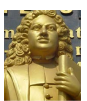

Thirukkural was one of the earliest Tamil literary texts to be published in 1812. This led the resurgence of interest among Tamil scholars in publishing the more ancient Tamil classics around that period.

In the nineteenth century, Tamil scholars like C.W. Damotharanar (1832–1901), and U.V. Swaminathar (1855–1942) spent their lifetime in the rediscovery of the Tamil classics. C. W. Damotharanar collected and edited different palm-leaf manuscripts of the Tamil grammar and literature. His editions included such texts as Tolkappiyam, Viracholiyam, Iraiyanar-Akapporul, IlakkanaVilakkam, Kaliththokai and Chulamani. U.V. Swaminathar, a student of Meenakshisundaranar, took efforts to publish the classical texts such as Civakachinthamani (1887), Paththupattu (1889), Chilapathikaram (1892), Purananuru (1894), Purapporul-Venpa-Malai (1895), Manimekalai (1898), Ainkurunuru (1903) and Pathitrupathu(1904).

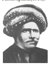

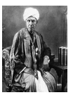

The publication of these ancient literary texts created an awareness among the Tamil people about their historical tradition, language, literature and religion. Modern Tamils founded their social and cultural identity on the ancient Tamil classics, collectively called the Sangam literature.

In 1816, F.W. Ellis (1777–1819) who founded the College of Fort St George, formulated the theory that the south Indian languages belonged to a separate family which was unrelated to the Indo-Aryan family of languages.

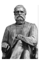

Robert Caldwell (1814–1891) expanded this argument in a book titled, A Comparative Grammar of the Dravidian or South Indian Family of Languages, in 1856. He established the close affinity between the Dravidian languages in contrast with Sanskrit and also established the antiquity of Tamil.

Tamil intellectuals of this period identified the fundamental differences between Tamil/Dravidian/ Egalitarian and Sanskrit/ Aryan/Brahmanism. They argued that Tamil was a language of Dravidian people, who are non-Brahmin and their social life was casteless, gender-sensitised and egalitarian. 

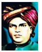

Tamil renaissance contributed to the origin and growth of Dravidian consciousness in the Tamil country. These ideas are exemplified in the Tamil invocation song in the play, Manonmaniam written by P. Sundaranar (1855–1897).

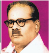

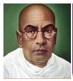

Ramalinga Adigal (1823–1874), popularly known as Vallalar, questioned the existing Hindu religious orthodoxy. Abraham Pandithar (1859–1919) gave prominence to Tamil music and published books on the history of Tamil music. C.W. Damotharanar, U.V. Swaminathar, Thiru Vi. Kaliyanasundaram (1883–1953), Parithimar Kalaignar (1870-1903), Maraimalai Adigal (1876–1950), Subramania Bharathi (1882–1921), S. Vaiyapuri (1891–1956), and the poet Bharatidasan (1891–1964), in their own ways and through their writings, contributed to the revival of Tamil literature. Meanwhile, M. Singaravelar (1860–1946) an early pioneer in Buddhist revival, promoted communism and socialism to counter the colonial power. Pandithar Iyotheethassar (1845–1914) and Periyar E.V. Ramasamy (1879–1973) held high the radical philosophy to defend the rights of the socially underprivileged and marginalised section of the people.

**V.G. Suryanarayana Sastri (Parithimar Kalaignar)**

V.G. Suryanarayana Sastri (1870-1903), born near Madurai, was professor of Tamil at the Madras Christian College. He was one of the earliest scholars to identify the influence of Sanskrit on Tamil, and adopted a pure Tamil name for himself: Parithimar Kalaignar. 

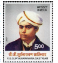

He was the first to argue that Tamil is a classical language, and demanded that the University of Madras should not call Tamil a vernacular language. Influenced by Western literary models, he introduced the sonnet form in Tamil. He also wrote novels and plays, and a number of essays on science. Tragically, he died at the young age of 33.

**Maraimalai Adigal**

Maraimalai Adigal (1876–1950) is considered the father of Tamil linguistic purism and the founder of Tani Tamil Iyakkam (Pure Tamil Movement). He wrote commentaries
 
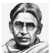

on the Sangam texts, Pattinappalai and Mullaipattu. As a young man, he worked in a journal, Siddhanta Deepika. Later he served as a Tamil teacher in the Madras Christian College for many years. He was inclined towards non- Brahmin movement. His teachers such as P. Sundaranar and Somasundara Nayagar were key influences in his life.

**Tani Tamil Iyakkam (Pure Tamil Movement)**

Maraimalai Adigal promoted the use of pure Tamil words and removal of the Sanskrit influence from the Tamil language. The movement made a great impact on Tamil culture especially in language and literature. His daughter Neelambikai, played an important role in its foundation. He changed his own name Vedachalam and took on the pure Tamil name of Maraimalai Adigal. His journal Jnanasagaram was renamed Arivukkadal and his institution, Samarasa Sanmarga Sangam, was re-christened as Pothu Nilai Kalakam. Neelambikai compiled a dictionary that provided pure Tamil equivalents to Sanskrit words that had crept into Tamil vocabulary.

## 10.2 Rise of the Dravidian Movement

The Dravidian movement emerged as a defence of the non- Brahmins against the Brahmin dominance. An organisation called The Madras Non- Brahmin Association was founded in 1909 to help the non- Brahmin students. In 1912 C. Natesanar, a medical doctor, founded the Madras United League, later renamed

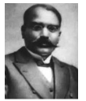

as Madras Dravidian Association to support Dravidian uplift. The organisation focused on educating and supporting non-Brahmin graduates and conducting regular meetings to share their grievances. Meanwhile, Natesanar founded a hostel, the Dravidian Home, at Triplicane (Madras) in July 1916 to address the lack of hostels for the non-Brahmin students which hindered their educational development. In addition, the home had a literary society for the benefit of non-Brahmin students.

## 10.3 South Indian Liberal Federation (Justice Party)

On 20 November 1916 around 30 prominent non-Brahmin leaders including Dr. C. Natesanar, Sir Pitti Theyagarayar, T.M. Nair and Alamelu Mangai Thayarammal came together to form the South Indian Liberation Federation (SILF). In the meantime, at a meeting held in the Victoria Public Hall the Non-Brahmin Manifesto was released in December 1916. The manifesto articulated the voice of the non-Brahmin communities.

The association started publishing three newspapers: Dravidian in Tamil, Justice in English and Andhra Prakasika in Telugu, to propagate the ideals of the Party.

The first election, under the Montagu- Chelmsford Reforms, was held in 1920 after the introduction of the Dyarchy form of government in the provinces. The Justice Party won the election and formed the first-ever Indian cabinet in Madras. A. Subbarayalu became the Chief Minister of the Madras Presidency and the party formed the government during 1920–1923 and 1923–1926. In the context of

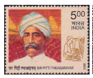

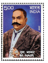  

Congress Party boycotting the legislature, the Justice Party continued to remain in office till 1937 elections were held. In the 1937 elections the Indian National Congress contested the elections for the first time and trounced the Justice Party.

**Programmes and Activities**

The Justice Party is the fountain head of the non-Brahmin Movement in the country. The Justice Party government widened education and employment opportunities for the majority of the population and created space for them in the political sphere.

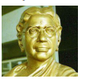

The Justicites removed the legal hindrances restricting inter-caste marriages and broke the barriers that prevented Depressed Classes from the use of public wells and tanks. The Justice Party government ordered that public schools accommodate the children of the Depressed Classes. Hostels were established for the students belonging to this social group in 1923. In the meantime, the Madras legislature under the Justice Party government was the first to approve participation of women in the electoral politics in 1921. This resolution created space for woman and thus facilitated Muthulakshmi Ammaiyar to become the first woman legislator in India in 1926.

The Justice Party worked towards legislating provisions for communal representation – reservations for various communities. Two Communal Government Orders (16 September 1921 and 15 August 1922) were passed to ensure equitable distribution in appointments among various castes and communities as a part of achieving social justice. The Justice Party rule established the Staff Selection Board in 1924 for the selection of government officials and encouraged all the communities to share the administrative powers. In 1929, the Government of British India adopted the pattern and established the Public Service Commission.

The Justice Party further concentrated on reforms in religious institutions. The Justice Party introduced the Hindu Religious Endowment (HRE) Act in 1926 and enabled any individual, irrespective of their caste affiliation, to become a member of the temple committee and govern the resources of the religious institutions.

## 10.4 Self-Respect Movement (Suyamariyathai Iyakkam)

The Self-Respect movement advocated a casteless society devoid of rituals and differences based on birth. The movement declared rationality and self-respect as the birthright of all human beings and held these as more important than self-rule. The movement declared illiteracy as a source for women’s subordination and promoted compulsory elementary education for all.

The movement demanded women’s emancipation, deplored superstitions, and emphasised rationality. The movement also advocated self-respect marriage.

The Self-Respect Movement championed not only the cause of the non-Brahmin Hindus, but also that of the Muslims. The Self-Respect Movement extolled the lofty principles of Islam such as equality and brotherhood.

**Periyar E.V.R.**

Periyar E.V. Ramasamy (1879–1973) was the founder of the Self-Respect Movement. He was the son of a wealthy businessman in Erode, Venkatappa and Chinna Thayammal. Though possessing little formal education, he engaged in critical discussions with scholars, who used to be patronised by his devout father. As a young man, he once ran away from home and spent many months

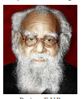  

in Varanasi and other religious centres. The firsthand experience of orthodox Hindu religion led to his disillusionment with religion. On his return, he took care of his family business for some years. His selfless public service and forthrightness made him a popular personality. He held different official positions of Erode that included the Chairmanship of Municipal Council (1918– 1919).

As president of the Tamil Nadu Congress Committee, Periyar proposed a resolution regarding the rights of “Untouchables” to temple entry. In the name of “caste dharma” the “lower caste” people were denied access to the temples and the streets surrounding the temple. In Vaikom (a town in the then Princely State of Travancore and in present day Kerala), people protested against this practice. In the initial stages George Joseph of Madurai played big role. After the local leaders were arrested Periyar led the movement and was imprisoned. People hailed him as Vaikom Virar (Hero of Vaikom). In the meantime, he was disturbed by the caste-based discrimination in the dining hall at the Cheranmadevi Gurukulam (school), which was run by V.V.Subramaniam (a Congress leader) with the financial support of the Tamil Nadu Congress Committee. Periyar was disappointed when, despite his objections and protests against this discrimination, the Congress continued to support the iniquitous practice in the Gurukulam.

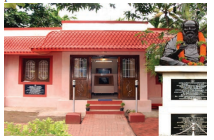

Periyar started the Self-Respect movement in 1925. Periyar understood the relevance of mass communication in spreading rationalist thought. He started a number of newspapers and journals such as Kudi Arasu (Democracy) (1925), Revolt (), Puratchi (Revolution) (1933), Paguththarivu (Rationalism) (1934), and Viduthalai (Liberation) (1935). Kudi Arasu was the official newspaper of the Self-Respect Movement. Usually, Periyar wrote a column and expressed his opinion on social issues in each of its issues. He frequently wrote columns under the pseudonym of Chitraputtiran.

Periyar had a close relationship with Singaravelar who is considered the first communist of south India and a pioneer of Buddhism. In 1936, Periyar got Dr. B. R. Ambedkar’s Annihilation of Caste translated into Tamil immediately after it was written. He also supported Ambedkar’s demand for separate electorates for scheduled castes.

In 1937, in opposition to the Rajaji’s government’s move to introduce compulsory Hindi in schools, he launched a popular movement to oppose it. The anti-Hindi agitation (1937–39) had a big impact on Tamilnadu’s politics. Periyar was imprisoned for his role in the movement. When he was still in jail, Periyar was elected the president of the Justice Party. Thereafter the Justice Party merged with the Self-Respect Movement. It was rechristened as Dravidar Kazhagam (DK) in 1944.

Rajaji, the Chief Minister of Madras State (1952–54), introduced a vocational education programme that encouraged imparting school children with training in tune with their father’s occupation. Periyar criticised it as Kula Kalvi Thittam (caste-based education scheme) and opposed it tooth and nail. His campaigns against it led to the resignation of Rajaji. K. Kamaraj became Chief Minister of the Madras State. Periyar died at the age of ninety four (1973). His mortal remains were buried at Periyar Thidal, Madras.

**Periyar, a Feminist**

Periyar was critical of patriarchy. He condemned child-marriage and the devadasi   system (institution of temple girls). Right from 1929, when the Self-respect Conferences began to voice its concern over the plight of women, Periyar had been emphasising women’s right to divorce and property. Periyar objected to terms like “giving in marriage”. This, he said, treats woman as a thing. He wants it substituted by “valkaithunai,”(companion) a word for marriage taken from the Tirukkural. Peiyar’s most important work on this subject is Why the Woman is Enslaved?

Periyar believed that property rights for women would provide them a social status and protection.

In 1989, Government of Tamil Nadu fulfilled the dream of radical reformers by the introduction of the Hindu Succession Tamil Nadu Amendment Act of 1989, which ensured the equal rights to ancestral property for women in inheritance. This Act became a trendsetter and led to similar legislation at the national level.

**Rettaimalai Srinivasan**

Rettaimalai Srinivasan (1859–1945), was born in 1859 at Kanchipuram. He fought for social justice, equality and civil rights of the marginalised in the caste order. He was honoured with such titles as Rao Sahib (1926), Rao Bahadur (1930) and Divan Bahadur (1936) for his selfless social services. His autobiography, Jeeviya Saritha Surukkam (A Brief Autobiography), published in 1939, is one of the earliest autobiographies.

Rettaimalai Srinivasan who had experienced the horrors of untouchability worked for the progress of the deprived castes. He founded the Adi Dravida Mahajana Sabha in 1893. He served as president of the Scheduled Castes’ Federation and the Madras Provincial Depressed Classes’ Federation.

A close associate of Dr B.R. Ambedkar, he participated in the first and second Round Table Conferences held in London (1930 and 1931) and voiced the opinions of the marginalised sections of the society. He was a signatory to the Poona Pact of 1932.

**M.C. Rajah**

Mylai Chinnathambi Raja (1883–1943), popularly known as M.C. Rajah, was one of the prominent leaders from the “depressed class”. Rajah started his career as a teacher and wrote different textbooks for schools and colleges. He was one of the founding members of the South Indian Liberal Federation (Justice Party). 

He became the first elected Legislative Council Member (1920–26) from the depressed classes in Madras province. He functioned as the Deputy Leader of Justice Party in the Madras Legislative Council.

In 1928, he founded the All India Depressed Classes Association and was its long time leader.

## 10.5 Labour Movements in Tamil Nadu

The First World War (1914–18) provided stimulus to industrial growth in India. These industries, catering to war time needs, had employed a huge number of workers. At the end of the War there were retrenchments across the industries, as the war time requirements receded. Combined with high prices, this gave a momentum to the labour movement. B.P. Wadia, M. Singaravelar, Thiru. Vi. Kalyanasundaram and others initiated the formation of labour unions in the Madras Presidency. In 1918, India’s first organised trade union, the Madras Labour Union, was formed.
 

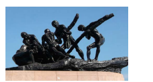

The first All India Trade Union Conference (AITUC) was held on 31 October 1920 in Bombay. The delegates discussed several resolutions. These included a demand for protection from police interference in labour disputes, the maintenance of an unemployment register, restriction on exporting foodstuffs, compensation for injuries, and health insurance.

M. Singaravelar (1860–1946), was a pioneer in the labour movement activities in the Madras presidency. He was born in Madras and graduated from the Presidency College, University of Madras. He advocated Buddhism in his early life. He knew many languages, including Tamil, English, Urdu, Hindi, German, French and Russian and wrote about the ideas of Karl Marx, Charles Darwin, Herbert Spencer and Albert Einstein in Tamil. 

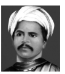

He organised the first ever celebration of May Day in 1923. He was one of the early leaders of the Communist Party of India. He published a Tamil newspaper, Thozhilalan (Worker) to address the problems of the working class. He was closely associated with Periyar and the Self-Respect Movement.

## 10.6 Language Agitation before Indian Independence

In general, language is a dominant symbol of identity and it is associated with culture and sentiments of any society. Tamil regained its prominence in the latter half of the nineteenth and early twentieth century. Maraimalai Adigal’s Pure Tamil Movement, the language reforms of Periyar and Tamil Isai Movement helped to galvanise the Tamil language. Tamil renaissance that led the Dravidian consciousness made a great intervention in the development of modern Tamil language and its art forms. Agamic temples did not permit rituals in Tamil. Tamil songs had a marginal place in musical concerts. Abraham Pandithar systematically studied the history of Tamil music and attempted to reconstruct the ancient Tamil musical system. He founded the Tanjore Sangitha Vidya Mahajana Sangam in 1912 and it became the kernel of the Tamil Isai Movement (Tamil Music Movement). The movement gave importance to the singing of Tamil compositions in music concerts. The first Tamil Isai Conference was held in 1943, to discuss the status of Tamil music.

The implementation of Hindi as a compulsory language in Tamil Nadu, at various points of time, was seen as a threat to Tamil language and culture. Periyar declared that the introduction of Hindi over Tamil would deny the Dravidians of their job opportunities. Maraimalai Adigal pointed out that the Tamil language would suffer with the introduction of Hindi. The anti-Hindi campaigners considered it an ideological battle against Brahminism and the hegemony of Sanskrit over Tamil.

## 10.7 Women’s Movements 

There were several streams of women’s movements and organisations established in the early twentieth century to address the question of women empowerment in Madras Presidency. Women’s India Association (WIA) and All India Women’s Conference (AIWC) are the important among them in Tamil Nadu. WIA was started in 1917 by Annie Besant, Dorothy Jinarajadasa and Margaret Cousins at Adyar, Madras. The Association published pamphlets and bulletins in different languages to detail the problems of personal hygiene, marriage laws, voting rights, child care and women’s role in the public. In the meantime, WIA formed the All India Women’s Conference (AIWC) in 1927 to address the problem of women’s education and recommended that the government implement various policies for the uplift of women.

Women’s liberation was one of the important objectives of the Self- Respect Movement. Self- respecters led by Periyar E.V.R. worked for gender equality and gender sensitisation of the society. The movement provided a space for women to share their ideas. There were several women activists in the movement. Muthulakshmi Ammaiyar, Nagammai, Kannamma, Nilavathi, Muvalur Ramamirtham, Rukmani Ammal, Alarmelmangai Thayammal, Nilambikai, and Sivakami Chidambaranar are prominent among them.

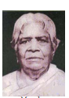

There was a custom of dedicating young girls to the Hindu temples as a servant of God, known as devadasi. Though intended as a service to god it soon got corrupted leading to extensive immorality and abuse of the women. Dr. Muthulakshmi Ammaiyar, was in the forefront of the campaign pressing for a legislation to abolish this devadasi system. The Madras Devadasis (Prevention of Dedication) Act 1947 was enacted by the government.