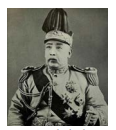
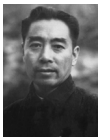
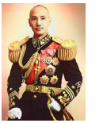
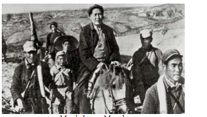
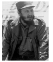
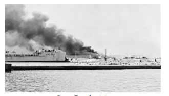
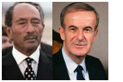
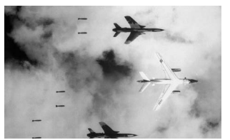
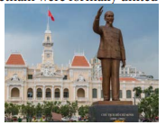
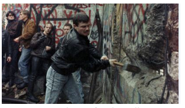

  

# Introduction 

In the aftermath of Second World War a new era began. It was the beginning of the decline of European colonial empires and the independence of colonies in Asia and Africa. If the effects of World War I led to the communist revolution of Russia, the Second World War played a big part in the communist revolution in China. The emergence of the US and the USSR as super powers resulted in the division of the world into two antagonistic blocs. A cold war situation triggered deadly conflicts in Korea, Cuba, Vietnam and West Asia.

Under the Marshall Plan for reconstruction of the war-ravaged Europe, the US won the trust of the great powers in Europe. Soviet Russia, by demonstrating solidarity with the liberation struggles of countries in Asia and Africa, earned the goodwill of the latter.

The Non-Aligned Movement played a limited role in containing the conflict between the two power blocs. In a bid to wriggle out of US control, European countries started the European movement in the form of Council of Europe. This developed into the European Common Market and finally into what is today the European Union. The Cold War period ended with the fall of Berlin Wall.

## 4.1 Chinese Revolution

**(a) China in the Pre-War Period**

In its long history, Chinese civilization was more advanced than that of Europe. But by the end of the nineteenth century, its progress had halted. The Manchus, the ruling dynasty, had governed China since about 1650. The entire administration system was in the hands of a bureaucracy of scholar-officials called mandarins who came from the landed gentry. The mass of peasant population was poverty- stricken, and suffered from high rents, high taxes, and shortage of land. There was very little industry, though some railways and engineering works had been built.
  

Discontent with the political and economic system resulted in a number of peasant uprisings. The Taiping Rebellion (1850–64) was a major rebellion. In the two opium wars of 1832 and 1848, China was defeated and was compelled to open its ports to western powers. The opening of China to western imperialism led to economic exploitation and the impoverishment of the Chinese people.

The European presence produced a profound hatred of foreigners. This combined with military defeat, led to more pressing demands for reforms from the Western- educated intellectuals. In 1898, the young Emperor, initiated a series of reforms known as the Hundred Days of Reform. But these reforms aroused tremendous opposition from the powerful conservatives and the Dowager-Empress Tzú Hsi. She imprisoned the Emperor and reversed the reforms.

**(b) The Chinese Revolution 1911**

The disintegration of the Manchu dynasty began with the death of the Dowager-Empress in 1908. The new emperor was two-years old and the provincial governors began to assert their independence. In October 1911 the local army mutinied and the revolt spread. Provincial governors removed the Manchu garrisons

>**Dr. Sun Yat-sen (1866–1925)**
Born in a poor family near Canton, Dr. Sun Yat- sen, the father of modern china was educated in a mission school and became a Christian. He was then trained as a doctor of medicine in Hong Kong. Evincing interest in politics he took part in a rising against the Manchus in 1895. In 1905 he founded in Tokyo the political party which in 1912 became the Kuomintang or the National People’s Party. Dr. Sun Yat-sen’s three principles were Nationalism, Democracy, and People’s livelihood with Socialism as the ultimate object.  

and proclaimed their independence. Already there were a few middle-class leaders. Dr. Sun Yat-sen was one among them. On hearing the news of the rising in a newspaper in the United States Sun Yat-sen arrived in Shanghai and was immediately elected provisional president of the new Chinese Republic.

**(c) Yuan Shih-kai and After**

The unity of China under Yuan Shih-kai lasted for four years. On his death in 1916 a new President was appointed for the next twelve years but the government was central only in name.

**(d) Communist Party of China**

With the Revolution and the breakup of the old society, Confucian thought was generally side-lined and after the Russian Revolution of 1917, the ideas of Marx and Lenin became popular among intellectuals. In 1918 a Society for the Study of Marxism was formed in Peking University. Among the students who attended was **Mao Tse-tung.**

>**Mao Tse-tung (1893–1976)**
Mao was born in Hunan in south-east China. His father was a wealthy peasant, and a firm supporter of the Manchus.Mao, who was very fond of reading, soon showed his ability and entered the Junior College at Changsha. This was the year (1911) when the Revolution had broken out in China. Mao joined the revolutionary army but soon left and enrolled in the Teachers’ Training College in Changsha. In the following year Mao began his full- fledged political activities of Hunan and emerged as a staunch Communist.

**Kuomintang and Chiang Kai Shek**

After the death of Sun Yat Sen the leader of the Kuomintang was Chiang Kai-shek. While the Communist Party was under Mao Tse Tung and Chou En Lai. 

As an avowed critic of Communists, Chiang removed all of them from important positions in the party. The communists increased their influence among the workers and peasants and obtained recruits for their army. The Kuomintang represented the interests of the landlords and capitalists.

In 1928 he was successful in capturing Peking. Once again there was a central government in China.

**Mao as Organizer of Peasants**

Mao had understood that the Kuomintang grip on the towns was very strong. So he concentrated his energies on organizing the peasantry. A few hundred Communists led by Mao retreated into the wild mountains. Here they stayed for the next seven years. As the army of Mao was gradually growing, the Kuomintang was unable to penetrate the mountains. The campaign against the communists was distracted as Chiang Kai-shek had to deal with the constant threat from Japan and also the attacks from war lords.

**The Long March 1934**

As Chiang Kai-shek had built a circle of fortified posts around the communist positions, Mao wanted to move out of Hunan for safer territory. By 1933 Mao had gained full control of the Chinese Communist party. In 1934, the Communist army of about 100,000 set out on the Long March. This march has become legendary. Of the 100000 who set out, only 20,000 finally reached northern Sheni late in 1935, after crossing nearly 6000 miles. They were soon joined by other communist armies. By 1937 Mao had become the leader of over 10 million people.

**Japanese Aggression**

Japan continued to occupy north Chinese provinces while developing Manchuria as a military base. Mao believed that Chiang Kai- shek was necessary for some time to hold together Kuomintang to fight the Japanese. As a consequence of this pragmatic policy, the attacks on the communists gradually stopped.

**Communist Victory**

With the surrender of the Japanese (1945), both the Kuomintang and the communists sought to occupy the Japanese areas. In this race the Kuomintang was successful. The cities and railways soon fell into their hands. Even the area around Peking was soon controlled by Chiang Kai-shek’s forces, largely because of the military aid given by the USA.

With the massive support provided by the USA Kuomintang government controlled the administration, ports and communication system. But the soldiers, mainly drawn from the peasants, were disillusioned and discontented. Mao was keen on obtaining the support of the middle class. So he declared that what the communists wanted was the rule of the people, not the dictatorship of the proletariat; the end of exploitation, not absolute equality.

**National People’s Congress**

In September 1949, before fighting had ended in the south of China, the people’s Political Consultative Conference met in Peking. Consisting of over 650 delegates from the Communist Party and other left-wing organizations, the conference elected the Central Governing Council with Mao as its Chairman.

The establishment of the People’s Republic of China under the leadership of Mao Tse Tung was a world-shaking event. There were now two mighty Communist powers in the world —the Soviet Union and People’s Republic of China.

**Denial of UNO Membership**

The United-States refused to recognize the People’s Republic of China for more than two decades.

## 4.2 Cold War: Rivalry between the US and the Soviet Union

**1. Truman’s Policy of Containment of Communism**

In 1948 the Soviets had established socialist governments in the countries of eastern Europe that had been liberated from the Nazis by the Soviet Army.

Truman, the president of USA, pursued a policy of containment of communism. The Soviets were however determined not only to maintain control of eastern Europe, but also keen on spreading Communism world-wide.

>**Cold War: The rivalry that developed after** World War II between the US and the USSR and their respective allies created tension which is referred to as Cold War. They did not take recourse to weapons. Instead they waged war on political, economic and ideological fronts.

**2. Marshall Plan**

The US conceived the Marshall Plan to bring the countries in western Europe under its influence. The plan sought to help the countries of Europe with American dollars to facilitate their early recovery from the destruction caused by the Second World War.

>The United States was much concerned that poverty, unemployment, and dislocation caused by the post-World War II period were increasing the appeal of communist parties in western Europe. The Secretary of State,George C. Marshall, advanced the idea of a European self-help programme to be financed by the United States. Sixteen nations, became part of this programme. Administrative and technical assistance was offered through the Economic Cooperation Administration (ECA) of the United States. Marshall Plan funding ended in 1951.

## 4.3 Formation of Military Alliances

**(a) NATO**

The United States and its European allies formed the North Atlantic Treaty Organization (NATO) to resist Soviet aggression in Europe (1949). It was an inter-state military alliance between the countries of North America and Europe. The major member countries included Canada, Belgium, Denmark, France, Iceland, Italy, Luxemburg, the Netherlands, Norway, Portugal and the United Kingdom. Later Greece and Turkey joined the organization (1952). Germany joined the NATO in 1955. The chief objective of NATO was the peace and security in the North Atlantic region.

**(b) SEATO or Manila Pact (1954)**

The Southeast Asia Treaty Organization (SEATO) was organized for the collective security of countries in Southeast Asia. Following the signing of the Manila Pact (1954) by the US, France, England, New Zealand, Australia, the Philippines, Thailand and Pakistan. Member countries of SEATO were committed to prevent communism from gaining ground in the region. Unlike the NATO alliance, SEATO had no joint commands with standing forces.

**(c) Warsaw Pact**

As a counter to the NATO, Soviet Union organized the Soviet-bloc countries for a united military action, under the Warsaw Pact. In December 1954, a conference of eight European nations namely, Albania, Bulgaria, Hungary, Czechoslovakia, East Germany, Poland, Romania and Russia took place in Moscow. They concluded the treaty on May 14, 1955. This is known as the Warsaw pact. A joint command of armed forces of the member countries with its headquarters in Moscow was setup. The Warsaw Pact was dissolved in 1991 following the break-up of USSR.

**(d) CENTO or the Baghdad Pact**

In 1955 Turkey, Iraq, Great Britain, Pakistan and Iran signed a pact known as Baghdad Pact. In 1958 the United States joined the organisation and thereafter it came to be known as the Central Treaty Organization. This treaty was open to any Arab nation desiring peace and security in the region. CENTO was dissolved in 1979.

## 4.4 Korean War 
The Korean War made the Cold War really hot. Since Korea was partitioned as North and South (1945), each side sought to win legitimacy by unifying the country. The President of North Korea Kim II (People’s Republic of Korea) decided to act before his southern rival, Syngman Rhee (the Republic of Korea), got the chance. He launched an attack in June 1950, with the tacit support of Stalin. Both Kim and Stalin did not expect the US to intervene. The war lasted for three years. The human cost was enormous. But the Korean people gained nothing.

**Third World Countries**

The capitalist countries led by the U.S. were politically designated as the First World, while the communist states led by the Soviet Union came to be known as the Second world. States outside these two were called Third World.

## 4.5 Non-Aligned Movement 

The Non-Alignment Movement (NAM) emerged in the wake of decolonization that followed World War II. At the Bandung (a city in Indonesia) conference (1955), the newly independent countries of Asia and Africa gave a call for abstaining from allying with any of the two Super Powers. It also pledged to fight all forms of colonialism and imperialism.

The NAM held its first conference at Belgrade in 1961 under the leadership of Tito (Yugoslavia), Nasser (Egypt), Nehru (India), Nkrumah (Ghana) and Sukarno (Indonesia). The basic principles of non-alignment, as listed in the statement issued at the Belgrade (a Serbian city, then part of Yugoslavia) Conference, were: peaceful co-existence, commitment to peace and security, no military alliance with any super power, no permission for any super power to build its military base in its territories. With the collapse of Soviet Union, the idea of non- alignment lost relevance.

**4.6 The Cuban Revolution** 
The United States had its satellite states in Central America (Honduras, El Salvador, Nicaragua, Panama and Guatemala), the Caribbean (Cuba, the Dominion Republic and Haiti) and east Asia (the Philippines, South Korea, South Vietnam and Thailand). These states were

governed by ruling groups made up of military personnel, landed gentry and occasionally of local capitalists.

After Castro took power, the US-owned oil refineries on the island refused to process Russian oil. Castro nationalized them. The US retaliated by ending the arrangement by which it bought the bulk of Cuba’s sugar. Castro nationalized the US-owned sugar companies. and ended the US monopolies in electricity and telephones. All these gravely threatened American economic interests.

**Cuban Missile Crisis**

In April 1961, while landing an army of Cuban exiles on the island of Bay of Pigs, the US bombed Cuban airfields with the objective of overthrowing Castro’s regime. US warships surrounded Cuba. The Kennedy government had received intelligence that the USSR was secretly installing nuclear missiles in Cuba. Finally, the Soviet President Khrushchev agreed to withdraw the missiles and thus the Missile Crisis was defused.

Eventually the two sides reached an agreement. The Soviet Union removed the missiles from Cuba on an understanding that the US would never invade Cuba again.

## 4.7 Arab-Israeli War 

The Treaty of Versailles (1919) had provided for mandates in Turkish Arab Empire. France was given the mandate for Syria and Lebanon, and Britain for Iraq, Palestine and Jordan. This arrangement upset the Arabs since they had expected independence at the end of World War I. Britain’s promise to Zionist leaders that it would allocate one of the Arab lands, Palestine, to Jewish settlers from Europe further embittered the Arabs. There was growing Arab antagonism towards Zionist settlers, as they bought land from rich Arabs and evicted the local peasant families who had been cultivating it for centuries.

At the end of October 1945, the Jewish underground organizations like Irgun Zvai Leumi (Zionist Para-military Organization) and the Stern Gang (Zionist Terrorist Organization) began to launch terror attacks on a large scale. Railways, bridges, airfields and government offices were blown up. The British government, presented the dispute to the UN for a decision.

Succumbing to the pressure of great powers, the UN resolved to partition the British mandate of Palestine into a Jewish state and an Arab state (29 November 1947). Clashes broke out almost immediately between Jews and Arabs in Palestine.

>**Zionist Movement:** In Palestine, the ancient home of Jews, only a few thousand Jews were living in 1900. Some 15 million were scattered around Europe and North America. (This is referred to as the Diaspora.) In 1896 Thodore Herzel, a Viennese journalist, published a pamphlet called The Jewish State in which he called for the creation of a Jewish national home. Next year (1897) the World Zionist Organisation was founded.

The Israelis, won control of the main road to Jerusalem and successfully repulsed repeated Arab attacks. As a result of separate armistice agreements (1947 Feb-June) between Israel and each of the Arab states, a temporary frontier was fixed between Israel and its neighbours. In Israel, the war is remembered as its War of Independence. In the Arab world, it is treated as the Nakbah (“Catastrophe”) as a large number of Arabs became refugees. Israel was admitted into the UN immediately much against the wishes of Arabs.

**Suez Canal Crisis (1956)**

In Egypt, in a coup in 1952, Colonel Nasser became its President. In 1956 he nationalized the Suez Canal, which undermined British interests. With the failure of diplomacy, Britain and France decided to use force. Israel saw this as an opportunity to open the Gulf of Aqaba to Israeli shipping and put a stop to Egyptian border raids. On 29 October Israeli forces invaded Egypt. Britain used this opportunity to demand that its troops be allowed to occupy the canal zone to protect the canal. Egypt refused and on 31 October Britain and France bombed Egyptian airfields and other installations as well as the Suez Canal area. However, under pressure of world opinion, Britain and France ended hostilities on 6 November. India represented by Nehru played a crucial role in resolving the crisis.

**Arab–Israeli War 1967** 

Ever since the formation of the Palestinian Liberation Organization (PLO), Israel came to be attacked frequently by Palestinian guerrilla groups based in Syria, Lebanon and Jordan. Israeli resorted to violent reprisals. In November 1966 an Israeli strike on the village of Al-Samū in the Jordanian West Bank, left 18 dead and 54 wounded. Israel’s air battle with Syria in April 1967 ended in the shooting down six Syrian MiG fighter jets. In his bid to demonstrate Egypt’s support for Syria Nasser mobilized Egyptian forces in the Sinai, seeking the removal of UN emergency forces stationed there on May 18. On May 22 he closed the Gulf of Aqaba to Israeli shipping. King Hussein of Jordan signed a mutual defence pact with

>**Palestine Liberation Organization (PLO)**\- It is an umbrella political organization representing the world’s Palestinians – all Arabs and their descendants who lived in mandated Palestine before the creation of the State of Israel in 1948. It was formed in 1964 to federate various Palestinian groups that previously had operated as clandestine resistance movements. Yasser Arafat was its most prominent leader.  

Egypt. Accordingly, it was decided to place Jordanian forces under Egyptian command. Soon, Iraq too joined the alliance.

**Israel’s Offensive**

Following the mobilization of Arab states by Nasser, on June 5, Israel staged a sudden pre-emptive air strike that destroyed more than 90 percent of Egypt’s air force on the tarmac. A similar air assault incapacitated the Syrian air force. Within three days the Israelis had achieved an overwhelming victory on the ground, capturing the Gaza Strip and all of the Sinai Peninsula up to the east bank of the Suez Canal.

>**Yasser Arafat (1924–2004)**
In 1969, Yasser Arafat became chairman of the PLO’s executive committee a position he held until his death in 2004. Yasser Arafat was appointed commander-in-chief of the all Palestinian Arab guerilla forces in September 1970. Wearing a disguised pistol and carrying an olive branch and dressed in a military uniform, his appearance raised world awareness of the Palestinian cause. Arafat was elected by the central council of the PLO as the first president of the state of Palestine on April 2, 1989.

**Arab–Israeli War 1973**

Egypt and Syria under Presidents Anwar Sadat and Hafez al- Assad respectively concluded a secret agreement in January 1973 to bring their armies under one command. Sadat offered the Israelis a peace deal, if they withdrew from Sinai. Israel rejected the offer. Egypt and Syria launched a sudden and surprise attack on the Yom Kippur

religious holiday (6 October 1973). Though Israel suffered heavy casualties it finally pushed back the Arab forces. Arabs gained nothing out of this war too. By way of mediation the USsucceeded in asserting its hegemony over the region and its oil.

## 4.8 Vietnam War

By the end of Second World War Viet Minh controlled the northern half of Vietnam. Viet Minh formed a government led by Ho Chi Minh in Hanoi. This Viet Minh government quickly occupied the southern half of Vietnam. However, the Allied Powers decided at Potsdam that the British in the south and the Chinese in the north should defend Indo-China from the Japanese. But Ho Chi Minh had established his control very firmly and so, early in 1946, the British and Chinese troops had to withdraw, leaving the French and Viet Minh to confront each other. In March the two governments (French and Viet Minh) reached an agreement by which North Vietnam was to be a free state, within an Indo-Chinese Federation.

In 1949 the French attempted to secure the support of the population by declaring Vietnam, Laos and Cambodia independent within the French Union, retaining only foreign affairs and defence under French control.

While the French were receiving considerable financial aid from America, the Viet Minh were helped by the new Chinese communist government. The French troops were eventually defeated. The Geneva Conference (1954) that met on Korea and Indo China decided that Vietnam was to be an independent state but temporarily divided; the Viet Minh to control the north and Bao Dai to head the government the south. Cambodia and Laos were to be independent.

With a population of 16 million North Vietnam became a Communist state with Ho Chi Minh as President. South Vietnam, approximately of the same size and population, was ruled by Ngo Dinh Diem.  

The government’s survival in South Vietnam depended on increasing amounts of US support. In 1965 marines landed at Danang naval base, and there were 33,500 US troops in the country within a month. The number increased and there were 210,000 by the end of year. The US bombed both North and South in the hope that it could force the liberation forces to abandon the struggle. The fighters of North Vietnam, trained in guerilla warfare, had grown out of spontaneous struggles against a repressive regime. They sustained their resistance without bowing to the US. The American troops also used bacteriological weapons. Incendiary bombs such as napalm and Agent Orange (to defoliate the forest cover) were used. Vast areas of Vietnam were devastated and hundreds of thousands of people killed. The American forces too suffered heavy casualties.

Early in 1975, the war took a decisive turn. The armies of North Vietnam and of the National Liberation Front of South Vietnam swept across the country routing the American supported troops of South Vietnam. By 30 April 1975, all the American troops had withdrawn and the capital of South Vietnam, Saigon, was liberated. North and South Vietnam were formally united as one country in 1976. The city of Saigon was renamed as Ho Chi- Minh City after the great leader of the Vietnamese people.

The emergence of Vietnam as a united and independent nation was an historic event. A small country had succeeded in winning independence and unification in the face of the armed opposition of the greatest power in the world. The help given to Vietnam by the socialist countries, the political support extended by a large number of Asian and African countries, and the solidarity expressed by the peoples in all parts of the world, helped in achieving this.

## 4.9 Towards European Union 

**(a) Council of Europe**

One of the momentous decisions taken in the post-War II era was to integrate the states of Western Europe. In doing so the Europeans wanted (1) to prevent further European wars by ending the rivalry between France and Germany. (2) to create a united Europe to resist any threat from Soviet Russia. (3) to form a third force in the world to counter-balance the strength of the US and USSR. (4) to make full use of the economic and military resources of Europe by organizing them on a continental scale. In May 1949 ten countries met in London and signed to form a Council of Europe. The Council of Europe with headquarters at Strasbourg was established with a committee of foreign ministers of member countries and a Consultative Assembly, drawn from the parliaments of foreign countries.

**(b) European Coal and Steel Community (ECSC)**

The European Defence Community (EDC) and the European Coal and Steel Community (ECSC) were established. Six countries (France, West Germany, Italy, Belgium, Holland and Luxemburg belonging to ECSC signed the treaty of Rome which established the European Economic Community (EEC) or the European Common Market, with headquarters at Brussels.

**(c) European Economic Community (EEC)**

The EEC eliminated barriers to the movement of goods, services, capital, and labour. It also prohibited public policies or private agreements that restricted market competition. A common agricultural policy (CAP) and a common external trade policy were evolved. European Common market was a remarkable success.

**(d) Single European Act (SEA)**

The Single European Act came into force on July 1, 1987. It significantly expanded the EEC’s scope giving the meetings of the EPC a legal basis. It also called for more intensive coordination of foreign policy among member countries. According to the SEA, each member was given multiple votes, depending on the country’s population. Approval of legislation required roughly two-thirds of the votes of all members.

**(e) European Union (EU)**

The Maastricht (Netherlands) Treaty signed on February 7, 1992, created the European Union. The monetary policy and a common currency (euro) to replace national currencies managed by common monetary institutions were subsequently planned and implemented. Today the European Union has 28 member states, and functions from its headquarters at Brussels, Belgium.

## 4.10 Fall of Berlin Wall and End of Cold War Era

The division of Germany into West (Federal Republic of Germany) and East (German Democratic Republic) led to glaring differences in living standards. West Berlin’s economy became prosperous thanks to the support received from the West under the Marshall Plan. In contrast the USSR had little interest in developing the economy of East Berlin. Further, people in East Berlin suffered from lack of democracy and freedom. Therefore, people of East Berlin moved to West Berlin in large numbers. In West Berlin, on the other hand, there was a fear that the Soviets could use military force to take West Berlin. In this context, East Germany began to construct a wall in 1961 which virtually cut off West Berlin from East Berlin and the surrounding East German areas. It was heavily guarded with watch towers and other lethal impediments to stop people from the East. In the late 1980s, as USSR’s hold over Eastern European countries was weakening, a mass of people assembled on 9 November 1989 on both sides of the wall and began to demolish it. Germany was officially reunited on 3 October 1990. The Berlin Wall was more than just a physical barrier. It was a symbolic boundary between communism and capitalism. With the fall of the Berlin Wall, followed by the collapse of the Soviet Union, the Cold War era came to an end.

>**Helmut Kohl, Chancellor** of West Germany from 1982 to 1990, and played a crucial role in integrating East Germany into West Germany in 1990. He thus became the first chancellor of a unified Germany after forty five years of division. With French president Mitterand, Kohl was the architect of the Maastricht Treaty, which established the European Union (EU) and the euro currency.

**Disintegration of the Soviet Union**

In the 1970s and early 1980s the Soviet Union continued to retain a strong and dominant position in international politics. However, its economy was suffering, and was unable to match the productive capacity of the first world. In 1985, Mikhail Gorbachev took over as head of the USSR. Gorbachev spoke about the need for openness (Glasnost) and reform (perestroika). But his commitment to reform, apart from opposition within the ruling communist party, did not match the resources  
available to USSR. In the middle of the 1980s about one third of the total GDP was going to the military. In order to maintain a parity with the US, in the context of President Reagan’s Star Wars programme, it became necessary for the Soviet Union to allocate more funds to the military. The increase in military budget further strained the Soviet economy.

The year 1988 saw the first mass protests –first in Armenia, and then in the Baltic States. Earlier Soviet regimes had used severe repression to quell such uprisings. Gorbachev could not take recourse to such brutal measures. The Chernobyl Disaster, a major accident in a nuclear plant in Ukraine, in 1986, was another blow. Gorbachev made moves to stabilise his position by reliance on conservative forces in 1989 and 1991. But on each occasion he was interrupted by massive miners’ strike which came close to cripple the country’s energy supplies.

The East European communist states, under the Soviet umbrella, were also in a deep economic and social crisis. Gorbachev’s decision to loosen the Soviet control on the countries of Eastern Europe created an independent, democratic momentum. A series of workers’ strikes undermined the communist regimes first in Poland and then in Hungary. A wave of demonstrations that swept East Germany led to demolition of the Berlin Wall in 1989.

>**Perestroika** (‘restructuring’) refers to the programme introduced by Mikhail Gorbachev in the late 1980s to restructure Soviet economic and political system. Along with the policy of ‘Glasnost’ (‘openness), Perestroika was intended to energize Soviet economy which was lagging behind the developed countries of the capitalist world.
**Glasnost** (‘openness’) was a policy of ideologically openness introduced by Mikhail Gorbachev along with Perestroika in the 1980s. Under Glasnost there was more openness, writers who had been censored earlier were rehabilitated, and there was space for criticism of politics and government.

>Yeltsin was first an ally of Gorbachev. How Moscow, Yeltsin won great popularity as a cham economic freedom. With Gorbachev’s introdu elections for the Soviet parliament, Yeltsin was with overwhelming support of a Moscow consti following year he was elected President of Russ objections. President Yeltsin advocated greate Russian Republic, with executive presidential allow him to govern independently of parliamen.

Subsequent to it, regimes in Czechoslovakia, followed by Bulgaria, fell. An attempt by Romania’s Nicolae Ceaușescu to resist the wave of change by shooting down demonstrators ended in his execution by a firing squad (December 1989) under the command of his own generals. The televised images of the shooting and the fall of the Berlin Wall galvanized the process of the breaking up of the communist world. In six months the political map of half of Europe had been redrawn.

Gorbachev made a last attempt to take a hard line against the disruptionist only to be challenged by a second great miners’ strike in 1991and huge demonstrations in Moscow. In response, conservative forces in his government attempted to take a hard line without Gorbachev. They used troops in Moscow to stage a coup, and held Gorbachev under house arrest. But other military units refused to back them and as a result power fell into the hands of Boris Yeltsin, a reformer backed by the West.

In the meantime, three Baltic States had formally left the Soviet Union. They were admitted to the U.N. as independent countries: Estonia, Latvia, and Lithuania. In November 1991 eleven republics (Ukraine, Georgia, Belarus, Armenia, Azerbaijan, Kazakhstan, Kyrgyzstan, Moldova, Turkmenistan, Tajikistan and Uzbekistan) announced secession from the Soviet Union. Instead, they declared they would establish a Commonwealth of Independent States. On 25 December Gorbachev announced his resignation. For six days the Soviet Union continued to exist only in name and at midnight on 31 December 1991, it was formally dissolved.The USSR was no more. 