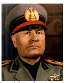
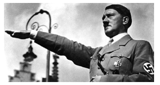
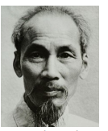
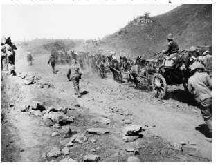
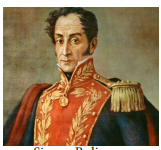
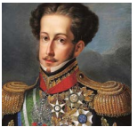
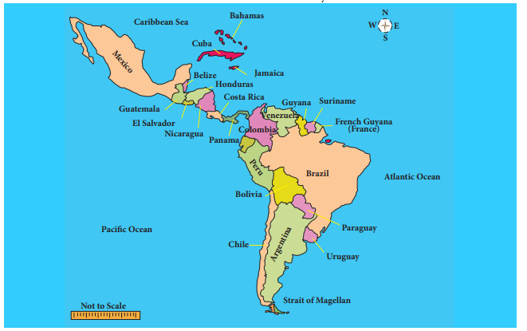
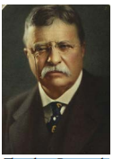

  

# Introduction 
The First World War shattered the global capitalist system based on European imperialism. The European powers were gravely weakened by the War, financially and politically. The conflict between the workers and the ruling classes that controlled the government became intense. As a result of this Fascism emerged in Italy and Germany. Anti-colonial struggles got intensified as the colonial powers were weakened by the War.

As we saw in the last chapter, the crisis in the Western world had led to the outbreak of World War I. We now turn to the social and political developments in the world after the end of the War.

## 2.1 The Great Depression** 
**Developments in the post-World War I**

The First World War led to the expansion of certain industries in the hope that the war-time boom would continue. However, when the War came to an end, the industries that grew to meet war-time requirements had to be abandoned or modified. The situation was made worse by the political complications caused by the Treaty of Versailles. A new wave of economic nationalism which expressed itself in protectionism or in tariff barriers affected world trade. The war also placed a heavy burden of debt on every European country.

**Stock Market Crash in the US** 
The first huge crash occurred on 24 October 1929. This discouraged investors and consumers to such an extent that more and more people began to sell their shares and dispose of their stocks. But there were no buyers. This was followed by the failure of American banks. The American financiers were forced to recall their own funds invested abroad.
  

**Breakdown of the International System of Exchange**

Despite emergency measures such as cutbacks in expenditure and increased taxation, the situation did not improve in England. So England decided to leave the Gold Standard. Immediately a great number of countries left the gold standard. Each nation adopted a policy of protectionism and devaluation of currency. Devaluation forced creditors to stop lending. This led to a world-wide credit contraction. Thus the defensive measures adopted by various nations to safeguard their economic interests led to an unprecedented decline in world economic activity. As its effect was deep and prolonged economists and historians call it the Great Depression.

>Gold Standard is a monetary system where a country’s currency or paper money carried a value directly linked to gold.

**Repercussion in Politics**

The Depression changed the political conditions in several countries. In England, the Labour Party was defeated in the general elections of 1931. In the USA, the Republican Party was rejected by the people in successive elections for about twenty years after the Depression.

**2.2 Rise of Fascism and Nazism**

**(a) The Impact of War in Italy**

The first of the nations of Western Europe to turn against the old ruling regime was Italy. During World War I the primary task of Italy was to keep the Austrians occupied on the Southern Front, while the British, French and Americans cornered Germany into submission along the battle lines in Flanders. The financial cost of the participation in the War was huge. Moreover, after the War, in the sharing of the spoils, Italy got less than she expected. The country suffered heavy losses in a war that was unpopular with both socialists and pro-Austrian Catholics. The nationalists were equally unhappy with the marginal gain in territory from the Treaty of Versailles. The War resulted in inflation. There were frequent protests and strikes. People held the rulers responsible for the humiliation at Versailles.

**Emergence of Mussolini**

In the elections held November 1919 in the aftermath of the Treaty of Versailles, Italian socialists, proclaiming that they were following Bolshevism (Communism in Soviet Russia), won about a third of the seats. Mussolini, son of a blacksmith and qualified as an elementary school master, in the end became a journalist with socialist views. A forceful speaker, Mussolini began to support the use of violence and broke with the socialists when they opposed Italy’s entry into the War. When the Fascist Party was founded in 1919 Mussolini immediately joined it. As Fascists stood for authority, strength and discipline, support came from industrialists, nationalists, ex-soldiers, the middle classes and discontented youth. The Fascists resorted to violence freely. In October 1922, in the context of a long ministerial crisis, Mussolini organised the Fascist March on Rome. Impressed by the show of force, the King invited Mussolini to form a government. The inability of the Democratic Party leaders to combine and act with resolution facilitated Mussolini’s triumph.

**Fascism** is a form of radical authoritarian ultra-nationalism, characterised by dictatorial power, forcible suppression of opposition and strong regimentation of society and of the economy, which came to prominence in early 20th-century Europe. –Wikipedia.

**Fascists under Mussolini**

In the 1924 elections, after intimidation of the electors, 65 per cent of the votes were cast for the Fascists. Matteotti, a socialist leader, who questioned the fairness of the elections was 

  

murdered. The opposition parties boycotted the Parliament in protest. Mussolini reacted by banning opposition parties and censoring the press. Opposition leaders were killed or imprisoned. Assuming the title of Il Duce (the leader), in 1926 he became a dictator with power to legislate. He passed a law forbidding strikes and lockouts. Unions and employers were organized into corporations. In 1938 Parliament was abolished and was replaced by a body representing the Fascist Party and the corporations. This new arrangement bolstered Mussolini’s dictatorial control of the economy, as well as enabling him to wield enormous power as head of the administration and the armed forces.

**Mussolini’s Pact with Pope**

In order to give respectability to the Fascist Party, Mussolini won over the Roman Catholic Church by recognising the Vatican City as an independent state. In return the Church recognised the Kingdom of Italy. The Roman Catholic faith was made the religion of Italy and compulsory religious teaching in school was ordered. The Lateran Treaty incorporating the said provisions was signed in 1929.

**Italy during the Great Depression**

During the years of the Great Depression the much publicised public works of building new bridges, roads and canals, hospitals and schools did not provide solution to the unemployment problem. In 1935, Mussolini invaded Ethiopia. This was useful to divert attention of the people away from the economic troubles.

**(b) Germany in the post-War**

From 1918 to 1993 Germany was a republic. The factors which led to the eventual triumph of Fascism in Germany were many. Between 1871 and 1914 Germany had risen to dizzy heights of economic, political and cultural accomplishments. Germany’s universities, its science, philosophy and music were known all over the world. Germany had surpassed even Britain and the US in several fields of industrial production.  

Germany’s defeat and humiliation at the end of World War I caused a deep shock to the of German people. The Great Depression further deepened their frustration and prompted them to turn against the Republican government.

**Evolution of German Fascism**

The origin of German fascism goes back to 1919 when a group of seven men met in Munich and founded the National Socialist German Workers’ Party (abbreviated as Nazi Party). One of them was Adolf Hitler. During World War I, he served in the Bavarian army. A gifted speaker, he could whip up the passion of the audience. In 1923 Hitler attempted to capture power in Bavaria. His launch of the National Revolution on the outskirts of Munich landed him in prison. During his time in prison wrote _Mein Kampf_ (My Struggle), an autobiographical book containing his political ideas. In the Presidential election of 1932, the Communist Party polled about 6,000,000 votes. Alarmed capitalists and property owners tilted towards supporting fascism Hitler exploited this opportunity to usurp powers.

>Social Democratic Party was founded as the General German Workers Association on 23 May 1863 in Leipzig. Founder was Ferdinand Lassalle. German elites of the late 19th century considered the very existence of a socialist party a threat to the security and stability of the newly unified Reich, and so Bismark outlawed this party from 1878 to 1890. However, in 1945, with the fall of Hitler, the Social Democratic Party was revived. It was the only surviving party from the Weimar period with a record of opposition to Hitler.

**The Nazi State of Hitler**

Republican government fell, as the Communists refused to collaborate with the Social Democrats. Thereupon industrialists, bankers and Junkers prevailed upon President Von Hindenburg to designate Hitler as Chancellor in 1933. The Nazi state of Hitler, known as Third Reich, brought an end to the parliamentary democracy.

Hitler replaced the flag of the Weimar republic by the swastika banners _( )_ of National Socialism. Germany was converted into a highly centralised state. All political parties except the Nazi party were declared illegal. The army of brown-shirted and jack-booted storm-troopers was expanded. The Hitler Youth was created, and the Labour Front set up. Trade unions were abolished, their leaders arrested. Strikes were made illegal, wages were fixed by the government. Total state control was extended over the press, the theatre, the cinema, radio and over education.

The Nazi Party’s propaganda was led by Josef Goebbels, who manipulated public opinion through planned propaganda. The Gestapo or Secret State Police was formed and run by Himmler.

**Nazi Policy towards Jews**

Along with the repressive measures, Hitler’s government followed a policy of repressing Jewish people. The Jews were removed from government positions, excluded from the universities and deprived of citizenship. Jewish businesses were closed down, and their establishments were attacked. After the outbreak of World War II concentration camps, barracks surrounded by electrified fences and watch towers, were built where Jews were interred and used as forced labour. Later they were turned into extermination camps where industrial means of murder such as gas chambers were used to kill them in what the Nazis termed ‘The Final Solution’.  

**Defiance of the Treaty of Versailles**

In August 1934 Hindenburg died and Hitler, apart from being Chancellor, became both President and Commander–in-Chief of the armed forces. Hitler’s foreign policy aimed at restoring the armed strength of Germany and annulling provisions of Versailles Treaty.

**2.3 Anti-Colonial Movements and Decolonisation Processes in Asia**

**(a) French Indo-China** 
**Rise of Anti-Colonialism**

Indo-China (today’s Cambodia, Laos and Vietnam) had shown its discontent right from the beginning of the French occupation (1887). While the Indo-Chinese resisted the imposition of French language and culture, they learned from them the ideas of revolution. During the First World War about 100,000 Indo-Chinese fought in France and returned with first-hand knowledge of how the French had fought and suffered during the War. Communist ideas from mainland China were also a major influence. Many became convinced that the considerable wealth of Indo-China was benefiting only the colonial power.

>Decolonisation is a process through which colonial powers transferred institutional and legal control over their colonies to the indigenous nationalist governments.

**The Emergence of Viet Minh**

The mainstream political party in Indo- China was the Vietnam Nationalist Party. Formed in 1927, 

it was composed of the wealthy and middle class sections of the population. In 1929 the Vietnamese soldiers 

>Ho Chi Minh (1890-1969) was born in Tongking. Europe. After working as a cook in a London hotel, lobbied for the independence for Vietnam. His art French Colonialism on Trial, made him well know founder-member of the French Communist party revolutionary techniques then. In 1925, , he founded the Revolutionary Youth Movement

mutinied, and there was a failed attempt to assassinate the French Governor-General. This was followed by a large scale peasant revolt led by the Communists. The revolt was crushed followed by what is called “White Terror.” Thousands of rebels were killed.

After the White Terror, Ho Chi Minh left for Moscow and spent the 1930s in Moscow and China. When France was defeated by Germany in 1940, Ho Chi Minh and his lieutenants used this turn of events to advance the Vietnamese cause. Crossing over the border into Vietnam in January 1941, they organized the League for the Independence of Vietnam, or Viet Minh. This gave renewed emphasis to a distinct Vietnamese nationalism.

**(b) Decolonisation in India**

**Dyarchy in Provinces**

The decolonization process started in India from the beginning of the twentieth century with the launch of the Swadeshi Movement in 1905. The outbreak of the First World War brought about rapid political as well as economic changes. In 1919, the Government of India Act introduced Dyarchy that provided for elected provincial assemblies as well as for Indian ministers to hold certain portfolios under Transferred Subjects. The Indian National Congress rejected Dyarchy and decided to boycott the legislature. 

**Lack of Measures to Industrialise India**

Despite the discriminating protection given to certain select industries such as sugar, cement, and chemicals, there was no change in the colonial economic policy. But in the case of indigenous industries, support was only in the form of providing “technical advice and education, and the establishment of pioneer factories in new industries”. However, even this policy was soon abandoned as many British enterprises were opposed to this .

**Impact of Depression on Indian Agriculture**

The ‘Great Depression’ also dealt a death blow to Indian agriculture and the indigenous manufacturing sector. The value of farm produce, declined by half while the land rent to be paid by the peasant remained unchanged. In terms of prices of agricultural commodities, the obligation of the farmers to the state doubled. The great fall in prices prompted Indian nationalists to demand protection for the internal economy. The 1930s saw the emergence of the Indian National Congress as a militant mass movement.

**Government of India Act, 1935**

The British had to appease the Indian nationalists and the outcome was the passage of the Government of India Act, 1935. This provided for greater power to the local governments and the introduction of direct elections. In the 1937 elections the Congress won a resounding victory in most of the provinces. However the decision of Britain to involve India in the Second World War, without consulting the popular Congress ministries, forced the latter to resign from office.

**2.4 Anti-Colonial Movements in Africa**

**Colonisation of Africa**

The African coastline had been explored in the sixteenth century and a few European settlements had come about. But the interior of Africa was unknown to the outside world until the last quarter of nineteenth century. European colonisation began after about 1875. The Berlin Colonial Conference of 1884–85 resolved that Africa should be divided into spheres of influence of various colonial powers. The war between the British and Boers in South Africa, however, was in defiance of this resolution.

**Boer Wars**

The relations between the two British colonies of Natal and Cape Colony and the two independent Boer states of the Transvaal and the Orange Free State had long been unfriendly. The discovery of gold in Transvaal, in 1886, led to large numbers of British miners settling in and around Johannesburg. The Boers hated these people whom they referred to as Uitlanders (foreigners). The Boers taxed them heavily apart from denying political rights. So the question was whether the British or the Boers were to be supreme in South Africa. Fearing attacks from the British, the Boers armed themselves and decided to attack.

The Boer War lasted for three years, 1899- 1902. Initially, the Boers were successful. But by the first half of 1900, the Boer army was defeated. Pretoria was occupied. The Boers took to guerrilla fighting. This continued for about two years. In retaliation the British destroyed farms and crops. They set up internment camps for Boer women and children. Shortage of food, medical and sanitary facilities caused the death of 26,000 people. The British annexed the two Boer states. Boers were however promised

  

self-government in due course. In 1907 full responsible government was given to the Transvaal and the Orange Free State. The four states formed into a union and the South Africa Act passed by the British parliament in 1909 provided for a Union Parliament at Cape Town. The Union of South Africa came into being in May 1910.

>The descendents of original Dutch settlers of South Africa, also known as Afrikaners, were called Boers. Their language is Afrikaans.

**Nationalist Politics in South Africa**

There were two main political parties: the Unionist Party which was mainly British, and the South Africa Party which had largely Afrikaners (Boers). The first Prime Minister, Botha belonged to the South Africa Party ruled in cooperation with the British. But a militant section of the South Africa Party formed the National Party under Herzog. 

In the 1920 elections the National Party gained forty- four seats. The South Africa Party, now led by Smuts, secured forty-one seats. At this juncture the British-dominated Unionist Party merged with the South Africa Party. This gave Smuts a majority over the militant Af r ikaner-control led National Party.

**Racist Policy against the Blacks**

The Afrikaners pursued a harsher, racist policy towards the blacks and the minority Indians. In 1923 an Act was passed to confine the native residents to certain parts of towns. Already an Act of 1913 had segregated black and white farmers, which made it impossible for the blacks to acquire land in most parts of the country. The 1924 elections were won by the National Party with the support of the Labour movement, composed mainly of white miners. The Act passed in 1924 prevented blacks from striking work and from joining trade unions. In the Cape Province the voting right to blacks was abolished. Native Blacks suffered in all spheres: social, economic and politics.

>**Apartheid in South Africa** Apartheid, which means separateness, became the racial policy of the Nationalist Party in 1947. From 1950 onwards a series of laws came to be enforced. The whole country was divided into separate areas for the different races. Marriage between white and non-white was forbidden. Nearly all schools were brought under government control so that education different from that of the Whites could be implemented for Africans. University education was also segregated. Apartheid is based on the belief that the political equality of White and Black in South Africa would mean Black rule. The ANC which fought the practice of racism was banned and its leader Nelson Mandela was put behind bars. Mounting pressure at the global level helped to end the racist regime in South Africa. In 1990 the ban on ANC was lifted and Mandela freed after 27 years. In the elections held subsequently the Africans were allowed to vote and ANC won the election and Mandela became the first black president of South Africa. Even though apartheid was dismantled the Whites completely dominate the economic sphere.

**2.5 Political Developments in South America**

**Mayas and Aztecs** Before the European discovery of America

three centres of civilisations existed there in Mexico in Central America and in Peru in South America. The Maya, the Inca and the Aztec Civilizations were highly advanced. There were several states in each of these areas of civilisation. Well organised and strong governments existed. Around the eleventh century, large cities formed into a league of Mayapan (centre of Maya civilisation of Native Americans American Indians). For over hundred years the League of Mayapan lasted. Though Mayapan was destroyed towards the close of twelth century, other cities continued. Aztecs from Mexico conquered the Maya country in the fourteenth century and founded their capital city of Tenochtitlan. For nearly two hundred years the Aztecs ruled their empire.

**European Colonisation and its Impact**

In the sixteenth century (around 1519) when the Aztecs were at the height of their power, the whole empire collapsed before a handful of adventurers led by a Spaniard named Hernan Cortes. Mexican civilisation collapsed. With it the great city of Tenochtitlan also perished. This is one of the world's worst genocides. The other famous Conquistador (conqueror) was also a Spaniard by name Francisco Pizarro. who led the conquest of the Incan Empire. Later the Spaniards made Peru a part of their dominions.

By the late 18th century, demand for political freedom, administrative autonomy and economic self-determination was articulated throughout Latin America. There were bloody conflicts between Haitian slaves, colonists, the armies of the British and the French colonizers. These struggles led by Toussaint L'Ouverture during 1791-1804 ended in the Haitian people’s independence from the colonial control of France. Haiti thus became the first Caribbean country to throw off slavery and French colonial control.

**Impact of Napoleonic Invasion of Spain and Portugal**

 

The American and French Revolutions provided inspiration to the Latin Americans. The Napoleonic invasion of Spain and Portugal in 1808 quickened the process of liberation Struggle in South America. Already the spirit of independence was growing under the leadership of Simon Bolivar, called El Liberator, the liberator. In the case of Brazil, the Portuguese royal family in the context of conquest of Portugal by Napoleon fled from Lisbon and thereby assisted the transition of Brazil from colony to independent nation. Pedro I renouncing the claim to the Portuguese throne declared independence of Brazil.

**The Monroe Doctrine**

The fight for independence intensified when Napoleon fell in 1815. But Monroe, the President of the USA, came up with his famous Monroe doctrine, which declared that if Europeans interfered anywhere in America, north or south, it would amount to waging a war against the United States. This threat frightened the European powers. By 1830 the whole of South America was free from European domination. Thus the U.S. protected the South American republics from Europe; but there was no one to protect them from the Protector, the United States.

**Disunity among Latin American Nationalists**

Latin American nationalists fought not only Spain and Portugal but also each other. In 1821 Central America seceded from Mexico. Later (1839) Central America itself split into five republics (Costa Rica, El Salvador, Guatemala, Honduras, and Nicaragua). Uruguay split from Brazil in 1828. In 1830 Venezuela and Ecuador seceded from Gran Columbia, the republic created by Bolivar.

**US Imperial Interests**

At the dawn of the twentieth century the United States had occupied Cuba and Puerto Rico, after defeating the Spanish in 1898. From 1898 to 1902 Cuba was under US military rule. When the Americans finally left they retained a naval station in Cuba. Roosevelt made an important amendment to the doctrine in 1904. It authorised US intervention in Latin America ‘in order to maintain order.’ After effecting this amendment, the US became the dominant influence not only politically but also in economics.

**Great Depression in South America**

The situation created by the Great Depression made it impossible for oligarchic regimes to accommodate the rising expectations of several assertive groups. In Mexico, there was violent social protest involving dissatisfied segments of the oligarchy, middle-class intellectuals, and peasant communities. Elsewhere electoral reform enabled newer social groups to obtain political power through the ballot box.

Latin America protested American inter vension and disliked their “dollar imperialism”. The opposition to political intervention produced a change in US policy after 1933. 

Franklin Roosevelt in his “Good Neighbour” policy agreed that the US would not intervene in the internal affairs of any state, and would give economic and technical assistance to Latin America.

>**Dollar Imperialism**, the term used to describe the policy of the USA in maintaining and dominating over distant lands through economic aid.