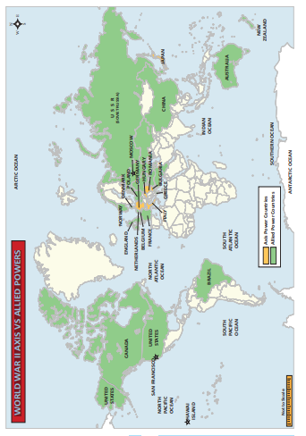
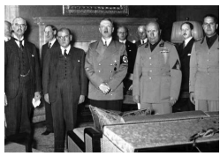
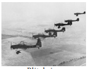
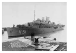
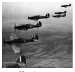
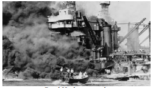
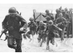
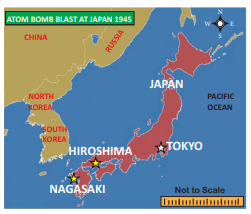
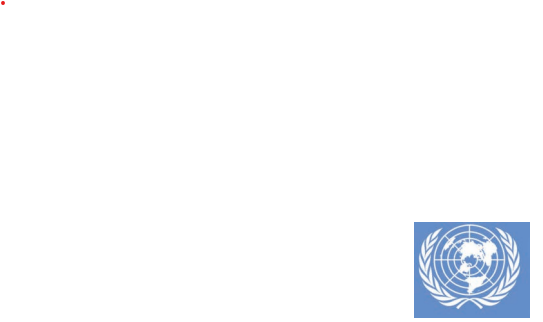
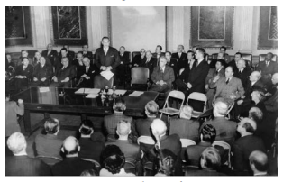

  

# Introduction 

The first half of the twentieth century witnessed two wars which devastated the world. World War I was fought from 1914 to 1918 and World War II began in 1939 and ended in 1945. While the world at large had experienced many wars, these two wars are referred to as “World” wars because of the extended areas of the conflict and the very high death toll of civilians as well as armed combatants. Both wars were fought on several fronts across Europe, Asia and Africa.

In both wars, the combined forces of Great Britain, France, Russia and the United States fought against a war alliance led by Germany. Germany’s allies were Italy and Japan in World War II.

**3.1 Causes, Course and Effects of World War II**

**(a) Causes**

The devastation caused by World War I was of such magnitude that it was referred to as The Great War, or The War to End All Wars. The belligerent nations, especially the Allies, had no desire for a second prolonged conflict, and this was the main driving force behind their actions after the end of World War I. The immediate and primary cause of World War II was the aggressive military offensive undertaken by a resurgent Germany and a fast developing Japan.

**Germany and Treaty of Versailles, 1919**

The Treaty of Versailles ending World War I was signed in June 1919. Among the many clauses of the Treaty, three in particular caused great resentment among the Germans. (i) Germany was forced to give up territories to the west, north and east of the German border; (ii) Germany had to disarm and was allowed to retain only a very restricted armed force; (iii) as reparations for the War, Germany was expected to pay for the military and civilian cost of the War to the Allied nations.
  

**Failure of League of Nations**

The Treaty also set up the League of Nations, on the initiative of President Woodrow Wilson of the United States. The League was expected to mediate between countries and take action against countries which indulged in military aggression. The popular mood favoured the traditional isolationist approach, and therefore the United States did not become a member of the League. The other Allied nations were also determined to maintain a non-interventionist attitude and, in consequence, the League remained an ineffectual international body.

**Post-War Crisis and Germany**

As mentioned above the three main clauses of the Treaty of Versailles, especially the imposition of penal reparations caused great discontent in Germany. The problems which many countries faced in the post-World War I decades led to the rise of extreme right wing dictatorships in Italy (Mussolini), Germany (Hitler) and Spain (Franco).

Germany experienced both high unemployment and severe inflation after the War, and its currency became practically worthless. There are several pictures of the 1920s when ordinary people had to carry money in wheelbarrows to buy bread. This was blamed on the war reparations which Germany was forced to pay, though in the final analysis, the demands for war reparations were moderated over several rounds of negotiations.

**The Rise of Adolf Hitler**

Adolf Hitler was able to exploit the general discontent among the Germans. Gifted with great oratorical skills, he was able to sway the people by his impassioned speeches, promising a return to the glorious military past of Germany. He founded the National Socialist party, generally known as “the Nazis”. The fundamental platform on which Hitler built his support was the notion of the racial superiority of the Germans as a pure, ‘Aryan’ race and a deep-seated hatred of the Jews. Hitler came to power in 1933 and ruled Germany till 1945.  

In direct contravention of the clauses of the Treaty of Versailles, Hitler began to re- arm Germany. The recruitment for the armed forces and the manufacture of armaments and machinery for the army, navy and air force with large amounts of government spending resulted in an economic revival and solved the problem of unemployment in Germany.

Italy’s break with Britain and France in the wake of Mussolini’s invasion of Ethiopia resulted in better relationship between Italy and Germany. In 1936, before Germany invaded the Rhineland, which was supposed to be a demilitarised zone, Rome - Berlin Axis had come into being. Later, with Japan joining this alliance, it became Rome- Berlin-Tokyo Axis. In 1938, Hitler invaded Austria and Czechoslovakia. Sudetenland in Czechoslovakia was German speaking, and Hitler’s claim was that the German speaking people should be united in to one nation.

**Allies and Non-Intervention**

There were also acts of aggression by Italy and Japan. Italy invaded Ethiopia in 1935 and Albania in 1939. Emperor Haile Selassie of Ethiopia appealed to the League of Nations, but got no help. In the East, Japan was pursuing its policy of military expansion. In 1931, Japan invaded Manchuria, and in 1937 it invaded China and seized Beijing. All these were ignored by the Allies and the League of Nations was unable to take any action.

In spite of all these manifestations of military activity by Germany, Italy and Japan, Britain and France continued to be non- interventionist. The mood in Britain was not in favour of starting another war. Prime Ministers Baldwin and Chamberlain did not feel justified in intervening in a region which was not officially in their sphere of interest. The United States was totally indifferent to the outside world, and was concerned with the revival of the economy after the Great Depression.

  

**Munich Pact**

A further factor was that the western powers and the Soviet Union distrusted each other. In 1938, Prime Minister Chamberlain concluded the Munich Pact with Germany, which was a shameful acceptance of Germany’s invasion of Czechoslovakia to annex German- speaking Sudetenland. In 1939 the Soviet Union independently concluded a non-aggression pact with Germany. The continued passivity of the Allies and the reluctance to start building up their armies were also contributory causes of the extended scale of World War II.

Though Hitler gave an assurance in the Munich Pact that Germany would not attack any other country, this was broken immediately. In 1939 he invaded Czechoslovakia. Poland was attacked next, and this was the final act which resulted in the declaration of war by Britain and France against Germany. In Britain, Prime Minister Chamberlain resigned in 1940 and Winston Churchill, who had always warned about Hitler and his military ambitions, became Prime Minister.

**(b) Course of World War II**

**Nature of the War**

World War II was fought on two distinct fronts - Europe and the Asia Pacific. In Europe, the war was fought by the Allies against Germany and Italy. In the Asia Pacific, the Allies fought Japan.

World War II was a modern war fought with heavy military equipment such as tanks,submarines, battleships, aircraft carriers, fighter planes and bomber planes. This involved a very large resource base, since all this equipment needed to be manufactured. There had to be raw materials, manufacturing capacity and technical inputs to improve the military hardware. This was an expensive and prolonged war of attrition.

**Outbreak of War**

Britain and France declared war on Germany in September 1939. In June 1940, Italy joined Germany, and in September 1940, Japan also joined the Axis powers.

There was little action immediately after the declaration of war. Britain had already begun to build up its military capabilities, and all young men were conscripted for military duty. 

The first years of the War were a time of spectacular successes of the Germany army which occupied Denmark and Norway and later France. By 1941, all of mainland Europe till the Russian frontier was under the Axis powers. The German army followed a tactic of ‘lightning strike’ (Blitzkrieg) to storm into various countries and overrun them.

The British Royal Navy continued to be the most powerful among the European naval forces and ensured that a sea-borne invasion of Britain was not possible. However, Britain depended on large scale imports of food, raw materials and industrial goods by sea from its Empire and the US.

To attack this, Germany developed a fleet of submarines which caused havoc, especially in the Atlantic Ocean area, by sinking a large number of civilian ships carrying supplies to Britain.

**Important Events**

**Dunkirk –** In May 1940 more than **300,000** British and French soldiers were forced back to the beaches in Dunkirk. Britain would have found it difficult to regroup if so many of her soldiers had been lost at Dunkirk.

**Battle of Britain**– By July 1940, it was feared that the Germans were planning to invade Britain. Hitler wanted to force Britain to accept his proposals for peace by a prolonged air-borne bombing campaign. The German air force began to attack specific targets, especially the ports, airfields and industrial installations. In September 1940, London was bombed mercilessly, an action known as The Blitz. By October 1940, night bombing raids on London and other industrial cities began.

This campaign failed because with the aid of a newly developed and top secret device ‘radar’ for detecting aircraft while still at a distance, the fighter planes of the Royal Air Force (Spitfires and Hurricanes) were able to inflict severe losses on the German bombers. The raids stopped after October 1940. The Germans dropped their plans to invade Britain because of the failure of the air battle.

**Lend Lease 1941–1945**

President Roosevelt realized that the United States had to change its policy of isolation, but could not intervene directly in the War in Europe, because it was not politically feasible. So he started a programme of “Lend Lease” in March 1941. Arms, food, military equipment and other supplies were sent to Britain, disguised as a “loan”, which would be returned after use. This augmented the resources of Britain to a great extent. Between 1941 and 1945, the total aid under Lend Lease amounted to $46.5 billion.  

**Invasion of Russia 1941-1942**

In June 1941 the German army invaded Russia. The long-term objectives of this move were to seize prime land for settling Germans, to destroy the communist regime, and also exploit Russia’s natural resources, especially oil. The German strategy of lightning strikes was initially successful and the army penetrated 1000 miles into Russian territory very soon. The German army then marched on Moscow. But ultimately, the resistance by the Soviet army, and the fierce Russian winter defeated the German army.

**Battle of Stalingrad (17 July 1942 to 2 February 1943)**

In August 1942, the Germans attacked Stalingrad.Stretching about 30 miles (50 km) along the banks of the Volga River, Stalingrad was a large industrial city producing armaments and tractors. Capturing the city would cut Soviet transport links with southern Russia, and Stalingrad would then enable the invading Germans to have access to the oil fields of the Caucasus. In addition, seizing the city that bore the name of Soviet leader Stalin would serve as a great personal and propaganda victory for Hitler. German war planners hoped to achieve that end with _Fall Blau_ (“Operation Blue”). On June 28, 1942, operations began with significant German victories.

Russian people suffered not only from bad working and living conditions, but also from ill-treatment at German hands in the occupied areas. There were about 15 million civilian deaths during the war, and about 10 million members of the armed forces were killed. All together over one-tenth of Russia’s population died. Yet the people remained loyal to the government, despite Hitler’s hopes of an anti- Stalin revolution. They successfully defended the city of Stalingrad.

**Battle of El Alamein 1942**

In the early years of the War, German forces under General Rommel were remarkably successful in occupying North Africa rapidly, leaving the British with only Egypt. The Allied forces under General Montgomery counter- attacked and defeated the German and Italian forces at El Alamein in North Africa. The German army was chased across the desert, out of North Africa. This provided the base for the Allied forces to invade Italy.

**Surrender of Italy 1943**

Mussolini had been thrown out and the new government of Italy surrendered to the Allies in 1943. However, the Germans set Mussolini up in a puppet regime in the north. Mussolini was killed in April 1945, by Italian partisans.

**End of Hitler**

The Allied forces under the command of General Eisenhower invaded Normandy in France. Slowly, the German army was forced back. But the Germans fought back and the War continued for nearly another year, and finally ended in May 1945. Hitler committed suicide in April 1945.

From 1944, the Russian army began to attack Germany from the East and captured much of Eastern Europe and Poland. In 1945, they occupied parts of Berlin, so that Germany was divided into two sections after the War.

**War in the Asia-Pacific Region**

Japan had entertained visions of a glorious empire, very much on the same lines as Hitler. The Japanese army invaded Manchuria in 1931.Though China appealed to the League of Nations, this act of aggression did not attract the attention of the United States or Britain. In 1937, Japan invaded China, and seized Beijing (Peking, as it was then known) which had traditionally been the capital of China. The region around Shanghai was also captured, and Nanjing (Nanking), the capital was captured at the end of the year. The Japanese army indulged in the biggest slaughter ever known in history in Nanjing. Civilians were killed en masse for sport, and all females – from children to old women – were tortured and killed. Guangzhou  (Canton) and many other parts of China were overrun. The Chinese army, under Chiang Kai- shek retreated to the west to the hilly country from where they continued to fight the Japanese.

**Pearl Harbour 1941**

On December 1941, Japan attacked American naval installations in Pearl Harbour, Hawaii, without warning. The idea was to cripple America’s Pacific fleet so that Japan would not face any opposition in its offensive against South-east Asian countries. Many battleships and numerous fighter planes were destroyed. The United States declared war on Japan, with Britain and China also joining in. This brought together both the Asia Pacific and the European war into one common cause. Most importantly, it brought the United States with its enormous resources into the war as a part of the Allies.

**Japanese Aggression in South-east Asia**

The Japanese had spectacular success in their plan to extend their empire throughout South-east Asia. Guam, the Philippines, Hong Kong, Singapore, Malaya, the Dutch East Indies (Indonesia) and Burma, all fell to the Japanese.

**Battle of Midway and Battle of Guadalcanal 1942**

The US navy defeated the Japanese navy in the Battle of Midway, which turned the tide in favour of the Allies. The Battle of Guadalcanal in Battle of Guadalcanal

  

the Solomon Islands was a combined offensive involving the army and the navy, and lasted for several months. Both were crushing defeats for the Japanese.

After this, the American forces were able to re-take the Philippines. Gradually the Japanese were thrown out of most of their conquered territories. In 1944, the combined British and Indian armies were able to push back the Japanese who attempted to invade the north- east of India. Then, along with the Chinese, they pushed the Japanese out of Burma, and liberated Malaya and Singapore.

**Hiroshima and Nagasaki,August 1945**

As a top secret project, using the latest scientific advances, the US developed an atomic bomb immensely more powerful than conventional explosives. The Japanese generals refused to surrender and finally the US dropped an atomic bomb on Hiroshima. As the Japanese still refused to surrender, another atom bomb was dropped on Nagasaki. Japan ultimately announced surrender on 15 August 1945 and formally signed 2 September 1945 bringing an end to World War II.

**(c) Effects of the War**

**New geo-political power alignment:** World War II changed the world in fundamental ways. The world was polarized into two main blocs led by superpowers, one led by the United States with a pronounced anti-Communist ideology, and the other by Soviet Russia. Europe was divided into two: Communist and non-Communist.

**Nuclear proliferation: The United States** and the Soviet Union entered into a race to have more nuclear powered weapons. They built a large stockpile of such weapons. Defence spending sky-rocketed in many countries.

**International agencies:** Many international agencies, in particular the United Nations, the World Bank and the International Monetary Fund came into existence providing a forum for countries large and small.

Colonial powers were forced to give independence to former colonies in a process of decolonization. India was the first to achieve independence.

## 3.2 Holocaust and Its Fallout

After Hitler came to power, the Jews were persecuted in many ways. They were deprived of their civil rights, their properties were confiscated and many were confined to ghettos. Eventually, the Nazis came up with the notion of the Final Solution, which was to exterminate the Jews completely.

>The word ‘holocaust’ is used to describe the genocide of nearly six million Jews by the Germans during World War II. Annihilating the Jews was one of the main items on the political agenda of Hitler and the Nazis. Hitler was able to play on the anti-Jewish feelings (anti-Semitism) which were common in Germany and, in fact, throughout Europe. Jews were scattered all across Europe and many had become prominent in business, in performing arts and professional fields. Money-lending was a major business activity among Jews and this strengthened the prejudice against them. Shakespeare’s play, _The Merchant of Venice clearly depicts the_ dislike and distrust of Jews among the people.

**Universal Declaration of Human Rights**

In the aftermath of the Holocaust the UNO in its Charter, pledged to promote universal respect for and observance of human rights and fundamental freedoms for all without distinction to race, sex, language and religion. The UN efforts to protect human rights on a global basis resulted in the constitution of UN Commission on Human Rights. A committee constituted under its auspices was chaired by Eleanor Roosevelt wife of late President Franklin Roosevelt. The members of the Commission included Charles Malik of Lebanon, P.C. Chang of Nationalist China, John Humphrey of Canada, and Rene Cassin of France. The Universal Declaration of Human Rights was its important contribution. The Universal Declaration of Human Rights set forth fundamental human rights in 30 articles. The UN adopted this historic Charter on 10 December 1948. This day (10 December) is observed globally as Human Rights Day. Provisions of some ninety national constitutions since 1948, according to the Franklin and Eleanor Roosevelt Institute in New York, can be traced to this Declaration.

**Birth of Israel**

A major outcome of the Holocaust was the creation of the state of Israel as a homeland for the Jews. While this was historically the original home of the Jews during Roman times.

## 3.3 New International Order

By 1941 the United States and Britain began to give serious consideration to the need for international cooperation for achieving lasting peace among all nations. International economic and financial stability were also important objectives. All these would need international organizations with members of the various nations across the world working together for these common objectives. This ultimately resulted in the establishment of the United Nations, the World Bank and the International Monetary Fund, with many associated organizations which deal with basic issues of importance for all societies and countries.

**United Nations**

The first initiative for the United Nations came from the United States and Britain in 1941 when they issued a joint declaration known as the Atlantic Charter. 

This Declaration of the United Nations was accepted by all the 26 countries which were fighting against the Axis powers (Germany, Italy and Japan) on New Year’s Day, 1942.The Charter of the United Nations was signed on June 26, 1945 by 51 nations. India which was not an independent country then also was a signatory to the Charter. Now the United Nations has 193 member states and each one - big or small - has an equal vote in the United Nations.

>"We, the peoples of the United Nations, determined to save succeeding generations from scourge of war, which twice in our lifetime has brought untold sorrow to mankind, and to reaffirm faith in fundamental human rights, in the dignity and worth of the human person, in the equal rights of men and women, and of nations large and small …”. - from The Preamble to the United Nations

**General Assembly and Security Council**

The United Nations functions almost like any government, through its principal organs which are similar to the legislative, executive and judicial wings of a state. In the General Assembly is the body in which each member state is represented. It meets once a year and issues of interest and points of conflict are discussed in the Assembly. The Security Council has

fifteen members. Five countries - the United States, Britain, France, Russia and China - are permanent members, and there are ten temporary members who are elected in rotation. These two bodies function like a legislature. Each of the permanent members has the right to veto any decision by the other members of the Security Council. This right has often been used to block major decisions, especially by the superpowers, the US and Russia. Major issues and conflicts are discussed in the Security Council.

**Administrative Structure**

The executive wing of the United Nations is the UN Secretariat. It is headed by the Secretary General, who is elected by the General Assembly on the recommendation of the Security Council. The Secretary General, along with his cabinet and other officials, runs the United Nations. The International Court of Justice, headquartered at The Hague in Holland, is the judicial wing of the United Nations. The Economic and Social Council (ECOSOC), the fifth organ of the United Nations, is responsible for coordinating all the economic and social work of the United Nations. The regional Economic Commissions functioning for regional development across the various regions of the world (Asia Pacific, West Asia, Europe, Africa and Latin America) are organs of ECOSOC. They have been very successful, and have been headed by eminent economists like Gunnar Myrdal.

**Other Important Organs of the UN**

Associated organizations deal with areas of critical interest to the world at large like food, health and education, and culture. These are: Food and Agriculture Organisation (FAO), World Health Organisation (WHO), UNESCO (UN Educational, Scientific and Cultural Organisation). There are also special organizations funded voluntarily by member countries. The two best known among them are UNICEF (United Nations Children’s Fund) which promotes child health and welfare across the world, and the UNDP (United Nations  Development Programme), which focuses on development.

**Activities of the UN**

Over the decades, the United Nations has expanded its activities in response to the changing problems facing the world. Thus, in the 1960s, decolonization was an important issue. Human rights, the problems of refugees, climate change, gender equality are all now within the ambit of the activities of the United Nations. A special mention must be made of the UN Peacekeeping force, which has acted in many areas of conflict all over the world. The Indian army has been an important part of the peacekeeping force and has been deployed in many parts of the world.

**World Bank**

The World Bank and the International Monetary Fund, referred to as the “Bretton Woods Twins”, were both established in 1945 after the Bretton Woods Conference in 1944. Located in Washington D.C. in the United States, they have the same membership, since a country cannot be a member of the Bank without being a member of the Fund.

The two main organs of the World Bank are the International Bank for Reconstruction and Development (IBRD) and the International Development Agency (IDA), Together they are often referred to as the World Bank. The main responsibility of the IBRD in the initial years was to fund the reconstruction activities under the Marshall Plan in the European countries devastated by the war. The agenda later expanded to promote economic development in poorer countries and the Bank lends money to various countries for developmental projects. A further area of interest is poverty alleviation, especially in the rural areas of developing countries. The International Development Agency (IDA) also lends money to governments for developmental activities. These loans are “soft” loans, and are given at very low rates of interest for a period of 50 years. The International Finance Corporation (IFC) mainly functions with private enterprises in developing countries.

In recent years the Bank is actively promoting the achievement of the Millennium Development Goals which aim at improving living standards, removing illiteracy, empowering women and improving maternal and child health, improving the environment and eradicating AIDS.

**International Monetary Fund (IMF)**

The International Monetary Fund was primarily the brainchild of Harry Dexter White and John Maynard Keynes, the famous economist. It was formally organized in 1945 with 29 member countries. It now has a membership of 189 countries. Its primary objective is to ensure financial stability and development across the world. The main agenda is to promote international monetary cooperation, expansion of international trade and exchange stability. The Fund lends money from its resources to countries facing balance of payments problems (because they are unable to pay for their imports). It however imposes stringent conditions on the borrowing nations to tighten their budgets, practice fiscal prudence and reduce their expenditure. This is often unpopular, especially among the developing countries which may have to cut down on various programmes which provide subsidies to the people.  

>The objectives of the IMF are: “to foster global monetary cooperation, secure financial stability, facilitate international trade, promote high employment and sustainable economic growth and reduce poverty around the world.”

## 3.4 Post-War Welfare States in Europe

The term Welfare State refers to the concept that the government is responsible for the social and economic welfare of the people, thus expanding the role of the state beyond providing defence and maintaining law and order.

In 1942, the Report commonly known as the Beveridge Report was published in the United Kingdom which proposed a series of measures which the government should adopt to provide citizens with adequate income, health care, education, housing and employment to overcome poverty and disease which were the major impediments to general welfare.

After the War, the Labour party was voted into power in Britain. It promised to undertake steps to look after the people “from the cradle to the grave”. Legislation was enacted to provide comprehensive free health coverage to the citizens through the National Health Service and monetary benefits like old page pensions and unemployment benefits, childcare services and family welfare services. These are in addition to universal, free school education to all children.

The benefits can either be achieved through cash transfers, like old age pensions and unemployment compensation, or through free services. In addition, these countries also try to minimize economic disparities through progressive taxation by taxing the higher income groups at relatively high rates.
